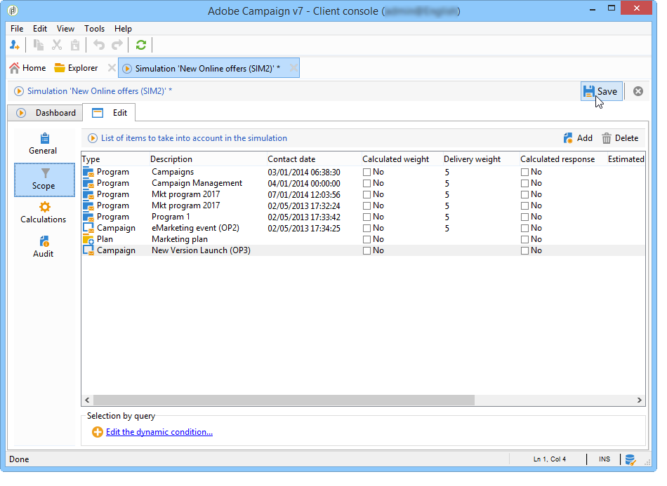

# 活动模拟{#campaign-simulations}

通过促销活动优化，您可以使用模拟来测试促销活动计划的效率。 这可让您衡量营销活动的潜在成功：产生的收入、基于所应用分类规则的目标流量等。

通过模拟，您可以监控和比较投放的影响。

## 设置模拟 {#set-up-a-simulation}

### 注意

准备投放 **测试** 模式对彼此没有影响，例如在分布式营销中评估营销活动时，或者只要未在临时日历中计划投放，就会发生这种情况。

这意味着压力和容量规则仅应用于 **[!UICONTROL Target estimation and message personalization]** 模式。 中的投放 **[!UICONTROL Estimation and approval of the provisional target]** 模式和 **[!UICONTROL Target evaluation]** 模式。

在 **[!UICONTROL Typology]** 的子选项卡。

### 创建模拟 {#create-a-simulation}

要创建模拟，请应用以下步骤：

1. 打开 **[!UICONTROL Campaigns]** ，单击 **[!UICONTROL More]** 链接 **[!UICONTROL Create]** ，然后选择 **[!UICONTROL Simulation]** 选项。

   

1. 输入模板和模拟的名称。 单击 **[!UICONTROL Save]** 来创建模拟。

   

1. 单击 **[!UICONTROL Edit]** 选项卡进行配置。

   

1. 在 **[!UICONTROL Scope]** 选项卡，指定要为此模拟考虑的投放。 为此，请单击 **[!UICONTROL Add]** 按钮，并指定要考虑的投放选择模式。

   

   您可以逐个选择每个投放，或按促销活动、项目或计划对其进行排序。

   >[!NOTE]
   >
   >如果您通过计划、项目或营销策划选择投放，则每当启动模拟时，Adobe Campaign都可以自动刷新投放列表以考虑这些内容。 为此，请检查 **[!UICONTROL Refresh the selection of deliveries each time the simulation is started]** 选项。
   >  
   >如果不这样做，则在创建模拟时，计划、项目群或营销策划中不可用的任何投放都将不被考虑在内：稍后添加的投放将被忽略。

   

1. 选择要包含在模拟范围中的元素。 如有必要，请使用SHIFT和CTRL键选择多个元素。

   

   单击 **[!UICONTROL Finish]** 以批准选择。

   您可以手动组合属于计划、项目或营销策划的选定投放和投放。

   

   如有必要，您可以通过 **[!UICONTROL Edit the dynamic condition...]** 链接。

   单击 **[!UICONTROL Save]** 以批准此配置。

   >[!NOTE]
   >
   >在计算模拟时，只考虑已计算目标的投放(状态： **Target就绪** 或 **准备投放**)。

1. 在 **[!UICONTROL Calculations]** 选项卡，例如选择分析维度，如收件人架构。

   

1. 然后，您可以添加表达式。

   

### 执行设置 {#execution-settings}

的 **[!UICONTROL General]** 在模拟的选项卡中，您可以输入执行设置：

* 的 **[!UICONTROL Schedule execution for down-time]** 选项会根据所选的优先级级别，将模拟启动定义为较短的忙时段。 模拟使用大量数据库资源，这就是为什么非紧急模拟计划在夜间运行的原因。
* 的 **[!UICONTROL Priority]** 是应用于模拟以延迟其触发的级别。
* **[!UICONTROL Save SQL queries in the log]**. SQL日志允许您在模拟以错误结束时进行诊断。 它们还可以帮助您了解模拟过慢的原因。 这些消息在 **[!UICONTROL SQL logs]** 的子选项卡 **[!UICONTROL Audit]** 选项卡。

## 执行模拟 {#execute-a-simulation}

### 启动模拟 {#start-a-simulation}

定义模拟范围后，即可执行它。

要执行此操作，请打开模拟仪表板并单击 **[!UICONTROL Start simulation]**.

执行完成后，打开模拟并单击 **[!UICONTROL Results]** 选项卡，以查看为每个投放计算的目标。

1. 的 **[!UICONTROL Deliveries]** 子选项卡列出了模拟考虑的所有投放。 它显示了两个计数：

   * 的 **[!UICONTROL Initial count]** 是在投放中估计时计算的目标。
   * 的 **[!UICONTROL Final count]** 是模拟后计数的收件人数。

      初始计数和最终计数之间的差异反映了在模拟之前配置的各种规则或过滤器的应用。

      要进一步了解此计算，请编辑 **[!UICONTROL Exclusions]** 子选项卡。

1. 的 **[!UICONTROL Exclusions]** 使用子选项卡可以查看排除项划分。

   

1. 的 **[!UICONTROL Alerts]** 子选项卡将模拟期间生成的所有警报消息分组。 在容量过载时（例如，如果目标收件人数量超过设置的容量），可以发送警报消息。
1. 的 **[!UICONTROL Exploration of the exclusions]** 使用子选项卡可创建结果分析表。 用户需要在横坐标/纵坐标轴中指示变量。

   有关创建分析表的示例，请参阅 [此部分](#explore-results).

### 查看结果 {#view-results}

#### 审核 {#audit}

的 **[!UICONTROL Audit]** 选项卡，监视模拟执行。 的 **[!UICONTROL SQL Logs]** 子选项卡对专家用户非常有用。 它以SQL格式列出执行日志。 这些日志仅在 **[!UICONTROL Save SQL queries in the log]** 选项 **[!UICONTROL General]** 选项卡。

#### 浏览结果 {#explore-results}

的 **[!UICONTROL Exploration of the exclusions]** 使用子选项卡可分析模拟生成的数据。

<!--
Descriptive analysis is detailed in [this section](../../reporting/using/about-adobe-campaign-reporting-tools.md).
-->

## 模拟结果 {#results-of-a-simulation}

中的指标 **[!UICONTROL Log]** 和 **[!UICONTROL Results]** 选项卡提供模拟结果的首个概述。 有关结果的更多详细信息，请打开 **[!UICONTROL Reports]** 选项卡。

### 报告 {#reports}

要分析模拟的结果，请编辑其报告：它们显示排除项和原因。

默认提供以下报表：

* **[!UICONTROL Detail of simulation exclusions]** :此报表提供所有相关投放的排除原因的详细图表。
* **[!UICONTROL Simulation summary]** :此报表显示各个投放中从模拟中排除的群体。
* **[!UICONTROL Summary of exclusions linked to the simulation]** :此报表显示了模拟导致的排除情况图表以及应用的分类规则，还显示了每个规则的排除比率图表。

<!--
>[!NOTE]
>
>You can create new reports and add them to the ones offered. For more on this, refer to [this section](../../reporting/using/about-adobe-campaign-reporting-tools.md).
-->

要访问报表，请单击 **[!UICONTROL Reports]** 目标模拟的链接。

您还可以使用 **[!UICONTROL Reports]** 可从模拟仪表板访问链接。

### 比较模拟 {#compare-simulations-}

每次执行模拟时，结果都会替换以前的任何结果：您无法显示结果并将结果从一个执行情况与另一个执行情况进行比较。

要比较结果，您需要使用报表。 事实上，Adobe Campaign允许您保存报表历史记录，以便日后再次查看。 该历史记录会保存到整个模拟生命周期中。

**示例:**

1. 在分类的投放上创建模拟 **A** 中，将应用于。
1. 在 **[!UICONTROL Reports]** ，可编辑其中一个可用报表，例如 **[!UICONTROL Detail of simulation exclusions]** 例如。
1. 在报表的右上方部分，单击图标以创建新历史记录。

   

1. 关闭模拟并更改分类配置 **A**.
1. 再次执行模拟，并将结果与报告中显示的结果进行比较，报告中为其创建了历史记录。

   

   您可以保存所需数量的报表历史记录。

### 报表轴 {#reporting-axes}

的 **[!UICONTROL Calculations]** 选项卡，可在目标上定义报表轴。 这些轴将在 [结果分析](#explore-results).

>[!NOTE]
>
>我们建议在模拟模板中定义计算轴，而不是针对每个模拟分别定义计算轴。\
>模拟模板保存在 **[!UICONTROL Resources > Templates > Simulation templates]** Campaign资源管理器的文件夹。

**示例:**

在以下示例中，我们希望根据收件人的状态（“客户”、“潜在客户”或“无”）创建一个额外的报表轴。

1. 要定义报告轴，请选择包含要在 **[!UICONTROL Analysis dimension]** 字段。 此信息是强制性的。
1. 在此，我们要选择收件人表的Segment字段。

   

1. 可以使用以下选项：

   * **[!UICONTROL Generate target overlap statistics]** 允许您恢复模拟报告中的所有重叠统计信息。 重叠是在一个模拟内至少两次投放中定向的收件人。

      >[!CAUTION]
      >
      >选择此选项会显着增加模拟执行时间。

   * **[!UICONTROL Keep the simulation work table]** 可以保留模拟跟踪。

      >[!CAUTION]
      >
      >自动保存这些表需要大量存储容量：确保数据库足够大。

当显示模拟结果时，有关所选表达式的信息将显示在 **[!UICONTROL Overlaps]** 子选项卡。

投放目标重叠表示模拟至少两次投放中的目标收件人。

>[!NOTE]
>
>此子选项卡仅在 **[!UICONTROL Generate target recovery statistics]** 选项。

在 **[!UICONTROL Exploring exclusions]** 子选项卡。 [了解详情](#explore-results)。
