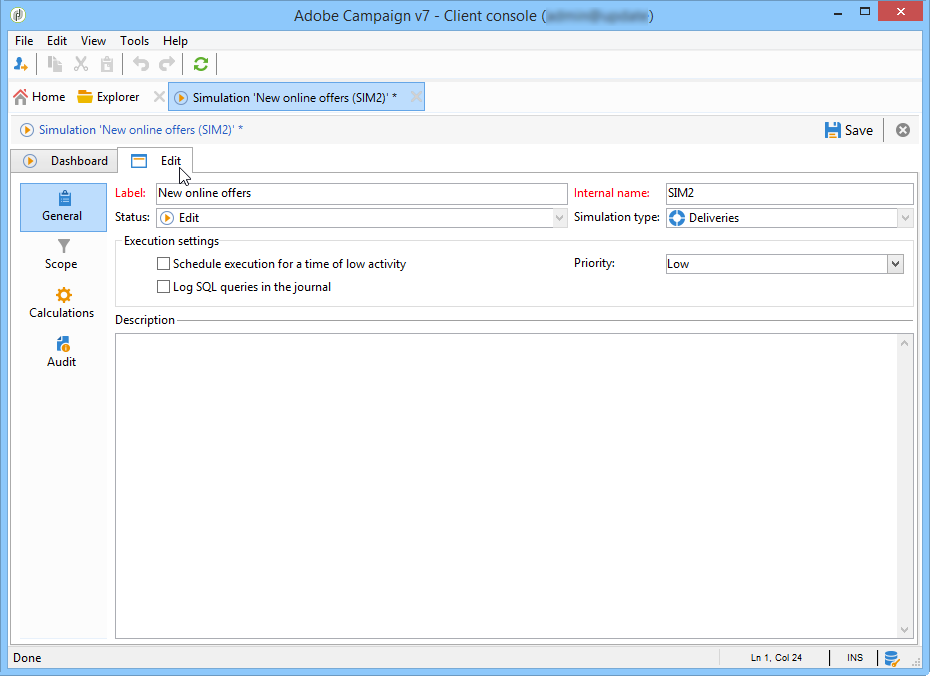

# 活动模拟{#campaign-simulations}

通过活动优化，您可以使用模拟来测试活动计划的效率。 这让您可以衡量营销活动的潜在成功情况：产生的收入、基于应用的分类规则的目标数量等。

通过模拟，您可以监控和比较投放的影响。

## 设置模拟 {#set-up-a-simulation}

### 注意

在&#x200B;**测试**&#x200B;模式下准备的投放彼此之间没有影响，例如在分布式营销中评估营销活动时，或者只要未在临时日历中计划投放。

这意味着压力和容量规则仅适用于&#x200B;**[!UICONTROL Target estimation and message personalization]**&#x200B;模式下的投放。 不考虑&#x200B;**[!UICONTROL Estimation and approval of the provisional target]**&#x200B;模式和&#x200B;**[!UICONTROL Target evaluation]**&#x200B;模式下的投放。

在投放属性的&#x200B;**[!UICONTROL Typology]**&#x200B;子选项卡中选择投放模式。

### 创建模拟 {#create-a-simulation}

要创建模拟，请应用以下步骤：

1. 打开&#x200B;**[!UICONTROL Campaigns]**&#x200B;选项卡，单击&#x200B;**[!UICONTROL Create]**&#x200B;部分中的&#x200B;**[!UICONTROL More]**&#x200B;链接并选择&#x200B;**[!UICONTROL Simulation]**&#x200B;选项。

   

1. 输入模板和模拟的名称。 单击&#x200B;**[!UICONTROL Save]**&#x200B;以创建模拟。

   

1. 单击&#x200B;**[!UICONTROL Edit]**&#x200B;选项卡进行配置。

   

1. 在&#x200B;**[!UICONTROL Scope]**&#x200B;选项卡中，指定要为此模拟考虑的投放。 为此，请单击&#x200B;**[!UICONTROL Add]**&#x200B;按钮并指定要考虑的投放选择模式。

   

   您可以逐个选择每个投放，也可以按活动、项目或计划对投放进行排序。

   >[!NOTE]
   >
   >如果您通过计划、项目或营销策划选择投放，Adobe Campaign会自动刷新投放列表，以便在启动模拟时考虑。 为此，请选中&#x200B;**[!UICONTROL Refresh the selection of deliveries each time the simulation is started]**&#x200B;选项。
   >  
   >如果不这样做，则在创建模拟时计划、项目或营销策划中不可用的任何投放都不会被考虑：稍后添加的投放将被忽略。

   

1. 选择要包含在模拟范围内的元素。 如有必要，请使用SHIFT和CTRL键选取多个元素。

   

   单击&#x200B;**[!UICONTROL Finish]**&#x200B;批准选择。

   您可以手动合并选定投放和属于计划、项目或营销策划的投放。

   

   如有必要，您可以通过&#x200B;**[!UICONTROL Edit the dynamic condition...]**&#x200B;链接使用动态条件。

   单击&#x200B;**[!UICONTROL Save]**&#x200B;以批准此配置。

   >[!NOTE]
   >
   >在计算模拟时，只考虑已计算目标的投放（状态：**目标就绪**&#x200B;或&#x200B;**准备投放**）。

1. 在&#x200B;**[!UICONTROL Calculations]**&#x200B;选项卡中，选择一个分析维度，例如收件人架构。

   

1. 然后，您可以添加表达式。

   

### 执行设置 {#execution-settings}

模拟的&#x200B;**[!UICONTROL General]**&#x200B;选项卡允许您输入执行设置：

* 根据所选的优先级级别，**[!UICONTROL Schedule execution for down-time]**&#x200B;选项将模拟启动延迟到不太繁忙的时间段。 模拟需要使用大量数据库资源，因此，例如非紧急模拟应安排在夜间运行。
* **[!UICONTROL Priority]**&#x200B;是应用于模拟以延迟其触发的级别。
* **[!UICONTROL Save SQL queries in the log]**。 SQL日志允许您诊断模拟是否以错误结束。 它们还可以帮助您了解为什么模拟速度太慢。 在&#x200B;**[!UICONTROL Audit]**&#x200B;选项卡的&#x200B;**[!UICONTROL SQL logs]**&#x200B;子选项卡中进行模拟后，将显示这些消息。

## 执行模拟 {#execute-a-simulation}

### 开始模拟 {#start-a-simulation}

一旦定义了模拟范围，您就可以执行它。

为此，请打开模拟仪表板并单击&#x200B;**[!UICONTROL Start simulation]**。

执行完成后，打开模拟并单击&#x200B;**[!UICONTROL Results]**&#x200B;选项卡以查看为每个投放计算的目标。

1. **[!UICONTROL Deliveries]**&#x200B;子选项卡列出了模拟所考虑的所有投放。 它显示两个计数：

   * **[!UICONTROL Initial count]**&#x200B;是投放估计期间计算的目标。
   * **[!UICONTROL Final count]**&#x200B;是模拟后计数的收件人数量。

     初始计数和最终计数之间的差异反映了模拟之前配置的各种规则或过滤器的应用。

     要了解有关此计算的更多信息，请编辑&#x200B;**[!UICONTROL Exclusions]**&#x200B;子选项卡。

1. **[!UICONTROL Exclusions]**&#x200B;子选项卡允许您查看排除项细分信息。

   

1. **[!UICONTROL Alerts]**&#x200B;子选项卡对模拟期间生成的所有警报消息进行分组。 在容量过载时（例如，如果定向的收件人数量超过设置的容量），可以发送警报消息。
1. **[!UICONTROL Exploration of the exclusions]**&#x200B;子选项卡允许您创建结果分析表。 用户需要在横坐标/纵坐标轴中指示变量。

   有关创建分析表的示例，请参阅[本节](#explore-results)的结尾。

### 查看结果 {#view-results}

#### 审核 {#audit}

**[!UICONTROL Audit]**&#x200B;选项卡允许您监视模拟执行。 **[!UICONTROL SQL Logs]**&#x200B;子选项卡对专家用户很有用。 它以SQL格式列出执行日志。 仅当在模拟执行之前在&#x200B;**[!UICONTROL General]**&#x200B;选项卡中选择了&#x200B;**[!UICONTROL Save SQL queries in the log]**&#x200B;选项时，才会显示这些日志。

#### 浏览结果 {#explore-results}

**[!UICONTROL Exploration of the exclusions]**&#x200B;子选项卡允许您分析模拟生成的数据。

<!--
Descriptive analysis is detailed in [this section](../../reporting/using/about-adobe-campaign-reporting-tools.md).
-->

## 模拟的结果 {#results-of-a-simulation}

**[!UICONTROL Log]**&#x200B;和&#x200B;**[!UICONTROL Results]**&#x200B;选项卡中的指标提供了模拟结果的第一个概览。 有关结果的更详细视图，请打开&#x200B;**[!UICONTROL Reports]**&#x200B;选项卡。

### 报告 {#reports}

要分析模拟的结果，请编辑其报告：它们显示排除项和原因。

默认情况下，会提供以下报表：

* **[!UICONTROL Detail of simulation exclusions]** ：此报表为所有相关的投放提供了一个详细的排除原因图表。
* **[!UICONTROL Simulation summary]** ：此报表显示从各种投放的模拟中排除的群体。
* **[!UICONTROL Summary of exclusions linked to the simulation]** ：此报表显示由模拟导致的排除图表、应用的分类规则以及显示每个规则的排除率的图表。

<!--
>[!NOTE]
>
>You can create new reports and add them to the ones offered. For more on this, refer to [this section](../../reporting/using/about-adobe-campaign-reporting-tools.md).
-->

要访问报表，请通过其仪表板单击目标模拟的&#x200B;**[!UICONTROL Reports]**&#x200B;链接。

您还可以使用可从模拟仪表板访问的&#x200B;**[!UICONTROL Reports]**&#x200B;链接编辑报告。

### 比较模拟 {#compare-simulations-}

每次执行模拟时，结果都会替换之前的任何结果：您无法显示和比较一个执行中的结果。

要比较结果，您需要使用报告。 事实上，Adobe Campaign允许您保存报表历史记录，以便稍后再次查看。 该历史记录将在模拟的生命周期中保存。

**示例：**

1. 对应用了类型&#x200B;**A**&#x200B;的投放创建模拟。
1. 在&#x200B;**[!UICONTROL Reports]**&#x200B;选项卡中，编辑其中一个可用的报告，例如&#x200B;**[!UICONTROL Detail of simulation exclusions]**。
1. 在报告的右上角部分，单击图标以创建新历史记录。

   

1. 关闭模拟并更改分类&#x200B;**A**&#x200B;的配置。
1. 再次执行模拟，并将结果与创建历史记录的报告中所显示的结果进行比较。

   

   您可以根据需要保存任意数量的报告历史记录。

### 报表轴 {#reporting-axes}

**[!UICONTROL Calculations]**&#x200B;选项卡允许您定义目标上的报告轴。 这些轴将在[结果分析](#explore-results)期间使用。

>[!NOTE]
>
>我们建议在模拟模板中定义计算轴，而不是为每个模拟分别定义计算轴。\
>模拟模板保存在Campaign资源管理器的&#x200B;**[!UICONTROL Resources > Templates > Simulation templates]**&#x200B;文件夹中。

**示例：**

在下面的示例中，我们要根据收件人的状态（“客户”、“潜在客户”或无）创建一个额外的报表轴。

1. 要定义报表轴，请选择包含要在&#x200B;**[!UICONTROL Analysis dimension]**&#x200B;字段中处理的信息的表。 此信息是强制性的。
1. 在此，我们要选择收件人表的区段字段。

   

1. 可以使用以下选项：

   * **[!UICONTROL Generate target overlap statistics]**&#x200B;允许您恢复模拟报告中的所有重叠统计信息。 重叠是在一个模拟中针对至少两个投放的收件人。

     >[!CAUTION]
     >
     >选择此选项可显着增加模拟执行时间。

   * **[!UICONTROL Keep the simulation work table]**&#x200B;允许您保留模拟跟踪。

     >[!CAUTION]
     >
     >自动保存这些表需要很大的存储容量：确保数据库足够大。

当显示仿真结果时，所选表达式的信息将显示在&#x200B;**[!UICONTROL Overlaps]**&#x200B;子选项卡中。

投放目标重叠指示模拟的至少两个投放中的目标收件人。

>[!NOTE]
>
>仅当启用了&#x200B;**[!UICONTROL Generate target recovery statistics]**&#x200B;选项时，才会显示此子选项卡。

可在&#x200B;**[!UICONTROL Exploring exclusions]**&#x200B;子选项卡中创建的排除分析报表中处理有关报表轴的信息。 [了解详情](#explore-results)。
