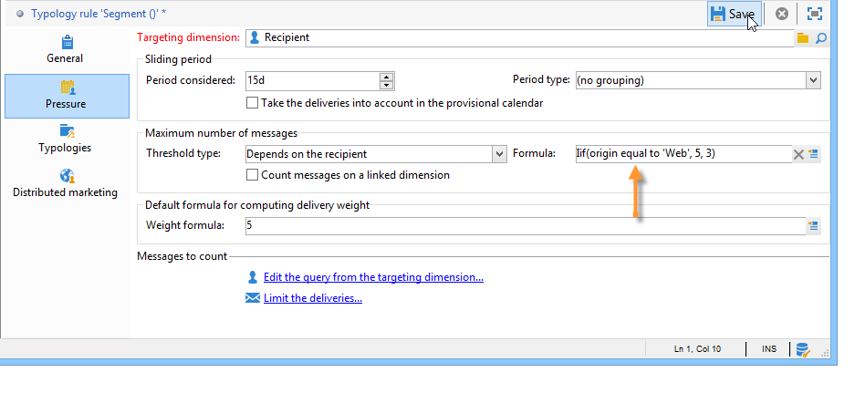
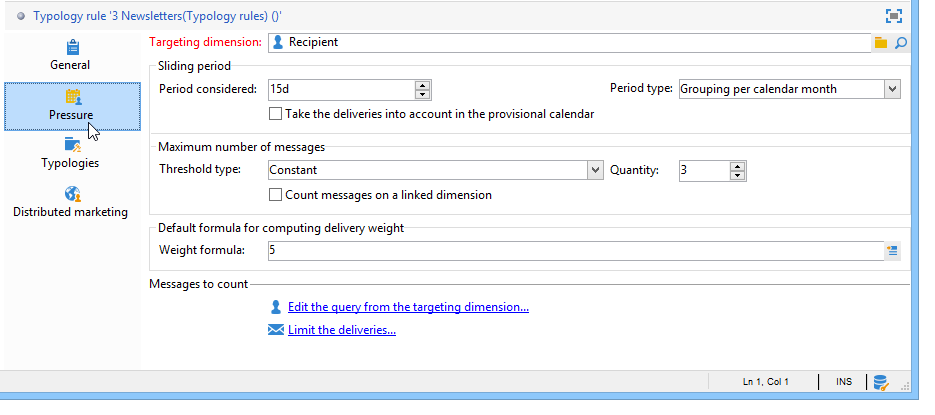
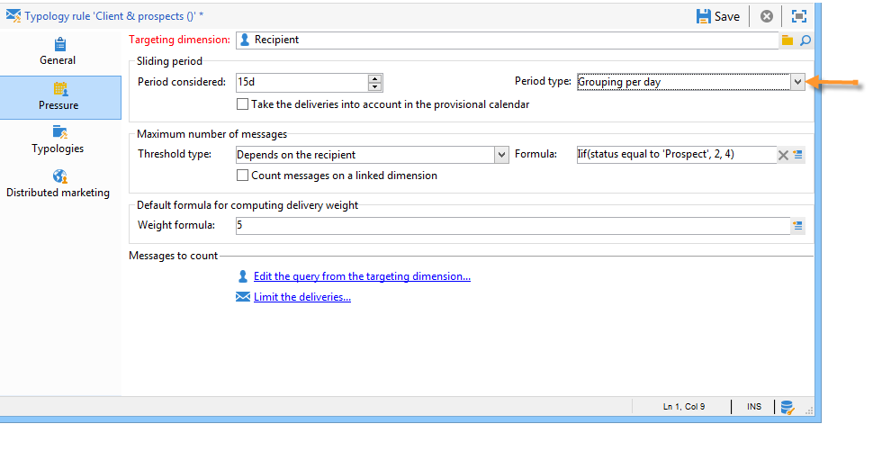
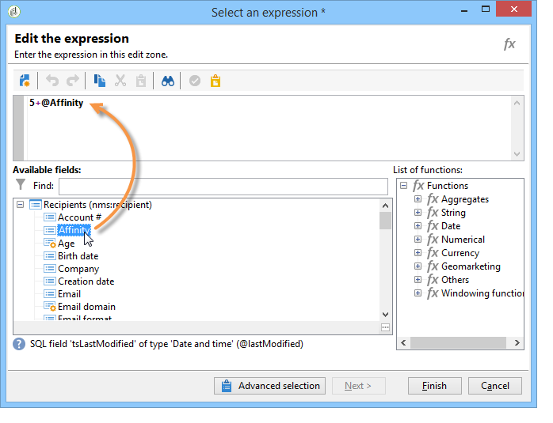

# 压力规则{#pressure-rules}

通过实施销售压力管理，您可以避免在数据库中过度招徕客户，这也称为营销疲劳。 为此，您可以定义每个收件人的消息数上限。 它还允许您在营销活动之间实施仲裁规则，以便向目标受众发送最佳消息。

**压力** 规则，以管理营销疲劳度，例如，将要发送给群体的信件数限制为2个、选择最符合一组订阅者利益的通信、避免向不满意的客户发送短信等。

根据定义的阈值和消息权重选择营销活动。

* 阈值是指定时间段内为给定收件人授权的最高投放数。 可以设置或变量。 可在分类规则设置中设置或计算分类规则。 [了解详情](#maximum-number-of-messages)。
* 利用投放权重，您可以确定压力管理框架内的优先级最高的投放。具有最高权重的消息优先。[了解详情](#message-weight)。

仲裁包括确保权重大于正在进行的营销活动的计划营销活动不会导致过度的用户档案征集：如果出现这种情况，则会将用户档案从投放中排除。

仲裁标准（消息权重和/或阈值）可能因以下两种类型的信息而异：

* 收件人首选项，即声明性信息：新闻稿订阅，收件人状态（客户或潜在客户），
* 收件人行为：购买、访问的链接等。

在分析阶段，应用用于定义符合条件的消息的仲裁规则。 对于每个收件人和相关期间，如果以下公式为true，则会发送消息： **（发送的消息数）+（权重较大的消息数）&lt;阈值**.

否则，收件人将 **[!UICONTROL Excluded by arbitration]**. [了解详情](#exclusion-after-arbitration)。

## 创建压力规则 {#create-a-pressure-rule}

要使用Adobe Campaign在促销活动之间设置仲裁，请首先创建促销活动分类并定义链接的分类规则(**压力** 规则)。

要创建和配置 **[!UICONTROL Pressure]** 分类规则，请应用以下步骤：

1. 在营销活动分类规则列表中，选择 **[!UICONTROL New]** 图标。

   

1. 在 **[!UICONTROL General]** ，请选择 **压力** 键入规则并输入其名称和描述。

   

1. 根据需要更改执行顺序。 当将多个分类规则作为 **[!UICONTROL Typology]** 设置后，首先应用顺序靠前的规则。 [了解详情](apply-rules.md#execution-order)。
1. 在 **[!UICONTROL Calculation parameters]** 部分中，如果希望在下一次每日重新仲裁执行之后保存定位，请定义频率。 [了解详情](apply-rules.md#adjust-calculation-frequency)。
1. 单击 **[!UICONTROL Pressure]** 选项卡，然后选择应用分类规则的日历期间。

   

   规则将应用于联系日期包含在相关时段内的投放。

   >[!NOTE]
   >
   >计划投放未被考虑在内。

1. 定义计算消息最多数量的方法。

   阈值表示在相关时间段内可发送给收件人的消息数量上限。

   默认情况下，阈值为常量，您需要指定规则授权的消息数量上限。

   

   要定义变量阈值，请选择 **[!UICONTROL Depends on the recipient]** 值 **[!UICONTROL Type of threshold]** 字段，然后使用右侧的图标打开表达式编辑器。

   

   有关更多信息，请参阅 [最大消息数](#maximum-number-of-messages).

1. 指定计算投放权重的方法。

   每个投放都有一个权重，即表示其优先级的值：这允许在活动之间进行仲裁。 权重使用分类规则和/或其属性中定义的公式计算。 [了解详情](#message-weight)。

1. 默认情况下，所有消息都会考虑阈值计算式。的 **[!UICONTROL Restriction]** 选项卡，可过滤与分类规则相关的消息：

   * 利用此选项卡的上半部分，可限制相关收件人。
   * 利用此选项卡的下半部分，可筛选要计数的消息。

      在以下示例中，仅保存在 **NewContacts** 文件夹，且投放以 **新闻稿** 很担心。
   

1. 的 **[!UICONTROL Typologies]** 选项卡，可查看应用此规则或将规则链接到一个或多个现有分类的营销活动分类。 [了解详情](campaign-typologies.md#apply-typologies)。

## 定义阈值和权重 {#define-thresholds-and-weights}

### 最大消息数 {#maximum-number-of-messages}

每个压力规则都定义一个阈值，即在给定时间段内可发送给一个收件人的消息数上限。 达到此阈值后，只有在所考虑的时段结束后，才会再进行投放。通过此流程，您可以在消息超过设置的阈值时自动将收件人从投放中排除，从而避免过度通信。

阈值可以是常量，也可以是通过包含变量的公式计算。 这意味着在给定的时间段内，阈值可能因收件人而异，甚至对于同一收件人也可能有所不同。

>[!CAUTION]
>
>正在输入 **0** 作为阈值，可阻止在考虑的时段内向目标群体发送所有投放。

**示例:**

您可以根据收件人所属的区段索引授权消息的数量。 这意味着属于Web区段的收件人可能会收到比其他收件人更多的消息。 安 **[!UICONTROL Iif (@origin='Web', 5, 3)]** 类型公式可为收件人授权投放5条消息，为其他区段授权投放3条消息。 配置将如下所示：

要定义阈值，您可以使用链接到定向维度的维度：例如，要包含发送到 [访客表](../../v8/audiences/target-mappings.md) 或者，避免每周向同一家庭发送多条消息，即在与收件人的维度中标识的同一家庭（可能指多个电子邮件地址）。

要执行此操作，请选择 **[!UICONTROL Count messages on a linked dimension]** 选项，然后选择访客或联系人表。

### 消息权重 {#message-weight}

每个投放都有一个权重，该权重表示其优先级级别。 默认情况下，投放的权重设置为5。 压力规则允许您定义要应用于的投放的权重。

可以通过公式设置或计算权重以适合收件人。 例如，您可以根据收件人兴趣定义投放的权重。

>[!CAUTION]
>
>在分类规则中定义的权重，可以在 **[!UICONTROL Properties]** 选项卡。 单击 **[!UICONTROL Typology]** 选项卡来选择营销活动类型，并根据需要指定要应用的权重。\
>但是，A分类规则中声明的权重不会用于计算B分类规则：此权重仅与使用A规则的投放有关。

**示例:**

在以下示例中，我们希望将音乐新闻稿的权重与其收件人的倾向得分相关联。 操作步骤：

1. 创建新字段以存储收件人倾向得分。 字段， **@Music** 在这种情况下，将通过调查和在线投票、收集的跟踪数据等的回答来扩充。
1. 创建分类规则以根据此字段计算消息权重。

   

1. 将此规则应用于具有以下主题的消息：时事通讯、特惠等。 这些投放的权重以及其优先级取决于每个收件人的倾向得分。

## 设置期间 {#setting-the-period}

压力规则在 **n** — 天滚动时段。

句点在 **[!UICONTROL Pressure]** 选项卡。 您可以指定天数，并根据需要选择要应用的分组类型（日、周、月、季度等）。

分组类型允许您扩展 **[!UICONTROL Period considered]** 字段中指定该期间日期的整日、日历周、日历月或日历年。

例如，压力规则定义每周2条消息的阈值，并对每个日历月进行分组，将阻止在同一周内发送2条以上的消息，并在同一日历月内发送。 警告，如果时段与两个月重叠，则计算阈值将考虑这两个日历月的投放，因此可能会阻止在第二个月内进行所有新投放。

>[!CAUTION]
>
>计算阈值时，只考虑已发送的投放。

要将考虑的投放限制为2周的周期，请输入 **15天** 在 **[!UICONTROL Concerned period]** 字段：在计算时，将考虑在应用规则的投放日期前两周发送的投放

期间开始日期取决于数据库的配置方式。

例如，如果对日期为12/11的投放应用15天压力规则而不进行分组，则11/27到12/12之间的投放将被考虑在内。 如果压力规则考虑临时日历中的投放，则11/27至12/27之间计划的所有投放都将被考虑在内。 最后，如果在规则中为每个日历月配置分组，则在计算阈值时(从11/1到12/31)会考虑11月和12月的所有投放。

**常见案例**

要确保未考虑当前日历周的投放，也不会考虑计算阈值上周的投放，请指定 **[!UICONTROL Period considered]** 在“0”处选择“按日历周分组”作为 **[!UICONTROL Period type]**.

当时段大于0（例如1）时，计算阈值可能会考虑前一天的投放。 因此，如果前一天对应于前一日历周，并且所选期间类型为“按日历周分组”，则计算阈值将考虑前一周的所有时间。

**示例:**

我们希望创建一个压力规则，该规则将请求限制为每两周发送3条消息，并将分组到日历月。

我们来收6份重量相同的快讯，订于05/30、06/3、06/8、06/12、06/22和06/30。

计划于6月12日和30日的投放将不会发送：06/12次投放将超过每两周3条报文的阈值，第30次投放将超过每个日历月授权通信的阈值。

在分析阶段，将通过仲裁排除这些投放的所有收件人：

对于同一规则，如果按季度对投放进行分组，则收件人为 **新闻稿第5号** 也将被排除，且不会发送。

最后，如果未选择分组，则仅 **新闻稿第4号** 将不会发送，因为它计划在与前三个新闻稿相同的2周期间发送。

>[!NOTE]
>
>在更改分类规则的定义时，您可以创建 **模拟** 为控制其对应投放的影响，并监控投放对彼此的影响。 [了解详情](campaign-simulations.md)。

## 仲裁后排除 {#exclusion-after-arbitration}

仲裁通过 **[!UICONTROL Forecasting]** 技术工作流和 **[!UICONTROL Campaign jobs]** 工作流。

的 **[!UICONTROL Forecasting]** 工作流会预计进行中期间（从开始日期到当前日期）的数据，以便在分析期间应用分类规则。 它还重新计算每晚仲裁的排除计数器。

因此，对于每个收件人，Adobe Campaign检查要发送的消息数量是否未超过阈值，同时考虑到在有关期间已发送的消息数量。 此信息是 **指示器**，因为所有计算都会在交付时更新。

如果此数字超过阈值，则应用促销活动分类中定义的仲裁规则，并将收件人从权重较低的促销活动中排除。

>[!NOTE]
>
>如果多个投放的得分相等，则将发送计划为最早日期的营销活动。

## 压力规则的用例 {#use-cases-on-pressure-rules}

### 根据条件调整阈值 {#adapt-the-threshold-based-on-criterion}

我们希望创建一个分类规则，以阻止每周向客户交付4条以上的消息，以及每周向潜在客户交付2条消息。

要识别客户和潜在客户，请使用 **[!UICONTROL Status]** 字段，其中对于潜在客户包含0，对于客户包含1。

要创建规则，请应用以下步骤：

1. 新建 **压力** 类型分类规则。
1. 编辑 **[!UICONTROL Pressure]** 选项卡：在 **[!UICONTROL Maximum number of messages]** 部分，我们要创建一个公式以根据每个收件人计算阈值。 选择 **[!UICONTROL Depends on the recipient]** 值 **[!UICONTROL Threshold type]** 字段，然后单击 **[!UICONTROL Edit expression]** 权利 **[!UICONTROL Formula]** 字段。

   单击 **[!UICONTROL Advanced parameters]** 按钮以定义计算公式。

   

1. 选择 **[!UICONTROL Edit the formula using an expression]** 选项并单击 **[!UICONTROL Next]**.

   

1. 在函数列表中，双击 **Iif** 函数 **[!UICONTROL Others]** 节点。

   然后选择收件人的 **状态** 在 **[!UICONTROL Available fields]** 中。

   

   输入以下公式： **Iif(@status=0,2,4)**

   

   使用此公式后，如果 Status 等于 0，则分配值“2”；对于所有其他 Status，则分配值“4”。

   单击 **[!UICONTROL Finish]** 以批准公式。

1. 指示应用规则的时段：在这种情况下为7天，用于计算每周的消息数。

   

1. 保存规则以批准创建。

现在，将之前创建的规则链接到分类，以将其应用于投放。 操作步骤：

1. 创建营销活动分类。
1. 转到 **[!UICONTROL Rules]** ，单击 **[!UICONTROL Add]** 按钮，然后选择之前创建的规则。

   

1. 保存分类：是否会将其添加到现有分类列表。

要在投放中使用此分类，请在投放属性(位于 **[!UICONTROL Typology]** 选项卡，如下所示：

>[!NOTE]
>
>可以在投放模板中定义分类，以自动应用至使用此模板创建的所有投放。

在投放分析期间，会根据已发送给投放的投放数量，将适用的投放收件人从投放中排除。 要查看此信息，您可以：

* 查看分析结果：

   

* 编辑投放，然后单击 **[!UICONTROL Delivery]** 选项卡 **[!UICONTROL Exclusions]** 子选项卡：

   

* 单击 **[!UICONTROL Audit]** 选项卡，然后 **[!UICONTROL Causes of exclusions]** 子选项卡，以显示排除次数和应用的分类规则：

   

### 根据行为计算投放权重 {#calculate-the-delivery-weight-based-on-behavior}

您可以根据收件人行为定义压力规则：因此，递送的重量可以适应于不同收件人的标准。 例如，您可以根据收件人是否访问了您的互联网网站、点击了上次新闻稿的特定部分、订阅了信息服务，甚至根据调查的回答、在线游戏等，决定发送消息。

在以下示例中，我们要创建权重为5的投放。 此权重通过基于收件人行为的倾向得分进行扩充：已从此网站订购的客户的得分为5，而从未在线订购的客户的得分为4。

要执行此类配置，您需要使用公式来定义消息权重。 有关倾向得分和调查答案的信息必须在数据模型中访问。 在本例中， **倾向** 字段。

应用以下配置步骤：

1. 新建 **压力** 类型分类规则。
1. 编辑 **[!UICONTROL Pressure]** 选项卡。 我们希望创建一个基于每个收件人的阈值公式：单击 **[!UICONTROL Edit expression]** 图标 **[!UICONTROL Weight formula]** 字段。

   

1. 默认情况下，值 **5** 显示在表达式编辑器的上部。 我们希望在此权重中添加每个收件人的倾向得分：将光标放在5的右侧，输入 **+** 字符，然后选择 **倾向** 字段。

   

1. 然后，为已购买的收件人添加更高的值。 对他们而言，交货的重量必须增加5，而对其他人而言，只增加4。

   

1. 单击 **[!UICONTROL Finish]** 来保存此规则。
1. 将规则链接到营销活动分类，并在投放中引用此分类以批准该分类。

### 仅发送加权最高的消息 {#send-only-the-highest-weighted-messages}

您希望在同一周内向每个收件人发送不超过2条的消息（每天最多2条消息），并且您只希望传递权重较高的消息。

为此，您需要为同一收件人计划多个具有不同权重的投放，并应用压力规则以排除权重较低的投放。

首先，配置压力规则。

1. 创建压力规则。 [了解详情](#create-a-pressure-rule)。
1. 在 **[!UICONTROL General]** 选项卡，选择 **[!UICONTROL Re-apply the rule at the start of personalization]** 选项。

   

   此选项会覆盖 **[!UICONTROL Frequency]** 字段中，并在个性化阶段自动应用规则。 [了解详情](apply-rules.md#adjust-calculation-frequency)。

1. 在 **[!UICONTROL Pressure]** 选项卡，选择 **[!UICONTROL 7d]** 作为 **[!UICONTROL Period considered]** 和 **[!UICONTROL Grouping per day]** 作为 **[!UICONTROL Period type]**.
1. 在 **[!UICONTROL Typologies]** 选项卡，将规则链接到营销活动分类。
1. 保存更改。

现在，为要应用压力规则的每个投放创建并配置工作流。

1. 创建营销策划. [了解详情](../campaigns/marketing-campaign-create.md#create-a-campaign)。
1. 在 **[!UICONTROL Targeting and workflows]** 的 **查询** 活动。 有关使用此活动的更多信息，请参阅 [此部分](../workflow/query.md).
1. 添加 **[!UICONTROL Email delivery]** 活动，并将其打开。 有关使用此活动的更多信息，请参阅 [此部分](../workflow/delivery.md).
1. 转到 **[!UICONTROL Approvals]** 选项卡 **[!UICONTROL Delivery properties]** 并禁用所有批准。

   

1. 在 **[!UICONTROL Typology]** 选项卡 **[!UICONTROL Delivery properties]**，引用营销活动类型以对应用规则。 为投放定义权重。

   

1. 在投放中，单击 **[!UICONTROL Scheduling]** 选择 **[!UICONTROL Schedule delivery (automatic execution when the scheduled date is reached)]**. 在本例中，选择 **[!UICONTROL Use a calculation formula]** 选项。
1. 将提取日期设置为10分钟（当前日期+ 10分钟）。
1. 将联系日期设置为次日（当前日期+ 1天）。

   

   要成功实施压力规则排除，请确保在联系日期和时间之前以及重新应用夜间仲裁之前设置提取日期和时间。 [了解详情](#exclusion-after-arbitration)。

1. 取消选择 **[!UICONTROL Confirm the delivery before sending]** 选项并保存更改。
1. 对于要发送的每个投放，请以相似方式继续。 确保为每次投放设置所需的权重。
1. 运行相关工作流以准备和发送投放。

当应用夜间仲裁时，将排除相同收件人权重较低的投放。 只会考虑发送权重最高的投放。 [了解详情](#message-weight)。

考虑到一周早些时候已经向相关收件人发送了电子邮件，下表显示了可应用于另外两次投放的配置示例。

<table> 
 <thead> 
  <tr> 
   <th> 投放  </th> 
   <th> 审批  </th> 
   <th> 权重  </th> 
   <th> 提取日期/时间  </th> 
   <th> 联系日期  </th> 
   <th> 投放开始日期/时间  </th> 
   <th> 仲裁工作流执行日期/时间  </th> 
   <th> 投放状态  </th> 
   <th> 发送的投放（日期/时间）  </th> 
  </tr> 
 </thead> 
 <tbody> 
  <tr> 
   <td> 投放1  </td> 
   <td> 已禁用  </td> 
   <td> 5  </td> 
   <td> 3pm  </td> 
   <td> 早8点（次日）  </td> 
   <td> 2pm  </td> 
   <td> 夜间  </td> 
   <td> 已排除  </td> 
   <td> 已排除  </td> 
  </tr> 
  <tr> 
   <td> 投放2  </td> 
   <td> 已禁用  </td> 
   <td> 10  </td> 
   <td> 4pm  </td> 
   <td> 早9点（次日）  </td> 
   <td> 2pm  </td> 
   <td> 夜间  </td> 
   <td> 已发送  </td> 
   <td> 早9点（次日）  </td> 
  </tr> 
 </tbody> 
</table>

两个投放的提取日期过后，会在两个投放的联系日期之前重新应用夜间仲裁。 这样可以查找已发送的所有投放（处理投放的收件人，通过广泛日志记录投放）或计划发送的投放（有资格接收投放的收件人，通过预测日志记录投放的收件人）。

在压力规则中定义的时间段内，已发送所有投放并列出潜在投放后，Adobe Campaign会按权重对它们进行排序，权重最高时排在首位。 达到压力规则中设置的阈值（同一周内不超过2封电子邮件）后，将从投放中排除收件人。
