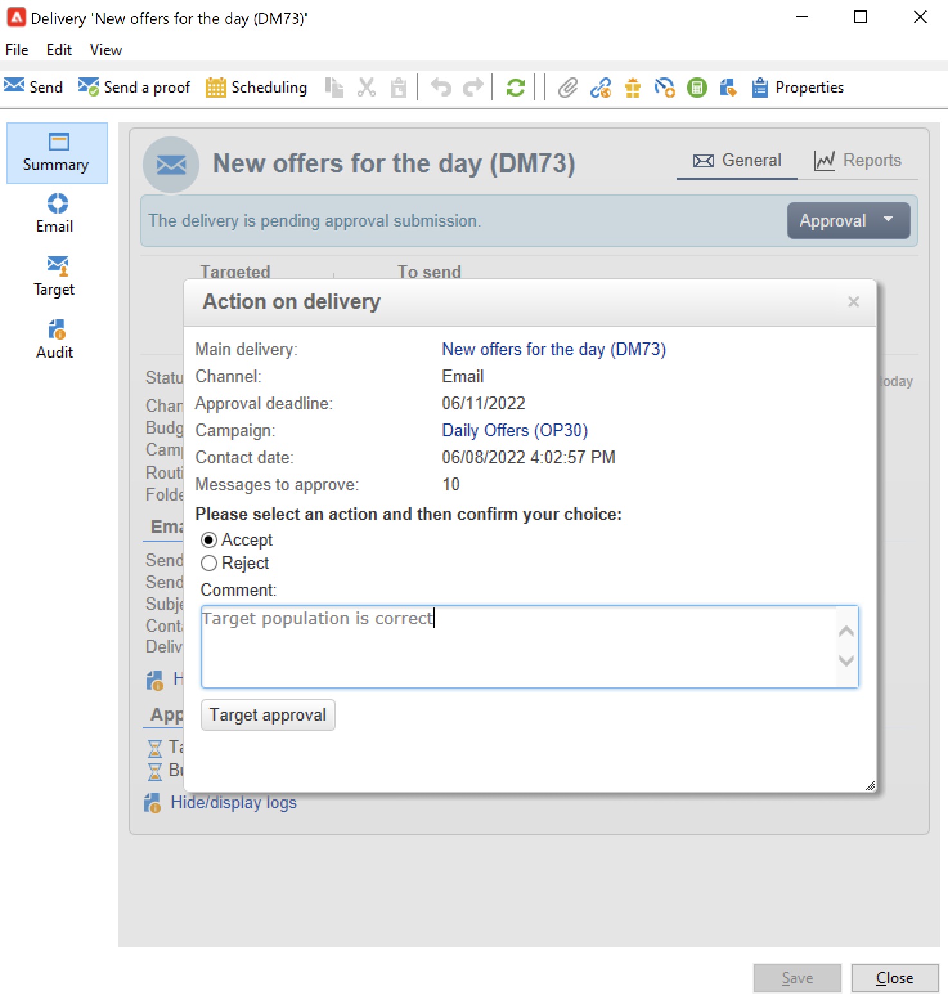
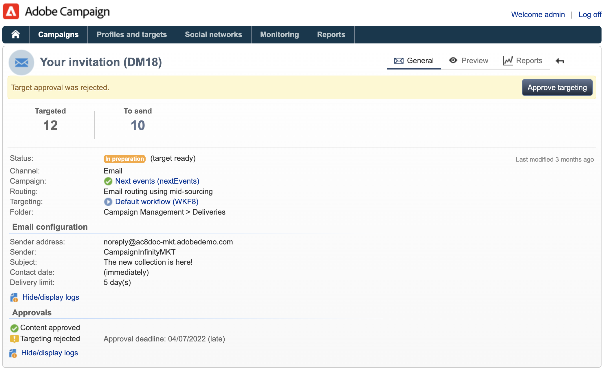
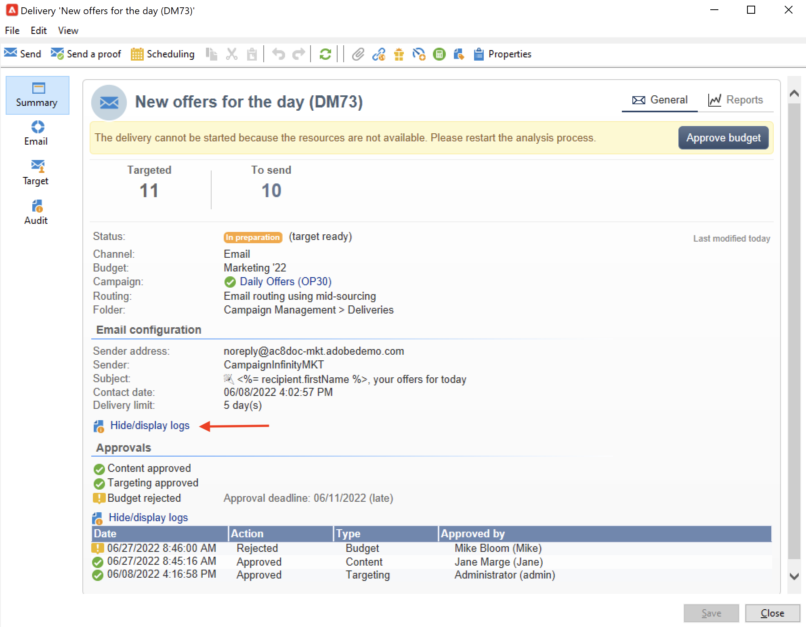

# 建立和管理审批流程 {#approval-marketing-campaigns}

创建和批准营销活动所涉及的方法和人员特定于每个组织。 活动批准流程涉及协调多个利益相关方：数字营销人员、投放经理、内容管理人员和外部所有者（如合作伙伴或供应商）。

通过Adobe Campaign，您可以为营销活动设置批准流程，并在需要操作时通知操作员。 您可以为投放的每个步骤定义批准：定位、内容、预算、提取和校样发送。 当您的营销活动投放完成各种验证步骤时，Adobe Campaigns会编译修改和签核的历史记录，包括反馈、评论、更改请求和评论。

通知消息将发送给指定为审阅人的Adobe Campaign操作员，以通知他们批准请求。

操作员可以通过以下几种方式进行批准：

* 从通知消息。 电子邮件中的链接可让操作员通过Web浏览器访问Campaign。 连接后，审阅人可以选择是否批准内容。
   

* 从营销活动仪表板。
   

* 从投放仪表板。
   

操作员可以从批准窗口访问营销活动和投放。 用户还可以输入评论。

操作员验证后，该信息会显示在营销活动和投放仪表板以及日志中。

投放的批准日志和营销活动的批准日志中也提供此信息。 通过 **[!UICONTROL Edit > Audit > Approvals]** 选项卡。

## 启用批准{#enable-approvals}

审批通知会发送给受影响的操作员，这些操作员会收到启用审批的每个流程的通知。

可为营销活动模板、每个营销活动单独启用，或为投放启用。

所有需要批准的作业均通过  **[!UICONTROL Properties]** > **[!UICONTROL Advanced campaign parameters...]** > **[!UICONTROL Approvals]** 选项卡。 从此选项卡中选择审阅人或审阅人组。 除非未启用此选项，否则用户会收到通知。 [了解详情](#approving-processes)。

可以使用此模板创建的每个营销活动都可以覆盖这些设置，每个投放也可以单独覆盖这些设置。 浏览 **[!UICONTROL Properties]** 按钮，然后 **[!UICONTROL Approvals]** 选项卡。

在以下示例中，投放内容不需要批准：

>[!CAUTION]
>
>检查审阅人是否具有 **适当的权限** ，且其安全区域已正确定义。 [了解详情](#selecting-reviewers)。

有关投放的审批流程，请参阅 [此部分](#review-and-approve-deliveries).

## 选择审阅人 {#select-reviewers}

对于每种类型的批准，从投放的下拉列表中选择负责批准的操作员或操作员组。 可以使用 **[!UICONTROL Edit...]** 链接。 此窗口还允许您编辑审批截止时间。 默认情况下，审阅人自提交日期起有3天时间批准流程。 要添加自动提醒，请使用 **[!UICONTROL Add a reminder]** 链接。

如果未指定审核者，则营销活动所有者负责审批并接收通知。 在 **[!UICONTROL Edit > Properties]** 选项卡：

所有其他Adobe Campaign运算符 **[!UICONTROL Administrator]** 权限也可以批准作业，但不会收到通知。

>[!NOTE]
>
>默认情况下，如果定义了批准运算符，则营销活动所有者无法执行批准或启动投放。 作为Adobe Campaign管理员，您可以修改此行为，并通过创建 **NmsCampaign_Activate_OwnerConfirmation** 选项，设置为 **1**.

如果定义了审阅人列表，则当一个审阅人批准了某个作业时，该作业即被批准。 然后，营销活动和投放功能板中将不再提供批准链接。 在启用通知发送后，如果其他审阅人单击通知消息中的批准链接，则系统会通知他们其他操作员已经批准了该作业。

## 审核和批准投放 {#review-and-approve-deliveries}

对于每个营销活动，您可以批准投放目标， [投放内容](#approving-content) 和成本。 负责审批工作的 Adobe Campaign 操作员收到电子邮件通知后，可通过控制台或 Web 连接批准或拒绝批准相关请求。[了解详情](#approving-processes)。

对于直邮投放，Adobe Campaign操作员可以在提取文件发送到路由器之前查看提取文件，如有必要，他们可以更改格式并重新启动提取。 [了解详情](#approve-an-extraction-file)。

完成这些验证阶段后，即可启动投放。 [了解详情](marketing-campaign-deliveries.md#starting-a-delivery)。

>[!NOTE]
>
>营销活动模板中会选择需要批准的流程。 [了解详情](marketing-campaign-templates.md)。

### 批准投放的步骤 {#approving-processes}

需要批准的阶段将显示在营销活动仪表板（通过控制台或Web界面）中。 它们还会显示在投放跟踪表和投放仪表板中。

对于营销活动中的每个投放，您可以批准以下流程：

* **定位、内容和预算**

   当 **[!UICONTROL Enable target approval]**, **[!UICONTROL Enable content approval]** 或 **[!UICONTROL Enable budget approval]** 选项，相关链接将显示在营销活动和投放功能板中。

   

   >[!NOTE]
   >
   >只有在审批设置窗口中启用了目标审批后，才可进行预算审批。 仅在分析目标后，才会显示用于预算审批的链接。

   如果 **[!UICONTROL Assign content editing]** 或 **[!UICONTROL External content approval]** 选项，功能板将显示 **[!UICONTROL Available content]** 和 **[!UICONTROL External content approval]** 链接。

   内容批准允许您访问发送的校样。

* **提取批准（直邮投放）**

   When **[!UICONTROL Enable extraction approval]** 在“批准设置”窗口中选择，则必须先批准提取的文件，然后才能通知路由器。

   的 **[!UICONTROL Approve file]** 选项在营销活动和投放功能板上可用。

   

   您可以在验证之前预览输出文件。 提取文件预览仅显示数据示例。 不会加载整个文件。

* **批准关联的投放**

   的 **[!UICONTROL Enable individual approval of each associated delivery]** 选项用于与辅助投放关联的主投放。 默认情况下，不会选择此选项，以便能够对主投放进行整体批准。 如果选择此选项，则必须单独批准每个投放。

   

>[!NOTE]
>
>在定位工作流中，如果在消息准备期间发生链接到配置问题的错误，则 **[!UICONTROL Restart message preparation]** 链接。 修复错误，并使用此链接在绕过定位阶段时重新启动消息准备。

### 批准内容 {#approve-content}

>[!CAUTION]
>
>要批准内容，必须进行校样循环。 通过校样，您可以批准信息显示、个性化数据并检查链接是否正常工作。
>
>下面详述的内容批准功能与校样投放相关。

可以配置内容批准周期。 为此，请选择 **[!UICONTROL Enable content approval]** 选项。 内容批准周期的主要步骤是：

1. 创建新投放后，营销活动经理单击 **[!UICONTROL Submit content]** 链接以开始内容批准周期。

   >[!NOTE]
   >
   >如果 **[!UICONTROL Enable the sending of proofs]** 选项（用于电子邮件投放）或 **[!UICONTROL Enable the sending and approval of proofs]** （对于直邮投放）选项时，将会自动发送校样。

1. 系统会向负责内容的人员发送通知电子邮件，该人员可以选择是否批准该内容：

   * 通过通知电子邮件：通知电子邮件包含指向已发送校样的链接，如果 **投放能力** 已为此实例启用加载项。

   * 通过控制台或web界面、投放跟踪、投放仪表板或营销活动仪表板。 利用此营销活动功能板，可通过单击 **[!UICONTROL Inbox rendering...]** 链接。 要查看其内容，请单击 **[!UICONTROL Detail]** 图标。

1. 系统会向负责营销活动的人员发送通知电子邮件，通知他们内容是否已获得批准。 负责营销活动的人员可以随时重新启动内容批准周期。 为此，请单击 **[!UICONTROL Content status]** 行（在投放级别），然后单击 **[!UICONTROL Reset content approval to submit it again]**.

#### 分配内容编辑 {#assign-content-editing}

利用此选项，可定义负责内容编辑的人员，如网站管理员。 如果 **[!UICONTROL Assign content editing]** 在“批准设置”窗口中选择“选项”，在创建投放和将通知电子邮件发送给内容负责人之间添加了多个批准步骤：

1. 创建新投放后，营销活动负责人点击 **[!UICONTROL Submit content editing]** 链接，以开始内容编辑周期。

1. 负责内容编辑的人员将收到一封电子邮件，告知他们内容可用。

1. 然后，他们可以登录到控制台，打开投放并使用简化的向导对其进行编辑，以更改主题、HTML和文本内容，并发送校样。

   >[!NOTE]
   >
   >如果 **[!UICONTROL Enable the sending of proofs]** 选项（用于电子邮件投放）或 **[!UICONTROL Enable the sending and approval of proofs]** （对于直邮投放）选项时，将会自动发送校样。

1. 负责内容编辑的人员完成对投放内容所做的任何更改后，便可以使内容可用。

   要实现此目的，他们可以使用：

   * the **[!UICONTROL Available content]** 链接。
   * 通知消息中的链接。
操作员在将内容提交给营销活动负责人之前可以添加评论。
通知消息允许审阅人批准或拒绝内容。

#### 外部内容批准 {#external-content-approval}

利用此选项，可定义负责批准投放渲染的外部操作员，如品牌通信一致性、费率等。 当 **[!UICONTROL External content approval]** 在“批准设置”窗口中选择“选项”，在内容批准和将通知发送给营销活动负责人之间添加多个批准步骤：

1. 外部内容管理器收到通知电子邮件，告知其内容已获得批准并请求外部批准。
1. 通知电子邮件包含指向已发送校样的链接（用于查看投放渲染）以及用于批准或拒绝投放内容的按钮。

仅当发送了一个或多个校样时，这些链接才可用。 否则，投放渲染仅可通过控制台或Web界面来使用。

### 批准提取文件 {#approve-an-extraction-file}

对于脱机投放，Adobe Campaign会生成一个提取文件，根据其设置，该文件将发送到路由器。 其内容取决于所使用的导出模板。

在内容、定位和预算获得批准后，投放会更改为 **[!UICONTROL Extraction pending]** 直到启动营销活动的提取工作流。

在提取请求日期，将创建提取文件，并将投放状态更改为 **[!UICONTROL File to approve]**.

您可以查看提取的文件的内容（通过单击其名称）、批准该文件，或根据需要更改格式，然后使用功能板上的链接重新启动提取。

文件获得批准后，即可向路由器发送通知电子邮件。 [了解详情](marketing-campaign-deliveries.md#start-an-offline-delivery)。

## 审批模式 {#approval-modes}

可以在活动仪表板、投放跟踪选项卡、投放仪表板或发送给审阅人的电子邮件通知中批准作业。

### 在功能板中批准 {#approval-via-the-dashboard}

要通过控制台或Web界面批准作业，请单击营销活动仪表板上的相应链接。

例如，执行投放分析后：

1. 选择 **[!UICONTROL Approve targeting]**。

1. 在弹出窗口中，检查要批准的信息。
1. 选择 **[!UICONTROL Accept]** 或 **[!UICONTROL Reject]** 并根据需要输入评论。 此评论将显示在验证日志中。
1. 通过 **[!UICONTROL Target approval]** 按钮。

如果某个流程已经由其他操作员批准，则该批准链接不可用。

如果某个流程被拒绝，该信息将按如下方式显示在投放仪表板中：

### 从通知消息批准 {#approval-via-notification-messages}

从 [通知消息](#notifications):

1. 单击通知中的链接。
1. 登录Adobe Campaign。
1. 检查要批准的信息
1. 选择 **[!UICONTROL Accept]** 或 **[!UICONTROL Reject]** 并根据需要输入评论。
1. 验证. 您的选择和评论会显示在验证日志中。

>[!NOTE]
>
>如果在该过程中引发警告，则通知中会显示警告。

### 跟踪批准{#approval-tracking}

用户界面中提供了批准日志：

* 在营销活动批准日志中， **[!UICONTROL Approvals]** 的子选项卡 **[!UICONTROL Edit > Audit]** 选项卡：

   

* 在营销活动投放日志中， **[!UICONTROL Deliveries]** 的子选项卡 **[!UICONTROL Edit > Audit]** 选项卡：

   

* 单击 **[!UICONTROL Hide/display logs]** 的 **[!UICONTROL Summary]** 选项卡。

   

* 此信息也可以通过 **[!UICONTROL Audit > Approvals]** 每个投放的选项卡：

   

>[!NOTE]
>
>操作员批准或拒绝某个工作后，其他审阅人便无法再更改该工作。

### 自动/手动批准 {#automatic-and-manual-approval}

在创建定位工作流程时，如果批准是自动的（默认模式），则Adobe Campaign会显示批准链接或在需要批准时立即发送通知。

要选择批准模式（手动或自动），请单击 **[!UICONTROL Edit > Properties]** 选项卡，然后单击 **[!UICONTROL Advanced campaign parameters...]** 最后 **[!UICONTROL Approvals]** 选项卡。
par

>[!NOTE]
>
>批准模式适用于营销活动的所有投放。

构建定向工作流程时，手动批准可让您避免创建批准链接或自动发送通知。 然后，营销活动仪表板提供 **[!UICONTROL Submit targeting for approval]** 链接以手动启动批准流程。

通过确认消息，您可以授权对此投放选择的作业进行批准。

然后，批准按钮会显示在营销活动仪表板（用于此投放）、投放仪表板和投放跟踪中。 如果启用了通知，则将并行发送它们。

这种启用批准的方法可让您处理定位，而无需向审阅人发送虚假通知。

## 通知 {#notifications}

通知是发送给审阅人的特定电子邮件，用于通知审阅人某个流程正在等待批准。 当操作员单击消息中的链接时，将显示验证页面，登录后，操作员可以查看信息并批准或拒绝作业。 也可以在审批窗口中输入评论。

通知电子邮件的内容可以个性化。 请参阅 [通知内容](#notification-content).

### 启用/禁用通知 {#enabling-disabling-notification}

默认情况下，如果在营销活动模板、营销活动或投放中启用了相关作业的批准，则会发送通知消息。 但是，可以禁用通知，以便仅从控制台授权批准。

为此，请编辑营销活动或营销活动模板的批准窗口( **[!UICONTROL Edit > Properties]** > **[!UICONTROL Advanced campaign parameters...]** > **[!UICONTROL Approvals]** ) **[!UICONTROL Do not enable notification sending]**.

### 通知内容 {#notification-content}

通知内容在特定模板中定义： **[!UICONTROL Notification of validations for the marketing campaign]**. 此模板保存在 **[!UICONTROL Administration > Campaign management > Technical delivery templates]** 文件夹。
