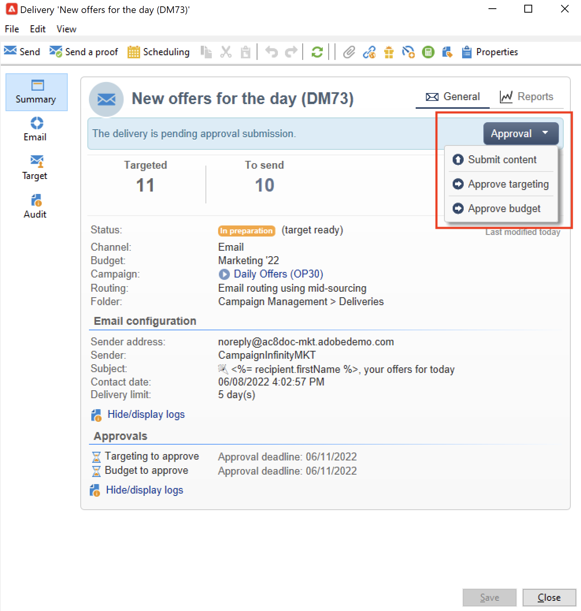
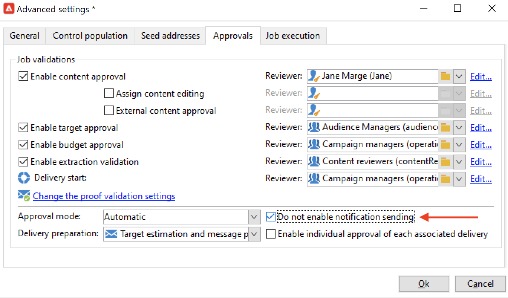

# 建立和管理审批流程 {#approval-marketing-campaigns}

参与创建和批准营销活动的方法和人员特定于每个组织。 活动审批流程涉及协调多个利益相关者：数字营销人员、投放经理、内容经理以及外部所有者（如合作伙伴或供应商）。

借助Adobe Campaign，您可以为营销策划设置批准流程，并在需要采取行动时通知操作员。 您可以为投放的每个步骤定义批准：定位、内容、预算、提取和证明发送。 当您的营销活动投放经历各种验证步骤时，Adobe Campaigns会编译修改和签署的历史记录，包括反馈、注释、更改请求和注释。

通知消息将发送给指定为审阅人的Adobe Campaign操作员，以告知他们有关批准请求的信息。

操作员可以通过多种方式批准：

* 来自通知消息。 电子邮件中的链接使操作员通过Web浏览器访问Campaign。 连接后，审阅者可以选择是否批准内容。
   

* 从营销活动仪表板。
   

* 从投放仪表板。
   

操作员可以从审批窗口访问活动和投放。 他们还可以输入评论。

操作员验证后，该信息会显示在营销活动和投放仪表板以及日志中。

该信息还可在投放的批准日志和营销活动的批准日志中找到。 这些日志可通过以下方式访问： **[!UICONTROL Edit > Audit > Approvals]** 选项卡。

## 启用审批{#enable-approvals}

审批通知将发送给每个启用审批的流程中受影响的操作员。

可以为营销活动模板、单独为每个营销活动或投放启用这些选项。

在营销活动模板中，通过选择需要批准的所有作业  **[!UICONTROL Properties]** > **[!UICONTROL Advanced campaign parameters...]** > **[!UICONTROL Approvals]** 选项卡。 从该选项卡中选择审阅人或审阅人组。 除非未启用此选项，否则用户会收到通知。 [了解详情](#approving-processes)。

可以覆盖使用此模板创建的每个营销活动的这些设置，也可以分别覆盖每个投放的这些设置。 浏览 **[!UICONTROL Properties]** 按钮，然后 **[!UICONTROL Approvals]** 选项卡。

在以下示例中，投放内容不需要审批：

>[!CAUTION]
>
>检查审阅人是否拥有 **适当的权限** ，并确保正确定义了它们的安全区域。 [了解详情](#selecting-reviewers)。

有关投放的批准流程的详情，请参见 [本节](#review-and-approve-deliveries).

## 选择审阅人 {#select-reviewers}

对于每种类型的批准，从投放的下拉列表中选择负责批准的操作员或操作员组。 可以使用添加更多运算符 **[!UICONTROL Edit...]** 链接。 利用此窗口，您还可以编辑审批截止日期。 默认情况下，审核者从提交日期起有三天时间来批准流程。 要添加自动提醒，请使用 **[!UICONTROL Add a reminder]** 链接。

如果未指定审核者，则市场活动所有者将负责审批并接收通知。 促销活动的所有者指定于 **[!UICONTROL Edit > Properties]** 的选项卡：

所有其他Adobe Campaign运算符，具有 **[!UICONTROL Administrator]** 权限也可以批准作业，但不会收到通知。

>[!NOTE]
>
>默认情况下，如果定义了审批操作员，则活动所有者无法执行审批或开始投放。 作为Adobe Campaign管理员，您可以修改此行为，并通过创建 **NmsCampaign_Activate_OwnerConfirmation** option，设置为 **1**.

如果定义了审核者列表，则当审核者批准某个作业后，即会批准该作业。 然后，审批链接在营销活动和投放仪表板中不再可用。 启用通知发送后，如果其他审阅人单击通知消息中的批准链接，则会通知他们其他操作员已批准作业。

## 审阅和批准投放 {#review-and-approve-deliveries}

对于每个活动，您可以批准投放目标， [投放内容](#approving-content) 和成本。 负责审批工作的 Adobe Campaign 操作员收到电子邮件通知后，可通过控制台或 Web 连接批准或拒绝批准相关请求。[了解详情](#approving-processes)。

对于直邮投放，Adobe Campaign操作员可以在提取文件发送到路由器之前查看该文件，如有必要，他们可以更改格式并重新提取该文件。 [了解详情](#approve-an-extraction-file)。

当这些验证阶段完成后，可以启动投放。 [了解详情](marketing-campaign-deliveries.md#starting-a-delivery)。

>[!NOTE]
>
>在活动模板中选择需要批准的流程。 [了解详情](marketing-campaign-templates.md)。

### 批准投放的步骤 {#approving-processes}

需要批准的阶段会显示在活动仪表板上（通过控制台或Web界面）。 它们还会显示在投放跟踪表和投放仪表板中。

对于营销活动中的每次投放，您可以批准以下流程：

* **定位、内容和预算**

   当 **[!UICONTROL Enable target approval]**， **[!UICONTROL Enable content approval]** 或 **[!UICONTROL Enable budget approval]** 在审批设置窗口中选择选项，相关链接将显示在campaign和delivery仪表板中。

   

   >[!NOTE]
   >
   >仅当在审批设置窗口中启用目标审批时，预算审批才可用。 仅当分析目标后，才会显示预算审批链接。

   如果 **[!UICONTROL Assign content editing]** 或 **[!UICONTROL External content approval]** 在审批设置窗口中选择选项，仪表板将显示 **[!UICONTROL Available content]** 和 **[!UICONTROL External content approval]** 链接。

   通过内容审批，您可以访问发送的校样。

* **提取审批（直邮投放）**

   时间 **[!UICONTROL Enable extraction approval]** 在批准设置窗口中选择，提取的文件必须先获得批准，然后才能通知路由器。

   此 **[!UICONTROL Approve file]** 选项在campaign和delivery功能板上可用。

   

   您可以在验证之前预览输出文件。 提取文件预览仅显示数据示例。 未加载整个文件。

* **批准关联的投放**

   此 **[!UICONTROL Enable individual approval of each associated delivery]** 选项用于与辅助投放关联的一次投放。 默认情况下，不会选中此选项，因此可以对主投放执行整体审批。 如果选择此选项，则必须单独批准每个投放。

   

>[!NOTE]
>
>在定向工作流中，如果在消息准备期间发生链接到配置问题的错误，则 **[!UICONTROL Restart message preparation]** 链接将显示在功能板上。 修复该错误，并使用此链接在绕过定位阶段时重新启动消息准备。

### 批准内容 {#approve-content}

>[!CAUTION]
>
>要批准内容，验证周期是必需的。 校样允许您批准显示信息和个性化数据，并检查链接是否正常工作。
>
>下面详述的内容审批功能与证明交付相关。

可以配置内容批准周期。 要执行此操作，请选择 **[!UICONTROL Enable content approval]** 选项。 内容审批周期的主要步骤包括：

1. 创建新投放后，营销活动经理单击 **[!UICONTROL Submit content]** 活动仪表板上的链接，以开始内容审批周期。

   >[!NOTE]
   >
   >如果 **[!UICONTROL Enable the sending of proofs]** 选项（用于电子邮件投放）或 **[!UICONTROL Enable the sending and approval of proofs]** （对于直邮投放）选项已在审批设置窗口中选择，验证将自动发送。

1. 通知电子邮件将发送给负责内容的人员，他们可以选择是否批准该内容：

   * 通过通知电子邮件：通知电子邮件包含指向已发送校样的链接，并且如果 **可投放性** 已为此实例启用加载项。

   * 通过控制台或Web界面、投放跟踪、投放仪表板或营销活动仪表板。 利用此营销活动信息板，您可以通过单击 **[!UICONTROL Inbox rendering...]** 链接。 要查看其内容，请单击 **[!UICONTROL Detail]** 图标。

1. 将向营销策划负责人发送通知电子邮件，通知他们内容是否已被批准。 营销活动的负责人可以随时重新开始内容审批周期。 要执行此操作，请单击 **[!UICONTROL Content status]** 营销活动仪表板的行（在投放级别），然后单击 **[!UICONTROL Reset content approval to submit it again]**.

#### 分配内容编辑 {#assign-content-editing}

利用此选项，可定义负责内容编辑的人员，如网站管理员。 如果 **[!UICONTROL Assign content editing]** 在审批设置窗口中选择了选项，则在投放创建和将通知电子邮件交付给负责内容的人之间添加了多个审批步骤：

1. 创建新投放后，活动负责人单击 **[!UICONTROL Submit content editing]** campaign仪表板中的链接，以开始内容编辑周期。

1. 负责内容编辑的人员将收到一封电子邮件，告诉他们内容可用。

1. 然后，他们可以登录到控制台，打开投放并使用简化的向导进行编辑，以更改主题、HTML和文本内容，并发送校样。

   >[!NOTE]
   >
   >如果 **[!UICONTROL Enable the sending of proofs]** 选项（用于电子邮件投放）或 **[!UICONTROL Enable the sending and approval of proofs]** （对于直邮投放）选项已在审批设置窗口中选择，验证将自动发送。

1. 一旦负责内容编辑的人员完成对投放内容的任何更改，他们就可以使内容可用。

   为此，他们可以使用：

   * 此 **[!UICONTROL Available content]** Adobe Campaign控制台中的链接。
   * 通知消息中的链接。
操作员可在将内容提交到营销策划负责人之前添加评论。
通知消息允许审阅人批准或拒绝内容。

#### 外部内容审批 {#external-content-approval}

利用此选项，可定义负责批准投放呈现（如品牌通信一致性、费率等）的外部操作员。 当 **[!UICONTROL External content approval]** 在审批设置窗口中选择选项，则在内容审批和将通知交付给活动负责人之间添加了多个审批步骤：

1. 外部内容经理会收到通知电子邮件，告知他们内容已获批准并请求外部批准。
1. 通知电子邮件包含指向已发送校样的链接（用于查看投放渲染），以及一个用于批准或拒绝投放内容的按钮。

这些链接仅在发送了一个或多个验证后才可用。 否则，只能通过控制台或Web界面进行投放渲染。

### 批准提取文件 {#approve-an-extraction-file}

对于离线投放，Adobe Campaign会生成一个提取文件，并根据其设置方式将其发送到路由器。 其内容取决于所使用的导出模板。

内容、目标和预算获得批准后，交付将更改为 **[!UICONTROL Extraction pending]** 直到启动营销活动的提取工作流为止。

在提取请求日期，将创建提取文件并更改投放状态 **[!UICONTROL File to approve]**.

您可以查看提取文件的内容（通过单击其名称）、批准该文件，或者在必要时，使用功能板上的链接更改格式并重新启动提取。

文件获得批准后，即可向路由器发送通知电子邮件。 [了解详情](marketing-campaign-deliveries.md#start-an-offline-delivery)。

## 审批模式 {#approval-modes}

可以在活动功能板、投放跟踪选项卡、投放功能板或发送给审阅人的电子邮件通知中批准作业。

### 在仪表板中批准 {#approval-via-the-dashboard}

要通过控制台或Web界面批准作业，请单击营销活动仪表板上的相应链接。

例如，执行投放分析后：

1. 选择 **[!UICONTROL Approve targeting]**。

1. 在弹出窗口中，检查要批准的信息。
1. 选择 **[!UICONTROL Accept]** 或 **[!UICONTROL Reject]** 并根据需要输入评论。 此注释将显示在验证日志中。
1. 使用 **[!UICONTROL Target approval]** 按钮。

如果某个流程已被其他操作员批准，则批准链接不可用。

如果流程被拒绝，则投放仪表板中会显示以下信息：

### 批准通知消息 {#approval-via-notification-messages}

要批准作业，请执行以下操作： [通知消息](#notifications)：

1. 单击通知中的链接。
1. 登录到Adobe Campaign。
1. 检查要批准的信息
1. 选择 **[!UICONTROL Accept]** 或 **[!UICONTROL Reject]** 并根据需要输入评论。
1. 验证. 您的选择和注释将显示在验证日志中。

>[!NOTE]
>
>如果在此过程中出现警告，则通知中会显示警告。

### 跟踪审批{#approval-tracking}

用户界面中提供了批准日志：

* 在营销活动批准日志中， **[!UICONTROL Approvals]** 的子选项卡 **[!UICONTROL Edit > Audit]** 选项卡：

   

* 在营销活动投放日志中， **[!UICONTROL Deliveries]** 的子选项卡 **[!UICONTROL Edit > Audit]** 选项卡：

   

* 通过单击 **[!UICONTROL Hide/display logs]** 的选项 **[!UICONTROL Summary]** 选项卡。

   

* 此信息也可通过 **[!UICONTROL Audit > Approvals]** 选项卡中显示的每个投放：

   

>[!NOTE]
>
>操作员批准或拒绝作业后，其他审核者无法再更改它。

### 自动/手动审批 {#automatic-and-manual-approval}

在创建定位工作流时，如果批准是自动的（默认模式），Adobe Campaign会显示批准链接，或者在需要批准时立即发送通知。

要选择审批模式（人工或自动），请单击 **[!UICONTROL Edit > Properties]** 选项卡，然后单击 **[!UICONTROL Advanced campaign parameters...]** 最后 **[!UICONTROL Approvals]** 选项卡。
票面值

>[!NOTE]
>
>审批模式适用于营销活动的所有投放。

在构建定位工作流时，通过手动批准，您可以避免创建批准链接或自动发送通知。 然后，营销活动仪表板提供 **[!UICONTROL Submit targeting for approval]** 链接，以手动启动批准流程。

通过确认消息，可授权审批为此投放选择的作业。

然后，审批按钮会显示在活动仪表板（适用于此投放）、投放仪表板和投放跟踪中。 如果启用了通知，则将并行发送这些通知。

通过启用批准这一方法，您无需向审阅人发送虚假通知，即可确定目标。

## 通知 {#notifications}

通知是发送给审阅人的特定电子邮件，用于通知他们流程正在等待审批。 当操作员单击消息中的链接时，将显示一个身份验证页面，登录后，操作员可以查看该信息并批准或拒绝作业。 您还可以在审批窗口中输入备注。

通知电子邮件的内容可以个性化。 参见 [通知内容](#notification-content).

### 启用/禁用通知 {#enabling-disabling-notification}

默认情况下，如果在活动模板、活动或投放中启用了相关作业的审批，则会发送通知消息。 但是，可以禁用通知，以便仅从控制台中授权审批。

要执行此操作，请编辑活动或活动模板的批准窗口( **[!UICONTROL Edit > Properties]** > **[!UICONTROL Advanced campaign parameters...]** > **[!UICONTROL Approvals]** 选项卡)并选择 **[!UICONTROL Do not enable notification sending]**.

### 通知内容 {#notification-content}

通知内容是在特定模板中定义的： **[!UICONTROL Notification of validations for the marketing campaign]**. 此模板保存在 **[!UICONTROL Administration > Campaign management > Technical delivery templates]** Adobe Campaign树的文件夹。
