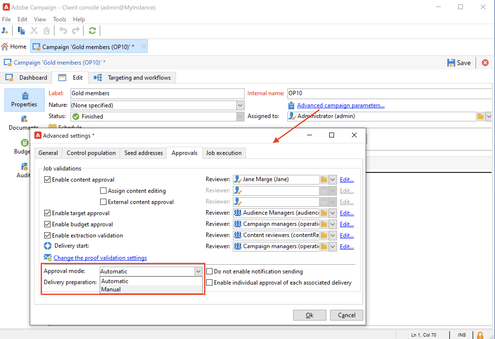

# 建立和管理审批流程 {#approval-marketing-campaigns}

创建和批准营销活动所涉及的方法和人员特定于每个组织。 活动审批流程涉及协调多个利益相关者：数字营销人员、投放经理、内容经理以及外部所有者，例如合作伙伴或供应商。

借助Adobe Campaign，您可以为营销策划设置批准流程，并在需要执行操作时通知操作员。 您可以为投放的每个步骤定义批准：定位、内容、预算、提取和验证发送。 当您的营销活动投放经历各种验证步骤时，Adobe Campaigns会编译修改和签署的历史记录，包括反馈、注释、更改请求和注释。

通知消息将发送给指定为审阅人的Adobe Campaign操作员，以告知他们有关批准请求的信息。

操作员可以通过多种方式批准：

* 来自通知消息。 电子邮件中的链接可让操作员通过Web浏览器访问Campaign。 连接后，查看者可以选择是否批准内容。
  

* 从营销活动仪表板。
  

* 从投放仪表板。
  

操作员可以从审批窗口访问活动和投放。 用户也可以输入评论。

操作员验证后，该信息会显示在营销活动和投放功能板以及日志中。

该信息还可在投放的审批日志和营销策划的审批日志中找到。 通过&#x200B;**[!UICONTROL Edit > Audit > Approvals]**&#x200B;选项卡访问这些日志。

## 启用审批{#enable-approvals}

审批通知将发送给受影响的操作员，并发送给每个启用了审批的流程。

它们可以为营销活动模板启用，也可以单独为每个营销活动启用，或为投放启用。

通过&#x200B;**[!UICONTROL Properties]** > **[!UICONTROL Advanced campaign parameters...]** > **[!UICONTROL Approvals]**&#x200B;选项卡，在营销活动模板中选择所有需要审批的作业。 从该选项卡中选择审阅人或审阅人组。 除非未启用此选项，否则用户会收到通知。 [了解详情](#approving-processes)。

可以覆盖使用此模板创建的每个营销活动的这些设置，也可以单独覆盖每个投放的这些设置。 浏览投放的&#x200B;**[!UICONTROL Properties]**&#x200B;按钮，然后浏览&#x200B;**[!UICONTROL Approvals]**&#x200B;选项卡。

在以下示例中，投放内容不需要审批：

>[!CAUTION]
>
>检查审阅人是否具有批准所需的&#x200B;**适当权限**，以及是否正确定义了其安全区域。 [了解详情](#selecting-reviewers)。

在[此部分](#review-and-approve-deliveries)中详细介绍了投放的批准流程。

## 选择审阅人 {#select-reviewers}

对于每种类型的批准，从投放的下拉列表中选择负责批准的操作员或操作员组。 可以使用&#x200B;**[!UICONTROL Edit...]**&#x200B;链接添加更多运算符。 此窗口还允许您编辑审批截止日期。 默认情况下，审阅人从提交日期起有三天时间来批准流程。 要添加自动提醒，请使用&#x200B;**[!UICONTROL Add a reminder]**&#x200B;链接。

如果未指定审核者，则市场活动责任人负责审批并接收通知。 在营销活动的&#x200B;**[!UICONTROL Edit > Properties]**&#x200B;选项卡中指定营销活动所有者：

所有其他具有&#x200B;**[!UICONTROL Administrator]**&#x200B;权限的Adobe Campaign操作员也可以批准作业，但他们不会收到通知。

>[!NOTE]
>
>默认情况下，如果定义了批准操作员，则活动所有者无法执行批准或开始投放。 作为Adobe Campaign管理员，您可以通过创建设置为&#x200B;**1**&#x200B;的&#x200B;**NmsCampaign_Activate_OwnerConfirmation**&#x200B;选项，修改此行为并允许活动所有者批准/开始投放。

如果定义了审核者列表，则当审核者批准某个作业后，该作业即会被批准。 然后，审批链接在营销活动和投放仪表板中不再可用。 启用发送通知后，如果其他查看者单击通知消息中的批准链接，则会通知他们其他操作员已批准作业。

## 审阅和批准投放 {#review-and-approve-deliveries}

对于每个活动，您可以批准投放目标、[投放内容](#approving-content)和成本。 负责审批工作的Adobe Campaign操作员收到电子邮件通知后，可通过客户端控制台或Web连接批准或拒绝批准相关请求。 [了解详情](#approving-processes)。

对于直邮投放，Adobe Campaign操作员可以在提取文件发送到路由器之前查看该文件，如有必要，他们可以更改格式并重新执行提取。 [了解详情](#approve-an-extraction-file)。

完成这些验证阶段后，可以启动投放。 [了解详情](marketing-campaign-deliveries.md#starting-a-delivery)。

>[!NOTE]
>
>在活动模板中选择需要批准的流程。 [了解详情](marketing-campaign-templates.md)。
>

### 批准投放的步骤 {#approving-processes}

需要批准的阶段将显示在Campaign仪表板上（通过客户端控制台或Web界面）。 它们还会显示在投放跟踪表和投放仪表板中。

对于活动中的每个投放，您可以批准以下流程：

* **定位、内容和预算**

  在审批设置窗口中选择&#x200B;**[!UICONTROL Enable target approval]**、**[!UICONTROL Enable content approval]**&#x200B;或&#x200B;**[!UICONTROL Enable budget approval]**&#x200B;选项后，相关链接将显示在营销活动和投放功能板中。

  

  >[!NOTE]
  >
  >仅当在审批设置窗口中启用目标审批时，预算审批才可用。 仅当分析目标后，才会显示预算审批链接。

  如果在审批设置窗口中选择了&#x200B;**[!UICONTROL Assign content editing]**&#x200B;或&#x200B;**[!UICONTROL External content approval]**&#x200B;选项，则仪表板将显示&#x200B;**[!UICONTROL Available content]**&#x200B;和&#x200B;**[!UICONTROL External content approval]**&#x200B;链接。

  通过内容审批，可访问发送的校样。

* **提取审批（直邮投放）**

  在审批设置窗口中选择&#x200B;**[!UICONTROL Enable extraction approval]**&#x200B;后，必须批准提取的文件，才能通知路由器。

  **[!UICONTROL Approve file]**&#x200B;选项在营销活动和投放功能板上可用。

  

  您可以在验证之前预览输出文件。 提取文件预览仅显示数据示例。 未加载整个文件。

* **批准关联的投放**

  **[!UICONTROL Enable individual approval of each associated delivery]**&#x200B;选项用于与辅助投放相关的一个主投放。 默认情况下，未选中此选项，因此可以对主投放执行整体审批。 如果选择此选项，则必须单独批准每个投放。

  

>[!NOTE]
>
>在定向工作流中，如果在消息准备期间发生链接到配置问题的错误，则仪表板上会显示&#x200B;**[!UICONTROL Restart message preparation]**&#x200B;链接。 修复该错误，并使用此链接在绕过定位阶段时重新启动消息准备。

### 批准内容 {#approve-content}

>[!CAUTION]
>
>要批准内容，验证周期是必需的。 校样允许您批准显示信息和个性化数据，并检查链接是否正常工作。
>
>下面详述的内容审批功能与验证投放相关。

可以配置内容批准周期。 为此，请在审批设置窗口中选择&#x200B;**[!UICONTROL Enable content approval]**&#x200B;选项。 内容审批周期的主要步骤包括：

1. 创建新投放后，活动经理可单击活动仪表板上的&#x200B;**[!UICONTROL Submit content]**&#x200B;链接以开始内容审批周期。

   >[!NOTE]
   >
   >如果在审批设置窗口中选择了&#x200B;**[!UICONTROL Enable the sending of proofs]**&#x200B;选项（用于电子邮件投放）或&#x200B;**[!UICONTROL Enable the sending and approval of proofs]**&#x200B;选项（用于直邮投放），则将自动发送校样。

1. 通知电子邮件将发送给负责内容的人员，他们可以选择是否批准内容：

   * 通过通知电子邮件：通知电子邮件包含指向已发送校样的链接，如果为此实例启用了&#x200B;**可投放性**&#x200B;加载项，则可能包含指向各种网页邮件的邮件的呈现的链接。

   * 通过客户端控制台或Web界面、投放跟踪、投放仪表板或活动仪表板。 此营销活动信息板允许您通过单击&#x200B;**[!UICONTROL Inbox rendering...]**&#x200B;链接查看已发送的验证列表。 要查看其内容，请单击列表右侧的&#x200B;**[!UICONTROL Detail]**&#x200B;图标。

1. 将向营销策划负责人发送通知电子邮件，告知他们内容是否已被批准。 活动负责人可以随时重新开始内容审批周期。 为此，请单击Campaign仪表板的&#x200B;**[!UICONTROL Content status]**&#x200B;行（在投放级别）上的链接，然后单击&#x200B;**[!UICONTROL Reset content approval to submit it again]**。

#### 分配内容编辑 {#assign-content-editing}

利用此选项，可定义负责内容编辑的人员，如网站管理员。 如果在审批设置窗口中选择了&#x200B;**[!UICONTROL Assign content editing]**&#x200B;选项，则在投放创建和将通知电子邮件交付给内容负责人之间会添加多个审批步骤：

1. 创建新投放后，营销活动负责人单击营销活动仪表板中的&#x200B;**[!UICONTROL Submit content editing]**&#x200B;链接以开始内容编辑周期。

1. 负责内容编辑的人员将收到一封电子邮件，告知他们内容可用。

1. 然后，他们可以登录到Client Console，打开投放并使用简化的向导对其进行编辑，以更改主题、HTML和文本内容，并发送校样。

   >[!NOTE]
   >
   >如果在审批设置窗口中选择了&#x200B;**[!UICONTROL Enable the sending of proofs]**&#x200B;选项（用于电子邮件投放）或&#x200B;**[!UICONTROL Enable the sending and approval of proofs]**&#x200B;选项（用于直邮投放），则将自动发送校样。

1. 一旦负责内容编辑的人员完成对投放内容的任何更改，他们就可以使内容可用。

   为此，他们可以使用：

   * Adobe Campaign客户端控制台中的&#x200B;**[!UICONTROL Available content]**&#x200B;链接。
   * 通知消息中的链接。
操作员可在将内容提交到活动负责人之前添加评论。
通知消息允许审阅人批准或拒绝内容。

#### 外部内容审批 {#external-content-approval}

利用此选项，可定义负责审批投放呈现的外部操作员，如品牌通信一致性、费率等。 在审批设置窗口中选择&#x200B;**[!UICONTROL External content approval]**&#x200B;选项后，在内容审批和将通知交付给活动负责人之间会添加多个审批步骤：

1. 外部内容经理会收到通知电子邮件，告知他们内容已获批准并请求外部批准。
1. 通知电子邮件包含指向已发送校样的链接（允许您查看投放渲染），以及一个用于批准或拒绝投放内容的按钮。

这些链接仅在发送了一个或多个验证后才可用。 否则，只能通过客户端控制台或Web界面进行交付渲染。

### 批准提取文件 {#approve-an-extraction-file}

对于离线投放，Adobe Campaign会生成一个提取文件，并根据其设置方式将其发送到路由器。 其内容取决于所使用的导出模板。

内容、目标和预算获得批准后，投放将更改为&#x200B;**[!UICONTROL Extraction pending]**，直到启动营销活动的提取工作流为止。

在提取请求日期创建提取文件，并且投放状态更改为&#x200B;**[!UICONTROL File to approve]**。

您可以查看提取文件的内容（通过单击其名称）、批准该文件，或者在必要时使用功能板上的链接更改格式并重新开始提取。

文件获得批准后，即可向路由器发送通知电子邮件。 [了解详情](marketing-campaign-deliveries.md#start-an-offline-delivery)。

## 审批模式 {#approval-modes}

可以在活动功能板、投放跟踪选项卡、投放功能板或发送给查看者的电子邮件通知中批准作业。

### 在仪表板中批准 {#approval-via-the-dashboard}

要通过客户端控制台或Web界面批准作业，请单击Campaign仪表板上的相应链接。

例如，执行投放分析后：

1. 选择 **[!UICONTROL Approve targeting]**。

1. 在弹出窗口中，检查要批准的信息。
1. 选择&#x200B;**[!UICONTROL Accept]**&#x200B;或&#x200B;**[!UICONTROL Reject]**，并根据需要输入评论。 此注释将显示在验证日志中。
1. 使用&#x200B;**[!UICONTROL Target approval]**&#x200B;按钮确认您的选择。

如果某个流程已被其他操作员批准，则批准链接不可用。

如果流程被拒绝，则投放仪表板中会显示以下信息：

### 批准通知消息 {#approval-via-notification-messages}

要通过[通知消息](#notifications)批准作业，请执行以下操作：

1. 单击通知中的链接。
1. 登录到Adobe Campaign。
1. 检查要批准的信息
1. 选择&#x200B;**[!UICONTROL Accept]**&#x200B;或&#x200B;**[!UICONTROL Reject]**，并根据需要输入评论。
1. 验证。 您的选择和注释将显示在验证日志中。

>[!NOTE]
>
>如果在此过程中出现警告，则通知中会显示警告。

### 跟踪审批{#approval-tracking}

用户界面中提供审批日志：

* 在营销活动审批日志中，**[!UICONTROL Edit > Audit]**&#x200B;选项卡的&#x200B;**[!UICONTROL Approvals]**&#x200B;子选项卡：

  

* 在营销活动投放日志中，**[!UICONTROL Edit > Audit]**&#x200B;选项卡的&#x200B;**[!UICONTROL Deliveries]**&#x200B;子选项卡：

  

* 单击&#x200B;**[!UICONTROL Summary]**&#x200B;选项卡的&#x200B;**[!UICONTROL Hide/display logs]**&#x200B;选项可查看每个投放的批准状态。

  

* 也可以通过每个投放的&#x200B;**[!UICONTROL Audit > Approvals]**&#x200B;选项卡访问此信息：

  

>[!NOTE]
>
>操作员批准或拒绝某个作业后，其他审核者就无法再更改该作业。

### 自动/手动审批 {#automatic-and-manual-approval}

在创建定位工作流时，如果批准是自动的（默认模式），Adobe Campaign会显示批准链接，或者在需要批准时立即发送通知。

要选择审批模式（手动或自动），请单击营销活动或营销活动模板的&#x200B;**[!UICONTROL Edit > Properties]**&#x200B;选项卡，然后单击&#x200B;**[!UICONTROL Advanced campaign parameters...]**，最后点击&#x200B;**[!UICONTROL Approvals]**选项卡。
票面值

>[!NOTE]
>
>审批模式适用于营销活动的所有投放。

在构建定向工作流时，通过手动批准，您可以避免创建批准链接或自动发送通知。 然后，营销活动仪表板提供一个&#x200B;**[!UICONTROL Submit targeting for approval]**&#x200B;链接，以手动启动审批流程。

确认消息允许您授权审批为此投放选择的作业。

然后，审批按钮会显示在活动仪表板（适用于此投放）、投放仪表板和投放跟踪中。 如果启用了通知，则将并行发送这些通知。

这种启用审批的方法允许您在不向审阅人发送虚假通知的情况下进行定位。

## 通知 {#notifications}

通知是发送给审阅人的特定电子邮件，用于通知他们流程正在等待审批。 当操作员单击消息中的链接时，将显示验证页面，登录后，操作员可以查看该信息并批准或拒绝作业。 您还可以在审批窗口中输入备注。

通知电子邮件的内容可以个性化。 查看[通知内容](#notification-content)。

### 启用/禁用通知 {#enabling-disabling-notification}

默认情况下，如果在活动模板、活动或投放中启用了相关作业的审批，则会发送通知消息。 但是，可以禁用通知，以便仅从客户端控制台中授权批准。

为此，请编辑营销活动或营销活动模板的审批窗口（**[!UICONTROL Edit > Properties]** > **[!UICONTROL Advanced campaign parameters...]** > **[!UICONTROL Approvals]**&#x200B;选项卡）并选择&#x200B;**[!UICONTROL Do not enable notification sending]**。

### 通知内容 {#notification-content}

通知内容是在特定模板中定义的： **[!UICONTROL Notification of validations for the marketing campaign]**。 此模板保存在Adobe Campaign树的&#x200B;**[!UICONTROL Administration > Campaign management > Technical delivery templates]**&#x200B;文件夹中。
