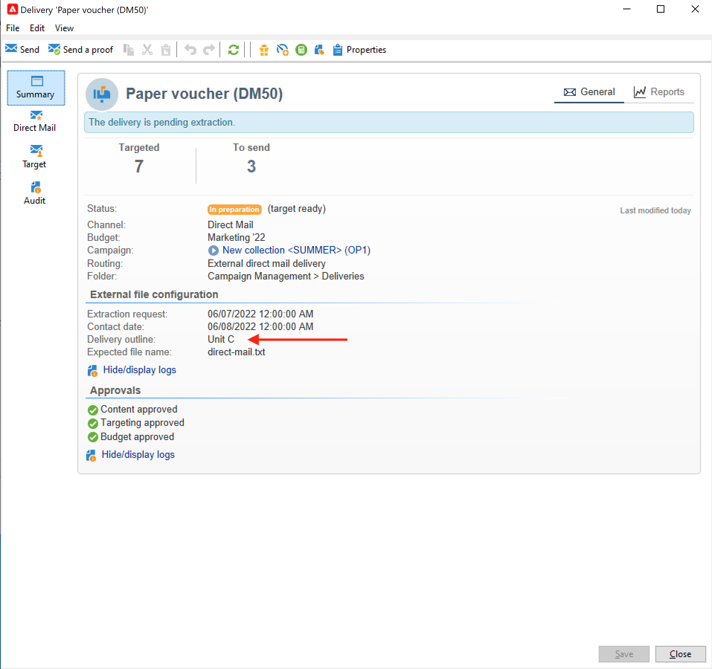

# 管理资源和文档 {#manage-assets-documents}

您可以将各种文档与营销活动关联：报表、照片、网页、图表等。 这些文档可以是任何格式。

在营销策划中，您还可以参考其他项目，如促销优惠券、与特定品牌或商店相关的特殊优惠等。 当这些元素包含在大纲中时，它们可以与直邮投放相关联。 [了解详情](#associating-and-structuring-resources-linked-via-a-delivery-outline)。

>[!CAUTION]
>
>此功能专为小型资产和文档而设计。

<!--
>[!NOTE]
>
>If you are using Campaign Marketing Resource Management module, you can also manage a library of marketing resources that are available for several users for collaborative work. [Learn more](../../mrm/using/managing-marketing-resources.md).
-->

## 添加文档 {#add-documents}

文档可以在营销活动级别（上下文文档）或项目群级别（常规文档）关联。

对于营销活动，**[!UICONTROL Documents]**&#x200B;选项卡包含：

* 具有适当权限的Adobe Campaign操作员可本地下载的内容（模板、图像等）所需的所有文档列表，
* 包含路由器信息的文档（如果有）。

这些文档通过&#x200B;**[!UICONTROL Edit > Documents]**&#x200B;选项卡链接到项目或营销策划。

您还可以通过功能板中的专用链接将文档添加到营销活动。

单击&#x200B;**[!UICONTROL Detail...]**&#x200B;图标可查看文件内容并添加信息：

在仪表板中，与营销活动关联的文档分组到&#x200B;**[!UICONTROL Document(s)]**&#x200B;部分，如以下示例所示：

也可以从此视图编辑和修改它们。

## 使用投放概要 {#delivery-outlines}

投放概要是公司为特定营销活动创建的一组结构化元素（文档、商店、促销优惠券等）。 它在直邮投放的上下文中使用。

这些元素在投放概要中进行分组，每个投放概要都将与投放关联；在发送到&#x200B;**服务提供商**&#x200B;的提取文件中将引用这些元素，以便将其附加到投放。 例如，您可以创建一个投放概要，其中引用单位及其使用的营销小册子。

对于营销活动，利用投放概要，可根据特定条件构建要与投放关联的外部元素：相关单位、授予的促销优惠、本地活动邀请等。

>[!CAUTION]
>
>投放大纲仅限于直邮营销活动。

### 创建投放概要 {#create-an-outline}

要创建投放概要，请单击相关营销活动&#x200B;**[!UICONTROL Edit > Documents]**&#x200B;选项卡中的&#x200B;**[!UICONTROL Delivery outlines]**&#x200B;子选项卡。

>[!NOTE]
>
>如果您看不到此选项卡，则此功能不适用于此营销活动，或者在您的实例中未启用直邮投放。 请参阅[营销活动模板配置](marketing-campaign-templates.md#campaign-templates)或您的许可协议。

接下来，单击&#x200B;**[!UICONTROL Add a delivery outline]**&#x200B;并为该营销活动创建大纲的层次结构：

1. 右键单击树的根并选择&#x200B;**[!UICONTROL New > Delivery outlines]**。
1. 右键单击刚刚创建的大纲，然后选择&#x200B;**[!UICONTROL New > Item]**&#x200B;或&#x200B;**[!UICONTROL New > Personalization fields]**。

大纲可以包含项目、个性化字段和选件：

* 项目可以是物理文档，例如，此处引用和描述的文档，将附加到投放。
* 通过个性化字段，您可以创建与投放而不是收件人相关的个性化元素。 因此，可以创建值以用于特定目标的投放（欢迎优惠、折扣等） 它们在Adobe Campaign中创建，并通过&#x200B;**[!UICONTROL Import personalization fields...]**&#x200B;链接导入大纲。

  

  也可以通过单击列表区域右侧的&#x200B;**[!UICONTROL Add]**&#x200B;图标，直接在大纲中创建它们。

  

### 选择大纲 {#select-an-outline}

对于每次投放，您可以从为提取大纲保留的节中选择要关联的大纲，如以下示例所示：

然后，所选轮廓将显示在窗口的下部。 可使用字段右侧的图标编辑或使用下拉列表更改它：

投放的&#x200B;**[!UICONTROL Summary]**&#x200B;选项卡也显示以下信息：

### 提取结果 {#extraction-result}

在提取并发送到服务提供商的文件中，根据与服务提供商相关的导出模板中的信息将大纲的名称以及适当时其特征（成本、描述等）添加到内容中。

在以下示例中，与投放关联的大纲的标签、预计成本和描述将添加到提取文件中。

导出模型必须与为相关投放选择的服务提供商关联。 请参阅[此部分](providers-stocks-and-budgets.md#creating-service-providers-and-their-cost-structures)。
