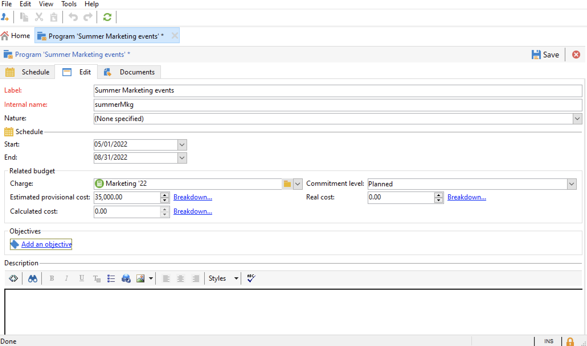

# 创建项目和活动{#create-programs-and-campaigns}

营销活动编排组件位于&#x200B;**[!UICONTROL Campaigns]**&#x200B;选项卡中：您可以在此处查看营销项目和营销活动及其相关元素的概述。

营销方案由营销活动组成，营销活动由投放、资源等组成。 所有与投放、预算、审阅者和链接文档相关的信息均分组到营销活动中。

 [在视频中发现项目和营销活动](#video)

## 使用方案和计划{#work-with-plan-and-program}

### 创建计划和项目层次结构 {#create-plan-and-program}

每个营销活动都属于一个项目，而项目又属于一个计划。所有计划、项目和营销活动都可以通过&#x200B;**营销活动**&#x200B;选项卡中的&#x200B;**[!UICONTROL Campaign calendar]**&#x200B;菜单使用。

在开始构建活动和投放之前，请为营销计划和项目配置文件夹层次结构。

1. 单击主页上的&#x200B;**资源管理器**&#x200B;图标。
1. 右键单击要在其中创建计划的文件夹。
1. 选择&#x200B;**添加新文件夹>促销活动管理>计划**。

   

1. 重命名计划。
1. 右键单击新创建的计划并选择&#x200B;**属性……**。
1. 在&#x200B;**常规**&#x200B;选项卡中，修改&#x200B;**内部名称**&#x200B;以避免在导出包期间出现重复项。

   

1. 单击&#x200B;**保存**。
1. 右键单击新创建的计划并选择&#x200B;**创建新的“项目”文件夹**。

   

1. 重复上述步骤以重命名新的程序文件夹及其内部名称。

### 配置程序 {#edit-a-program}

编辑程序时，请使用下述选项卡浏览和配置程序。

* **计划**&#x200B;选项卡根据您在日历标题中单击的选项卡，显示月、周或日计划的日历。 您可以从此页面创建营销策划、项目或任务。 [了解详情](#campaign-calendar)

* 通过&#x200B;**编辑**&#x200B;选项卡，可对项目进行个性化设置：名称、开始和结束日期、预算、链接文档等。

  

## 使用营销活动{#work-with-campaigns}

### 创建营销活动 {#create-a-campaign}

您可以通过营销活动列表创建营销活动。 要显示此视图，请选择&#x200B;**[!UICONTROL Campaigns]**&#x200B;仪表板中的&#x200B;**[!UICONTROL Campaigns]**&#x200B;菜单，然后单击&#x200B;**[!UICONTROL Create]**。

**[!UICONTROL Program]**&#x200B;字段允许您选择营销策划将附加到的项目。 此信息是强制性的。

营销策划也可以通过营销策划或项目日历中的创建。 [了解详情](#campaign-calendar)

在营销策划创建窗口中，选择营销策划模板，并添加营销策划的名称和描述。 您还可以指定营销策划的开始和结束日期。

单击&#x200B;**[!UICONTROL OK]**&#x200B;以创建营销活动。 它会被添加到项目计划和营销策划列表中。

然后，您可以编辑之前创建的营销活动并定义其参数。 要打开并配置此营销活动，您可以：

1. 浏览促销活动日历并选择要显示的促销活动，然后单击&#x200B;**[!UICONTROL Open]**&#x200B;链接。
1. 浏览项目的&#x200B;**[!UICONTROL Schedule]**&#x200B;选项卡，选择并打开该营销策划。
1. 浏览营销活动列表，然后单击要编辑的营销活动名称。

所有这些操作都会将您带到活动仪表板。

访问以下部分，了解如何配置活动：

* [添加投放](marketing-campaign-deliveries.md)
* [管理资源和文档](marketing-campaign-assets.md)
* [构建目标受众](marketing-campaign-target.md)
* [设置审批流程](marketing-campaign-approval.md)
* [管理库存和预算](providers-stocks-and-budgets.md)

### 编辑Campaign设置 {#campaign-settings}

营销活动是通过营销活动模板创建的。 您可以配置已选择某些选项且已保存其他设置的可重用模板。

对于每个活动，都提供以下功能：

* 参考文档和资源：您可以将文档与营销活动关联（简介、报告、图像等）。 支持所有文档格式。 [了解详情](marketing-campaign-deliveries.md#manage-associated-documents)。
* 定义成本：对于每个市场活动，Adobe Campaign允许您定义成本录入和成本计算结构，在创建市场营销活动时使用这些结构。 例如：印刷费用、使用外部代理、房间租赁等。 [了解详情](providers-stocks-and-budgets.md#defining-cost-categories)。
* 定义目标：您可以定义促销活动的可量化目标，例如订户数、业务量等。 此信息稍后将在营销活动报表中使用。
* 管理种子地址和对照组。 [了解详情](marketing-campaign-deliveries.md#defining-a-control-group)。
* 管理审批：您可以选择要批准的处理，并根据需要选择审核操作员或操作员组。 [了解详情](marketing-campaign-approval.md#checking-and-approving-deliveries)。

>[!NOTE]
>
>要访问和更新促销活动设置，请浏览到&#x200B;**[!UICONTROL Edit]**&#x200B;选项卡中的&#x200B;**[!UICONTROL Advanced campaign parameters...]**&#x200B;链接。

### 监测活动 {#monitor-a-campaign}

对于每个活动，任务、资源和投放都集中在仪表板中。 利用此界面，您可以管理和编排营销操作。

借助Adobe Campaign，您可以设置协作流程，以创建和审批营销活动的各个步骤：审批预算、目标、内容等。 此编排在[此部分](marketing-campaign-approval.md)中有详细说明。

>[!NOTE]
>
>营销活动中可用的组件取决于其模板。 营销活动模板配置显示在[此部分](marketing-campaign-templates.md#campaign-templates)中。

营销活动完成后，使用&#x200B;**[!UICONTROL Reports]**&#x200B;链接访问营销活动报告。

## 营销活动日历 {#campaign-calendar}

活动日历显示所有项目、计划、活动和投放。

要编辑计划、项目、营销策划或投放，请在日历中浏览到其名称，然后使用&#x200B;**[!UICONTROL Open]**&#x200B;链接。 然后，它将显示在新选项卡中，如下所示：

您可以筛选营销活动日历中显示的信息。 为此，请单击&#x200B;**[!UICONTROL Filter]**&#x200B;链接并选择筛选条件。

>[!NOTE]
>
>在按日期过滤时，将显示开始日期晚于指定日期和/或结束日期早于指定日期的所有营销活动。 使用每个字段右侧的日历选择日期。

您还可以使用&#x200B;**[!UICONTROL Search]**&#x200B;字段筛选显示的项。

链接到每个项目的图标允许您查看其状态：已完成、进行中、正在编辑等。

要筛选要显示的营销活动，请单击&#x200B;**[!UICONTROL Filter]**&#x200B;链接，然后选择要显示的营销活动状态。

在浏览日历时，您还可以创建项目或营销策划。

当您通过项目群的&#x200B;**[!UICONTROL Schedule]**&#x200B;选项卡创建营销策划时，该营销策划会自动链接到相关项目。 在这种情况下，**[!UICONTROL Program]**&#x200B;字段是隐藏的。

## 使用Web界面 {#use-the-web-interface-}

您可以通过Internet浏览器访问Adobe Campaign客户端控制台屏幕，以查看所有营销活动和投放以及数据库中用户档案的报告和信息。 此访问不会启用记录创建。 根据操作员的权限，您可以查看和/或处理数据库中的数据。 例如，您可以批准活动内容和定位、重新启动或停止投放等。

1. 照常通过https://`<your instance>:<port>/view/home`登录。
1. 使用菜单访问概述。

   

除了在营销策划之间导航和查看这些营销策划之外，您还可以执行以下类型的任务：

* 监测实例上的活动
* 参与验证流程，例如，批准或拒绝投放内容
* 执行其他快速操作，例如，暂停工作流
* 访问所有报告功能
* 参加论坛讨论

此表汇总了您可以从浏览器对营销活动执行的操作：

| 页面  | 操作 |
| --- | --- |
| 活动、投放、优惠等列表。 | 删除列表项 |
| 营销活动 | 取消营销活动 |
| 投放 | 批准投放内容和目标 提交投放内容 确认投放 暂停并停止投放 |
| Web 应用程序 | 创建Web应用程序 编辑应用程序内容和属性 将应用程序内容另存为模板 发布应用程序 |
| 产品建议 | 批准选件内容和资格 禁用联机选件 |
| 任务 | 完成任务 取消任务 |
| 营销资源 | 批准资源 锁定并解锁资源 |
| 营销活动包 | 提交程序包以供审批 批准或拒绝程序包 取消程序包 |
| Campaign 订单 | 创建订单 接受或拒绝订单 |
| 库存 | 删除库存行 |
| 优惠模拟 | 启动和停止模拟 |
| 定位工作流 | 启动、暂停和停止工作流 |
| 报告 | 在报告历史记录中保存当前数据 |
| 论坛 | 添加讨论 在讨论中回复邮件 关注讨论并取消订阅 |

### 管理批准

可以通过Web访问为目标或投放内容进行审批。

您还可以使用通知消息中包含的链接。 如需详细信息，请参阅[此小节](marketing-campaign-approval.md#checking-and-approving-deliveries)。

## 教程视频 {#video}

本视频说明如何创建营销计划、项目和营销活动。

>[!VIDEO](https://video.tv.adobe.com/v/3426482?quality=12&captions=chi_hans)
