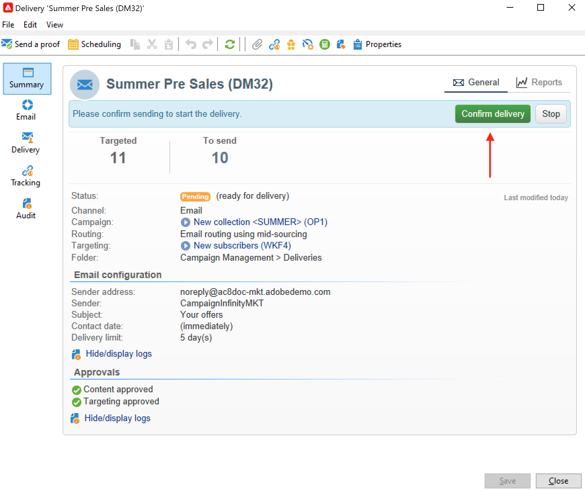

# 营销活动投放 {#marketing-campaign-deliveries}

在营销策划中编排跨渠道投放：通过个性化的电子邮件、短信、推送通知和应用程序内消息，简化与Adobe Campaign的通信。 您可以使用视频、表情符号或GIF等富媒体，并直接集成它们。

可通过活动功能板、活动工作流或直接通过投放概述创建投放。 从营销活动创建投放后，这些投放将链接到此营销活动，并在营销活动级别合并。

## 创建投放 {#create-deliveries}

您可以通过两种方式将投放添加到营销活动：

* 通过营销活动仪表板中的&#x200B;**[!UICONTROL Add a delivery]**&#x200B;链接。

保存后，投放即会添加到活动仪表板。

* 通过添加投放，在营销活动工作流的&#x200B;**[!UICONTROL Targeting and workflows]**&#x200B;选项卡中。

  

  启动工作流后，投放即会添加到活动仪表板。

在此页面](marketing-campaign-approval.md)中了解如何设置和执行投放审批流程[。

## 开始投放 {#start-a-delivery}

获得所有批准后，可以发送投放。 投放执行过程取决于渠道。

* 对于电子邮件或移动渠道投放，请参阅[此章节](#start-an-online-delivery)

* 对于直邮投放，请参阅[此章节](#start-an-offline-delivery)

### 开始电子邮件或移动投放 {#start-an-online-delivery}

在批准所有审批请求后，投放状态将更改为&#x200B;**[!UICONTROL Pending confirmation]**&#x200B;并可以启动。 可以开始投放的审阅人会收到投放已准备就绪可供开始的通知。

该信息也会显示在促销活动信息板上。 **[!UICONTROL Confirm delivery]**&#x200B;链接允许您开始投放。

确认投放仅限于管理员，以及投放或营销活动属性中明确提及的操作员或操作员组。 如果未设计运算符，则管理员和活动所有者可以批准。

但是，您还可以允许活动所有者确认发送，即使已在投放或活动属性中定义特定审阅人也是如此。 为此，请以管理员身份创建&#x200B;**NmsCampaign_Activate_OwnerConfirmation**&#x200B;选项并将其设置为&#x200B;**1**。 这些选项是从Campaign资源管理器的&#x200B;**[!UICONTROL Administration]** > **[!UICONTROL Platform]** > **[!UICONTROL Options]**&#x200B;文件夹中进行管理的。

### 开始直邮投放 {#start-an-offline-delivery}

获得所有审批后，投放状态将更改为&#x200B;**[!UICONTROL Pending extraction]**。 提取文件是通过专用的[技术工作流](../workflow/technical-workflows.md)创建的，在默认配置中，当直邮投放挂起提取时，将自动启动该工作流。 当流程正在进行时，它将显示在仪表板中，并可通过其链接进行编辑。

成功执行提取工作流后，必须批准提取文件（前提是在投放设置中选择了提取文件批准）。 [了解详情](marketing-campaign-approval.md#approving-an-extraction-file)。

请按照以下步骤验证内容并将文件发送给提供商：

1. 提取文件获得批准后，即可生成路由器通知电子邮件的证明。 此电子邮件基于投放模板构建。 它必须被批准。

   仅当在高级促销活动参数的&#x200B;**[!UICONTROL Approvals]**&#x200B;选项卡中启用了&#x200B;**[!UICONTROL Enable the sending and validation of proofs (Direct mail)]**&#x200B;选项时，此步骤才可用。

   

1. 单击&#x200B;**[!UICONTROL Send a proof]**&#x200B;按钮以创建校样。

   必须预先定义验证目标。

   您可以创建所需数量的验证。 可通过投放详细信息的&#x200B;**[!UICONTROL Direct mail...]**&#x200B;链接访问这些内容。

1. 投放状态更改为&#x200B;**[!UICONTROL To submit]**。 单击&#x200B;**[!UICONTROL Submit proofs]**&#x200B;按钮开始审批流程。

1. 投放状态更改为&#x200B;**[!UICONTROL Proof to validate]**，并且有一个按钮允许您接受或拒绝审批。

   您可以接受或拒绝此批准，或返回提取步骤。

1. 验证获批后，提取文件将发送到路由器并完成投放。

### 预算和成本计算 {#compute-costs-and-stocks}

文件提取将启动两个流程：预算计算和库存计算。 更新预算条目。

* 通过&#x200B;**[!UICONTROL Budget]**&#x200B;选项卡，您可以管理营销活动的预算。 成本条目的总数显示在营销活动主选项卡及其所属项目的&#x200B;**[!UICONTROL Calculated cost]**&#x200B;字段中。 这些金额还反映在营销活动预算中。

  

  最终将根据路由器提供的信息计算实际成本。 只有实际发送的消息才会被计费。

* 库存在树的&#x200B;**[!UICONTROL Administration > Campaign management > Stocks]**&#x200B;节点中定义。

  

  **[!UICONTROL Administration > Campaign management > Service providers]**&#x200B;节点中的成本结构。

  

  库存行在库存区中可见。 要定义初始坯件，请打开坯件线。 每次进行交货时，库存都会减少。 您可以定义警报级别和通知。

  >[!NOTE]
  >
  >在本节](providers-stocks-and-budgets.md)中了解有关预算[的更多信息。
