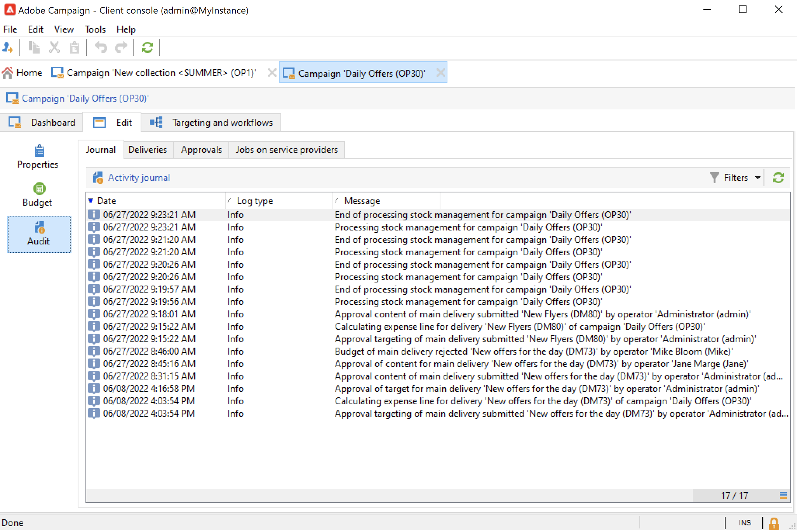

# 监测营销活动 {#monitor-marketing-campaigns}

## 跟踪活动 {#tracking-a-campaign}

对于每个营销活动， **[!UICONTROL Tracking]** 选项卡用于查看所有作业及其状态。

以下信息可通过此子选项卡访问：

* 此 **[!UICONTROL Audit]** 子选项卡显示活动日记帐。 它包含营销活动上执行的作业：工作流创建或启动、批准、提取、库存管理等。

   

* 此 **[!UICONTROL Deliveries]** 子选项卡包含营销活动的所有投放。 可以从此视图中编辑它们。 要执行此操作，请选择投放并单击 **[!UICONTROL Detail]** 图标。

   

* 此 **[!UICONTROL Approvals]** 子选项卡包含营销活动的所有批准流程。 您可以检查详细信息和注释

* 为生成服务提供商消息而创建的工作流显示在 **[!UICONTROL Jobs on service providers]** 子选项卡。 单击 **[!UICONTROL Detail]** 图标，以显示选定的工作流。

## 跟踪投放 {#delivery-tracking}

投放列表可通过 **[!UICONTROL Deliveries]** Campaign节点的链接。

对于每个投放，此列表允许您访问关键指标：状态、已定位的收件人数量、关联的营销活动等。

要检查投放的状态，请编辑该投放并查看其功能板和选项卡。

<!--
>[!NOTE]
>
>Information concerning delivery details is available in [this section](../../delivery/using/about-message-tracking.md) section.
-->

## 跟踪执行 {#execution-tracking}

您可以通过单击 **[!UICONTROL Deliveries]**，可通过Adobe Campaign主页访问它。

有关在营销活动中执行的流程的详细信息，请参阅 **[!UICONTROL Edit > Audit]** 选项卡中的选定内容进行标识。 您可以在营销活动中查看投放列表。 [了解详情](#tracking-a-campaign)。
