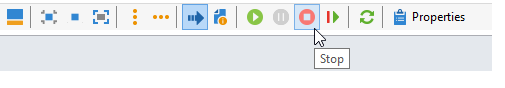

# 选择营销活动受众 {#marketing-campaign-deliveries}

在营销活动中，您可以为每个投放定义：

* 目标受众。 您可以向收件人](#send-to-a-group)的[列表发送消息，或在工作流](#build-the-main-target-in-a-workflow)中构建[受众
* 对照组。 您可以[添加控制组](#add-a-control-group)来监视邮件传递后的收件人行为
* 种子地址 — 在[本节](../../v8/audiences/test-profiles.md)中了解详情。—>

某些信息可以从[营销活动模板](marketing-campaign-templates.md#campaign-templates)继承。

<!--
To build the delivery target, you can define filtering criteria for the recipients in the database. This recipient selection mode is presented in [this section](../../delivery/using/steps-defining-the-target-population.md).
-->

## 发送至组{#send-to-a-group}

您可以将群体导入列表，然后在投放中定位此列表。 为此请执行以下操作步骤：

1. 编辑投放并单击&#x200B;**[!UICONTROL To]**&#x200B;链接以更改目标群体。
1. 在&#x200B;**[!UICONTROL Main target]**&#x200B;选项卡中，选择&#x200B;**[!UICONTROL Defined via the database]**&#x200B;选项，然后单击&#x200B;**[!UICONTROL Add]**&#x200B;以选择收件人。

   

1. 选择&#x200B;**[!UICONTROL A list of recipients]**。

   

1. 单击&#x200B;**[!UICONTROL Next]**&#x200B;以选择列表。

   

   您可以通过添加新的筛选条件来优化目标。

1. 定义所有条件后，单击&#x200B;**[!UICONTROL Finish]**&#x200B;并保存主目标。

## 在活动工作流中构建受众 {#build-the-main-target-in-a-workflow}

投放的主要目标也可以在营销活动工作流中定义：利用此图形环境，您可以使用查询、测试和运算符构建目标：合并、重复数据删除、共享等。

>[!IMPORTANT]
>
>在营销策划中添加的工作流不能超过28个。 超过此限制，其他工作流在界面中不可见，并且可能会生成错误。

### 创建工作流 {#create-a-targeting-workflow}

定位可以通过工作流中以图形顺序显示的筛选条件组合来创建。 可创建根据自身要求定向的群体和子群体。 要显示工作流编辑器，请单击营销活动仪表板中的&#x200B;**[!UICONTROL Targeting and workflows]**&#x200B;选项卡。

通过放置在工作流中的一个或多个查询，从Adobe Campaign数据库中提取目标群体。 了解如何在[本节](../workflow/query.md)中生成查询。

您可以通过并集、交集、共享、排除等框启动查询并共享群体。

从工作区左侧的列表中选择对象并将其链接以构建目标。

在图中，链接图表中目标构建所需的定位和计划查询。 您可以在构建过程中执行定位，以检查从数据库提取的群体。

>[!NOTE]
>
>有关定义查询的示例和过程的详情，请参见[此部分](../workflow/query.md)。

编辑器的左侧部分包含一个表示活动的图形对象库。 第一个选项卡包含定向活动，第二个选项卡包含流量控制活动，这些活动有时用于协调定向活动。

可通过图编辑器工具栏访问定向工作流执行和格式功能。

>[!NOTE]
>
>[此部分](../workflow/about-workflows.md)中详细介绍了可用于构建图表的活动以及所有显示和布局功能。

您可以为单个营销策划创建多个定位工作流。 要添加工作流，请执行以下操作：

1. 转到工作流创建区域的左上角部分，右键单击并选择&#x200B;**[!UICONTROL Add]**。 您还可以使用位于该区域上方的&#x200B;**[!UICONTROL New]**&#x200B;按钮。

   

1. 选择&#x200B;**[!UICONTROL New workflow]**&#x200B;模板并命名此工作流。
1. 单击&#x200B;**[!UICONTROL OK]**&#x200B;以确认创建工作流，然后为此工作流创建图。

### 执行工作流 {#execute-a-workflow}

只要您具有相应的权限，可以通过工具栏中的&#x200B;**[!UICONTROL Start]**&#x200B;按钮手动启动定位工作流。

可以编程该定位以根据计划（调度器）或事件（外部信号、文件导入等）自动执行。

与执行定位工作流相关的操作（启动、停止、暂停等） 是&#x200B;**异步**&#x200B;进程：该命令已保存，一旦服务器可供应用，该命令将立即生效。

利用工具栏图标，可采取有关执行定向工作流的操作。

* 启动或重新启动

   * 通过&#x200B;**[!UICONTROL Start]**&#x200B;图标，可启动定位工作流。 单击此图标时，将激活所有没有输入过渡的活动（端点跳转除外）。

     

     服务器考虑该请求，如其状态所示： **[!UICONTROL Start as soon as possible]**。

   * 您可以通过相应的工具栏图标重新启动定位工作流。 如果&#x200B;**[!UICONTROL Start]**&#x200B;图标不可用（例如，正在停止定位工作流），此命令可能很有用。 在这种情况下，请单击&#x200B;**[!UICONTROL Restart]**&#x200B;图标以预期重新启动。 服务器考虑该请求，因为其状态显示为： **[!UICONTROL Restart requested]**。

* 停止或暂停

   * 利用工具栏图标，可停止或暂停正在进行的定位工作流。

     单击&#x200B;**[!UICONTROL Pause]**&#x200B;后，进行中的操作&#x200B;**[!UICONTROL are not]**&#x200B;已暂停，但在下次重新启动之前不会启动其他活动。

     

     服务器考虑该命令，因为其状态显示为： **[!UICONTROL Pause requested]**。

     当定向工作流执行到特定活动时，您也可以自动暂停定向工作流。 为此，请右键单击要暂停定位工作流的活动，然后选择&#x200B;**[!UICONTROL Enable but do not execute]**。

     

     此配置由一个特殊图标显示。

     

     >[!NOTE]
     >
     >在高级定位活动设计和测试阶段，此选项非常有用。

     单击&#x200B;**[!UICONTROL Start]**&#x200B;以继续执行。

   * 单击&#x200B;**[!UICONTROL Stop]**&#x200B;图标可停止正在进行的执行。

     

     服务器考虑该命令，因为其状态显示为： **[!UICONTROL Stop requested]**。

  您还可以在执行到达活动时自动停止定向工作流。 为此，请右键单击将停止定位工作流的活动，然后选择&#x200B;**[!UICONTROL Do not activate]**。

  

  此配置由一个特殊图标显示。

  

  >[!NOTE]
  >
  >在高级定位活动设计和测试阶段，此选项非常有用。

* 无条件停止

  在资源管理器中，选择&#x200B;**[!UICONTROL Administration > Production > Object created automatically > Campaign workflows]**&#x200B;以访问和操作每个活动工作流。

  您可以通过单击&#x200B;**[!UICONTROL Actions]**&#x200B;图标并选择&#x200B;**[!UICONTROL Unconditional]**&#x200B;停止来无条件停止工作流。 此操作终止您的营销活动工作流。

  

  >[!CAUTION]
  >
  >仅限管理员用户无条件停止。

## 添加对照组 {#add-a-control-group}

控制组是不接收投放的群体；它用于通过与接收投放的目标群体的行为进行比较，来跟踪投放后的行为和活动影响。

控制组可以从主目标提取和/或来自特定组或查询。

### 激活营销活动的控制组 {#activate-the-control-group-for-a-campaign}

您可以在活动级别定义控制组，在这种情况下，控制组将应用于相关活动的每次投放。

1. 编辑相关的营销活动，然后单击&#x200B;**[!UICONTROL Edit]**&#x200B;选项卡。
1. 单击 **[!UICONTROL Advanced campaign parameters...]**。

   

1. 选择&#x200B;**[!UICONTROL Enable and edit control group configuration]**&#x200B;选项。
1. 单击&#x200B;**[!UICONTROL Edit...]**&#x200B;配置控制组。

   

[此部分](#extract-the-control-group-from-the-main-target)中详细描述了整个过程。 在[本节](#add-a-population)中了解有关控制组的更多信息。

### 为投放激活对照组 {#activate-the-control-group-for-a-delivery}

您可以在投放级别定义控制组，在这种情况下，控制组将应用于相关营销活动的每次投放。

默认情况下，在营销活动级别定义的控制组配置适用于该营销活动的每次投放。 但是，您可以为单个投放调整控制组。

>[!NOTE]
>
>如果您为活动定义了控制组，并且还为链接到此活动的投放配置了该控制组，则只会应用为投放定义的控制组。

1. 编辑相关的投放，然后单击&#x200B;**[!UICONTROL To]**&#x200B;链接。
1. 单击&#x200B;**[!UICONTROL Control group]**&#x200B;选项卡，然后选择&#x200B;**[!UICONTROL Enable and edit control group configuration]**。

   

1. 单击&#x200B;**[!UICONTROL Edit...]**&#x200B;配置控制组。

[此部分](#extract-the-control-group-from-the-main-target)中详细描述了整个过程。

### 使用新群体作为对照组 {#add-a-population}

您可以将特定群体用于对照组。 在这种情况下，请在相关字段中选择要用作控制组的列表。

此群体可以来自收件人列表，也可以通过特定查询对其进行定义。

>[!NOTE]
>
>Adobe Campaign查询编辑器出现在[此部分](../workflow/query.md)中。

### 从主目标中提取控制组 {#extract-the-control-group-from-the-main-target}

您还可以从投放的主目标中提取收件人。 在这种情况下，收件人将从受此配置影响的投放操作目标中获取。 此提取可能是随机的，也可能是对收件人排序的结果。

要提取控制组，请为活动或投放启用控制组，然后选择以下选项之一： **[!UICONTROL Activate random sampling]**&#x200B;或&#x200B;**[!UICONTROL Keep only the first records after sorting]**。

* 使用&#x200B;**[!UICONTROL Activate random sampling]**&#x200B;选项对主群体中的收件人应用随机取样。 如果您随后将阈值设置为100，则控制组将由从目标群体中随机选择的100个收件人组成。 随机取样取决于数据库引擎。
* 使用&#x200B;**[!UICONTROL Keep only the first records after sorting]**&#x200B;选项根据一个或多个排序顺序定义限制。 如果选择&#x200B;**[!UICONTROL Age]**&#x200B;字段作为排序条件，然后将100定义为阈值，则控制组将由100个最年轻的收件人组成。 例如，定义包含很少购买的收件人或频繁购买的收件人的控制组，并将其行为与联系的收件人的行为进行比较，这可能很有趣。

单击&#x200B;**[!UICONTROL Next]**&#x200B;以定义排序顺序（如有必要）并选择收件人限制模式。

此配置相当于工作流中的&#x200B;**[!UICONTROL Split]**&#x200B;活动，可让您将目标划分为子集。 控制组是上述子组之一。

### 教程视频 {#create-email-video}

以下视频介绍了如何向营销活动添加控制组。

>[!VIDEO](https://video.tv.adobe.com/v/335606?quality=12)

[此处](https://experienceleague.adobe.com/docs/campaign-learn/tutorials/getting-started/introduction-to-adobe-campaign.html){target="_blank"}提供了其他Campaign操作方法视频。
