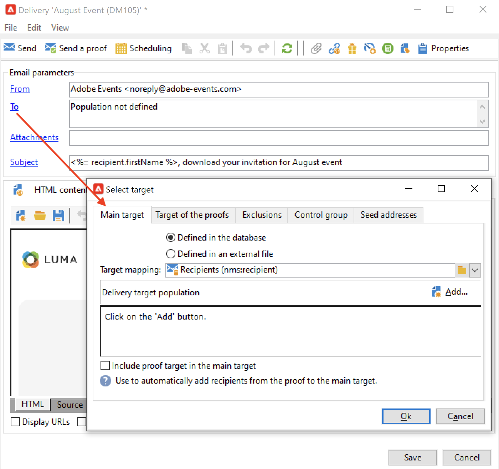

# 选择营销活动受众 {#marketing-campaign-deliveries}

在营销活动中，您可以为每个投放定义：

* 目标受众。 您可以将邮件发送到 [收件人列表](#send-to-a-group) 或构建 [工作流中的受众](#build-the-main-target-in-a-workflow)
* 控制组。 您可以 [添加控制组](#add-a-control-group) 监视邮件投放后的收件人行为
<!--
* Seed addresses - Learn more in [this section](../../delivery/using/about-seed-addresses.md).-->

其中某些信息可从 [活动模板](marketing-campaign-templates.md#campaign-templates).

<!--
To build the delivery target, you can define filtering criteria for the recipients in the database. This recipient selection mode is presented in [this section](../../delivery/using/steps-defining-the-target-population.md).
-->

## 发送到群组{#send-to-a-group}

您可以将群体导入列表，然后在投放中定位此列表。 为此请执行以下操作步骤：

1. 编辑投放，然后单击 **[!UICONTROL To]** 链接以更改目标群体。
1. 在 **[!UICONTROL Main target]** 选项卡，选择 **[!UICONTROL Defined via the database]** 选项并单击 **[!UICONTROL Add]** 来选择收件人。

   

1. 选择 **[!UICONTROL A list of recipients]**.

   

1. 单击 **[!UICONTROL Next]** 来选择列表。

   

   您可以通过添加新的筛选条件来优化目标。

1. 单击 **[!UICONTROL Finish]** 定义所有标准后，保存主目标。

## 在营销活动工作流中构建受众 {#build-the-main-target-in-a-workflow}

投放的主要目标也可以在营销活动工作流中定义：此图形环境允许您使用查询、测试和运算符来构建目标：并集、重复数据删除、共享等。

>[!IMPORTANT]
>
>在营销活动中添加的工作流不得超过28个。 超出此限制后，其他工作流在界面中不可见，并且可能会生成错误。

### 创建工作流 {#create-a-targeting-workflow}

可以通过工作流中图形序列中的筛选条件组合来创建定位。 您可以创建群体和子群体，这些群体和子群体将根据您的要求进行定位。 要显示工作流编辑器，请单击 **[!UICONTROL Targeting and workflows]** 选项卡。

目标群体通过置于工作流中的一个或多个查询从Adobe Campaign数据库中提取。 了解如何在 [此部分](../workflow/query.md).

您可以通过“并集”、“交集”、“共享”、“排除”等框启动查询并共享群体。

从工作区左侧的列表中选择对象，并链接它们以构建目标。

在图中，将图中目标构建所需的定位和计划查询关联起来。 在施工过程中，您可以执行定位，以检查从数据库提取的群体。

>[!NOTE]
>
>有关定义查询的示例和过程详见 [此部分](../workflow/query.md).

编辑器的左侧部分包含一个表示活动的图形对象库。 第一个选项卡包含定位活动，第二个选项卡包含流量控制活动，这些活动有时用于协调定位活动。

可通过图编辑器工具栏访问定向工作流执行和格式设置功能。

>[!NOTE]
>
>有关构建图表以及所有显示和布局功能的可用活动，请参见 [此部分](../workflow/about-workflows.md).

您可以为单个营销活动创建多个定位工作流。 要添加工作流，请执行以下操作：

1. 转到工作流创建区域的左上角部分，右键单击并选择 **[!UICONTROL Add]**. 您还可以使用 **[!UICONTROL New]** 按钮。

   

1. 选择 **[!UICONTROL New workflow]** 模板并命名此工作流。
1. 单击 **[!UICONTROL OK]** 以确认创建工作流，然后创建此工作流的图表。

### 执行工作流 {#execute-a-workflow}

定位工作流可以通过 **[!UICONTROL Start]** 按钮来访问Advertising Cloud帮助，前提是您拥有相应的权限。

可以根据调度（调度器）或事件（外部信号、文件导入等）对定向进行编程以自动执行。

与执行定位工作流（启动、停止、暂停等）相关的操作 are **异步** 流程：命令已保存，一旦服务器可以应用该命令，该命令将立即生效。

利用工具栏图标，可执行定位工作流相关的操作。

* 启动或重新启动

   * 的 **[!UICONTROL Start]** 图标可启动定位工作流。 单击此图标时，将激活所有没有输入过渡的活动（端点跳转除外）。

      

      服务器会考虑请求，如其状态所示： **[!UICONTROL Start as soon as possible]**.

   * 您可以通过相应的工具栏图标重新启动定位工作流。 如果 **[!UICONTROL Start]** 图标不可用，例如当正在停止定位工作流时。 在这种情况下，单击 **[!UICONTROL Restart]** 图标以预测重新启动。 服务器考虑了该请求，其状态如下所示： **[!UICONTROL Restart requested]**.

* 停止或暂停

   * 利用工具栏图标，可停止或暂停正在进行的定位工作流。

      单击 **[!UICONTROL Pause]**，正在进行的操作 **[!UICONTROL are not]** 已暂停，但在下次重新启动之前不会启动任何其他活动。

      

      服务器考虑了该命令，其状态如下所示： **[!UICONTROL Pause requested]**.

      您还可以在定位工作流执行到达特定活动时自动暂停该工作流。 为此，请右键单击要暂停定位工作流的活动，然后选择 **[!UICONTROL Enable but do not execute]**.

      

      此配置由一个特殊图标显示。

      

      >[!NOTE]
      >
      >此选项在高级定位营销活动设计和测试阶段非常有用。

      单击 **[!UICONTROL Start]** 以继续执行。

   * 单击 **[!UICONTROL Stop]** 图标以停止正在执行的操作。

      

      服务器考虑了该命令，其状态如下所示： **[!UICONTROL Stop requested]**.
   您还可以在执行到达活动时自动停止定位工作流。 为此，请右键单击要停止定位工作流的活动，然后选择 **[!UICONTROL Do not activate]**.

   

   此配置由一个特殊图标显示。

   

   >[!NOTE]
   >
   >此选项在高级定位营销活动设计和测试阶段非常有用。

* 无条件停止

   在资源管理器中，选择 **[!UICONTROL Administration > Production > Object created automatically > Campaign workflows]** 访问每个营销活动工作流并执行相应操作。

   通过单击 **[!UICONTROL Actions]** 图标和选择 **[!UICONTROL Unconditional]** 停下。 此操作会终止您的营销活动工作流。

   

## 添加控制组 {#add-a-control-group}

控制组是未收到交货的群体；它通过与已收到投放的目标群体的行为进行比较，用于跟踪投放后行为和促销活动影响。

控制组可以从主目标中提取和/或来自特定组或查询。

### 激活营销活动的控制组 {#activate-the-control-group-for-a-campaign}

您可以在营销活动级别定义控制组，在这种情况下，控制组将应用于相关营销活动的每个投放。

1. 编辑相关的营销活动，然后单击 **[!UICONTROL Edit]** 选项卡。
1. 单击 **[!UICONTROL Advanced campaign parameters...]**。

   

1. 选择 **[!UICONTROL Enable and edit control group configuration]** 选项。
1. 单击 **[!UICONTROL Edit...]** 配置控制组。

   

完整过程详见 [此部分](#extract-the-control-group-from-the-main-target). 在 [此部分](#add-a-population).

### 为传递激活控制组 {#activate-the-control-group-for-a-delivery}

您可以在投放级别定义控制组，在这种情况下，控制组将应用于相关营销活动的每个投放。

默认情况下，营销活动级别定义的控制组配置适用于该营销活动的每个投放。 但是，您可以根据单个交付情况调整控制组。

>[!NOTE]
>
>如果您为营销活动定义了控制组，并且还为链接到此营销活动的投放配置了该控制组，则只会应用为投放定义的控制组。

1. 编辑相关投放，然后单击 **[!UICONTROL To]** 链接。
1. 单击 **[!UICONTROL Control group]** 选项卡，然后选择 **[!UICONTROL Enable and edit control group configuration]**.

   

1. 单击 **[!UICONTROL Edit...]** 配置控制组。

完整过程详见 [此部分](#extract-the-control-group-from-the-main-target).

### 将新群体用作控制组 {#add-a-population}

您可以为控制组使用特定群体。 在这种情况下，在相关字段中选择要用作控制组的列表。

此群体可以来自收件人列表，也可以通过特定查询对其进行定义。

>[!NOTE]
>
>Adobe Campaign查询编辑器显示在 [此部分](../workflow/query.md).

### 从主目标提取控制组 {#extract-the-control-group-from-the-main-target}

您还可以从投放的主目标提取收件人。 在这种情况下，将从受此配置影响的投放操作目标中获取收件人。 此提取可以是随机的，也可以是对收件人进行排序的结果。

要提取控制组，请为营销活动或投放启用控制组，然后选择以下选项之一： **[!UICONTROL Activate random sampling]** 或 **[!UICONTROL Keep only the first records after sorting]**.

* 使用 **[!UICONTROL Activate random sampling]** 选项，以对主群体中的收件人应用随机取样。 如果随后将阈值设置为100，则控制组将由100个从目标群体中随机选择的收件人组成。 随机取样取决于数据库引擎。
* 使用 **[!UICONTROL Keep only the first records after sorting]** 选项来定义基于一个或多个排序顺序的限制。 如果您选择 **[!UICONTROL Age]** 字段作为排序条件，然后将100定义为阈值，则控制组将由100个最年轻的收件人组成。 例如，定义一个控制组（包含很少购买的收件人或频繁购买的收件人），并将他们的行为与联系的收件人的行为进行比较可能很有趣。

单击 **[!UICONTROL Next]** 定义排序顺序（如有必要）并选择收件人限制模式。

此配置等同于 **[!UICONTROL Split]** 活动，您可以将目标划分为子集。 控制组是这些子集之一。

#### 教程视频 {#create-email-video}

此视频介绍如何在Adobe Campaign中创建营销活动和电子邮件。

>[!VIDEO](https://video.tv.adobe.com/v/25604?quality=12)

还提供其他Campaign操作方法视频 [此处](https://experienceleague.adobe.com/docs/campaign-classic-learn/tutorials/overview.html?lang=zh-Hans).
