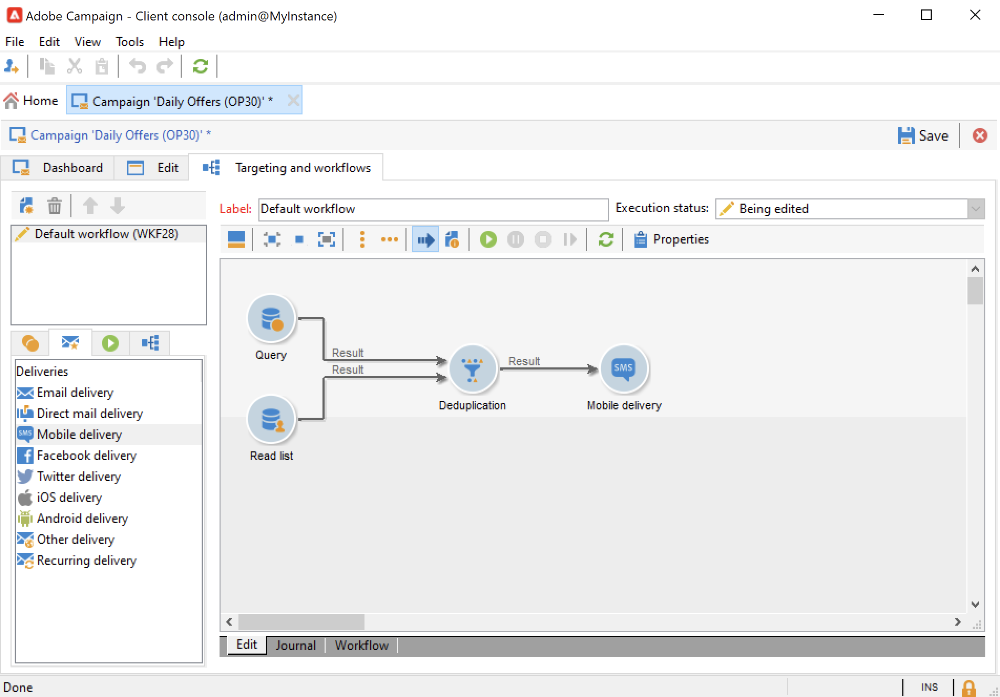

# 创建和配置营销活动模板 {#campaign-templates}

所有营销活动都基于存储主要特性和功能的模板。 Campaign附带创建营销活动的内置模板。 此模板启用了所有功能：文档、种子地址、批准、投放概述等。

可用功能取决于您的权限、插件以及Adobe Campaign平台的配置。

>[!NOTE]
>
>当您单击 **[!UICONTROL Explorer]** 图标。

提供了内置模板以用于创建尚未定义特定配置的活动。您可以创建和配置活动模板，然后从这些模板创建活动。

## 创建活动模板 {#create-a-campaign-template}

要创建营销活动模板，请执行以下步骤：

1. 打开营销活动 **资源管理器**，并浏览至 **资源>模板>营销活动模板**.
1. 单击 **新建** 位于模板列表上方的工具栏中。

您还可以 **重复** 可重复使用和调整其配置的内置模板。 要实现此目的，请右键单击模板并选择 **复制**.

1. 输入新活动模板的标签。
1. 单击 **保存** 然后重新打开您的模板。
1. 在 **编辑** 选项卡，定义模板属性。
1. 选择 **高级促销活动参数……** 用于将工作流添加到活动模板的链接。

   

1. 更改 **定位和工作流** 值至 **是**.，然后确认。 了解如何在中添加功能 [本节](#typology-of-enabled-modules).
1. 此 **定位和工作流** 选项卡将添加到模板中。 单击 **添加工作流……**，输入 **标签** 并单击 **确定**.
1. 根据需要创建工作流。

   

1. 单击 **保存**. 您的模板现在已准备好用于创建新营销活动。

利用活动模板的各种选项卡和子选项卡，可访问其设置，如中所述 [常规配置](#general-configuration).

## 选择模块 {#select-modules}

此 **[!UICONTROL Advanced campaign parameters...]** 通过链接，您可以基于此模板为营销活动启用和禁用作业。 选择要在基于此模板创建的营销活动中启用的功能。

如果未选择某个功能，则将与进程有关的元素（菜单、图标、选项、选项卡、子选项卡等） 不会显示在模板的界面中或基于此模板的营销活动中。 营销活动详细信息左侧的选项卡，以及可用的选项卡，与模板中选择的功能一致。 例如， **费用和目标** 功能未启用，则相应的 **[!UICONTROL Budget]** 选项卡不显示在基于此模板的营销活动中。

此外，配置窗口的快捷方式已添加到营销活动仪表板。 启用某个功能后，可通过直接链接从Campaign仪表板访问该功能。

### 配置示例

* 例如，具有以下设置：

  

  营销活动仪表板显示：

  

  请注意 **[!UICONTROL Targeting and workflows]** 缺少选项卡。

  可以使用以下功能：

  

  请注意 **[!UICONTROL Budget]** 缺少选项卡。

  Campaign高级设置也反映此配置。

  

  请注意 **[!UICONTROL Approvals]** 选项卡不可用。

* 使用此配置：
  

  营销活动仪表板显示：

  

  请注意 **[!UICONTROL Targeting and workflows]** 选项卡可用，但 **添加文档** 缺少链接。

  可以使用以下功能：

  

  请注意 **[!UICONTROL Budget]** 选项卡可用。

  Campaign高级设置也反映此配置。

  

  请注意 **[!UICONTROL Approvals]** 选项卡可用，但 **[!UICONTROL Control population]** 和 **[!UICONTROL Seed addresses]** 未启用选项卡。

## 模块类型 {#typology-of-enabled-modules}

* **对照组**

  选择此模块后，模板的高级设置以及基于此模板的营销活动会添加一个附加选项卡。 可以通过模板定义配置，也可以单独为每个营销活动定义配置。 在中了解有关控制组的更多信息 [本节](marketing-campaign-deliveries.md#defining-a-control-group).

  

* **种子地址**

  选择此模块后，模板的高级设置以及基于此模板的营销活动会添加一个附加选项卡。 可以通过模板定义配置，也可以单独为每个营销活动定义配置。

  

* **文档**

  选择此模块后，将向中添加一个附加选项卡 **[!UICONTROL Edit]** 选项卡中显示的模板和基于该模板的营销活动。 可从模板添加附加文档，或单独为每个营销活动添加附加文档。 了解中文档的更多信息 [本节](marketing-campaign-deliveries.md#manage-associated-documents).

  

* **投放概要**

  选择此模块时， **[!UICONTROL Delivery outlines]** 子选项卡将添加到 **[!UICONTROL Documents]** 选项卡，以定义营销活动的投放概要。 要了解有关投放概要的更多信息，请参阅 [本节](marketing-campaign-assets.md#delivery-outlines).

  

* **定位和工作流**

  当您选择 **[!UICONTROL Targeting and workflows]** 模块时，会添加一个选项卡，以允许您基于此模板为营销活动创建一个或多个工作流。 您还可以根据此模板为每个活动单独配置工作流。要了解有关活动工作流的更多信息，请参阅 [本节](marketing-campaign-deliveries.md#build-the-main-target-in-a-workflow).

  

  启用此模块后， **[!UICONTROL Jobs]** 选项卡将添加到营销活动的高级设置中，以定义流程执行顺序。

* **审批**

  如果您启用 **[!UICONTROL Approvals]**，您可以选择要批准的流程以及负责批准的操作员。 要了解有关批准的更多信息，请参阅 [本节](marketing-campaign-approval.md#select-reviewers).

  

  您可以选择是否通过 **[!UICONTROL Approvals]** 模板高级设置部分的选项卡。

* **费用和目标**

  选择此模块时， **[!UICONTROL Budget]** 选项卡会添加到基于此模板的模板和营销活动的详细信息，以便可以选择关联的预算。

  

## 模板属性 {#template-properties}

创建活动模板时，需要输入以下信息：

* 输入 **标签** 模板的：标签是必填项，并且是基于此模板的所有营销活动的默认标签。
* 选择活动 **自然** 下拉列表中。 此列表中可用的值是保存在 **[!UICONTROL natureOp]** 明细列表。

了解如何在中访问和配置明细列表 [此页面](../../v8/config/ui-settings.md#enumerations).

* 选择 **营销活动类型**：唯一、定期或定期。 默认情况下，营销活动模板适用于独特营销活动。 有关循环和定期活动的详情，请参见 [本节](recurring-periodic-campaigns.md).
* 指定营销活动的持续时间，即营销活动将发生的天数。 基于此模板创建营销活动时，将自动填充营销活动开始和结束日期。

  如果促销活动是重复性的，则必须直接在模板中指定促销活动的开始和结束日期。

* 指定 **相关项目** 模板的：基于此模板的营销活动将链接到选定的项目。

<!--
## Track campaign execution{#campaign-reverse-scheduling}

You can create a schedule for a campaign and track accomplishments, for instance to prepare an event schedule for a specific date. Campaign templates now let you calculate the start date of a task based on the end date of a campaign.

In the task configuration box, go to the **[!UICONTROL Implementation schedule]** area and check the **[!UICONTROL The start date is calculated based on the campaign end date]** box. (Here, "start date" is the task start date). Go to the **[!UICONTROL Start]** field and enter an interval: the task will start this long before the campaign end date. If you enter a period which is longer than the campaign is set to last, the task will begin before the campaign.

When you create a campaign using this template, the task start date will be calculated automatically. However, you can always change it later.-->
