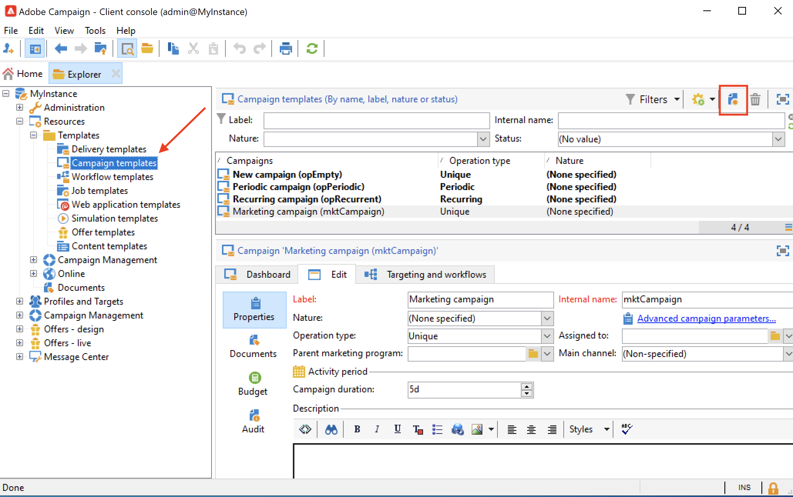
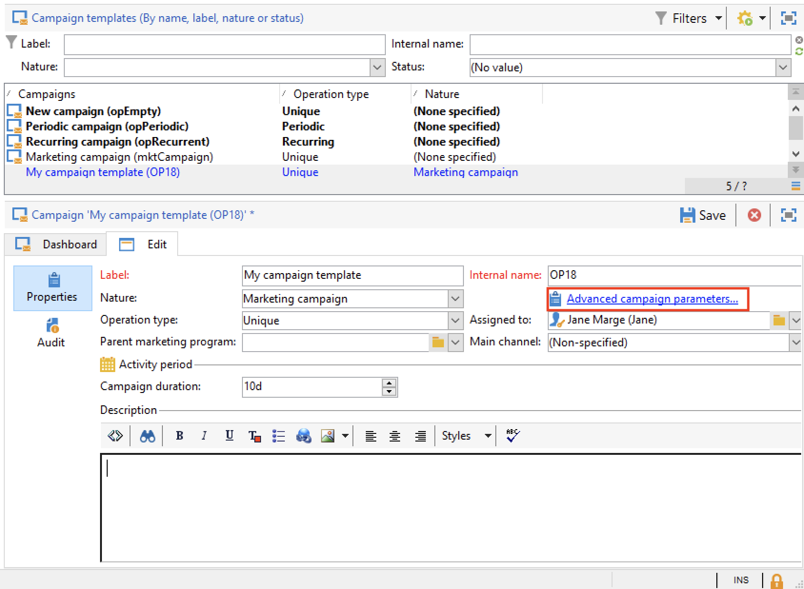
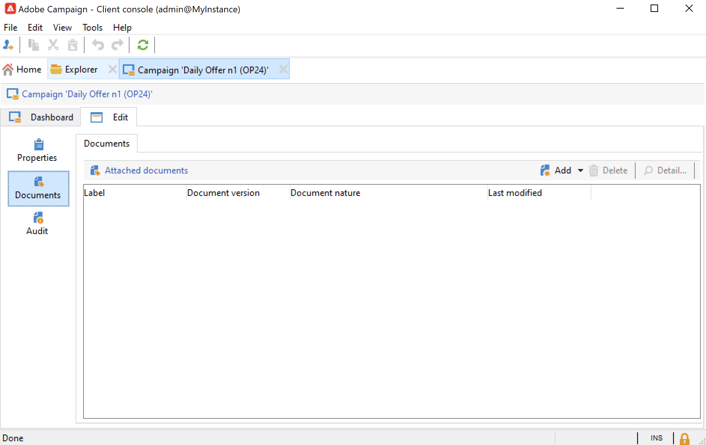

# 创建和配置营销活动模板 {#campaign-templates}

所有营销活动都基于存储主要特征和功能的模板。 Campaign附带一个用于创建营销活动的内置模板。 此模板启用了所有功能：文档、种子地址、批准、交付大纲等

可用功能取决于您的权限、加载项和Adobe Campaign平台的配置。

>[!NOTE]
>
>在单击 **[!UICONTROL Explorer]** 图标。

提供了内置模板以用于创建尚未定义特定配置的活动。您可以创建和配置活动模板，然后从这些模板创建活动。

## 创建营销活动模板 {#create-a-campaign-template}

要创建营销活动模板，请执行以下步骤：

1. 打开营销活动 **资源管理器**，然后浏览 **资源>模板>营销活动模板**.
1. 单击 **新建** 在工具栏的模板列表上方。

您还可以 **重复** 内置模板，可重复使用和调整其配置。 要执行此操作，请右键单击模板并选择 **复制**.

1. 输入新营销活动模板的标签。
1. 单击 **保存** 然后重新打开您的模板。
1. 在 **编辑** 选项卡，定义模板属性。
1. 选择 **高级营销活动参数……** 链接，以向营销活动模板添加工作流。

   

1. 更改 **定位和工作流** 值 **是**.，并确认。 了解如何在 [此部分](#typology-of-enabled-modules).
1. 的 **定位和工作流** 选项卡。 单击 **添加工作流……**，输入 **标签** 单击 **确定**.
1. 根据您的需求创建工作流。

   

1. 单击&#x200B;**保存**。您的模板现已准备好用于创建新营销活动。

利用营销活动模板的各种选项卡和子选项卡，可访问其设置，如 [常规配置](#general-configuration).

## 选择模块 {#select-modules}

的 **[!UICONTROL Advanced campaign parameters...]** 利用链接，可根据此模板为营销活动启用和禁用作业。 选择要在基于此模板创建的营销活动中启用的功能。

如果未选择某个功能，则与该过程相关的元素（菜单、图标、选项、选项卡、子选项卡等） 不显示在模板的界面或基于此模板的营销活动中。 营销活动详细信息左侧的选项卡和可用的选项卡与模板中选择的功能一致。 例如， **费用和目标** 功能未启用，则对应 **[!UICONTROL Budget]** 选项卡不会显示在基于此模板的营销活动中。

此外，配置窗口的快捷方式也添加到营销活动仪表板。 启用功能后，通过直接链接可从营销活动仪表板访问该功能。

### 配置示例

* 例如，通过以下设置：

   

   营销活动功能板显示：

   

   请注意， **[!UICONTROL Targeting and workflows]** 选项卡。

   提供以下功能：

   

   请注意， **[!UICONTROL Budget]** 选项卡。

   营销活动高级设置也反映了此配置。

   

   请注意， **[!UICONTROL Approvals]** 选项卡。

* 使用此配置：
   

   营销活动功能板显示：

   

   请注意， **[!UICONTROL Targeting and workflows]** 选项卡，但 **添加文档** 链接缺失。

   提供以下功能：

   

   请注意， **[!UICONTROL Budget]** 选项卡。

   营销活动高级设置也反映了此配置。

   

   请注意， **[!UICONTROL Approvals]** 选项卡，但 **[!UICONTROL Control population]** 和 **[!UICONTROL Seed addresses]** 选项卡未启用。

## 模块类型 {#typology-of-enabled-modules}

* **对照组**

   选择此模块后，会在模板的高级设置和基于此模板的营销活动中添加一个额外的选项卡。 配置可通过模板进行定义，也可单独为每个营销活动定义。 在 [此部分](marketing-campaign-deliveries.md#defining-a-control-group).

   

* **种子地址**

   选择此模块后，会在模板的高级设置和基于此模板的营销活动中添加一个额外的选项卡。 配置可通过模板进行定义，也可单独为每个营销活动定义。

   

* **文档**

   选择此模块后，会向 **[!UICONTROL Edit]** 选项卡，以及基于此模板的营销活动。 可以从模板添加附加的文档，也可以单独为每个营销活动添加附加的文档。 了解有关 [此部分](marketing-campaign-deliveries.md#manage-associated-documents).

   

* **投放概要**

   选择此模块后， **[!UICONTROL Delivery outlines]** 子选项卡 **[!UICONTROL Documents]** 选项卡，以定义营销活动的投放大纲。 了解有关 [此部分](marketing-campaign-assets.md#delivery-outlines).

   

* **定位和工作流**

   当您选择 **[!UICONTROL Targeting and workflows]** 模块中，添加了一个选项卡，用于根据此模板为营销活动创建一个或多个工作流。 还可以根据此模板为每个营销活动单独配置工作流。有关 [此部分](marketing-campaign-deliveries.md#build-the-main-target-in-a-workflow).

   

   启用此模块后， **[!UICONTROL Jobs]** 选项卡添加到营销活动的高级设置中以定义流程执行序列。

* **审批**

   如果启用 **[!UICONTROL Approvals]**，则可以选择要批准的流程和负责审批的操作员。 了解有关批准的更多信息，请参阅 [此部分](marketing-campaign-approval.md#select-reviewers).

   

   您可以选择是否通过 **[!UICONTROL Approvals]** “模板高级设置”部分的选项卡。

* **非劳动成本和目标**

   选择此模块后， **[!UICONTROL Budget]** 选项卡会添加到模板和基于此模板的营销活动的详细信息中，以便选择关联的预算。

   

## 模板属性 {#template-properties}

创建营销活动模板时，需要输入以下信息：

* 输入 **标签** 模板：该标签是必填的，是基于此模板的所有营销活动的默认标签。
* 选择营销活动 **自然** 从下拉列表中。 此列表中可用的值是 **[!UICONTROL natureOp]** 枚举。

了解如何在 [Campaign Classicv7文档](https://experienceleague.adobe.com/docs/campaign-classic/using/getting-started/administration-basics/managing-enumerations.html){target="_blank"}.

* 选择 **营销活动类型**:唯一、循环或定期。 默认情况下，促销活动模板适用于独特的促销活动。 定期和定期营销活动详见 [此部分](recurring-periodic-campaigns.md).
* 指定营销活动的持续时间，即营销活动将发生的天数。 创建基于此模板的营销活动时，将自动填充营销活动开始和结束日期。

   如果营销活动是重复的，则必须直接在模板中指定营销活动开始和结束日期。

* 指定 **相关计划** 模板：基于此模板的营销活动会链接到选定的项目。

<!--
## Track campaign execution{#campaign-reverse-scheduling}

You can create a schedule for a campaign and track accomplishments, for instance to prepare an event schedule for a specific date. Campaign templates now let you calculate the start date of a task based on the end date of a campaign.

In the task configuration box, go to the **[!UICONTROL Implementation schedule]** area and check the **[!UICONTROL The start date is calculated based on the campaign end date]** box. (Here, "start date" is the task start date). Go to the **[!UICONTROL Start]** field and enter an interval: the task will start this long before the campaign end date. If you enter a period which is longer than the campaign is set to last, the task will begin before the campaign.

When you create a campaign using this template, the task start date will be calculated automatically. However, you can always change it later.-->
