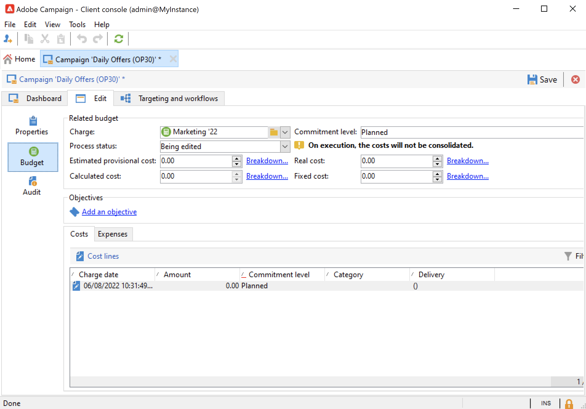

# 创建和配置营销活动模板 {#campaign-templates}

所有营销活动都基于存储主要特性和功能的模板。 Campaign附带创建营销活动的内置模板。 此模板启用了所有功能：文档、种子地址、批准、投放概述等。

可用功能取决于您的权限、插件以及Adobe Campaign平台的配置。

>[!NOTE]
>
>单击主页上的&#x200B;**[!UICONTROL Explorer]**&#x200B;图标时，将显示树。

提供了内置模板以用于创建尚未定义特定配置的活动。您可以创建和配置活动模板，然后从这些模板创建活动。

## 创建活动模板 {#create-a-campaign-template}

要创建营销活动模板，请执行以下步骤：

1. 打开Campaign **资源管理器**，并浏览至&#x200B;**资源>模板>营销活动模板**。
1. 单击模板列表上方工具栏中的&#x200B;**新建**。

您还可以&#x200B;**复制**&#x200B;内置模板以重复使用并调整其配置。 为此，请右键单击模板并选择&#x200B;**复制**。

1. 输入新活动模板的标签。
1. 单击&#x200B;**保存**&#x200B;并重新打开模板。
1. 在&#x200B;**编辑**&#x200B;选项卡中，定义模板属性。
1. 选择&#x200B;**高级促销活动参数……**&#x200B;链接以将工作流添加到您的促销活动模板。

   

1. 将&#x200B;**定位和工作流**&#x200B;值更改为&#x200B;**是**，然后确认。 在[本节](#typology-of-enabled-modules)中了解如何添加功能。
1. **定位和工作流**&#x200B;选项卡已添加到模板。 单击&#x200B;**添加工作流……**，输入&#x200B;**标签**，然后单击&#x200B;**确定**。
1. 根据需要创建工作流。

   

1. 单击&#x200B;**保存**。 您的模板现在已准备好用于创建新营销活动。

营销活动模板的各种选项卡和子选项卡允许您访问其设置，如[常规配置](#general-configuration)中所述。

## 选择模块 {#select-modules}

通过&#x200B;**[!UICONTROL Advanced campaign parameters...]**&#x200B;链接，您可以基于此模板为营销活动启用和禁用作业。 选择要在基于此模板创建的营销活动中启用的功能。

如果未选择任何功能，则与流程相关的元素（菜单、图标、选项、选项卡、子选项卡等）不会出现在模板的界面中或基于此模板的营销策划中。 营销活动详细信息左侧的选项卡，以及可用的选项卡，与模板中选择的功能一致。 例如，**费用和目标**&#x200B;功能未启用，相应的&#x200B;**[!UICONTROL Budget]**&#x200B;选项卡未显示在基于此模板的营销活动中。

此外，配置窗口的快捷方式已添加到营销活动仪表板。 启用某个功能后，可通过直接链接从Campaign仪表板访问该功能。

### 配置示例

* 例如，具有以下设置：

  

  营销活动仪表板显示：

  

  请注意，**[!UICONTROL Targeting and workflows]**&#x200B;选项卡缺失。

  可以使用以下功能：

  

  请注意，**[!UICONTROL Budget]**&#x200B;选项卡缺失。

  Campaign高级设置也反映此配置。

  

  请注意，**[!UICONTROL Approvals]**&#x200B;选项卡不可用。

* 使用此配置：
  

  营销活动仪表板显示：

  

  请注意，**[!UICONTROL Targeting and workflows]**&#x200B;选项卡可用，但缺少&#x200B;**添加文档**&#x200B;链接。

  可以使用以下功能：

  

  请注意，**[!UICONTROL Budget]**&#x200B;选项卡可用。

  Campaign高级设置也反映此配置。

  

  请注意，**[!UICONTROL Approvals]**&#x200B;选项卡可用，但未启用&#x200B;**[!UICONTROL Control population]**&#x200B;和&#x200B;**[!UICONTROL Seed addresses]**&#x200B;选项卡。

## 模块类型 {#typology-of-enabled-modules}

* **对照组**

  选择此模块后，模板的高级设置以及基于此模板的营销活动会添加一个附加选项卡。 可以通过模板定义配置，也可以单独为每个营销活动定义配置。 在[本节](marketing-campaign-deliveries.md#defining-a-control-group)中了解有关控制组的更多信息。

  

* **种子地址**

  选择此模块后，模板的高级设置以及基于此模板的营销活动会添加一个附加选项卡。 可以通过模板定义配置，也可以单独为每个营销活动定义配置。

  

* **文档**

  选择此模块后，模板的&#x200B;**[!UICONTROL Edit]**&#x200B;选项卡中会添加一个附加选项卡，以及基于此模板的营销活动。 可从模板添加附加文档，或单独为每个营销活动添加附加文档。 在[本节](marketing-campaign-deliveries.md#manage-associated-documents)中了解关于文档的更多信息。

  

* **投放概要**

  选择此模块后，将在&#x200B;**[!UICONTROL Documents]**&#x200B;选项卡中添加一个&#x200B;**[!UICONTROL Delivery outlines]**&#x200B;子选项卡，以定义营销活动的投放大纲。 在[本节](marketing-campaign-assets.md#delivery-outlines)中了解有关投放概要的更多信息。

  

* **定位和工作流**

  选择&#x200B;**[!UICONTROL Targeting and workflows]**&#x200B;模块后，将添加一个选项卡，允许您基于此模板为营销活动创建一个或多个工作流。 还可以基于此模板为每个营销活动单独配置工作流。请参阅[本节](marketing-campaign-deliveries.md#build-the-main-target-in-a-workflow)以了解有关营销活动工作流的详细信息。

  

  启用此模块后，将向营销活动的高级设置添加一个&#x200B;**[!UICONTROL Jobs]**&#x200B;选项卡以定义流程执行顺序。

* **审批**

  如果启用&#x200B;**[!UICONTROL Approvals]**，则可以选择要批准的进程和负责批准的操作员。 在[此部分](marketing-campaign-approval.md#select-reviewers)中了解有关审批的更多信息。

  

  您可以通过模板高级设置部分的&#x200B;**[!UICONTROL Approvals]**&#x200B;选项卡选择是否启用流程审批。

* **费用和目标**

  选择此模块后，模板和基于此模板的营销活动的详细信息中将添加&#x200B;**[!UICONTROL Budget]**&#x200B;选项卡，以便选择关联的预算。

  

## 模板属性 {#template-properties}

创建活动模板时，需要输入以下信息：

* 输入模板的&#x200B;**标签**：标签是必需的，并且是基于此模板的所有营销活动的默认标签。
* 从下拉列表中选择营销活动&#x200B;**性质**。 此列表中的可用值是保存在&#x200B;**[!UICONTROL natureOp]**&#x200B;枚举中的值。

在[此页面](../../v8/config/ui-settings.md#enumerations)中了解如何访问和配置枚举。

* 选择&#x200B;**类型的营销活动**：唯一、定期或定期。 默认情况下，营销活动模板适用于独特营销活动。 [此部分](recurring-periodic-campaigns.md)中详细介绍了循环和定期营销活动。
* 指定营销活动的持续时间，即营销活动将发生的天数。 基于此模板创建营销活动时，将自动填充营销活动开始和结束日期。

  如果促销活动是重复性的，则必须直接在模板中指定促销活动的开始和结束日期。

* 指定模板的&#x200B;**相关项目**：基于此模板的营销活动已链接到所选项目。

<!--
## Track campaign execution{#campaign-reverse-scheduling}

You can create a schedule for a campaign and track accomplishments, for instance to prepare an event schedule for a specific date. Campaign templates now let you calculate the start date of a task based on the end date of a campaign.

In the task configuration box, go to the **[!UICONTROL Implementation schedule]** area and check the **[!UICONTROL The start date is calculated based on the campaign end date]** box. (Here, "start date" is the task start date). Go to the **[!UICONTROL Start]** field and enter an interval: the task will start this long before the campaign end date. If you enter a period which is longer than the campaign is set to last, the task will begin before the campaign.

When you create a campaign using this template, the task start date will be calculated automatically. However, you can always change it later.-->
