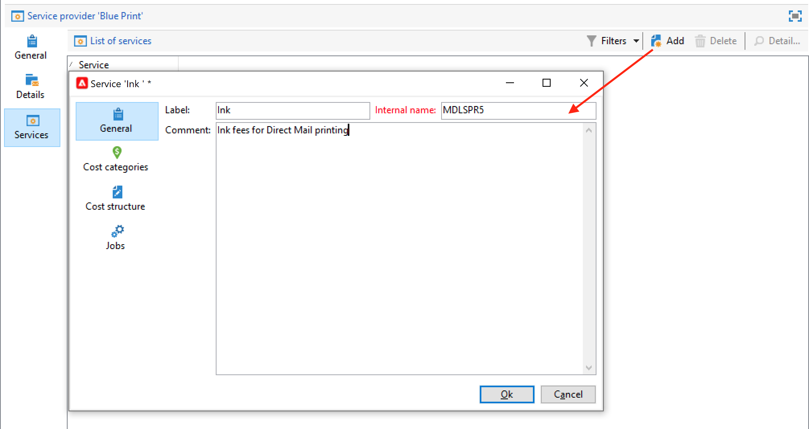
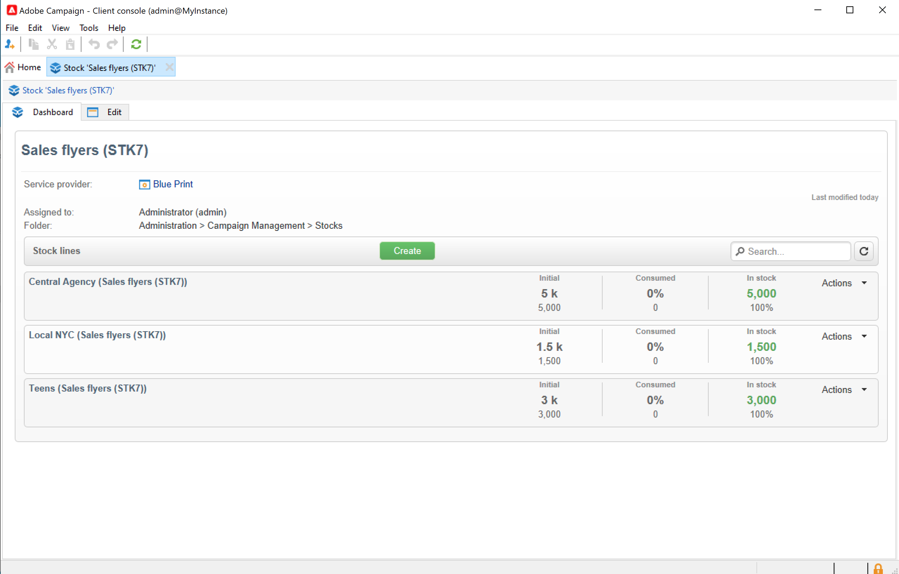

# 供应商、库存和预算{#providers-stocks-and-budgets}

通过Adobe Campaign，您可以定义将参与在营销策划内执行的任务的服务提供商。 Adobe Campaign管理员从主视图中定义有关服务提供商和相关成本结构的信息。 服务提供商从交付中引用，其成本结构允许计算与此交付相关的成本以及对相关库存的管理。

## 创建服务提供商及其成本结构 {#create-service-providers-and-their-cost-structures}

每个服务提供商都保存在包含联系人详细信息、服务模板和相关作业的文件中。

服务提供商配置于 **[!UICONTROL Administration > Campaign management]** Campaign资源管理器的文件夹。

在投放期间执行的作业由服务提供商执行，特别是对于直邮和移动渠道。 例如，这些服务提供商可以参与打印或分发邮件。 这些作业涉及特定于每个服务提供商的配置和成本。 服务提供商的配置涉及四个阶段：

1. 在Adobe Campaign中创建服务提供商。 [了解详情](#add-a-service-provider)

1. 定义关联服务模板的成本类别和结构。 [了解详情](#define-cost-categories)

1. 进程的配置。 [了解详情](#configure-processes-associated-with-a-service)。

1. 在营销活动级别引用服务提供商。 [了解详情](#associate-a-service-with-a-campaign)。

### 创建服务提供商及其成本类别 {#create-a-service-provider-and-its-cost-categories}

#### 添加服务提供商 {#add-a-service-provider}

您可以根据投放需要创建任意数量的服务提供商。 添加服务提供者的过程如下：

1. 单击 **[!UICONTROL New]** 服务提供商列表上方的按钮。
1. 在窗口的下半部分，指定服务提供商的名称和联系详细信息。

   

1. 单击 **[!UICONTROL Save]** 按钮以将服务提供程序添加到列表。

#### 定义成本类别 {#define-cost-categories}

您现在可以将服务模板与每个服务提供商关联。 在这些模板中，您必须首先确定成本类别，并在必要时确定相关库存。 然后，您可以通过成本结构为每个类别创建成本计算规则。 [了解详情](#define-the-cost-structure)。

成本类别是一个实体，其中包含一组符合投放类型条件（电子邮件、直邮、短信等）的成本。 成本类别在与服务提供者相关的服务模板中分组。 每个服务提供商可以引用一个或多个服务模板。

要创建服务模板并定义其内容，请执行以下步骤：

1. 在 **[!UICONTROL Services]** 选项卡上，单击 **[!UICONTROL Add]** 按钮并输入服务模板的名称。

   

1. 为每种类型的流程（通过直邮/电子邮件投放/等）创建成本类别。 或任务)。 要执行此操作，请单击 **[!UICONTROL Cost categories]** 选项卡，然后 **[!UICONTROL Add]** 按钮，然后输入每个成本类别的参数。

   

   * 输入此成本类别的标签，然后选择相关流程的类型： **[!UICONTROL Direct mail]**， **[!UICONTROL Email]**， **[!UICONTROL Mobile]**&#x200B;等。
   * 单击 **[!UICONTROL Add]** 按钮定义与此类别关联的成本类型。
   * 如有必要，将库存行与每种成本类型相关联，以便使用的数量将自动与现有库存相关联。

      >[!NOTE]
      >
      >坯件线定义于 **[!UICONTROL Stock management]** 节点。 [了解详情](#stock-and-order-management)。

1. 您可以为此成本类别预先选择一个值，该值是服务提供方成本类别中的默认值（而不是空值）。 要执行此操作，请启用 **是** 中的选项 **[!UICONTROL Selected]** 相关类别类型的列：

   

   在投放级别，该值默认处于选中状态。

### 定义成本结构 {#define-the-cost-structure}

对于每种类型的成本，成本结构会指定要应用的计算规则。

单击 **[!UICONTROL Cost structure]** 选项卡，为每个成本类别和类型配置成本计算。 单击 **[!UICONTROL Add]** 输入成本结构。

* 要创建成本结构，请从下拉列表中选择消息类型和相关的成本类别，以及计算规则将应用的成本类型。 这些下拉列表的内容来自通过 **[!UICONTROL Cost categories]** 选项卡。

   您必须为成本结构分配标签。 默认情况下，它具有以下投放概要： **成本类别 — 成本类型**.

   但是，您可以对其进行重命名：直接在 **[!UICONTROL Label]** 字段。

* 成本计算公式在窗口的下半部分定义。

   此公式可以固定（适用于任意数量的消息），也可以根据消息数量进行计算。

   当它取决于报文数量时，成本计算结构可以是 **[!UICONTROL Linear]**， **[!UICONTROL Linear by threshold]**，或 **[!UICONTROL Constant by threshold]**.

#### 线性结构 {#linear-structure}

如果无论报文总数如何，一条报文（或一批报文）的金额始终相同，请选择 **[!UICONTROL Linear]** 并输入每条消息的成本。

如果此金额适用于一批消息，请在 **[!UICONTROL for]** 字段。

#### 阈值线性结构 {#linear-structure-by-threshold}

如果金额按阈值应用于每条消息，则必须定义 **[!UICONTROL Linear by threshold]** 计算结构。 在此类型的成本结构中，每条报文的成本为0.13，例如，如果报文总数在1条到100条之间，而发送的报文从100条到1000条的成本为0.12，如果报文超过1000条，则成本为0.11。

配置如下：

要添加阈值，请单击 **[!UICONTROL Add]** 按钮进行标记。

#### 阈值常量结构 {#constant-structure-by-threshold}

最后，您可以根据报文总数配置成本计算。 要执行此操作，请选择 **[!UICONTROL Constant by threshold]** 计算结构。 例如，无论总数量是多少，1条到100条报文的成本将设置为固定数量12.00,101条到1000条报文的传送成本将设置为100.00，超过1000条报文的任何传送成本都将设置为500.00。

### 配置与服务关联的作业 {#configure-processes-associated-with-a-service}

您可以通过以下方式关联与服务提供商关联的流程信息 **[!UICONTROL Jobs]** 选项卡。 通过此部分可以配置向路由器发送信息。

* 此 **[!UICONTROL File extraction]** 部分指示选择此服务时用于交付的导出模板。 您可以在中指示输出文件的名称 **[!UICONTROL Extraction file]** 字段。 利用字段右侧的按钮，可插入变量。

* 此 **[!UICONTROL Notification email]** 部分允许您指定在发送文件后通知服务提供商的模板。 选择用于创建警报消息和收件人组的模板。

   默认情况下，通知消息的投放模板保存在中 **[!UICONTROL Administration > Campaign management > Technical delivery templates]** 文件夹，可从常规视图访问该文件夹。

* 此 **[!UICONTROL Post-processing]** 部分允许您选择在批准投放后启动的工作流。 如果输入了工作流模板，则会自动创建工作流实例，然后在批准生效后立即启动该实例。 例如，此工作流可以将提取文件发送到外部服务提供商进行处理。

### 将服务与营销活动关联 {#associate-a-service-with-a-campaign}

服务提供商与营销活动投放相关联。 它们在投放模板中被引用，以便在通过此模板创建的投放中提供其服务。

选择服务后，与投放类型（直邮、电子邮件等）对应的成本类别 将自动在中心表中与已定义的处理选项一起指示。

>[!NOTE]
>
>如果在选择服务时没有显示成本类别，则意味着没有为此类型的流程定义成本类别。 例如，对于电子邮件投放，如果没有 **[!UICONTROL Email]** 类型成本类别已定义，不会显示任何类别，选择服务将不起作用。

* 对于直邮投放，您可以从配置窗口中选择服务。

   

* 对于在移动渠道或电话上投放，将应用相同的选择模式。
* 对于电子邮件投放，服务是从 **[!UICONTROL Advanced]** 选项卡，如以下示例所示：

   

此 **[!UICONTROL Amount to surcharge]** 列允许您在相关投放或任务的上下文中为此类别添加成本。

在定义交货的成本类别时，您可以定义成本类型的必备选择。 要执行此操作，请选择 **[!UICONTROL A cost type must be selected]**.

## 库存和订单管理 {#stock-and-order-management}

成本类型可与库存行关联，以便处理预警、跟踪供应和启动订单。

在Adobe Campaign中建立库存和订单管理，并在要执行的交货的供应不足时提醒操作员的程序如下：

1. 股票创建和引用关联的服务提供商。 [了解详情](#create-a-stock)。

1. 添加坯件线。 [了解详情](#add-stock-lines)。

1. 在出现警报时通知操作员。 [了解详情](#alert-operators)。

1. 订单和供应。 [了解详情](#orders)。

### 库存管理 {#stock-management}

如果库存耗尽或达到最小阈值，Adobe Campaign可以提醒一组操作员。 库存水平可通过 **[!UICONTROL Stocks]** 链接 **[!UICONTROL Campaigns]** 通过tab键 **[!UICONTROL Other choices]** 导航区域的链接。

#### 创建库存 {#creating-a-stock}

应用以下步骤来创建新坯件：

1. 单击 **[!UICONTROL Create]** 按钮进行修改。
1. 输入库存的标签，然后从下拉列表中选择与其关联的服务提供商。 [了解详情](#create-service-providers-and-their-cost-structures)。

#### 添加库存行 {#add-stock-lines}

一种坯件包括各种坯件线。 库存行包含将由交货冲减的初始资源数量。 每个库存行均指明消耗数量、库存数量和订购数量。

创建坯件时，单击 **[!UICONTROL Stock lines]** 制表符以添加新行。

创建坯件后，可使用其操控板创建和监控坯件线。

单击 **[!UICONTROL Create]** 按钮来添加新的库存行。

* 指示中最初库存的数量 **[!UICONTROL Initial stock]** 字段。 此 **[!UICONTROL Consumed]** 和 **[!UICONTROL In stock]** 字段会自动计算并随着促销活动进行更新。

   

* 指示应在哪个阈值内提醒操作员订购库存 **[!UICONTROL Alert level]** 字段。 达到预警级别后，使用此库存的交货的审批窗口中将显示一则警告消息。

#### 将库存与成本类别关联 {#associate-a-stock-with-cost-categories}

对于给定的服务提供商，在服务中，库存行可以由成本类别之一引用，如下所示：

### 库存跟踪 {#stock-tracking}

#### 警报运算符 {#alert-operators}

当投放中引用的库存不足时，会显示警报。 例如，在批准提取文件时，将显示以下警报：

#### 顺序 {#orders}

此 **[!UICONTROL Orders]** 子标签允许您查看当前订单并保存新订单。

要保存订单，请编辑目标库存行，然后单击 **[!UICONTROL Add]** 按钮，并指定交货日期和订购数量。

>[!NOTE]
>
>一旦到达交货日期，订购的库存行就会自动消失，并且在 **[!UICONTROL Volume on order]** 字段已添加到 **[!UICONTROL Tracking]** 选项卡。 此数量会自动添加到库存量中。

此 **[!UICONTROL Consumptions]** 选项卡包含每个营销活动使用的数量。 根据执行的投放，自动输入此选项卡中的信息。 单击 **[!UICONTROL Edit]** 按钮以打开相关营销策划。

## 计算预算 {#calculate-budgets}

### 原则 {#principle}

针对投放和营销活动管理成本。 根据进度，该等成本分配至预算。

营销策划的投放成本在营销策划级别合并，项目的所有营销策划的成本均会传递到与其关联的项目。 通过专用报告，您可以跟踪整个平台或每个计划和每个项目的预算。

### 实施 {#implementation}

在营销策划中，当您选择预算时，必须输入初始金额。 计算成本将根据输入金额的承担水平（支出、预期、预留、承付）自动更新。

<!--
See [Calculating amounts](../../mrm/using/controlling-costs.md#calculating-amounts).

>[!NOTE]
>
>The procedure for creating budgets is presented in [Creating a budget](../../mrm/using/controlling-costs.md#creating-a-budget).
-->
