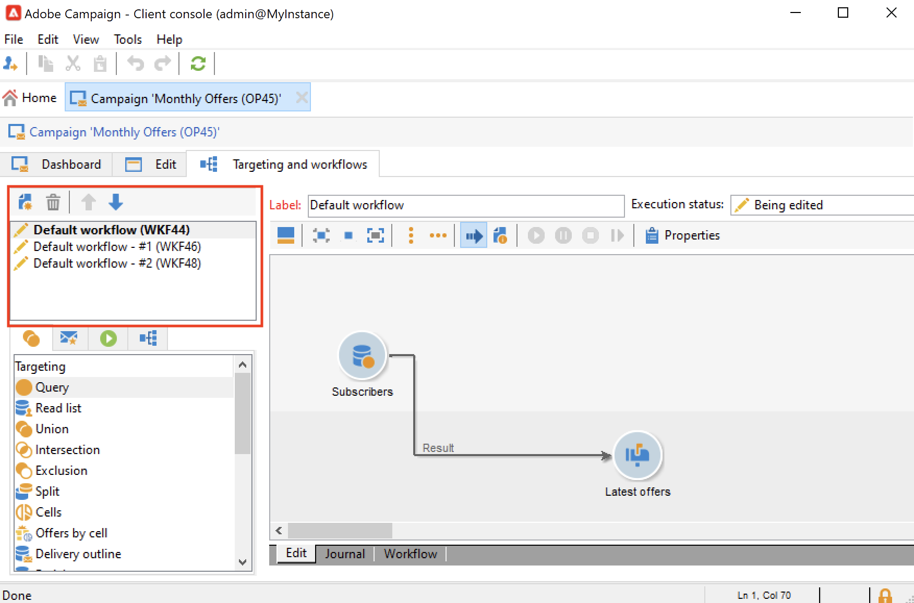

# 循环和定期活动 {#recurring-and-periodic-campaigns}

**周期性营销活动**&#x200B;是基于特定模板的营销活动，其工作流配置为根据关联计划执行。 每次执行时都会重复定位，并跟踪各种流程和目标群体。  配置完毕后，定期活动将自动创建新工作流（通过复制工作流模板）并运行它。 例如，如果您需要向受众区段发送每月提醒，请配置定期营销活动，以便在每年年初创建12个工作流，每个月一个。 [了解详情](#create-a-recurring-campaign)

**定期营销活动**&#x200B;是基于特定模板的营销活动，可让您根据执行计划创建营销活动实例。 根据模板计划中定义的频率，系统会根据定期活动模板自动创建Campaign实例。 [了解详情](#create-a-periodic-campaign)

## 创建定期活动 {#create-a-recurring-campaign}

循环活动是从定义要执行的工作流模板和执行计划的特定模板创建的。

### 为定期活动创建模板 {#create-the-campaign-template}

要为定期活动创建模板，请执行以下步骤：

1. 打开Campaign资源管理器并浏览到&#x200B;**[!UICONTROL Resources > Templates > Campaign templates]**。
1. 复制内置&#x200B;**[!UICONTROL Recurring campaign]**模板。
   
1. 输入模板名称和营销活动的持续时间。
1. 对于此类型的营销活动，添加了&#x200B;**[!UICONTROL Schedule]**选项卡以创建模板执行计划。 使用此选项卡可根据此模板定义营销活动的执行日期。
   

   执行计划的配置模式与工作流的&#x200B;**[!UICONTROL Scheduler]**&#x200B;对象一致。 [了解详情](../workflow/scheduler.md)。

   >[!CAUTION]
   >
   >必须仔细执行执行计划配置。 定期活动会根据指定的计划复制其模板的工作流。 此操作可能会使数据库过载。

1. 在&#x200B;**[!UICONTROL Create in advance for]**&#x200B;字段中指定一个值，以创建指定期间的相应工作流。
1. 在&#x200B;**[!UICONTROL Targeting and workflows]**&#x200B;选项卡中，设计要用于基于此模板的营销活动的工作流模板。 此工作流通常包含定位参数和一个或多个投放。

   >[!NOTE]
   >
   >此工作流必须另存为定期工作流模板。 为此，请编辑工作流属性并在&#x200B;**[!UICONTROL Execution]**&#x200B;选项卡中选择&#x200B;**[!UICONTROL Recurring workflow template]**&#x200B;选项。

   

### 创建定期活动 {#create-the-recurring-campaign}

要创建定期活动并根据模板中定义的计划执行其工作流，您必须：

1. 根据您的定期活动模板创建新活动。
1. 在&#x200B;**[!UICONTROL Schedule]**&#x200B;选项卡中填写工作流执行计划。 促销活动计划允许您为每个行输入自动工作流创建或执行起始日期。

   您可以为每行添加以下附加选项：

   * 启用&#x200B;**[!UICONTROL To be approved]**&#x200B;选项以在工作流中强制投放审批请求。
   * 启用&#x200B;**[!UICONTROL To be started]**&#x200B;选项以在到达开始日期时启动工作流。

   **[!UICONTROL Create in advance for]**&#x200B;字段允许您创建涵盖输入期间的所有工作流。

   在执行&#x200B;**[!UICONTROL Jobs on campaigns]**&#x200B;工作流时，会根据营销活动计划中定义的发生次数创建专用工作流。 因此，将为每个执行日期创建工作流。

1. 定期工作流是自动从营销策划中存在的工作流模板创建的。 它们在营销活动的&#x200B;**[!UICONTROL Targeting and workflows]**&#x200B;选项卡中可见。

   

   定期工作流实例的标签由其模板标签和工作流编号组成，其中的#字符介于。

   根据计划创建的工作流会自动在&#x200B;**[!UICONTROL Schedule]**&#x200B;选项卡的&#x200B;**[!UICONTROL Workflow]**&#x200B;列中与其关联。

   

   可以从此选项卡中编辑每个工作流。

   >[!NOTE]
   >
   >与工作流关联的计划行的开始日期可从工作流的变量中获取，其语法如下：\
   >`$date(instance/vars/@startPlanningDate)`

## 创建定期活动 {#create-a-periodic-campaign}

定期营销活动是基于特定模板的营销活动，通过该模板可根据执行计划创建营销活动实例。 根据模板计划中定义的频率，系统会根据定期活动模板自动创建Campaign实例。

### 创建活动模板 {#create-the-campaign-template-1}

1. 打开Campaign资源管理器并浏览到&#x200B;**[!UICONTROL Resources > Templates > Campaign templates]**。
1. 复制内置&#x200B;**[!UICONTROL Periodic campaign]**&#x200B;模板。
1. 输入模板的属性。

   >[!NOTE]
   >
   >分配了模板的操作员必须具有相应的权限，才能在所选项目中创建营销策划。

1. 创建与此模板关联的工作流。 模板创建的每个定期营销活动中都会复制此工作流。

   >[!NOTE]
   >
   >此工作流是一个工作流模板。 无法从营销活动模板执行该操作。

1. 按照定期活动模板完成其执行计划：单击&#x200B;**[!UICONTROL Add]**&#x200B;按钮并定义开始和结束日期，或通过链接填写执行计划。

   >[!CAUTION]
   >
   >定期活动模板可根据以上定义的计划创建新活动。 因此，必须仔细完成此操作，以避免Adobe Campaign数据库过载。

1. 一旦达到执行开始日期，就会自动创建匹配的营销活动。 它具有模板的所有特征。

   可以通过模板计划编辑每个营销活动。

   每个定期营销活动都包含相同的元素。 创建后，即作为标准营销活动进行管理。
