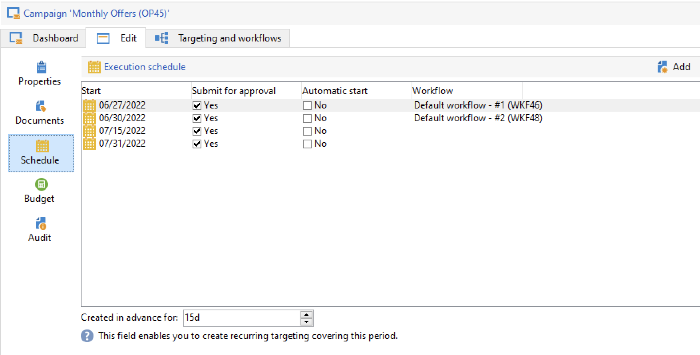

# 定期和定期促销活动 {#recurring-and-periodic-campaigns}

A **循环营销活动** 是基于特定模板的营销活动，其工作流配置为根据关联的计划执行。 每次执行时都会重复定位，并跟踪各种进程和目标群体。  配置完成后，循环营销活动会自动创建新的工作流（通过复制工作流模板）并运行该工作流。 例如，如果您需要向受众区段发送每月提醒，请配置一个定期促销活动，以便在每年年初创建12个工作流，每月创建一个工作流。 [了解详情](#create-a-recurring-campaign)

A **周期性营销活动** 是基于特定模板的营销活动，允许您根据执行计划创建营销活动实例。 根据模板计划中定义的频率，根据定期促销活动模板自动创建促销活动实例。 [了解详情](#create-a-periodic-campaign)

## 创建定期营销活动 {#create-a-recurring-campaign}

定期营销活动是根据定义要执行的工作流模板和执行计划的特定模板创建的。

### 为定期促销活动创建模板 {#create-the-campaign-template}

要为定期促销活动创建模板，请执行以下步骤：

1. 打开Campaign资源管理器并浏览 **[!UICONTROL Resources > Templates > Campaign templates]**.
1. 复制内置 **[!UICONTROL Recurring campaign]** 模板。
   
1. 输入模板的名称和营销活动的持续时间。
1. 对于此类型的营销活动， **[!UICONTROL Schedule]** 选项卡，以创建模板执行计划。 使用此选项卡可根据此模板定义营销活动的执行日期。
   

   执行计划的配置模式与 **[!UICONTROL Scheduler]** 对象。 [了解详情](../workflow/scheduler.md)。

   >[!CAUTION]
   >
   >必须仔细执行执行计划配置。 定期营销活动会根据指定的计划复制其模板的工作流。 此操作可能会使数据库过载。

1. 在 **[!UICONTROL Create in advance for]** 字段，以便为指示的时段创建相应的工作流。
1. 在 **[!UICONTROL Targeting and workflows]** 选项卡，根据此模板设计要在营销活动中使用的工作流模板。 此工作流通常包含定位参数和一个或多个投放。

   >[!NOTE]
   >
   >此工作流必须另存为定期工作流模板。 为此，请编辑工作流属性并选择 **[!UICONTROL Recurring workflow template]** 选项 **[!UICONTROL Execution]** 选项卡。

   

### 创建定期营销活动 {#create-the-recurring-campaign}

要创建定期营销活动并根据模板中定义的计划执行其工作流，您必须：

1. 根据您的定期促销活动模板创建新促销活动。
1. 在 **[!UICONTROL Schedule]** 选项卡。 营销活动计划允许您为每个行输入自动工作流创建或执行开始日期。

   对于每行，您可以添加以下其他选项：

   * 启用 **[!UICONTROL To be approved]** 选项，以在工作流中强制提交批准请求。
   * 启用 **[!UICONTROL To be started]** 选项，以在达到开始日期时启动工作流。

   的 **[!UICONTROL Create in advance for]** 字段中，您可以创建涵盖输入时段的所有工作流。

   执行 **[!UICONTROL Jobs on campaigns]** 工作流中，将根据营销活动计划中定义的发生次数创建专用工作流。 因此，将为每个执行日期创建工作流。

1. 定期工作流是根据营销活动中存在的工作流模板自动创建的。 它们可从 **[!UICONTROL Targeting and workflows]** 选项卡。

   

   定期工作流实例的标签由其模板标签和工作流编号组成，其中之间有#字符。

   从计划创建的工作流会在 **[!UICONTROL Workflow]** 列 **[!UICONTROL Schedule]** 选项卡。

   

   可从此选项卡编辑每个工作流。

   >[!NOTE]
   >
   >与工作流关联的计划行的开始日期可从工作流变量中使用以下语法：\
   >`$date(instance/vars/@startPlanningDate)`

## 创建定期营销活动 {#create-a-periodic-campaign}

定期营销活动是基于特定模板的营销活动，允许您根据执行计划创建营销活动实例。 根据模板计划中定义的频率，根据定期促销活动模板自动创建促销活动实例。

### 创建营销活动模板 {#create-the-campaign-template-1}

1. 打开Campaign资源管理器并浏览 **[!UICONTROL Resources > Templates > Campaign templates]**.
1. 复制内置 **[!UICONTROL Periodic campaign]** 模板。
1. 输入模板的属性。

   >[!NOTE]
   >
   >分配模板的操作员必须拥有在选定项目中创建营销策划的适当权限。

1. 创建与此模板关联的工作流。 此工作流在模板创建的每个定期营销活动中重复。

   >[!NOTE]
   >
   >此工作流是工作流模板。 无法从营销活动模板执行。

1. 完成其执行计划以作为定期促销活动模板：单击 **[!UICONTROL Add]** 按钮定义开始和结束日期，或通过链接填写执行计划。

   >[!CAUTION]
   >
   >定期营销活动模板可根据上面定义的计划创建新营销活动。 因此，必须仔细完成，以避免Adobe Campaign数据库过载。

1. 达到执行开始日期后，将自动创建匹配的营销活动。 它具有模板的所有特性。

   可以通过模板计划编辑每个营销活动。

   每个定期营销活动都包含相同的元素。 创建后，即可将其作为标准营销活动进行管理。
