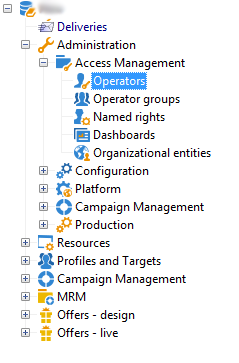

# 分布式营销入门{#about-distributed-marketing}

Adobe Campaign提供 **分布式营销** 中央单位（总部、营销部等）开展合作活动的申请 实施协作营销活动。此合作基于共享工作区，称为 **[!UICONTROL list of campaign packages]**，向本地实体提供集中创建的活动模板和实例。

中央实体提供本地实体可以使用的营销策划。 营销活动由表示本地或协作营销活动的包实现。 要使用营销活动，必须由本地实体对其进行订购，并且订单必须获得批准。

>[!CAUTION]
>
>分布式营销模块是一个 **营销活动** 选项。 请核实您的许可协议。

## 术语 {#terminology}

* **中央实体**

  中央实体由营销运营商组成，负责指定通信并协助地方实体开展营销活动。

  分布式营销模块允许中央实体：

   * 为本地实体设置营销活动包，
   * 提高本地实体在客户/潜在客户通信、定位、内容等选择方面的自主程度。
   * 管理和控制成本，
   * 处理机构网络。

* **本地实体**

  本地实体可以是代理、商店或特定的本地运营者组（国家或地区经理、品牌经理等）。

  分布式营销允许本地实体拥有更多自主权，同时优化执行成本。

* **本地化**

  本地化是本地实体修改营销活动目标和内容的能力。 可能的本地化级别取决于活动的类型及其实施。

* **营销活动包列表**

  营销活动包列表包含对本地实体可用的营销活动。

* **营销活动包**

  由中央实体创建的模板（或营销活动实例），可供一组本地实体使用。

* **本地营销活动**

  本地营销活动是从列表中引用的模板创建的实例 **[!UICONTROL campaign packages]** 带有 **特定执行计划**. 其目标是使用由中央实体设置和配置的活动模板满足本地通信需求。

  本地实体的自治程度取决于所使用的实现。

  请参阅 [创建本地活动](creating-a-local-campaign.md).

* **协作营销活动**

  协作营销活动是指满足以下条件的营销活动 **执行计划已定义** 由中央实体提供，本地实体可使用该中央实体。 每个本地实体的内容保持不变，但成本是分担的。 要参加该活动，本地实体需订阅协作活动。

   * **[!UICONTROL Collaborative campaign (by form)]**：建议用于涉及最多300个本地实体的活动。 本地实体可以在Web表单中输入用于定位和内容个性化的预定义参数。 表单可以是Adobe Campaign表单或外部表单（外联网客户端）。 功能管理员可以根据集成商定义的表单模板定义和配置表单。 要订购营销活动，本地实体只需要具有Web访问权限。
   * **[!UICONTROL Collaborative campaign (by campaign)]**：建议用于针对数十个本地实体的营销活动。 此类营销活动会为每个本地实体创建子营销活动。 一旦 **[!UICONTROL collaborative campaign (by campaign)]** 经中央实体批准，营销策划将提供给本地实体，本地实体可以对其进行修改。 执行会在父营销活动和子营销活动之间自动同步。 本地实体必须有权访问实例，才能订购活动并参与活动。
   * **[!UICONTROL Collaborative campaign (by target approval)]**：建议开展针对数千个地方实体的活动。 本地实体接收由中央实体预定义的联系人列表。 本地实体通过Web表单根据促销活动内容决定是否保留某些联系人。 从选定联系人的列表中推导出本地实体。 要参与该活动，本地实体只需要拥有Web访问权限。
   * **[!UICONTROL Collaborative campaign (simple)]**：此模式确保与以前版本的特定执行过程兼容。

  请参阅 [创建协作活动](creating-a-collaborative-campaign.md).

**订购营销活动程序包**

如果本地实体注册了促销活动，则会按照顺序生成该订单，以重组与促销活动本地化相关的所有信息。

## 工作区 {#workspace}

营销活动包的列表可从以下位置访问： **营销活动** 选项卡：单击 **[!UICONTROL Campaign packages]** 链接。

此窗口允许所有本地运营商查看其本地代理可用的营销活动。

对于中央机构，此窗口会显示营销活动包列表中可用的所有包，并提供用于编辑列表的附加链接。

## 操作员和实体 {#operators-and-entities}

首先，通过 **[!UICONTROL Access management]** 文件夹。

### 运算符 {#operators}

您需要创建中央和本地运算符。

中心运算符必须属于 **[!UICONTROL Central management]** 操作员组或具有 **[!UICONTROL CENTRAL]** 指明权限。

本地运算符必须属于 **[!UICONTROL Local management]** 操作员组或具有 **[!UICONTROL LOCAL]** 指明权限。 它们还必须链接到其本地实体。

### 组织实体 {#organizational-entities}

要创建组织实体，请单击 **[!UICONTROL Administration > Access management > Organizational entities]** 文件夹，然后单击 **[!UICONTROL New]** 图标（在实体列表上方）。

每个组织实体都包含标识信息（标签、内部名称、联系信息等） 和订单审批流程中涉及的组。 在中定义 **[!UICONTROL Notifications and approvals]** 此部分包含在 **[!UICONTROL General]** 选项卡。

* 定义包通知组：每当将新包添加到营销活动包列表以及营销活动变得可用时，此组中的操作员都会收到通知。
* 选择负责批准订单的审阅人组，即负责批准由本地实体订购的营销活动的审阅人。
* 最后，选择负责批准本地营销活动（目标、内容、预算等）的审阅人组。 在订购营销活动时，此组可能会被添加到，具体取决于模板。

>[!NOTE]
>
>审批流程将呈列在 [审批流程](creating-a-local-campaign.md#approval-process) 部分。

## 实施 {#implementation}

分布式营销活动由中央实体创建和发布。 如果需要，它们可以由本地和中央实体使用。

实施过程取决于使用的活动包类型和本地实体委派级别。

### Integrator任务 {#integrator-side}

1. 创建本地实体。
1. 将收件人与管理本地实体的操作员关联起来。

   

1. 指定本地实体的权限和浏览规则
1. 指定营销活动本地化所需的字段集：

   * 目标定义和最大大小，
   * 内容定义，
   * 执行计划（联系日期和提取日期）， **仅用于本地运算符**，
   * 具有所有必需附加字段的订单模式扩展。

1. 创建Web窗体(Adobe或外联网)，以便显示本地化参数、评估目标和预算，以及预览内容和批准订单。

   对象 **协作营销活动（按目标审批）**，创建用于保存每个本地实体的审批的表。

### 功能管理员任务 {#functional-administrator-side}

创建每个营销策划时，必须执行这些步骤。

1. 使用用于营销活动本地化的字段更新表单。
1. 从相应的活动模板（协作活动）创建实例，或复制活动模板（本地活动）。
1. 使用本地化字段和表单引用配置营销活动。
1. 发布营销活动。

### 本地操作员任务 {#local-operator-side}

必须为每个活动执行这些步骤。

1. 收到Campaign包可用性的通知后，请指定营销活动的位置（可选）。
1. 评估目标、预算等。
1. 预览促销活动内容。
1. 订购营销活动。
