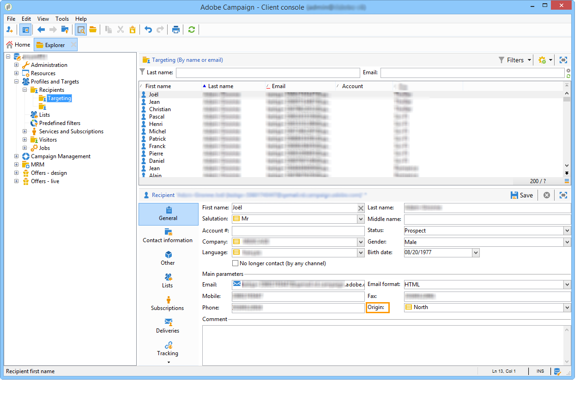

# 分布式营销入门{#about-distributed-marketing}

Adobe Campaign提供 **分布式营销** 中央单位（总部、营销部门等）开展合作活动的申请 实施协作营销活动。此合作基于称为 **[!UICONTROL list of campaign packages]**，其中向本地实体提供了集中创建的营销活动模板和实例。

中央实体提供本地实体可能使用的营销活动。 营销活动由表示本地或协作营销活动的包实现。 要使用营销活动，本地实体必须对其进行订购，并且该订购必须获得批准。

>[!CAUTION]
>
>分布式营销模块是 **Campaign** 选项。 请核实您的许可协议。

## 术语 {#terminology}

* **中央实体**

   中央实体由负责指定通信和协助地方实体开展营销活动的营销经营者组成。

   分布式营销模块允许中心实体：

   * 为本地实体设置营销活动包，
   * 提高本地实体在客户/潜在客户沟通、定位、内容等方面的自主度。
   * 管理和控制成本，
   * 处理一个机构网络。

* **本地实体**

   本地实体可以是特定本地运营商（国家或地区经理、品牌经理等）的代理、商店或组。

   分布式营销允许本地实体在优化执行成本的同时拥有更多自主权。

* **本地化**

   本地化是指本地实体修改营销活动目标和内容的能力。 可能的本地化级别取决于营销活动类型及其实施。

* **营销活动包列表**

   营销活动包列表包含可用于本地实体的营销活动。

* **Campaign包**

   模板（或营销活动实例），由中央实体创建，并可供一组本地实体使用。

* **本地营销活动**

   本地营销活动是使用 **[!UICONTROL campaign packages]** 带有 **特定执行计划**. 其目标是使用由中央实体设置和配置的活动模板满足本地通信需求。

   地方实体的自治程度取决于所使用的实施。

   请参阅 [创建本地营销活动](creating-a-local-campaign.md).

* **协作活动**

   协作式营销活动是指 **定义执行计划** 中央实体，而本地实体可使用该中央实体。 对于每个本地实体，内容保持不变，但成本会共享。 为了参与，当地实体订购了协作活动。

   * **[!UICONTROL Collaborative campaign (by form)]**:建议使用涉及多达300个本地实体的营销活动。 本地实体可以在Web窗体中输入用于定位和内容个性化的预定义参数。 表单可以是Adobe Campaign表单或外部表单（外联网客户端）。 功能管理员可以根据集成商定义的表单模板定义和配置表单。 要订购营销活动，本地实体只需要Web访问。
   * **[!UICONTROL Collaborative campaign (by campaign)]**:建议开展针对数十个当地实体的活动。 此类型的营销活动为每个本地实体创建子营销活动。 一旦 **[!UICONTROL collaborative campaign (by campaign)]** 经中央实体批准，营销活动将提供给本地实体，由其进行修改。 在父营销活动和子营销活动之间自动同步执行。 本地实体必须有权访问实例，才能订购营销活动并参与其中。
   * **[!UICONTROL Collaborative campaign (by target approval)]**:建议开展针对数千个地方实体的活动。 本地实体接收由中央实体预定义的联系人列表。 本地实体通过Web窗体根据促销活动内容决定是否保留某些联系人。 从所选接触的列表导出局部图元。 要参与营销活动，本地实体只需要Web访问。
   * **[!UICONTROL Collaborative campaign (simple)]**:此模式可确保与先前版本的特定执行进程兼容。

   请参阅 [创建协作活动](creating-a-collaborative-campaign.md).

**订购营销活动包**

如果本地实体注册了营销活动，则会按顺序进行，该顺序会重组与营销活动本地化相关的所有信息。

## 工作区 {#workspace}

可从 **促销活动** 选项卡：单击 **[!UICONTROL Campaign packages]** 链接。

此窗口允许所有本地操作员查看其本地代理可用的营销活动。

对于中央代理，此窗口显示营销活动包列表中可用的所有包，并提供用于编辑列表的其他链接。

## 运算符和实体 {#operators-and-entities}

首先，通过指定中央实体和本地实体运算符 **[!UICONTROL Access management]** 文件夹。

### 运算符 {#operators}

您需要创建中央和本地运算符。

中心运算符必须属于 **[!UICONTROL Central management]** 运算符组或具有 **[!UICONTROL CENTRAL]** 右名。

本地运算符必须属于 **[!UICONTROL Local management]** 运算符组或具有 **[!UICONTROL LOCAL]** 右名。 它们还必须与其本地实体链接。

### 组织实体 {#organizational-entities}

要创建组织实体，请单击 **[!UICONTROL Administration > Access management > Organizational entities]** 节点，然后单击 **[!UICONTROL New]** 图标。

每个组织实体都包含标识信息（标签、内部名称、联系信息等） 和订单批准流程中涉及的组。 这些权限在 **[!UICONTROL Notifications and approvals]** 部分 **[!UICONTROL General]** 选项卡。

* 定义资源包通知组：每次向营销活动包列表添加新资源包时，以及每次营销活动可用时，此组中的操作员都会收到通知。
* 选择负责批准订单的审核者组，即负责批准由本地实体订购的促销活动的审核者组。
* 最后，选择负责批准本地营销活动（目标、内容、预算等）的审阅者组。 在订购营销活动时，可以根据模板将此组添加到。

>[!NOTE]
>
>审批流程于 [审批流程](creating-a-local-campaign.md#approval-process) 中。

## 实施 {#implementation}

分布式营销活动由中心实体创建和发布。 它们可以根据需要由本地实体和中央实体使用。

实施过程取决于所使用的营销活动包类型和本地实体委派级别。

### 集成商任务 {#integrator-side}

1. 创建本地实体。
1. 将收件人与管理本地实体的运算符关联。

   

1. 为本地实体指定权限和浏览规则
1. 指定营销活动本地化所需的字段集：

   * 目标定义和最大大小，
   * 内容定义，
   * 执行计划（联系日期和提取日期）， **仅用于本地运算符**,
   * 扩展了顺序模式，并包含所有必需的其他字段。

1. 创建Web窗体(Adobe或外联网)，以便显示本地化参数、评估目标和预算，以及预览内容和批准订单。

   对于 **协作营销活动（通过target批准）**，创建保存每个本地实体批准的表。

### 功能管理员任务 {#functional-administrator-side}

创建每个营销活动时必须执行这些步骤。

1. 使用用于促销活动本地化的字段更新表单。
1. 从相应的营销活动模板（协作营销活动）创建实例，或复制营销活动模板（本地营销活动）。
1. 使用本地化字段和表单引用配置营销活动。
1. 发布营销活动。

### 本地操作员任务 {#local-operator-side}

必须对每个营销活动执行这些步骤。

1. 收到营销活动包可用性通知后，请指定营销活动的位置（可选）。
1. 评估目标、预算等
1. 预览营销活动内容。
1. 订购营销活动。
