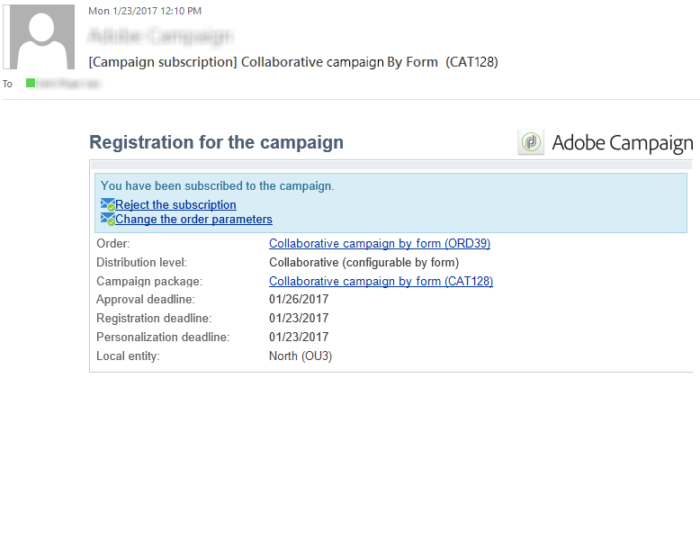

# 创建协作活动{#creating-a-collaborative-campaign-intro}

中央实体从&#x200B;**分布式营销**&#x200B;营销活动模板创建协作营销活动。 请参见[此页面](about-distributed-marketing.md#collaborative-campaign)。

## 创建协作活动 {#creating-a-collaborative-campaign}

要配置协作营销活动，请单击&#x200B;**[!UICONTROL Campaign management > Campaigns]**&#x200B;文件夹，然后单击&#x200B;**[!UICONTROL New]**&#x200B;图标。

>[!NOTE]
>
>除了&#x200B;**[!UICONTROL collaborative campaigns (by campaign)]**&#x200B;之外，还可以通过Web界面配置和执行这些营销活动。

协作活动数据库的配置过程与本地活动模板的配置过程类似。 不同类型协作活动的规范详见下文。

### 按形状 {#by-form}

要创建协作营销活动（按表单），必须选择&#x200B;**[!UICONTROL Collaborative campaign (by form)]**&#x200B;模板。

在&#x200B;**[!UICONTROL Edit]**&#x200B;选项卡中，单击&#x200B;**[!UICONTROL Advanced campaign parameters...]**&#x200B;链接以访问&#x200B;**分布式营销**&#x200B;选项卡。

选择&#x200B;**By form** Web界面。 此类界面允许您创建个性化字段，本地实体在订购营销活动时将使用这些字段。 请参阅[创建本地营销活动（按表单）](examples.md#creating-a-local-campaign--by-form-)。

保存您的营销活动。 您现在可以从&#x200B;**促销活动**&#x200B;选项卡的&#x200B;**促销活动包**&#x200B;视图中通过单击&#x200B;**[!UICONTROL Create]**&#x200B;按钮来使用此项。

**[!UICONTROL Campaign Package]**&#x200B;视图允许您使用本地营销活动模板（现成或重复）以及协作营销活动的引用营销活动，以便为不同的组织实体创建营销活动。

### 按营销活动 {#by-campaign}

要创建协作营销活动（按营销活动），必须选择&#x200B;**[!UICONTROL Collaborative campaign (by campaign) (opCollaborativeByCampaign)]**&#x200B;模板。

订购营销活动时，本地实体可以完成由中央实体定义的标准，并在订购之前评估营销活动。

中央实体批准&#x200B;**协作营销活动（按营销活动）**&#x200B;的订单后，将为本地实体创建子营销活动。 一旦可供它们使用，本地实体就可以修改：

* 活动工作流，
* 类型规则，
* 和个性化字段。

本地实体执行子营销活动。 中央实体执行父营销策划。

中央实体可以从此仪表板（通过&#x200B;**[!UICONTROL List of associated campaigns]**&#x200B;链接）查看与&#x200B;**协作营销活动（按营销活动）**&#x200B;链接的所有子营销活动。

### 通过目标审批 {#by-target-approval}

要创建协作营销活动（通过目标审批），必须选择&#x200B;**[!UICONTROL Collaborative campaign (by target approval)]**&#x200B;模板。

>[!NOTE]
>
>在此模式下，中央实体不需要指定本地实体。

活动工作流必须集成&#x200B;**本地审批**&#x200B;类型活动。 活动参数如下：

* **[!UICONTROL Action to perform]**：目标审批通知。
* **[!UICONTROL Distribution context]**：显式。
* **[!UICONTROL Data distribution]**：本地实体分发。

必须创建&#x200B;**本地实体分发**&#x200B;类型数据分发。 使用数据分发模板，您可以限制分组值列表中的记录数。 在&#x200B;**[!UICONTROL Resources > Campaign management > Data distribution]**&#x200B;中，单击&#x200B;**[!UICONTROL New]**&#x200B;图标以创建新的&#x200B;**[!UICONTROL Data distribution]**。 有关数据分发的更多信息，

选择&#x200B;**定向维度**&#x200B;和&#x200B;**[!UICONTROL Distribution field]**。 对于&#x200B;**[!UICONTROL Assignment type]**，选择&#x200B;**本地实体**。

在&#x200B;**[!UICONTROL Distribution]**&#x200B;选项卡中，为每个本地实体添加一个字段并指定值。

您可以在&#x200B;**投放**&#x200B;类型活动之后再添加一次&#x200B;**目标审批**&#x200B;以配置相关报告。

在营销活动创建通知消息中，本地实体接收已由中央实体参数预定义的联系人列表。

本地实体可以根据营销活动内容删除某些联系人。

### 简单 {#simple}

要创建简单的协作活动，必须选择&#x200B;**[!UICONTROL Collaborative campaign (simple)]**&#x200B;模板。

## 创建协作活动包 {#creating-a-collaborative-campaign-package}

要使营销活动对本地实体可用，中央实体必须创建营销活动包。

应用以下步骤：

1. 在&#x200B;**营销活动**&#x200B;页面的&#x200B;**[!UICONTROL Navigation]**&#x200B;部分中，单击&#x200B;**[!UICONTROL Campaign packages]**&#x200B;链接。
1. 单击 **[!UICONTROL Create]** 按钮。
1. 窗口顶部的部分允许您选择&#x200B;**[!UICONTROL New collaborative package (mutualizedEmpty)]**&#x200B;模板。
1. 选择引用营销活动。
1. 指定活动包的标签、文件夹和执行计划。

### 日期 {#dates}

开始日期和结束日期定义营销活动包列表中的营销活动可见性时段。

对于&#x200B;**协作营销活动**，中央实体必须指定注册和个性化截止日期。

>[!NOTE]
>
>**[!UICONTROL Personalization deadline]**&#x200B;允许中央实体选择截止日期，本地实体必须在此日期之前交付了要用于配置营销活动的文档（电子表格、图像）。 这不是强制选项。 不直接跳过此日期将不会影响Campaign实施。

### 受众 {#audience}

创建协作营销活动后，中央实体必须立即指定每个营销活动所涉及的本地实体。

>[!CAUTION]
>
>除非指定了相关的本地实体，否则无法批准&#x200B;**[!UICONTROL Simple, by form and by campaign collaborative campaign kits]**。

### 审批模式 {#approval-modes}

对于&#x200B;**协作营销活动**，您可以指定订单审批模式。

在手动模式下，本地实体需要订阅活动才能参与。

在自动模式下，本地实体预订阅活动。 它可以在不需要中央实体批准的情况下取消营销活动订阅或修改其参数。

### 通知 {#notifications}

通知的配置与本地实体的通知相同。 请参阅[此小节](creating-a-local-campaign.md#notifications)。

## 订购营销活动 {#ordering-a-campaign}

将协作营销活动添加到营销活动包列表后，将通知属于中央实体定义的受众的本地实体(**协作营销活动（按目标审批）**&#x200B;没有预定义受众)。 发送的消息包含一个链接，允许您注册促销活动，如下所示：

此消息还可让本地实体查看由创建资源包的中央运算符输入的描述，以及链接到营销活动的文档。 这些内容不属于营销策划本身，但它们会提供有关营销策划的其他信息。

一旦本地操作员通过Web界面登录，他们就可以向要订购的协作活动输入个性化信息：

本地实体完成注册后，中心实体会收到电子邮件通知，批准其订单。

有关更多信息，请参阅[审批流程](creating-a-local-campaign.md#approval-process)一节。

## 批准订单 {#approving-an-order}

批准协作活动包订单的流程与批准本地活动包订单的流程相同。 请参阅[此小节](creating-a-local-campaign.md#approving-an-order)。
