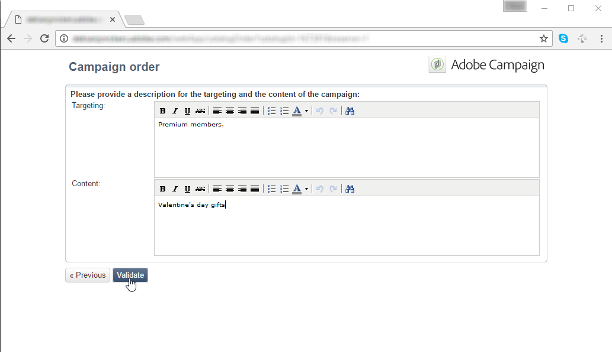
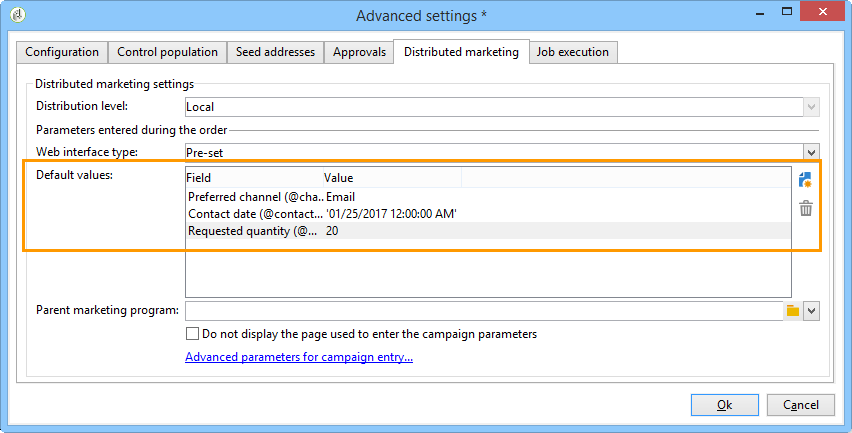

# 创建本地活动{#creating-a-local-campaign}

本地营销活动是使用 **[!UICONTROL campaign packages]** 带有 **特定执行计划**. 其目标是使用由中央实体设置和配置的活动模板满足本地通信需求。 实施本地操作的主要阶段如下：

**对于中央实体**

1. 创建本地营销活动模板。
1. 从模板创建营销活动包。
1. 发布营销活动包。
1. 批准订单。

**对于本地实体**

1. 订购营销活动。
1. 执行活动。

## 创建本地营销活动模板 {#creating-a-local-campaign-template}

要创建营销活动包，您必须首先创建 **活动模板** 通过 **[!UICONTROL Resources > Templates]** 节点。

要创建新的本地模板，请复制默认模板 **[!UICONTROL Local campaign (opLocal)]** 模板。

命名营销活动模板并填写可用字段。

在营销活动窗口中，单击 **[!UICONTROL Edit]** ，然后单击 **[!UICONTROL Advanced campaign parameters...]** 链接。

### Web 界面 {#web-interface}

在 **分布式营销** 选项卡，您可以选择Web界面类型，并指定当本地实体下订单时要输入的默认值和参数。

Web界面对应于订购营销活动时由本地实体填写的表单。

选择要应用于从模板创建的营销活动的Web界面类型：

可用的Web界面类型有四种：

* **[!UICONTROL By brief]** :本地实体必须提供描述营销活动配置的描述。 订单获得批准后，中央实体将整体配置并执行营销活动。

   

* **[!UICONTROL By form]** :本地实体有权访问Web表单，在该表单中，根据使用的模板，他们可以编辑内容、目标、最大大小，以及使用个性化字段创建和提取日期。 本地实体可以评估目标并预览此Web窗体中的内容。

   

   提供的表单在Web应用程序中指定，该表单必须从 **[!UICONTROL web Interface]** 字段 **[!UICONTROL Advanced campaign parameters...]** 链接。 请参阅 [创建本地营销活动（按表单）](examples.md#creating-a-local-campaign--by-form-).

   >[!NOTE]
   >
   >此示例中使用的Web应用程序就是一个示例。 您必须创建特定的Web应用程序才能使用表单。

   

* **[!UICONTROL By external form]** :本地实体有权访问其外联网(而非Adobe Campaign)中的campaign参数。 这些参数与 **本地营销活动（按表单）**.
* **[!UICONTROL Pre-set]** :本地实体使用默认表单订购营销活动，而不将其本地化。

   

### 默认值 {#default-values}

选择 **[!UICONTROL Default values]** 由当地实体完成。 例如：

* 联系和提取日期，
* 目标特征（年龄段等）。

完成 **[!UICONTROL Parent marketing program]** 和 **[!UICONTROL Charge]** 字段。

### 审批 {#approvals}

从 **[!UICONTROL Advanced parameters for campaign entry]** 链接时，可以指定审阅人的最大数量。

订购营销活动时，本地实体将输入审阅人。

如果不希望为营销活动命名审阅人，请输入0。

### 文档 {#documents}

您可以允许本地实体运算符链接文档（文本文件、电子表格、图像、促销活动描述等） 到本地营销活动。 的 **[!UICONTROL Advanced parameters for campaign entry...]** 链接可让您限制文档数量。 要执行此操作，只需在 **[!UICONTROL Number of documents]** 字段。

在订购营销活动包时，表单建议链接模板中相应字段中指示的任意数量的文档。

如果不希望显示文档上载字段，请输入 **[!UICONTROL 0]** 在 **[!UICONTROL Number of documents]** 字段。

>[!NOTE]
>
>的 **[!UICONTROL Advanced parameters for campaign entry]** 可通过检查 **[!UICONTROL Do not display the page used to enter the campaign parameters]**.

### 工作流 {#workflow}

在 **[!UICONTROL Targeting and workflows]** ，创建用于收集 **[!UICONTROL Default values]** 在 **[!UICONTROL Advanced campaign parameters...]** 并创建投放。

双击 **[!UICONTROL Query]** 活动，以根据指定的 **[!UICONTROL Default values]**.

### 投放 {#delivery}

在 **[!UICONTROL Audit]** ，单击 **[!UICONTROL Detail...]** 图标以查看 **[!UICONTROL Scheduling]** 的值。

的 **[!UICONTROL Scheduling]** 图标，可配置投放的联系和执行日期。

如有必要，请配置投放的最大大小：

找到投放的HTML。 例如， **[!UICONTROL Delivery > Current order > Additional fields]**，则使用 **[!UICONTROL Age segment]** 字段，以根据目标的年龄来查找投放。

保存营销活动模板。 您现在可以从 **[!UICONTROL Campaign packages]** 视图 **[!UICONTROL Campaigns]** ，方法是 **[!UICONTROL Create]** 按钮。

>[!NOTE]
>
>营销活动模板及其常规配置详见 [本页](../campaigns/marketing-campaign-templates.md).

## 创建营销活动包 {#creating-the-campaign-package}

要使营销活动模板对本地实体可用，需要将其添加到列表中。 为此，中央机构需要创建一个新的一揽子计划。

应用以下步骤：

1. 在 **[!UICONTROL Navigation]** 部分 **促销活动** 页面，单击 **[!UICONTROL Campaign packages]** 链接。
1. 单击 **[!UICONTROL Create]** 按钮。

   

1. 利用窗口上方的部分，可选择 [先前](#creating-a-local-campaign-template) 指定的营销活动包模板。

   默认情况下， **[!UICONTROL New local campaign package (localEmpty)]** 模板用于本地营销活动。

1. 指定营销活动包的标签、文件夹和执行计划。

### 日期 {#dates}

开始和结束日期定义营销活动包列表中营销活动的可见性时段。

可用日期是营销活动对本地实体（按订单）可用的日期。

>[!CAUTION]
>
>如果本地实体未在截止日期之前保留该营销活动，则将无法使用该营销活动。

此信息可在发送给本地代理的通知消息中找到，如下所示：

### 受众 {#audience}

对于本地营销活动，中央实体可通过检查 **[!UICONTROL Limit the package to a set of local entities]**.

### 其他设置 {#additional-settings}

保存包后，中央实体可以从 **[!UICONTROL Edit]** 选项卡。

从 **[!UICONTROL General]** ，则中央实体可以：

* 从 **[!UICONTROL Approval parameters...]** 链接，
* 审查执行计划，
* 添加或删除本地实体。

>[!NOTE]
>
>默认情况下，每个实体都可以对 **本地营销活动** 一次。
>   
>检查 **[!UICONTROL Enable multiple creation]** 选项，以允许从营销活动包创建多个本地营销活动。

### 通知 {#notifications}

当营销活动可用或达到注册截止时间时，会向本地通知组的操作员发送消息。 有关更多信息，请参阅 [组织实体](about-distributed-marketing.md#organizational-entities).

## 订购营销活动 {#ordering-a-campaign}

当本地实体批准并开始实施期限后，即可访问营销活动包。 本地实体会收到一封电子邮件，告知他们有新的营销活动包可用（一旦达到其发布日期）。

>[!NOTE]
>
>如果在创建营销活动包时指定了某些本地实体，则这些实体将是唯一接收通知的实体。 如果未指定本地实体，则所有本地实体都将收到通知。

要使用中央实体提供的营销活动，本地实体必须订购该活动。

要订购营销活动，请执行以下操作：

1. 单击 **[!UICONTROL Order campaign]** 或Adobe Campaign中的相应按钮。

   输入您的ID和密码以订购营销活动。 界面由Web应用程序中定义的一组页面组成。

1. 在首页中输入必需信息（订单标签和评论），然后单击 **[!UICONTROL Next]**.

   

1. 完成可用参数并批准订单。

1. 通知将发送给本地实体所属的组织实体的经理以批准此订单。

   

1. 信息将返回给当地和中央实体。 虽然本地实体只能查看其自己的订单，但中央实体可以按任何本地实体查看所有订单，如下所示：

   

   操作员可以显示订单详细信息：

   

   的 **[!UICONTROL Edit]** 选项卡包含本地实体在订购营销活动时输入的信息。

   

1. 该命令必须经中央实体批准才能定稿。

   

   有关更多信息，请参阅 [审批流程](#approval-process) 中。

1. 然后，本地操作员会收到营销活动可用的通知：营销活动可用性可在 **促销活动** 选项卡。 然后可以使用营销活动。 有关更多信息，请参阅 [访问营销活动](accessing-campaigns.md).

   的 **[!UICONTROL Start targeting with order approval]** 选项允许本地实体在订单获得批准后立即运行营销活动。

   

## 批准订单 {#approving-an-order}

要确认促销活动订单，中央实体必须批准该订单。

的 **[!UICONTROL Campaign orders]** 概述，通过 **促销活动** 选项卡，用于查看促销活动订单的状态并批准它们。

>[!NOTE]
>
>本地实体可以更改顺序，直到其获得批准。

### 审批流程 {#approval-process}

#### 电子邮件通知 {#email-notification}

当营销活动由本地实体订购时，其审阅人会通过电子邮件通知，如下所示：

>[!NOTE]
>
>选择审阅者将显示在 [审阅人](#reviewers) 中。 他们可以接受或拒绝命令。

#### 通过Adobe Campaign控制台批准 {#approving-via-the-adobe-campaign-console}

此外，营销活动订单概述中的订单也可以通过控制台获得批准。 要批准订单，请选择它并单击 **[!UICONTROL Approve the order]**.

>[!NOTE]
>
>在营销活动可用日期之前，仍可以编辑和重新配置营销活动。 本地实体也可以通过单击 **[!UICONTROL Cancel]** 按钮。

#### 创建营销策划 {#creating-a-campaign}

营销活动订单获得批准后，即可由本地实体配置和执行。

有关更多信息，请参阅 [访问营销活动](accessing-campaigns.md).

### 拒绝批准 {#rejecting-an-approval}

负责审批的操作员可以拒绝订单或促销活动包。

如果审阅人拒绝订单，则相关通知会自动发送给相关的本地实体：它显示拒绝批准的操作员输入的评论。

信息显示在营销活动包列表页面或营销活动订单页面上。 如果他们有权访问Adobe Campaign控制台，则本地实体会收到此拒绝通知。

他们可以查看营销活动包中的相关评论 **[!UICONTROL Edit]** 选项卡。

### 审阅人 {#reviewers}

每次需要批准时，审阅人都会通过电子邮件通知。

对于每个本地实体，选择审阅人以批准营销活动订单和进行营销活动批准。 有关选择本地审阅人的详细信息，请参阅 [组织实体](about-distributed-marketing.md#organizational-entities).

>[!NOTE]
>
>要使此选择成为可能，订单批准必须尚未生效。

### 取消订单 {#canceling-an-order}

中央机构可使用 **[!UICONTROL Delete]** 按钮。

这会取消 **[!UICONTROL Campaign orders]** 中。
