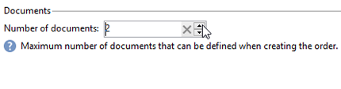
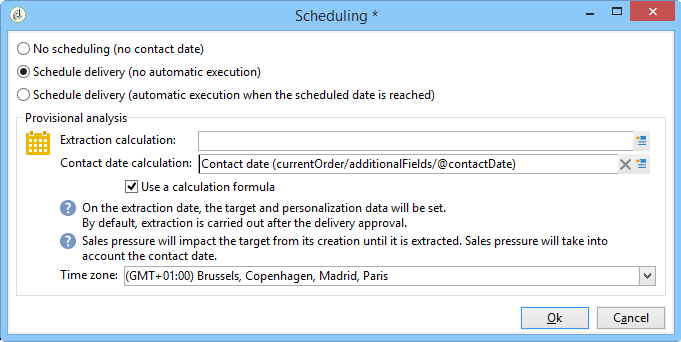
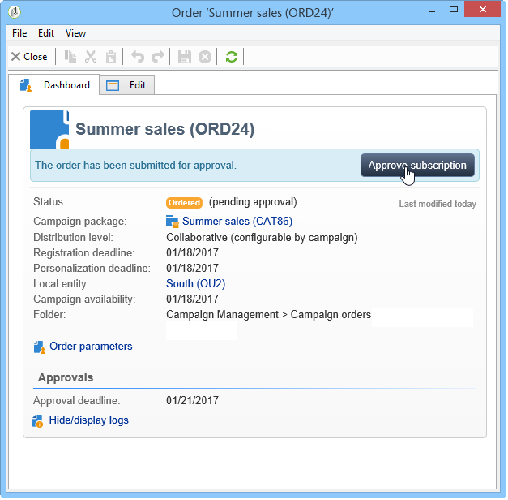
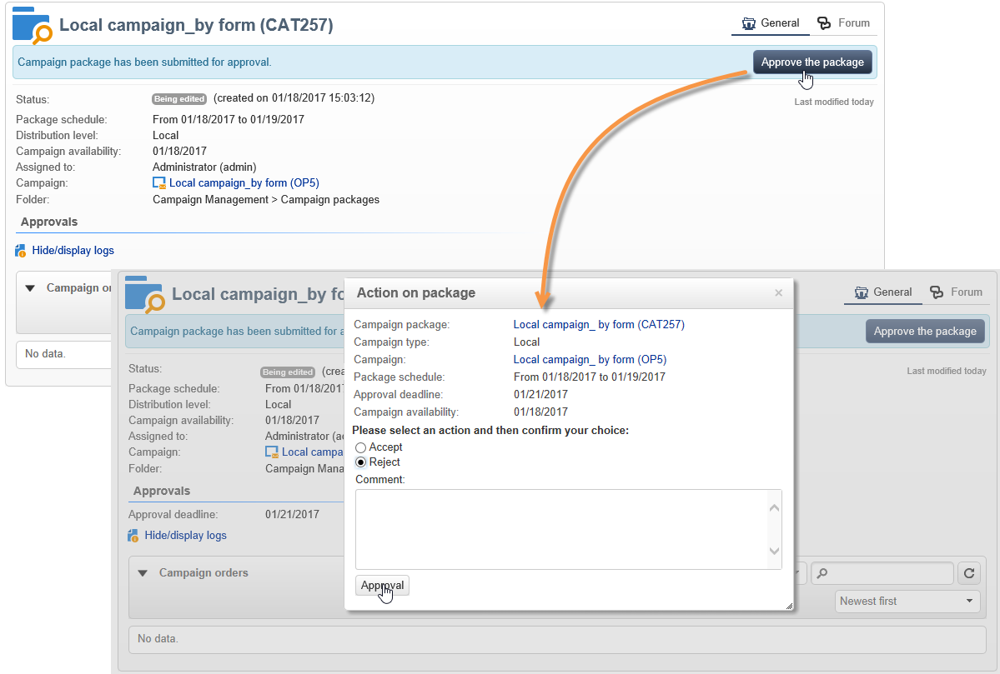

# 创建本地活动{#creating-a-local-campaign}

本地营销活动是从包含&#x200B;**特定执行计划**&#x200B;的&#x200B;**[!UICONTROL campaign packages]**&#x200B;列表中引用的模板创建的实例。 其目标是使用由中央实体设置和配置的活动模板满足本地通信需求。 实施本地操作的主要阶段如下：

中央实体&#x200B;**的**

1. 创建本地活动模板。
1. 从模板创建活动包。
1. 发布活动包。
1. 正在审批订单。

本地实体&#x200B;**的**

1. 订购营销活动。
1. 执行活动。

## 创建本地活动模板 {#creating-a-local-campaign-template}

要创建营销活动包，您必须首先通过&#x200B;**[!UICONTROL Resources > Templates]**&#x200B;节点创建&#x200B;**营销活动模板**。

要创建新的本地模板，请复制默认的&#x200B;**[!UICONTROL Local campaign (opLocal)]**&#x200B;模板。

命名您的营销活动模板并填写可用字段。

在营销活动窗口中，单击&#x200B;**[!UICONTROL Edit]**&#x200B;选项卡，然后单击&#x200B;**[!UICONTROL Advanced campaign parameters...]**&#x200B;链接。

### 接口类型 {#web-interface}

在&#x200B;**分布式营销**&#x200B;选项卡中，您可以选择接口类型并指定本地实体下订单时要输入的默认值和参数。

该界面对应于本地实体在订购营销活动时要填充的表单。

选择要应用于从模板创建的营销活动的界面类型：

有四种类型的接口可用：

* **[!UICONTROL By brief]** ：本地实体必须提供描述，以便描述营销活动配置。 订单获得批准后，中央实体会配置并执行整个营销活动。

  

* **[!UICONTROL By form]** ：本地实体有权访问Web窗体，本地实体可以在其中使用个性化字段编辑内容、目标、其最大大小以及创建和提取日期，具体取决于使用的模板。 本地实体可以评估目标并预览此Web窗体中的内容。

  

  提供的表单在Web应用程序中指定，必须从模板的&#x200B;**[!UICONTROL Advanced campaign parameters...]**&#x200B;链接的&#x200B;**[!UICONTROL web Interface]**&#x200B;字段的下拉列表中选择该应用程序。 请参阅[创建本地营销活动（按表单）](examples.md#creating-a-local-campaign--by-form-)。

  >[!NOTE]
  >
  >本示例中使用的Web应用程序就是一个示例。 您必须创建特定的Web应用程序才能使用表单。

  

* **[!UICONTROL By external form]** ：本地实体有权访问其外网(非Adobe Campaign)中的营销活动参数。 这些参数与&#x200B;**本地营销活动（按表单）**&#x200B;的参数相同。
* **[!UICONTROL Pre-set]** ：本地实体使用默认表单订购营销活动，而不进行本地化。

  

### 默认值 {#default-values}

选择要由本地实体完成的&#x200B;**[!UICONTROL Default values]**。 例如：

* 联系和提取日期，
* 目标特征（年龄段等）。

完成&#x200B;**[!UICONTROL Parent marketing program]**&#x200B;和&#x200B;**[!UICONTROL Charge]**&#x200B;字段。

### 审批 {#approvals}

从&#x200B;**[!UICONTROL Advanced parameters for campaign entry]**&#x200B;链接中，可以指定最大审阅人数量。

订购营销活动时，审阅人将由本地实体输入。

如果不希望为促销活动命名审阅者，请输入0。

### 文档 {#documents}

您可以允许本地实体运算符链接文档（文本文件、电子表格、图像、营销活动描述等） 到本地营销活动。 **[!UICONTROL Advanced parameters for campaign entry...]**&#x200B;链接允许您限制文档数量。 要实现此目的，只需在&#x200B;**[!UICONTROL Number of documents]**&#x200B;字段中输入允许的最大数量即可。

在订购营销活动包时，表单会建议关联模板中相应字段中所指示的任意数量的文档。

如果您不想显示文档上载字段，请在&#x200B;**[!UICONTROL Number of documents]**&#x200B;字段中输入&#x200B;**[!UICONTROL 0]**。

>[!NOTE]
>
>可以通过选中&#x200B;**[!UICONTROL Do not display the page used to enter the campaign parameters]**&#x200B;来停用&#x200B;**[!UICONTROL Advanced parameters for campaign entry]**。

### 工作流 {#workflow}

在&#x200B;**[!UICONTROL Targeting and workflows]**&#x200B;选项卡中，创建收集&#x200B;**[!UICONTROL Advanced campaign parameters...]**&#x200B;中指定的&#x200B;**[!UICONTROL Default values]**&#x200B;并创建投放的营销活动工作流。

双击&#x200B;**[!UICONTROL Query]**&#x200B;活动以根据指定的&#x200B;**[!UICONTROL Default values]**&#x200B;对其进行配置。

### 投放 {#delivery}

在&#x200B;**[!UICONTROL Audit]**&#x200B;选项卡中，单击&#x200B;**[!UICONTROL Detail...]**&#x200B;图标以查看所选投放的&#x200B;**[!UICONTROL Scheduling]**。

**[!UICONTROL Scheduling]**&#x200B;图标允许您配置投放的联系和执行日期。

如有必要，请配置投放的最大大小：

找到投放的HTML。 例如，在&#x200B;**[!UICONTROL Delivery > Current order > Additional fields]**&#x200B;中，使用&#x200B;**[!UICONTROL Age segment]**&#x200B;字段根据目标的年龄查找投放。

保存您的活动模板。 您现在可以从&#x200B;**[!UICONTROL Campaigns]**&#x200B;选项卡的&#x200B;**[!UICONTROL Campaign packages]**&#x200B;视图中，通过单击&#x200B;**[!UICONTROL Create]**&#x200B;按钮来使用它。

>[!NOTE]
>
>[此页面](../campaigns/marketing-campaign-templates.md)中详细介绍了营销活动模板及其常规配置。

## 创建活动包 {#creating-the-campaign-package}

要使营销活动模板可供本地实体使用，需要将其添加到列表中。 为此，中央机构需要制定新的方案。

应用以下步骤：

1. 在&#x200B;**营销活动**&#x200B;页面的&#x200B;**[!UICONTROL Navigation]**&#x200B;部分中，单击&#x200B;**[!UICONTROL Campaign packages]**&#x200B;链接。
1. 单击 **[!UICONTROL Create]** 按钮。

   

1. 窗口上方的部分允许您选择[以前](#creating-a-local-campaign-template)指定的营销活动包模板。

   默认情况下，**[!UICONTROL New local campaign package (localEmpty)]**&#x200B;模板用于本地营销活动。

1. 指定活动包的标签、文件夹和执行计划。

### 日期 {#dates}

开始日期和结束日期定义营销活动包列表中的营销活动可见性时段。

可用日期是促销活动对本地实体（要订购）可用的日期。

>[!CAUTION]
>
>如果本地实体未在截止日期前预留营销活动，则将无法使用该营销活动。

此信息可在发送给本地机构的通知消息中找到，如下所示：

### 受众 {#audience}

对于本地营销活动，中央实体可以通过检查&#x200B;**[!UICONTROL Limit the package to a set of local entities]**&#x200B;来指定涉及的本地实体。

### 其他设置 {#additional-settings}

保存包后，中央实体可以从&#x200B;**[!UICONTROL Edit]**&#x200B;选项卡编辑它。

在&#x200B;**[!UICONTROL General]**&#x200B;选项卡中，中心实体可以：

* 通过&#x200B;**[!UICONTROL Approval parameters...]**&#x200B;链接配置营销活动包审阅者，
* 查看执行计划，
* 添加或删除本地实体。

>[!NOTE]
>
>默认情况下，每个实体只能对&#x200B;**本地营销活动**&#x200B;订购一次。
>   
>选中&#x200B;**[!UICONTROL Enable multiple creation]**&#x200B;选项以允许从营销活动包创建多个本地营销活动。

### 通知 {#notifications}

当营销活动可用或达到注册截止日期时，将向本地通知组的操作员发送消息。 有关详细信息，请参阅[组织实体](about-distributed-marketing.md#organizational-entities)。

## 订购营销活动 {#ordering-a-campaign}

活动包获得批准且实施期开始后，本地实体即可访问这些活动包。 本地实体会收到一封电子邮件，通知他们新的Campaign包可用（一旦达到可用日期）。

>[!NOTE]
>
>如果在创建活动包时指定了某些本地实体，则它们将是唯一接收通知的本地实体。 如果未指定本地实体，则所有本地实体都将收到通知。

要使用中央实体提供的营销策划，本地实体必须对其进行排序。

要订购活动，请执行以下操作：

1. 单击通知消息中的&#x200B;**[!UICONTROL Order campaign]**，或单击Adobe Campaign中的相应按钮。

   输入您的ID和密码以订购营销活动。 该界面由Web应用程序中定义的一组页面组成。

1. 在首页中输入必需的信息（订单标签和备注），然后单击&#x200B;**[!UICONTROL Next]**。

   

1. 完成可用参数并批准订单。

1. 系统会向本地实体所属组织实体的经理发送通知，以批准此订单。

   

1. 信息被返回到本地和中央实体。 虽然本地实体只能查看自己的订单，但中央实体可以查看任何本地实体的所有订单，如下所示：

   

   操作员可以显示订单详细信息：

   

   **[!UICONTROL Edit]**&#x200B;选项卡包含本地实体在订购营销活动时输入的信息。

   

1. 该命令必须得到中央实体的批准才能最后确定。

   

   有关更多信息，请参阅[审批流程](#approval-process)一节。

1. 然后，会通知本地操作员该营销活动可用：可以在&#x200B;**营销活动**&#x200B;选项卡中的营销活动包列表中找到营销活动可用性。 然后，可以使用营销策划。 有关详情，请参阅[访问营销活动](accessing-campaigns.md)。

   通过&#x200B;**[!UICONTROL Start targeting with order approval]**&#x200B;选项，本地实体可在订单获得批准后立即运行营销活动。

   

## 批准订单 {#approving-an-order}

要确认促销活动订单，必须获得中心实体的批准。

通过&#x200B;**促销活动**&#x200B;选项卡访问的&#x200B;**[!UICONTROL Campaign orders]**&#x200B;概述允许您查看并批准促销活动订单的状态。

>[!NOTE]
>
>本地实体可以对订单进行更改，直到获得批准为止。

### 审批流程 {#approval-process}

#### 电子邮件通知 {#email-notification}

当营销活动由本地实体订购时，其查看者会收到电子邮件通知，如下所示：

>[!NOTE]
>
>选择审阅人将显示在[审阅人](#reviewers)部分中。 他们可以接受或拒绝该订单。

#### 通过客户端控制台批准 {#approving-via-the-adobe-campaign-console}

订单也可以通过客户控制台在促销活动订单概述中审批。 要批准订单，请选择该订单并单击&#x200B;**[!UICONTROL Approve the order]**。

>[!NOTE]
>
>在营销活动可用日期之前，仍可以编辑和重新配置营销活动。 本地实体也可以通过单击&#x200B;**[!UICONTROL Cancel]**&#x200B;按钮拒绝营销活动。

#### 创建活动 {#creating-a-campaign}

营销活动订单获得批准后，可以由本地实体配置并执行。

有关详情，请参阅[访问营销活动](accessing-campaigns.md)。

### 拒绝审批 {#rejecting-an-approval}

负责审批的操作员可以拒绝订单或活动程序包。

如果复查人拒绝订单，则系统会自动将相关通知发送给相关的本地实体：显示拒绝审批的操作员输入的备注。

信息显示在活动包列表页面或活动订单页面上。 如果他们有权访问Adobe Campaign客户端控制台，则会将此拒绝通知本地实体。

他们可以在营销活动包的&#x200B;**[!UICONTROL Edit]**&#x200B;选项卡中查看相关评论。

### 审阅者 {#reviewers}

每次需要审批时，审阅人都会收到电子邮件通知。

对于每个本地实体，将选择审阅人进行营销活动订单批准和营销活动批准。 有关选择本地审阅者的详细信息，请参阅[组织实体](about-distributed-marketing.md#organizational-entities)。

>[!NOTE]
>
>要使此选择成为可能，订单审批必须尚未生效。

### 取消订单 {#canceling-an-order}

中央机构可以使用订单仪表板上的&#x200B;**[!UICONTROL Delete]**&#x200B;按钮取消订单。

这将取消&#x200B;**[!UICONTROL Campaign orders]**&#x200B;视图中的营销活动。
