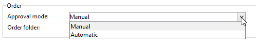

# 分布式营销示例{#distributed-marketing-samples}


## 创建本地活动（按表单） {#creating-a-local-campaign--by-form-}

**By表单**&#x200B;类型Web界面涉及使用&#x200B;**Web应用程序**。 根据配置，此Web应用程序可以包含任何类型的已定义个性化元素。 例如，您可以建议用于评估目标、预算、内容等的链接。 通过专用API。

>[!NOTE]
>
>本示例中使用的Web应用程序不是随Adobe Campaign一起提供的现成Web应用程序。 要在营销策划中使用表单，您必须创建专用的Web应用程序。

创建营销活动模板时，请单击&#x200B;**[!UICONTROL Advanced campaign parameters...]**&#x200B;链接的&#x200B;**[!UICONTROL Web interface]**&#x200B;选项中的&#x200B;**[!UICONTROL Zoom]**&#x200B;图标以访问Web应用程序的详细信息。


>[!NOTE]
>
>Web应用程序参数仅在营销活动模板中可用。

在&#x200B;**[!UICONTROL Edit]**&#x200B;选项卡中，选择&#x200B;**促销活动订单**&#x200B;活动并将其打开以访问其内容。


在此示例中，**促销活动订单**&#x200B;活动包括：

* 由本地实体在订单期间输入的字段，

  

* 允许本地实体评估营销活动（如目标、预算、内容等）的链接，

  

* 用于计算和显示这些评估结果的脚本。

  

在此示例中，使用以下API：

* 对于目标评估，

  ```
  var res = nms.localOrder.EvaluateTarget(ctx.localOrder);
  ```

* 在预算评估中，

  ```
  var res = nms.localOrder.EvaluateDeliveryBudget(ctx.@deliveryId, NL.XTK.parseNumber(ctx.@compt));
  ```

* 对于内容评估，

  ```
  var res = nms.localOrder.EvaluateContent(ctx.localOrder, ctx.@deliveryId, "html", resSeed.@id);
  ```

## 创建协作活动（通过目标批准） {#creating-a-collaborative-campaign--by-target-approval-}

### 简介 {#introduction}

您是一家大型服装品牌的营销经理，该品牌在美国各地有一家在线商店和几家精品店。 春天到了，你决定推出一项特别优惠，给最优秀的客户目录中的所有裙子优惠50%。

这项优惠针对的是你美国商店里最优秀的客户，也就是说那些自今年年初以来消费超过300美元的客户。

因此，您决定使用分布式营销来创建一个协作营销活动（通过目标批准），该活动将允许您选择商店的最佳客户（按区域分组），这些客户将收到包含特殊优惠的电子邮件投放。

此示例的第一部分说明了接收促销活动创建通知的本地实体，以及如何使用它来评估促销活动并对其进行排序。

此示例的第二部分说明如何创建营销策划。

步骤如下：

本地实体&#x200B;**的**

1. 使用营销活动创建通知来访问中央实体选择的联系人列表。
1. 选择联系人并批准参与率。

中央实体的&#x200B;**：**

1. 创建&#x200B;**[!UICONTROL Data distribution]**&#x200B;活动。
1. 创建协作活动。
1. Publish营销活动。

### 本地实体侧 {#local-entity-side}

1. 已选择参与活动的本地实体将收到电子邮件通知。

   

1. 通过单击&#x200B;**[!UICONTROL Access your contact list and approve targeting]**&#x200B;链接，授予本地实体访问为营销活动选择的客户端列表的权限（通过Web浏览器）。

   

1. 本地实体将从列表中取消选中某些联系人，因为自年初以来，已就类似的选件与他们进行了联系。

   

一旦检查获得批准，营销活动即可自动启动。

### 中央实体侧 {#central-entity-side}

#### 创建数据分发活动 {#creating-a-data-distribution-activity}

1. 要设置协作营销活动（通过目标审批），您必须首先创建&#x200B;**[!UICONTROL Data distribution activity]**。 单击Campaign资源管理器&#x200B;**[!UICONTROL Resources > Campaign management > Data distribution]**&#x200B;文件夹中的&#x200B;**[!UICONTROL New]**&#x200B;图标。

   

1. 在&#x200B;**[!UICONTROL General]**&#x200B;选项卡中，必须指定：

   * **[!UICONTROL Targeting dimension]**。 此处对&#x200B;**收件人**&#x200B;执行&#x200B;**数据分发**。
   * **[!UICONTROL Distribution type]**。 您可以选择&#x200B;**固定大小**&#x200B;或&#x200B;**大小（百分比**）。
   * **[!UICONTROL Assignment type]**。 选择&#x200B;**本地实体**&#x200B;选项。
   * **[!UICONTROL Distribution type]**。 在此，收件人表中存在&#x200B;**[!UICONTROL Origin (@origin)]**&#x200B;字段，用于识别联系人和本地实体之间的关系。
   * **[!UICONTROL Approval storage]**&#x200B;字段。 选择&#x200B;**本地审批收件人**&#x200B;选项。

1. 在&#x200B;**[!UICONTROL Breakdown]**&#x200B;选项卡中，指定：

   * **[!UICONTROL Distribution field value]**，对应于即将推出的营销活动中涉及的本地实体。
   * 本地实体&#x200B;**[!UICONTROL label]**。
   * **[!UICONTROL Size]**（固定或百分比）。 **0默认值**&#x200B;涉及选择链接到本地实体的所有收件人。

   

1. 保存您的新数据分发。

#### 创建协作活动 {#creating-a-collaborative-campaign}

1. 从Campaign资源管理器的&#x200B;**[!UICONTROL Campaign management > Campaign]**&#x200B;文件夹中，创建一个新的&#x200B;**[!UICONTROL collaborative campaign (by target approval)]**。
1. 在&#x200B;**[!UICONTROL Targeting and workflows]**&#x200B;选项卡中，为您的营销活动创建工作流。 该活动必须包含&#x200B;**Split**&#x200B;活动，其中&#x200B;**[!UICONTROL Record count limitation]**&#x200B;由&#x200B;**[!UICONTROL Data distribution]**&#x200B;活动定义。

   

1. 添加一个&#x200B;**[!UICONTROL Local approval]**&#x200B;操作，您可以在其中指定：

   * 消息内容将被发送到通知中的本地实体，
   * 审批提醒，
   * 营销活动的预期处理。

   

1. 保存您的记录。

#### Publish营销活动 {#publishing-the-campaign}

您现在可以从&#x200B;**[!UICONTROL Campaigns]**&#x200B;选项卡添加&#x200B;**营销活动包**。

1. 选择您的&#x200B;**[!UICONTROL Reference campaign]**。 在包的&#x200B;**[!UICONTROL Edit]**&#x200B;选项卡中，您可以选择要用于营销活动的&#x200B;**[!UICONTROL Approval mode]**：

   * 在&#x200B;**手动**&#x200B;模式下，如果本地实体接受来自中央实体的邀请，则它们将参与营销活动。 如果他们想要并且需要经理的批准以确认其参与活动，则可以删除预选联系人。
   * 在&#x200B;**自动**&#x200B;模式下，本地实体必须参与该营销活动，除非它们从该营销活动中注销自身。 无需批准，他们即可删除联系人。

   

1. 在&#x200B;**[!UICONTROL Description]**&#x200B;选项卡中，您可以添加营销活动的描述以及要发送到本地实体的任何文档。

   

1. 批准活动包，然后启动工作流以发布该包，并使其对包列表中的所有本地实体可用。

   

## 创建协作活动（按表单） {#creating-a-collaborative-campaign--by-form-}

### 简介 {#introduction-1}

您是一家大型化妆品牌的市场经理，该品牌在美国各地有一家在线商店和几家精品店。 为了卸掉冬季货品并为新货腾出空间，您决定创建一项特殊优惠，该优惠将针对两类客户：30岁以上的客户，您将向其提供对年龄敏感的护肤产品；以及30岁以下客户，您将向其提供更基本的护肤产品。

因此，您决定使用分布式营销来创建一个协作营销活动（按表单），该活动将允许您按年龄范围从不同的商店中选择客户。 这些客户将收到一封包含特殊优惠的电子邮件投放，将根据其年龄范围进行个性化。

此示例的第一部分说明了接收促销活动创建通知的本地实体，以及如何使用它来评估促销活动并对其进行排序。

此示例的第二部分说明如何创建营销策划。

步骤如下：

本地实体&#x200B;**的**

1. 使用营销活动创建通知访问在线表单。
1. 个性化营销活动（目标、内容、投放量）。
1. 检查这些字段，并在必要时进行更改。
1. 批准您的参与。
1. 本地实体（或中央实体）的经理批准您的配置和参与。

中央实体的&#x200B;**：**

1. 创建协作活动。
1. 像在本地营销活动中一样配置&#x200B;**[!UICONTROL Advanced campaign parameters...]**。
1. 像配置本地活动一样配置活动工作流和投放。
1. 更新Web窗体。
1. 创建并发布活动包。

### 本地实体侧 {#local-entity-side-1}

1. 被选定参加营销活动的本地实体收到电子邮件通知，告知其参加营销活动。

   

1. 本地实体完成个性化表单，然后他们：

   * 评估目标和预算，
   * 预览投放内容，
   * 批准他们的参与。

     

1. 负责验证订单的操作员批准其参与。

   

### 中央实体侧 {#central-entity-side-1}

1. 要实施协作活动（按表单），您必须使用&#x200B;**协作活动（按表单）**&#x200B;模板创建活动。

   

1. 在营销活动的&#x200B;**[!UICONTROL Edit]**&#x200B;选项卡中，单击&#x200B;**[!UICONTROL Advanced campaign parameters...]**&#x200B;链接以将其配置为本地营销活动。 请参阅[创建本地营销活动（按表单）](#creating-a-local-campaign--by-form-)。

   

1. 配置活动工作流和Web窗体。 请参阅[创建本地营销活动（按表单）](#creating-a-local-campaign--by-form-)。
1. 通过指定执行计划和所涉及的本地实体来创建活动包。

   

1. 通过在&#x200B;**[!UICONTROL Edit]**&#x200B;选项卡中选择审批模式完成包配置。

   

1. 在&#x200B;**[!UICONTROL Description]**&#x200B;选项卡中，您可以输入营销活动包说明、发布包时要发送到本地实体的通知消息，并将任何信息性文档附加到营销活动包。

   

1. 批准包以发布它。

   
