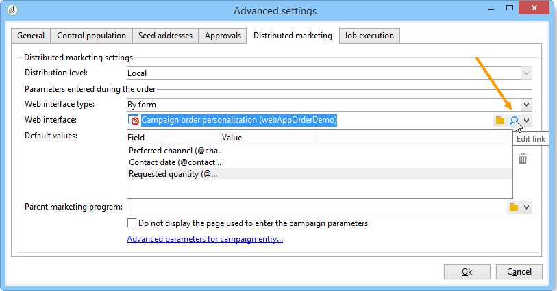

# 分布式营销示例{#distributed-marketing-samples}


## 创建本地营销活动（按表单） {#creating-a-local-campaign--by-form-}

的 **按表单** 类型web界面涉及使用 **Web应用程序**. 根据其配置，此Web应用程序可以包含任何类型的已定义个性化元素。 例如，您可以建议使用链接来评估目标、预算、内容等。 通过专用API。

>[!NOTE]
>
>此示例中使用的Web应用程序不是随Adobe Campaign一起提供的现成Web应用程序。 要在营销活动中使用表单，必须创建专用的Web应用程序。

创建营销活动模板时，单击 **[!UICONTROL Zoom]** 图标 **[!UICONTROL Web interface]** 的 **[!UICONTROL Advanced campaign parameters...]** 链接以访问web应用程序的详细信息。



>[!NOTE]
>
>Web应用程序参数仅在营销活动模板中可用。

在 **[!UICONTROL Edit]** 选项卡，选择 **营销活动订单** 活动，然后将其打开以访问其内容。


在本例中， **营销活动订单** 活动包括：

* 地方实体在订单期间输入的字段，

   

* 允许本地实体评估营销活动的链接（例如目标、预算、内容等），

   

* 脚本，可用于计算和显示这些评估的结果。

   

在此示例中，使用了以下API:

* 对于目标评估，

   ```
   var res = nms.localOrder.EvaluateTarget(ctx.localOrder);
   ```

* 对于预算评估，

   ```
   var res = nms.localOrder.EvaluateDeliveryBudget(ctx.@deliveryId, NL.XTK.parseNumber(ctx.@compt));
   ```

* 对于内容评估，

   ```
   var res = nms.localOrder.EvaluateContent(ctx.localOrder, ctx.@deliveryId, "html", resSeed.@id);
   ```

## 创建协作型营销活动（通过目标批准） {#creating-a-collaborative-campaign--by-target-approval-}

### 简介 {#introduction}

您是一家大型服装品牌的营销经理，该品牌在美国各地拥有一家在线商店和几家专卖店。 春天到来后，你决定创建一个特惠，让你最好的客户在你的目录里把所有裙子都减掉50%。

此优惠针对的是您美国商店中最好的客户，即自年初以来已花费超过300美元的客户。

因此，您决定使用分布式营销创建协作式营销活动（按目标批准），以便您选择商店的最佳客户（按区域分组），该客户将收到包含特殊选件的电子邮件投放。

此示例的第一部分说明了接收促销活动创建通知的本地实体，以及它们如何使用该实体评估促销活动并对其进行排序。

此示例的第二部分说明如何创建营销活动。

步骤如下：

**对于本地实体**

1. 使用营销活动创建通知可访问中央实体选择的联系人列表。
1. 选择联系人并批准参与。

**对于中央实体：**

1. 创建 **[!UICONTROL Data distribution]** 活动。
1. 创建协作营销活动。
1. 发布营销活动。

### 本地实体端 {#local-entity-side}

1. 被选择参与营销活动的本地实体将收到电子邮件通知。

   

1. 通过单击 **[!UICONTROL Access your contact list and approve targeting]** 链接，则本地实体有权（通过web浏览器）访问为营销活动选择的客户端列表。

   

1. 本地实体从列表中取消检查某些联系人，因为自年初以来，已联系他们以获取类似优惠。

   

检查获得批准后，营销活动可自动启动。

### 中央实体侧 {#central-entity-side}

#### 创建数据分发活动 {#creating-a-data-distribution-activity}

1. 要设置协作营销活动（通过目标批准），您必须首先创建 **[!UICONTROL Data distribution activity]**. 单击 **[!UICONTROL New]** 图标 **[!UICONTROL Resources > Campaign management > Data distribution]** 节点。

   

1. 在 **[!UICONTROL General]** ，则必须指定：

   * the **[!UICONTROL Targeting dimension]**. 此处 **数据分发** 执行 **收件人**.
   * the **[!UICONTROL Distribution type]**. 您可以选择 **固定大小** 或 **大小（百分比）**.
   * the **[!UICONTROL Assignment type]**. 选择 **本地实体** 选项。
   * the **[!UICONTROL Distribution type]**. 这里，它是 **[!UICONTROL Origin (@origin)]** “收件人”表中存在的字段，用于标识联系人与本地实体之间的关系。
   * 的 **[!UICONTROL Approval storage]** 字段。 选择 **收件人的本地批准** 选项。

1. 在 **[!UICONTROL Breakdown]** 选项卡，指定

   * the **[!UICONTROL Distribution field value]**，对应于参与即将进行的营销活动的本地实体。
   * 本地实体 **[!UICONTROL label]**.
   * the **[!UICONTROL Size]** （固定或以百分比表示）。 的 **0默认值** 包括选择链接到本地实体的所有收件人。

   

1. 保存新的数据分发。

#### 创建协作活动 {#creating-a-collaborative-campaign}

1. 从 **[!UICONTROL Campaign management > Campaign]** 节点，创建新 **[!UICONTROL collaborative campaign (by target approval)]**.
1. 在 **[!UICONTROL Targeting and workflows]** ，为营销活动创建工作流。 此参数必须包含 **拆分** 活动，其中 **[!UICONTROL Record count limitation]** 由 **[!UICONTROL Data distribution]** 活动。

   

1. 添加 **[!UICONTROL Local approval]** 可在其中指定的操作：

   * 将在通知中发送给本地实体的消息内容，
   * 批准提醒，
   * 营销活动的预期处理。

   

1. 保存记录。

#### 发布营销活动 {#publishing-the-campaign}

您现在可以添加 **营销活动包** 从 **[!UICONTROL Campaigns]** 选项卡。

1. 选择 **[!UICONTROL Reference campaign]**. 在 **[!UICONTROL Edit]** 选项卡，您可以选择 **[!UICONTROL Approval mode]** 用于营销活动：

   * in **手动** 模式，则当本地实体接受中央实体的邀请时，它们将参与营销活动。 如果需要，他们可以删除预先选定的联系人，并且需要经理的批准才能确认他们参与营销活动。
   * in **自动** 模式时，本地实体必须参与营销活动，除非它们取消注册。 他们可以删除联系人，而无需批准。

   

1. 在 **[!UICONTROL Description]** 选项卡，您可以为营销活动添加描述以及要发送到本地实体的任何文档。

   

1. 批准您的营销活动包，然后启动发布该包的工作流，并将其提供给包列表中的所有本地实体。

   

## 创建协作型营销活动（按表单） {#creating-a-collaborative-campaign--by-form-}

### 简介 {#introduction-1}

你是一家大型化妆品品牌的营销经理，该品牌在美国各地有一家网上商店和几家专卖店。 要卸下冬季库存并为新库存腾出空间，您决定创建一个特殊选件，以定位两个客户类别：30岁以上的人，你将向他们提供年龄敏感的护肤产品，30岁以下的人，你将向他们提供更基本的护肤产品。

因此，您决定使用分布式营销创建（按表单）的协作式营销活动，以便您能够根据年龄范围从不同商店选择客户。 这些客户将收到一封包含特殊优惠的电子邮件投放，该优惠将根据其年龄范围进行个性化。

此示例的第一部分说明了接收促销活动创建通知的本地实体，以及它们如何使用该实体评估促销活动并对其进行排序。

此示例的第二部分说明如何创建营销活动。

步骤如下：

**对于本地实体**

1. 使用营销活动创建通知访问在线表单。
1. 个性化营销活动（目标、内容、投放量）。
1. 检查这些字段，并根据需要更改它们。
1. 批准您的参与。
1. 本地实体（或中央实体）的经理会批准您的配置和参与。

**对于中央实体：**

1. 创建协作营销活动。
1. 配置 **[!UICONTROL Advanced campaign parameters...]** 就象当地竞选一样。
1. 像为本地营销活动配置营销活动工作流和投放一样。
1. 更新Web窗体。
1. 创建营销活动包并发布它。

### 本地实体端 {#local-entity-side-1}

1. 选择参加营销活动的本地实体会收到一封电子邮件通知，通知他们参与营销活动。

   

1. 本地实体填写个性化表单，然后：

   * 评估目标和预算，
   * 预览投放内容，
   * 批准他们的参与。

      

1. 负责验证订单的操作员批准其参与。

   

### 中央实体侧 {#central-entity-side-1}

1. 要实施协作式营销活动（按表单），您必须使用 **协作型营销活动（按表单）** 模板。

   

1. 在营销活动的 **[!UICONTROL Edit]** ，单击 **[!UICONTROL Advanced campaign parameters...]** 链接以将其配置为本地营销活动。 请参阅 [创建本地营销活动（按表单）](#creating-a-local-campaign--by-form-).

   

1. 配置营销活动工作流和Web窗体。 请参阅 [创建本地营销活动（按表单）](#creating-a-local-campaign--by-form-).
1. 通过指定执行计划和涉及的本地实体来创建营销活动包。

   

1. 通过选择 **[!UICONTROL Edit]** 选项卡。

   

1. 从 **[!UICONTROL Description]** 选项卡，您可以输入营销活动包描述、在发布营销活动包时将发送给本地实体的通知消息，以及将任何信息文档附加到营销活动包。

   

1. 批准包以发布它。

   
