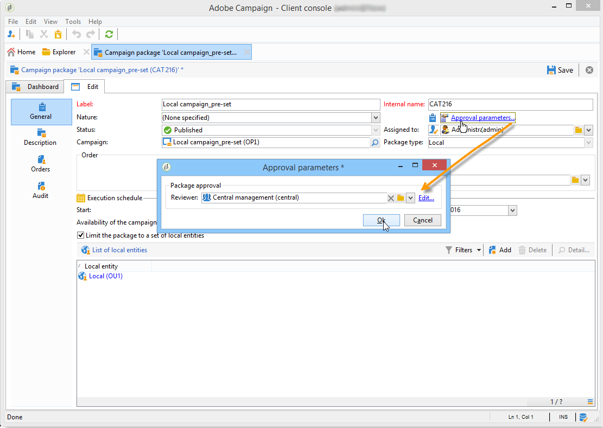

# 发布活动包{#publishing-the-campaign-package}

中央实体操作员在中发布他们希望提供给本地实体的营销活动 **[!UICONTROL list of campaign packages]**.

在营销活动包列表中发布营销活动包之前，必须由中央实体批准营销活动包。 要执行此操作，您可以通过 **[!UICONTROL Approval parameters]** 营销活动包中的链接。

## 分配审阅人 {#assigning-a-reviewer}

要选择审阅人，请单击 **[!UICONTROL Approval parameters]** 链接，然后从下拉列表中选择相关的审阅者。

然后，您可以通过单击 **[!UICONTROL Submit for approval]**.

然后，会向审核者发送一条通知消息，以确认此营销活动包的可用性。 该消息包含通过Web访问接受或拒绝批准的链接。

>[!NOTE]
>
>在组织实体级别，您还可以指定审阅人来批准订单。 有关更多信息，请参阅 [组织实体](about-distributed-marketing.md#organizational-entities).

## 添加其他审阅人 {#adding-other-reviewers}

您可以从以下位置添加其他审阅人 **[!UICONTROL Edit...]** 链接，可在campaign包的 **[!UICONTROL Approval parameters...]** 选项卡。

## 审批期 {#approval-periods}

默认情况下，审核者将在提交日期起三天后进行审批。

在“编辑审阅者”窗口中，您还可以设置提醒，以便在活动包未获批准时发送一条或多条消息。 要执行此操作，请单击 **[!UICONTROL Add reminder]** 链接，然后 **[!UICONTROL Add]** 按钮。

可以在给定日期发送提醒和/或 **x** 天后提交。 可以在提醒表的第一列中配置提醒类型。 在以下示例中，查看者将在2014年1月29日(即在 **[!UICONTROL Date]** 栏内提交第二次提醒，且为批准期结束前一天，即提交批准日期后两天。

定义包并提交包以供批准后，执行计划将显示在 **[!UICONTROL Audit]** 选项卡。 它显示根据以前的配置计算出的处理截止日期，以及所有已配置提醒的日期。

## 通过Adobe Campaign控制台进行审批 {#approving-via-the-adobe-campaign-console}

如果未指定审查者或通知的操作员均未批准包，则 **[!UICONTROL Approve the package]** 按钮允许您直接从营销活动包进行审批 **[!UICONTROL Dashboard]** 或包概述中的。

批准后，将发布营销活动并将其添加到列表，在达到其可用日期后，本地实体即可使用它。 如果在创建营销策划时指定了本地实体，则会向通知组中的操作员发送一条消息，让他们知道营销策划可用。 如果未预先指定实体，则默认情况下所有本地实体都可以使用营销活动。 有关更多信息，请参阅 [组织实体](about-distributed-marketing.md#organizational-entities).
