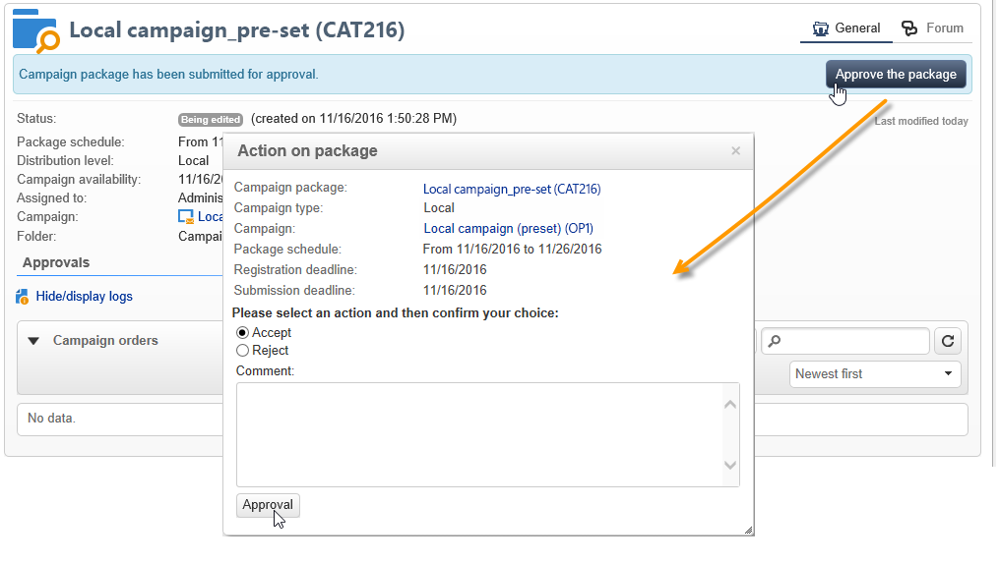

# 发布活动包{#publishing-the-campaign-package}

中央实体运算符将希望提供的营销活动发布到&#x200B;**[!UICONTROL list of campaign packages]**&#x200B;中的本地实体。

在营销活动包列表中发布营销活动包之前，必须获得中央实体的批准。 为此，您可以通过Campaign包中的&#x200B;**[!UICONTROL Approval parameters]**&#x200B;链接指定审阅人或审阅人组。

## 分配审阅人 {#assigning-a-reviewer}

要选择审阅人，请单击营销活动包中的&#x200B;**[!UICONTROL Approval parameters]**&#x200B;链接，然后从下拉列表中选择相关的审阅人。

然后，您可以通过单击&#x200B;**[!UICONTROL Submit for approval]**&#x200B;开始批准流程。

然后，将向查看者发送通知消息，以确认此Campaign包的可用性。 该消息包含通过Web访问接受或拒绝批准的链接。

>[!NOTE]
>
>在组织实体级别，您还可以指定审阅人来批准订单。 有关详细信息，请参阅[组织实体](about-distributed-marketing.md#organizational-entities)。

## 添加其他审阅人 {#adding-other-reviewers}

您可以通过&#x200B;**[!UICONTROL Edit...]**&#x200B;链接添加其他审阅人，该链接可在营销活动包的&#x200B;**[!UICONTROL Approval parameters...]**&#x200B;选项卡中找到。

## 审批时间线 {#approval-periods}

默认情况下，审核者将在提交日期起三天后进行审批。

在“编辑审阅者”窗口中，您还可以设置提醒，以便在活动包未获批准时发送一条或多条消息。 为此，请单击&#x200B;**[!UICONTROL Add reminder]**&#x200B;链接，然后单击&#x200B;**[!UICONTROL Add]**&#x200B;按钮。

可以在给定日期和/或在提交日期后&#x200B;**x**&#x200B;天发送提醒。 可以在提醒表的第一列中配置提醒类型。 在以下示例中，审阅人将在2023年1月11日（即&#x200B;**[!UICONTROL Date]**&#x200B;列中选择的日期前两天）收到提醒消息，并在审批期结束前一天（即，提交审批日期后两天）收到第二封提醒消息。

定义包并将其提交审批后，执行计划将显示在&#x200B;**[!UICONTROL Audit]**&#x200B;选项卡中。 它显示根据以前的配置计算出的处理截止日期，以及所有已配置提醒的日期。

## 通过客户端控制台批准 {#approving-via-the-adobe-campaign-console}

如果未指定审核者或通知的操作员均未批准程序包，则可以使用&#x200B;**[!UICONTROL Approve the package]**&#x200B;按钮直接从营销活动程序包&#x200B;**[!UICONTROL Dashboard]**&#x200B;或程序包概述进行批准。

批准后，该营销活动会发布并添加到列表，一旦达到其可用日期，本地实体即可使用它。 如果在创建营销策划时指定了本地实体，则会向通知组中的操作员发送消息，告知他们营销策划可用。 如果未预先指定实体，则默认情况下所有本地实体都可以使用营销活动。 有关详细信息，请参阅[组织实体](about-distributed-marketing.md#organizational-entities)。
