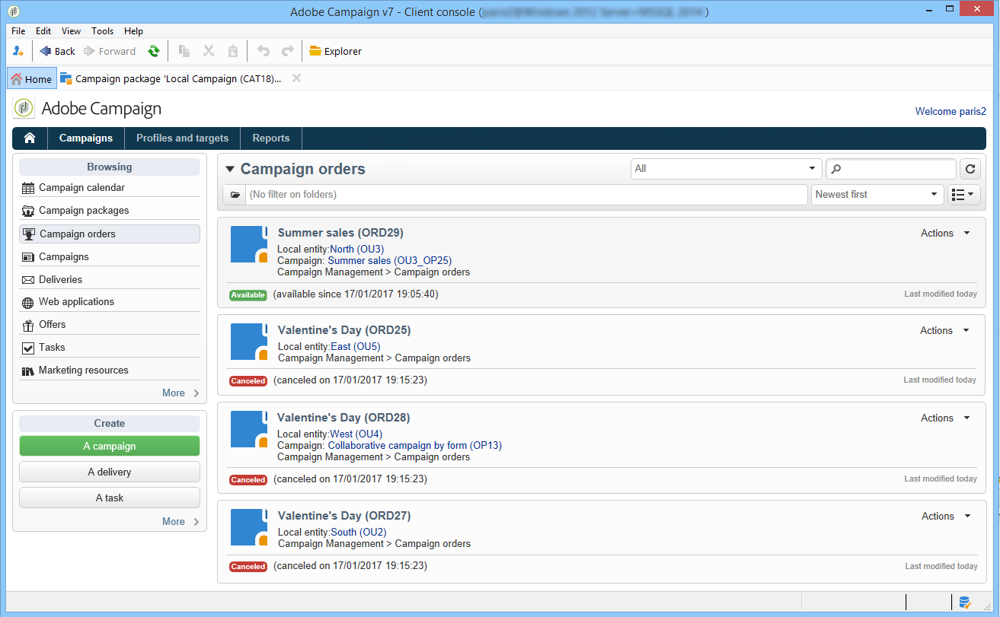
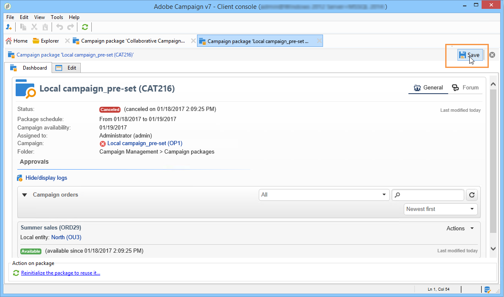

# 跟踪活动{#tracking-a-campaign}

中央实体运算符可以跟踪营销活动包列表中的营销活动订单。

这允许他们：

* [筛选包](#filter-packages)，
* [编辑包](#edit-packages)，
* [取消包](#cancel-a-package)，
* [重新初始化包](#reinitializing-a-package)。

## 筛选包 {#filter-packages}

在&#x200B;**[!UICONTROL Campaigns]**&#x200B;选项卡中，您可以显示重组所有现有分布式营销活动的&#x200B;**[!UICONTROL Campaign packages]**&#x200B;列表。 您可以筛选此列表，使其仅显示已发布、延迟、未决批准等的营销活动。 为此，请单击此视图上部的链接，或使用&#x200B;**[!UICONTROL Filter list]**&#x200B;链接并选择要显示的促销活动包状态。

## 编辑包 {#edit-packages}

**[!UICONTROL Campaign packages]**&#x200B;页允许您查看每个包的摘要。

此摘要显示以下信息：标签、促销活动类型、创建促销活动的名称以及文件夹。

单击包名称可对其进行编辑。 您还可以按其本地实体和状态查看订单。

**[!UICONTROL Campaign orders]**&#x200B;视图也提供了此信息，该视图列出了所有订单。

中央操作员可以编辑顺序。 可通过两种方式来做到这一点：

1. 操作员可以单击订单名称对其进行编辑：这将显示订单详细信息。

   

   **[!UICONTROL Edit > General]**&#x200B;选项卡允许您查看本地实体在订购营销活动时输入的信息。

   

1. 操作员可以单击营销活动包标签以编辑它并更改某些设置。

   

## 取消包 {#cancel-a-package}

中央实体可随时取消营销活动包。

在营销活动包&#x200B;**[!UICONTROL Dashboard]**&#x200B;中单击&#x200B;**[!UICONTROL Cancel]**。

**[!UICONTROL Comment]**&#x200B;字段允许您证明取消的合理性。

对于&#x200B;**本地营销活动**，取消包会将其从可用营销活动列表中删除。

对于&#x200B;**协作营销活动**，取消包会触发许多操作：

1. 与此包相关的任何订单都将被取消，

   

1. 引用营销活动已取消，所有活动进程（工作流、投放）已停止，

   

1. 向所有有关的本地实体发送通知。

   

如有必要，中央实体仍可以访问和重新初始化已取消的包（请参阅下文）。 它们仅在获得批准并启动后，才会再次提供给本地实体。 软件包重新初始化过程如下所示。

## 重新初始化包 {#reinitializing-a-package}

已发布的营销活动包可以重新初始化、修改并提供给本地实体。

1. 选择相关的包。
1. 单击&#x200B;**[!UICONTROL Reinitialize the package to reuse it]**&#x200B;链接，然后单击&#x200B;**[!UICONTROL OK]**。

   

1. 单击&#x200B;**[!UICONTROL Save]**&#x200B;按钮可批准重新初始化包。

   

1. 程序包状态更改为&#x200B;**[!UICONTROL Being edited]**。 再次修改、批准并发布它，以将其恢复到Campaign包的列表。

>[!NOTE]
>
>您还可以重新初始化已取消的营销活动包。
