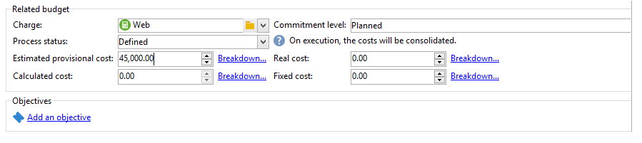

# 控制成本{#controlling-costs}

Adobe Campaign允许您控制已计划、已提交和已开票的营销成本，并使用“营销资源管理”模块按类别划分这些成本。

营销活动各个流程的承诺成本将计入营销部门预先定义的预算。 这些金额可以划分为若干类别，以便使信息更易读，并提供更详细的营销投资报告。

预算的管理和跟踪将集中在Adobe Campaign树的专用节点中。 这样，您就可以监控同一视图和所有预算中分配、保留、承诺和支出的金额。

使用MRM实施预算管理时必须应用以下步骤：

1. 定义预算。 [了解详情](#creating-a-budget)。

1. 定义成本计算方法：为服务提供商定义成本结构。 [了解详情](../campaigns/providers--stocks-and-budgets.md)。

1. 定义营销活动成本（投放/任务）：投放和任务产生的成本将单独或全局输入到营销活动模板。 [了解详情](../campaigns/marketing-campaign-deliveries.md#compute-costs-and-stocks)。

1. 整合：根据任务、投放和营销活动的进度状态，将成本计算并传递到相应的预算。 当营销活动的创建足够深入时，营销活动预算的进度状态可更改为 **[!UICONTROL Specified]**. 然后，将自动输入项目的计算成本以及营销活动中计算的成本。 [了解详情](#cost-commitment--calculation-and-charging)。

## 创建预算 {#creating-a-budget}

要创建预算，请执行以下步骤：

1. 浏览到 **[!UICONTROL Campaign management > Budgets]** Campaign资源管理器的文件夹。
1. 单击 **[!UICONTROL New]** 图标，命名并保存预算。
1. 输入初始金额：在相关字段中指示已分配的金额。 其他金额会自动输入。 [了解详情](#calculating-amounts)。
1. 通过输入开始和结束日期来定义有效期。 此信息仅表示。
1. 为促销活动、任务等创建将成本分配给此预算的费用类别。 链接。 [了解详情](#expense-categories)。

>[!NOTE]
>
>您可以选择相关预算。 如需详细信息，请参阅[此部分](#linking-a-budget-to-another)。

### 计算金额 {#calculating-amounts}

每个预算都由初始金额定义，该金额将从计划或执行各种营销活动、投放或与它们相关的任务的成本中减少。 金额的状态（计划、保留、承诺、已用或已开票）取决于在营销活动、投放或任务中定义的成本类型和承诺级别。

>[!NOTE]
>
>为类别输入的金额必须与 **[!UICONTROL Allocated]** 字段。

对于营销活动，根据承诺的级别，可以计划、承诺或预留成本，以供将来的行动使用。

>[!CAUTION]
>
>创建营销活动后， **[!UICONTROL Budget]** 必须设置为 **[!UICONTROL Defined]** 执行费用。 如果状态为 **[!UICONTROL Being edited]**，则不会合并成本。
>   
>选项 **[!UICONTROL Commitment level]** 表示在将成本计入预算之前对未来的成本预测。 根据营销活动、任务或投放的进度，您可以决定分配更高或更低的承诺级别(1)。 计划，2. 保留，3。 提交)。

例如，Web促销活动的预计计划成本为45,000欧元。

对于营销活动，当预算创建状态设置为 **[!UICONTROL Defined]**，营销活动的实际成本（或者，如果没有，计算成本）将被计入预算总额。

根据促销活动预算的承付金额，金额将在 **[!UICONTROL Planned]**, **[!UICONTROL Reserved]** 或 **[!UICONTROL Committed]** 字段。

承诺级别可以修改：

* 在 **营销活动** 级别，在 **[!UICONTROL Budget]** 窗口，在 **[!UICONTROL Edit]** 选项卡。 这是配置预算、成本和费用的地方。
* 在 **任务** 级别，在 **[!UICONTROL Expenses and revenues]** 窗口。

预算为 **[!UICONTROL Reserved]**，则会自动为已计费预算执行更新。

在任务级别上，过程是相同的。

当支出产生发票并支付发票时，其金额随后在 **[!UICONTROL Invoiced]** 字段。

### 费用类别 {#expense-categories}

这些金额可以分为多个费用类别，以便更好地阅读数据并更详细地报告营销投资。 在预算创建期间，通过 **[!UICONTROL Budgets]** 树的节点。

要添加类别，请单击 **[!UICONTROL Add]** 按钮。

您可以从现有类别中选择类别，或通过直接在字段中输入来定义新类别。 确认输入时，会显示一条确认消息，让您将此类别添加到现有类别的列表，并在必要时将其与“自然”相关联。 该资料将用于预算报告。

### 将预算链接到其他预算 {#linking-a-budget-to-another}

您可以将预算与主预算关联。 为此，请在 **[!UICONTROL related budget]** 字段。

为了显示相关预算的列表，主预算中将添加一个额外的选项卡。

这些资料将转交预算报告。

## 添加费用行 {#adding-expense-lines}

费用行会自动添加到预算中。 在投放分析期间和任务完成时创建它们。

对于每个促销活动、交货或任务，生成的成本将分组到预算的支出行中，这些成本将被计入其费用。 这些费用行根据相关服务提供商的成本行创建，并通过相关的成本结构计算。

因此，每个费用行都包含以下信息：

* 营销活动及其相关投放或任务
* 根据成本结构或估计临时成本计算的金额
* 交付或相关任务的实际成本
* 相应的发票行（仅限MRM）
* 按成本类别计算的成本列表（如果存在成本结构）

在上例中，编辑的费用行包含 **新信息卡** 投放 **忠诚春季包** 营销活动。 编辑投放时， **[!UICONTROL Direct Mail]** 选项卡，您可以查看费用行的计算方式。

此交付的成本计算基于为相关服务提供商选择的成本类别：

根据所选成本类别，应用相应的成本结构以计算成本行。 在本例中，对于相关服务提供商，成本结构如下：

>[!NOTE]
>
>成本类别及结构于 [本页](../campaigns/providers--stocks-and-budgets.md#create-a-service-provider-and-its-cost-categories)

## 成本承担、计算及收费 {#cost-commitment--calculation-and-charging}

可以为投放和任务提交成本。 根据与之相关的过程的进度，更新成本的状态。

### 成本计算过程 {#cost-calculation-process}

成本分为三类：

1. 估计临时费用

   预计临时费用是对活动过程费用的估计。 只要正在编辑，输入的金额就不会合并。 它肯定 **[!UICONTROL Specified]** 在计算中要考虑的金额输入的状态。

   此金额是手动输入的，可划分为多个费用类别。 要降低成本，请单击 **[!UICONTROL Breakdown...]** 链接，然后 **[!UICONTROL Add]** 按钮以定义新金额。

   

   您可以将每个成本与类别关联，以便以后可以在相关预算和预算报表中查看按费用类别划分的成本。

1. 计算成本

   计算成本取决于相关元素（营销活动、投放、任务等） 及其状态（正在编辑、进行中、已完成）。 无论如何，如果指定了实际成本，则计算成本将使用此金额。

   如果未提供实际成本，则适用以下规则：

   * 对于正在编辑的营销活动，计算成本是营销活动的预计临时成本，如果未定义此成本，则计算成本将是营销活动投放和任务的所有临时成本的总和。 如果促销活动完成，促销活动的计算成本将是所有计算成本的总和。
   * 对于尚未分析的交货，计算成本为估计临时成本。 如果已经执行分析，则计算成本将是从服务提供成本结构和目标接收者数量中计算的所有成本的总和。
   * 对于正在进行的任务，计算成本使用估计的临时成本。 如果任务完成，则计算成本将是从服务提供商成本结构计算的所有成本的总和以及完成的天数。
   * 对于营销计划，对于项目，计算成本是为促销活动计算的成本总和。 如果未指定这些费用，则计算的费用将使用估计的临时费用。

   >[!NOTE]
   >
   >的 **[!UICONTROL Breakdown]** 链接允许您查看计算和上次成本计算日期的详细信息。

1. 实际成本

   实际成本是人工输入的，如有必要，将划分为不同的费用类别。

### 计算和计费 {#calculation-and-charging}

成本通过成本结构计算，并计入相关营销活动、投放或任务中选定的预算。

可通过预算审批对提交到促销活动的金额执行检查。 可在营销活动中创建其他检查点样式的任务，以设置其他批准。 请参阅 [任务类型](creating-and-managing-tasks.md#types-of-task).

### 示例 {#example}

我们将创建一个营销活动，其中包括：

* 使用服务提供商的成本结构的直邮投放
* 具有固定成本的任务
* 每日成本的任务

#### 步骤1 — 创建预算 {#step-1---creating-the-budget}

1. 通过 **[!UICONTROL Campaign management > Budgets]** 节点。

1. 在 **[!UICONTROL Allocated]** 字段 **[!UICONTROL Amounts]** 中。 在窗口的下部添加两个费用类别：

#### 步骤2 — 配置服务提供商并定义成本结构 {#step-2---configuring-the-service-provider-and-defining-the-cost-structures}

1. 使用 **[!UICONTROL Administration > Campaigns]** 节点。 如需详细信息，请参阅[此部分](../campaigns/providers--stocks-and-budgets.md#create-a-service-provider-and-its-cost-categories)。

   对于直邮投放，请创建成本类别 **[!UICONTROL Envelopes]** （类型114x229和162x229）， **[!UICONTROL Postage]** 和 **[!UICONTROL Print]** （类型A3和A4）。 然后创建以下成本结构：

   

1. 添加固定成本（在成本类别中），其计算是固定的，其金额为空（在相应的成本结构中），并且将为每个交货单独指定。

   

   对于任务，请创建以下两个成本类别：

   * **[!UICONTROL Room reservation]** （小房间和大房间），带 **固定** 费用结构，数额为300和500欧元：

   

   * **[!UICONTROL Creation]** (**内容模板** 类型)，带 **每日** 300欧元的成本结构：

   

#### 步骤3 — 在营销活动中对预算进行计费 {#step-3---charging-the-budget-in-the-campaign}

1. 创建营销活动并选择在步骤1中创建的预算。

   >[!NOTE]
   >
   >默认情况下，为项目群选择的预算将应用于项目群中的所有营销活动。

   

1. 指定预计临时成本，并细分：

   

1. 单击 **[!UICONTROL Ok]** 然后 **[!UICONTROL Save]** 以确认此信息。 然后，营销活动的计算成本将更新为估计的临时成本。

#### 步骤4 — 创建直邮投放 {#step-4---creating-the-direct-mail-delivery}

1. 为营销活动创建工作流并定位查询活动以选择目标（警告，必须指定收件人邮政地址）。

1. 创建直邮投放，并选择在步骤2中创建的服务提供商：系统会自动显示成本类别。

1. 覆盖信封的成本并添加固定成本。 此外，还要选择与这些费用有关的类别。

   

   >[!NOTE]
   >
   >如果未使用其中一个成本类别，则不会产生任何费用。

1. 启动您刚刚创建的工作流以启动分析和计算成本。

   

1. 如果为此促销活动启用了预算审批，请从仪表板批准预算。 您可以检查成本类别的审批。

   

与交货有关的费用行将添加在 **[!UICONTROL Edit > Budget]** 选项卡。 编辑它以查看计算的详细信息。

为投放计算的成本将更新以下信息：

在编辑计算成本时，您可以检查成本划分以及成本计算的状态和日期。

#### 步骤5 — 创建任务 {#step-5---creating-tasks}

在此营销活动中，我们将添加成本结构为的两项任务 [已创建早期版本](#step-2---configuring-the-service-provider-and-defining-the-cost-structures).

为此，请在营销活动仪表板中，单击 **[!UICONTROL Add a task]** 按钮。 命名任务并单击 **[!UICONTROL Save]**.

1. 然后，该任务将添加到任务列表。 您必须对其进行编辑才能对其进行配置。

1. 在 **[!UICONTROL Properties]** 选项卡，选择服务和相应的成本类别：

   

1. 接下来，单击 **[!UICONTROL Expenses and revenue]** 图标，并指定预计临时成本。

   

   保存任务后，将指定计算成本，并输入估计临时成本的值。

   任务完成时（状态） **[!UICONTROL Finished]** )，则计算成本会自动更新为在其成本结构中输入的大房间成本。 此成本也会显示在划分的此类别中。

1. 接下来，根据同一过程创建第二个任务；计划超过五天，并且与之前创建的成本结构相关。

   

   任务完成后，使用相关成本结构的值指定计算成本，即示例中的1500欧元（5天x 300欧元）：

   

#### 步骤6 — 更新促销活动预算状态 {#step-6---update-the-campaign-budget-status}

配置营销活动后，可将其设置为 **[!UICONTROL Specified]**. 然后，营销活动的计算成本将指示投放的计算成本和营销活动任务的总和：

#### 预算审批 {#budget-approval}

激活批准后，可通过特殊链接从促销活动仪表板批准预算。 启动定向工作流并需要批准直邮投放时，会显示此链接。

然后，您可以单击链接以授予或拒绝批准，或者在为此营销活动激活通知时使用通知电子邮件中的链接。

预算获得批准并交付完成后，成本将通过特殊的技术工作流自动上传。

## 订单和发票 {#orders-and-invoices}

在MRM的上下文中，您可以与服务提供商保存订单并开具发票。 这些订单和发票的整个生命周期都可以通过Adobe Campaign界面进行管理。

### 订单创建 {#order-creation}

要与服务提供商保存新订单，请单击 **[!UICONTROL MRM > Orders]** 树的节点，然后单击 **[!UICONTROL New]** 按钮。

指定订单编号、相关服务提供商以及订单总金额。

### 签发和跟踪发票 {#issuing-and-tracking-invoices}

对于每个服务提供商，您可以保存发票并定义其状态和预算费用。

发票会在 **[!UICONTROL MRM > Invoices]** Adobe Campaign树的节点。

发票由发票行组成，发票行的总额允许自动计算金额。 这些行是通过 **[!UICONTROL Invoice lines]** 选项卡。 它们可以与订单关联，以便将信息上传到订单。

每个服务提供商的发票显示在 **[!UICONTROL Invoices]** 选项卡：

的 **[!UICONTROL Details]** 选项卡可显示发票的内容。

单击 **[!UICONTROL Add]** 创建新发票。
