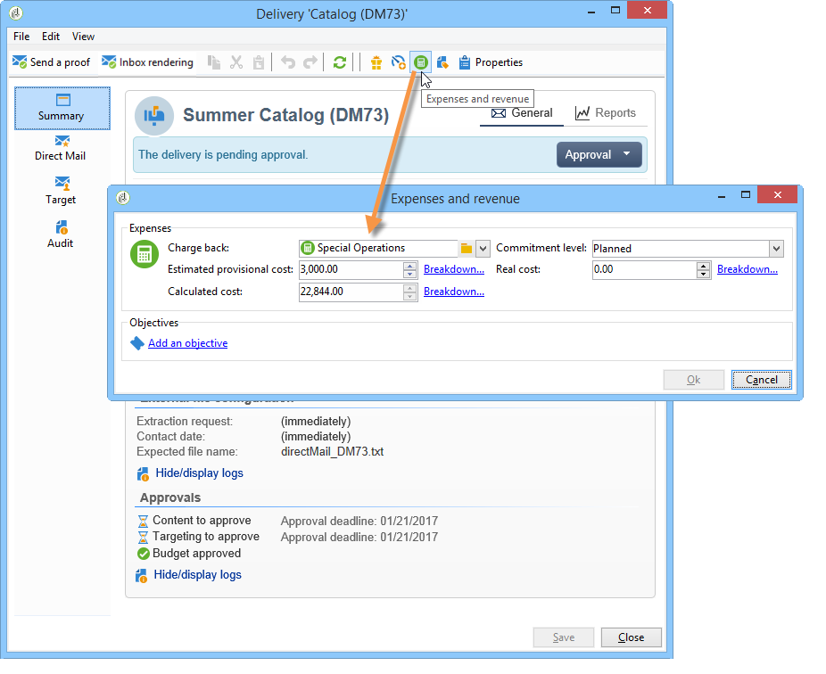

# 控制成本{#controlling-costs}

通过Adobe Campaign，您可以控制计划营销成本、承诺营销成本和已开票营销成本，并使用营销资源管理模块按类别细分这些成本。

为营销活动的各个流程承诺的成本将记入营销部门预先定义的预算。 这些金额可以划分为多个类别，以使信息更易读取，并提供营销投资的更详细报告。

预算的管理和跟踪集中存储在Adobe Campaign树的专用节点中。 通过此视图，您可以监控从同一视图为所有预算分配、保留、承诺和支出的金额。

必须应用以下步骤才能使用MRM实施预算管理：

1. 定义预算。 [了解详情](#creating-a-budget)。

1. 定义成本计算方法：为服务提供商定义成本结构。 [了解详情](../campaigns/providers-stocks-and-budgets.md)。

1. 定义营销活动成本（投放/任务） ：投放和任务产生的成本为营销活动模板单独或全局输入。 [了解详情](../campaigns/marketing-campaign-deliveries.md#compute-costs-and-stocks)。

1. 合并：根据任务、投放和营销活动的进度状态，计算成本并将其传递到相应的预算。 当营销活动创建足够高级时，营销活动预算的进度状态可以更改为 **[!UICONTROL Specified]**. 然后，将自动输入项目的计算成本以及营销策划上计算的成本。 [了解详情](#cost-commitment--calculation-and-charging)。

## 创建预算 {#creating-a-budget}

要创建预算，请执行以下步骤：

1. 浏览至 **[!UICONTROL Campaign management > Budgets]** Campaign资源管理器的文件夹。
1. 单击 **[!UICONTROL New]** 图标，命名并保存预算。
1. 输入初始金额：在相关字段中指明分配金额。 其它金额会自动输入。 [了解详情](#calculating-amounts)。
1. 通过输入起始日期和终止日期来定义有效期。 此信息仅供参考。
1. 创建费用类别，将营销活动、任务等的成本分配到此预算。 可以链接。 [了解详情](#expense-categories)。

>[!NOTE]
>
>您可以选择相关预算。 如需详细信息，请参阅[此小节](#linking-a-budget-to-another)。
>

### 计算金额 {#calculating-amounts}

每个预算由初始金额定义，在计划或执行活动或交付或任务后，初始金额将从与其相关的各种活动、交付或任务的成本中减少。 金额（计划、预留、承付款、支出或开票）的状态取决于成本类型以及活动、交货或任务中定义的承付款水平。

>[!NOTE]
>
>为类别输入的金额必须与中定义的预算信封匹配 **[!UICONTROL Allocated]** 字段。

对于营销活动，可以根据承诺级别，计划、承诺或预留成本供未来操作使用。

>[!CAUTION]
>
>创建营销活动时，进度状态位于 **[!UICONTROL Budget]** 必须设置为 **[!UICONTROL Defined]** 执行时要考虑的成本。 如果状态为 **[!UICONTROL Being edited]**，则不会合并成本。
>   
>选项 **[!UICONTROL Commitment level]** 表示在将成本计入预算之前对未来成本的预测。 根据活动、任务或投放的进度，您可以决定分配更高或更低的承诺级别(1)。 计划中，按2。 保留，3。 已提交)。

例如，一个Web营销活动的预计计划成本为45,000欧元。

对于市场活动，当预算创建状态设置为 **[!UICONTROL Defined]**，促销活动的实际成本（如果没有计算成本，则计算成本）将转入预算总额中。

根据营销活动预算的承诺水平，此金额将输入 **[!UICONTROL Planned]**， **[!UICONTROL Reserved]** 或 **[!UICONTROL Committed]** 字段。

可以修改承诺级别：

* 在 **营销活动** 级别，在 **[!UICONTROL Budget]** 窗口，可在 **[!UICONTROL Edit]** 选项卡。 这是配置预算、成本和支出的位置。
* 在 **任务** 级别，在 **[!UICONTROL Expenses and revenues]** 窗口。

当预算为 **[!UICONTROL Reserved]**，则自动为计费的预算执行更新。

在任务层上的过程是相同的。

当支出产生发票且发票已支付时，其金额将输入到 **[!UICONTROL Invoiced]** 字段。

### 费用类别 {#expense-categories}

这些金额可以分为若干费用类别，以提高数据的可读性，并更详细地报告营销投资。 支出类别是在预算创建期间通过 **[!UICONTROL Budgets]** 树节点。

要添加类别，请单击 **[!UICONTROL Add]** 按钮来打开窗口。

您可以从现有类别中选择类别，或通过在字段中直接输入它来定义新类别。 当您确认输入时，可通过确认消息将此类别添加到现有类别列表，并在必要时将其与自然关联。 此信息将用于预算报告。

### 将预算链接到另一个预算 {#linking-a-budget-to-another}

您可以将预算链接到主预算。 要实现此目的，请在主预算的 **[!UICONTROL related budget]** 辅助预算的字段。

将向主预算添加一个附加选项卡，以显示相关预算的列表。

此信息会转移到预算报表中。

## 添加费用行 {#adding-expense-lines}

费用行会自动添加到预算中。 它们是在投放分析期间以及任务完成时创建的。

对于每个活动、投放或任务，生成的成本将分组到计入预算的支出行中。 这些费用行根据相关服务提供商的成本行创建，并通过关联的成本结构计算。

因此，每个费用行都包含以下信息：

* 活动以及与之相关的投放或任务
* 根据成本结构或估计临时成本计算的金额
* 相关投放或任务的实际成本
* 相应的发票行（仅限MRM）
* 按成本类别计算的成本列表（如果存在成本结构）

在上面的示例中，编辑的费用行包含为计算的成本 **新卡片** 的投放 **忠诚度春季套餐** 营销活动。 编辑投放时， **[!UICONTROL Direct Mail]** 选项卡让您查看费用行的计算方式。

此投放的成本计算基于为相关服务提供商选择的成本类别：

根据所选成本类别，应用相应的成本结构以计算成本行。 在本例中，对于相关的服务提供商，成本结构如下：

>[!NOTE]
>
>成本类别及结构呈列于 [此页面](../campaigns/providers-stocks-and-budgets.md#create-a-service-provider-and-its-cost-categories)

## 成本承诺、计算及计费 {#cost-commitment--calculation-and-charging}

可以为投放和任务提交成本。 根据与其相关的过程的进度，更新成本的状态。

### 成本计算流程 {#cost-calculation-process}

成本分为三类：

1. 估计临时费用

   估计临时费用是活动进程的估计费用。 只要正在编辑，输入的数额就不会合并。 它必须有 **[!UICONTROL Specified]** 计算时要考虑的金额输入的状态。

   此金额是手动输入的，可划分为多个费用类别。 要降低成本，请单击 **[!UICONTROL Breakdown...]** 链接，然后 **[!UICONTROL Add]** 按钮以定义新金额。

   

   您可以将每个成本与类别关联，以便以后可以在相关预算和预算报表中查看按费用类别列出的成本细分。

1. 计算成本

   计算出的成本取决于相关的元素（活动、投放、任务等） 及其状态（正在编辑、正在进行、已完成）。 在任何情况下，如果指定了实际成本，则计算成本将使用此金额。

   如果未提供实际成本，则应用以下规则：

   * 对于正在编辑的营销活动，计算成本是营销活动的预计临时成本，如果未定义此成本，则计算成本将是营销活动的所有临时成本和任务的总和。 如果营销活动结束，则营销活动的计算成本将是所有计算成本的总和。
   * 就尚未分析之交付而言，计算成本为估计临时成本。 如果已执行分析，则计算成本将是根据服务提供成本结构和定向收件人数量计算的所有成本的总和。
   * 对于正在进行的任务，计算成本使用估计的临时成本。 如果任务已完成，则计算成本将是根据服务提供商成本结构计算的所有成本与已完成天数的总和。
   * 对于营销计划（与项目群一样），计算成本是为营销活动计算的成本总和。 如并无指明该等成本，则计算成本将采用估计临时成本。

   >[!NOTE]
   >
   >此 **[!UICONTROL Breakdown]** 链接允许您查看计算的详细信息和上次成本计算日期。

1. 实际成本

   实际成本是手动输入的，如有必要，可将其划分为不同的费用类别。

### 计算和计费 {#calculation-and-charging}

成本通过成本结构进行计算，并计入相关营销活动、投放或任务中选择的预算。

可以通过预算审批对承诺给营销活动的金额执行检查。 可以在营销活动中创建其他检查点样式任务，以设置其他批准。 请参阅 [任务类型](creating-and-managing-tasks.md#types-of-task).

### 示例 {#example}

我们将创建一项营销活动，其中包含：

* 使用服务提供商的成本结构的直邮投放
* 具有固定成本的任务
* 具有每日成本的任务

#### 第1步 — 创建预算 {#step-1---creating-the-budget}

1. 通过以下方式创建新的预算 **[!UICONTROL Campaign management > Budgets]** 节点。

1. 在“ ”中定义1万欧元的预算 **[!UICONTROL Allocated]** 字段 **[!UICONTROL Amounts]** 部分。 在窗口的下半部分添加两个费用类别：

#### 第2步 — 配置服务提供商并定义成本结构 {#step-2---configuring-the-service-provider-and-defining-the-cost-structures}

1. 从创建服务提供商和服务模板及其成本结构 **[!UICONTROL Administration > Campaigns]** 节点。 如需详细信息，请参阅[此小节](../campaigns/providers-stocks-and-budgets.md#create-a-service-provider-and-its-cost-categories)。

   对于直邮投放，创建成本类别 **[!UICONTROL Envelopes]** （类型114x229和162x229）， **[!UICONTROL Postage]** 和 **[!UICONTROL Print]** （类型A3和A4）。 然后，创建以下成本结构：

   

1. 添加固定成本（在成本类别中），其计算是固定的，且金额为空（在相应的成本结构中），并且将为每次投放单独指定。

   

   对于任务，创建以下两个成本类别：

   * **[!UICONTROL Room reservation]** （小房间和大房间），带 **固定** 费用结构300欧元和500欧元：

   

   * **[!UICONTROL Creation]** (**内容模板** type)，带 **每日** 费用结构300欧元：

   

#### 步骤3 — 计入营销活动中的预算 {#step-3---charging-the-budget-in-the-campaign}

1. 创建活动并选择在步骤1中创建的预算。

   >[!NOTE]
   >
   >默认情况下，为项目群选择的预算将应用于项目群中的所有营销策划。

   

1. 指定预计临时成本，并细分：

   

1. 单击 **[!UICONTROL Ok]** 然后 **[!UICONTROL Save]** 以确认此信息。 然后，使用估计的临时成本更新活动的计算成本。

#### 步骤4 — 创建直邮投放 {#step-4---creating-the-direct-mail-delivery}

1. 为市场活动创建工作流，并定位查询活动以选择目标（警告，必须指定收件人邮政地址）。

1. 创建直邮投放并选择在步骤2中创建的服务提供商：自动显示成本类别。

1. 覆盖信封的成本并添加固定成本。 同时选择与这些成本相关的类别。

   

   >[!NOTE]
   >
   >如果未使用其中一个成本类别，则不会生成任何费用。

1. 启动您刚刚创建的工作流，以启动分析并计算成本。

   

1. 如果已为此活动启用预算审批，则从仪表板审批预算。 您可以检查成本类别的审批。

   

有关投放的支出行已添加到 **[!UICONTROL Edit > Budget]** 的选项卡。 编辑它以查看计算的详细信息。

为投放计算的成本将更新为以下信息：

在编辑已计算的成本时，您可以检查成本细分以及成本计算的状态和日期。

#### 步骤5 — 创建任务 {#step-5---creating-tasks}

对于此营销活动，我们将添加成本结构针对的两个任务 [先前创建](#step-2---configuring-the-service-provider-and-defining-the-cost-structures).

要实现此目的，请在营销活动仪表板中，单击 **[!UICONTROL Add a task]** 按钮。 命名任务并单击 **[!UICONTROL Save]**.

1. 然后将任务添加到任务列表中。 必须编辑它才能进行配置。

1. 在 **[!UICONTROL Properties]** 选项卡，选择服务和相应的成本类别：

   

1. 接下来，单击 **[!UICONTROL Expenses and revenue]** 图标，并指定预计临时成本。

   

   当保存任务后，计算成本将随为估计临时成本输入的值一起指定。

   任务完成时(状态 **[!UICONTROL Finished]** )，计算出的成本将自动更新为在其成本结构中输入的大房间成本。 在细分中，此成本也会显示在此类别中。

1. 接下来，根据相同的过程创建第二个任务；计划时间超过五天，并与之前创建的成本结构相关。

   

   当任务完成后，计算成本将使用相关成本结构的值指定，即在本例中为1500欧元（5天x 300欧元）：

   

#### 步骤6 — 更新营销活动预算状态 {#step-6---update-the-campaign-budget-status}

配置活动后，可以通过将其设置为来更新其状态 **[!UICONTROL Specified]**. 然后，活动的计算成本将指示投放的计算成本与活动的任务的总和：

#### 预算审批 {#budget-approval}

激活审批后，可通过特殊链接从营销活动仪表板审批预算。 在启动定向工作流且需要批准直邮投放时，会显示此链接。

然后，您可以单击链接以授予或拒绝审批，或者如果已经为此营销活动激活了通知，则使用通知电子邮件中的链接。

当预算获得批准且交付完成时，成本将通过特殊的技术工作流自动上传。

## 订单和发票 {#orders-and-invoices}

在MRM环境中，您可以向服务提供商保存订单并开具发票。 可以通过Adobe Campaign界面管理这些订单和发票的整个生命周期。

### 订单创建 {#order-creation}

要保存服务提供商的新订单，请单击 **[!UICONTROL MRM > Orders]** 节点，然后单击 **[!UICONTROL New]** 按钮。

指定订单编号、相关的服务提供商以及订单的总金额。

### 发放和跟踪发票 {#issuing-and-tracking-invoices}

对于每个服务提供商，您可以保存发票，并定义其状态和计费的预算。

发票创建并存储在 **[!UICONTROL MRM > Invoices]** Adobe Campaign树的节点。

发票由发票行组成，发票行的合计允许自动计算金额。 这些行是手动创建的 **[!UICONTROL Invoice lines]** 选项卡。 它们可以与订单相关联，以将信息上传到订单。

每个服务提供商的发票均显示在 **[!UICONTROL Invoices]** 配置文件的选项卡：

此 **[!UICONTROL Details]** 选项卡用于显示发票的内容。

单击 **[!UICONTROL Add]** 以创建新发票。
