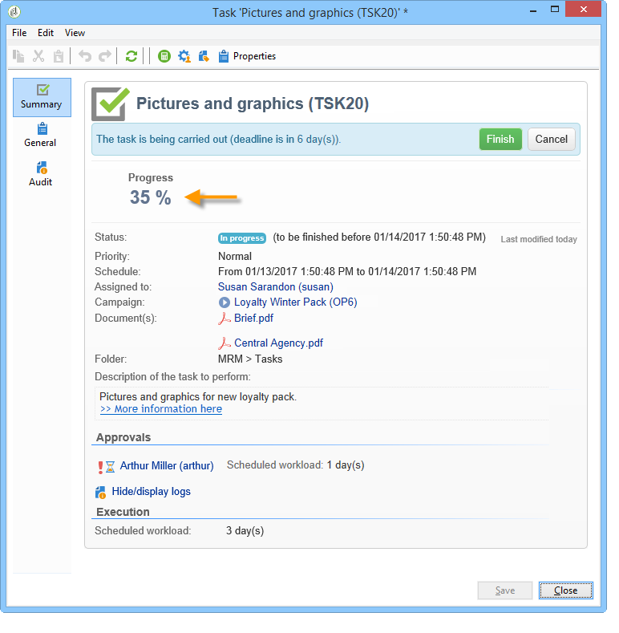
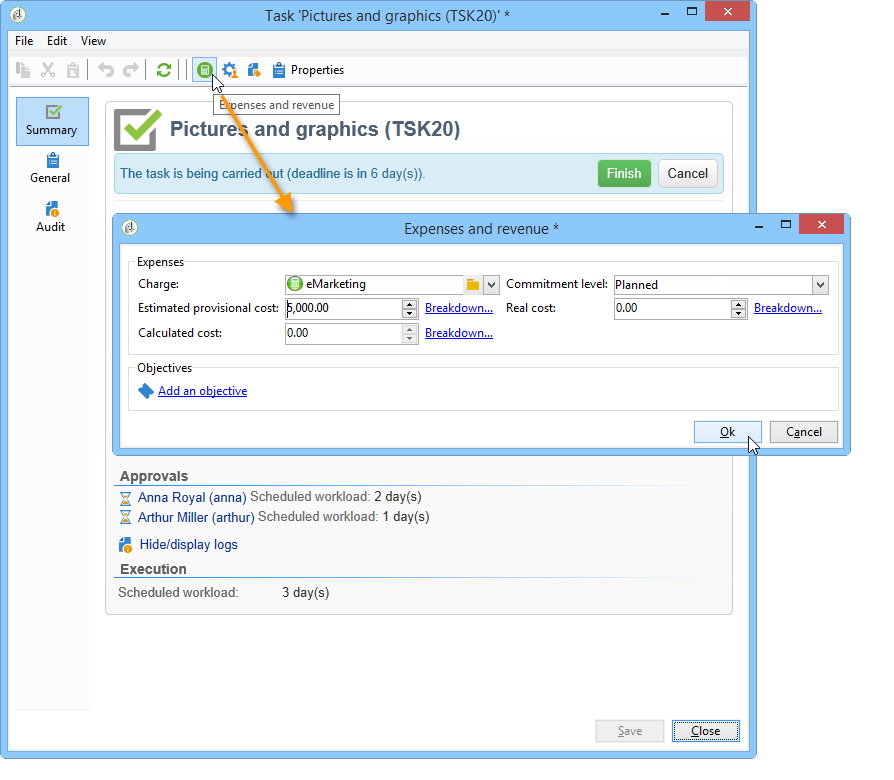
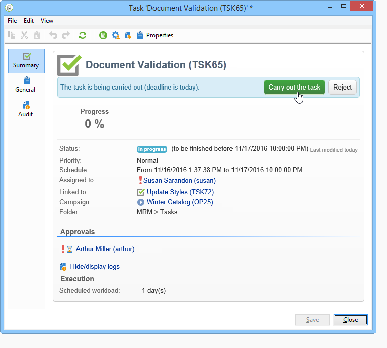

# 创建和管理任务{#creating-and-managing-tasks}

Adobe Campaign允许您直接在应用程序中创建任务并管理其完整的生命周期。 项目和营销策划实施可以划分为分配给Adobe Campaign操作员或外部服务提供商的任务。 这种操作模式允许您创建包括所有项目参与者和外部参与者的开放协作环境。

可以从任务列表或活动仪表板创建、查看和监控任务。 还可以在营销计划、项目和营销策划的时间表中查看和跟踪这些指标。

任务会附加到活动，并且可能具有依赖关系，即关联的任务。 每个任务都有一个状态、优先级、预计负载和相关成本。

所有任务都分组到一个列表中，该列表可通过访问 **营销活动** 选项卡。 有关详细信息，请参见 [访问任务](#accessing-tasks).

它们可以显示在它们所属的项目计划中。

## 访问任务 {#accessing-tasks}

### 显示任务 {#displaying-tasks}

任务显示在任务列表中，可通过访问 **[!UICONTROL Campaigns]** 选项卡。

您可以查看当前操作员的所有任务。

有关详细信息，请参见 [任务的执行状态](#execution-status-of-a-task) 和 [任务的进度状态](#progress-status-of-a-task).

### 筛选任务 {#filtering-tasks}

显示此视图时，将自动进行筛选，以便仅显示 **当前操作员任务**. 您还可以使用窗口上半部分中的字段过滤任务。

### 编辑任务 {#editing-tasks}

单击任务以进行编辑。

## 创建新任务 {#creating-a-new-task}

要创建任务，请执行以下步骤：

1. 浏览至 **[!UICONTROL Tasks]** 中的链接 **[!UICONTROL Campaigns]** 选项卡，然后单击 **[!UICONTROL Create]**.

   

1. 输入任务的名称并选择它链接到的营销策划。
1. 设置开始日期和结束日期。
1. 单击 **[!UICONTROL Save]** 以创建任务。

   

您也可以通过营销策划的仪表板创建任务：在这种情况下，任务会自动链接到从中创建它的营销策划。

创建任务后，该任务会添加到营销活动计划、营销活动功能板和任务列表。 要编辑任务，请在任务列表中单击任务名称，或从计划或活动功能板中选择该任务，然后单击 **[!UICONTROL Open]**.

创建任务后，您可以通过定义：

* 经理和参与者。 [了解详情](#manager-and-participants)
* 创建计划。 [了解详情](#execution-schedule)
* 承诺成本。 [了解详情](#expenses-and-revenues)

您还可以添加 [审阅者](#reviewers) 和 [参考文档](#documents-referenced).

任务生命周期在 [本节](#life-cycle).

### 经理和参与者 {#manager-and-participants}

默认情况下，任务将分配给创建该任务的操作员。 当该任务需要操作时，将通知此运算符。

您可以从中选择其他运算符 **[!UICONTROL Assigned to]** 下拉列表。

>[!NOTE]
>
>操作员管理详情，请参见 [本节](../../v8/start/gs-permissions.md).
>
>仅允许负责任务的操作员关闭任务。

您可以指定更多参与执行任务的操作员。 不允许这些操作员关闭任务：他们只能批准分配给他们的任务。

要添加任务运算符，请执行以下步骤：

1. 单击 **[!UICONTROL Resources]** 图标。

   

1. 单击 **[!UICONTROL Add]** 并选择相关操作员。
1. 输入使用率：表示任务执行期间分配给操作员的工作量。 此比率仅用于指示，并以百分比表示。

   

   例如，对于执行计划设置为10天的任务，使用率为50%的操作员将在此任务上调动10天一半的工作时间。

   对于每个操作员，您可以输入计划工作量和实际工作量。 这些持续时间也仅供参考。

1. 您可以从以下位置配置提醒： **[!UICONTROL Add a reminder...]** 链接。 在任务结束日期之前，将向任务涉及的所有操作员发送电子邮件通知。

   

1. 您还可以在任务开始之前发送通知。 要设置此项，请在 **[!UICONTROL Initial notification]** 字段。
1. 在到达结束日期且任务未关闭时，可以向以下所选定的被分派人或被分派人组发送通知： **[!UICONTROL Assignee]** 下拉列表。

操作员仪表板允许您检查其工作量（其他正在进行的任务）。

### 任务审批 {#reviewers}

除了参与者外，您还可以定义操作员，在任务关闭后，他们将会审核任务。

要执行此操作，请单击 **[!UICONTROL Enable task approval]** 选项中位于页面的 **[!UICONTROL Resources]** 窗口。 这可以是单个操作员、一组操作员或操作员列表。

要指定运算符列表，请单击 **[!UICONTROL Edit...]** 链接到第一个审阅人的右侧，并根据需要添加任意数量的运算符，如下所示：

您可以在配置窗口的下半部分定义任务的审批计划。 默认情况下，审阅人自提交日期起有三天时间批准任务。 您还可以添加提醒，提醒将在审批截止日期前自动发送给相关操作员。

任务负责人可以自行分配批准任务，即使已分配其他操作员执行此操作。 如果未定义审阅者，则通知将发送给负责该任务的人员。 所有其他Adobe Campaign操作员，具有 **[!UICONTROL Administrator]** 权限也可以批准任务。 但是，他们不会收到通知。

### 引用的文档 {#documents-referenced}

您可以添加 [文档和营销资源](managing-marketing-resources.md) 完成一项任务。

要执行此操作，请执行以下操作：

1. 打开任务，然后单击 **[!UICONTROL Documents]** 图标。

   

1. 单击 **[!UICONTROL Add]** 并选择要添加到任务的文档。 对营销资源应用相同的流程。

引用的文档会添加到发送给任务中涉及的操作员的通知中。 它们也会添加到任务仪表板上。

### 执行计划 {#execution-schedule}

任务的有效期显示在 **[!UICONTROL Start]** 和 **[!UICONTROL End]** 字段。 计划负荷表示在期间要执行的工作量。 它以天或小时表示。

>[!NOTE]
>
>任务生命周期在 [生命周期](#life-cycle).

此 **[!UICONTROL Workload performed]** 字段也以天和小时表示，可让您手动更新与计划工作负载相关的任务进度。

此 **[!UICONTROL Progress status]** 以百分比表示的任务，将根据相关操作员执行的任务自动更新。 它可以手动输入。

可在任务仪表板中查看此信息。

它也会显示在营销策划选项卡中。

如果已达到任务执行计划的结束日期，但任务未完成，则任务将 **[!UICONTROL Late]**. 还会显示警告消息以提醒操作员。

有关详细信息，请参见 [任务的进度状态](#progress-status-of-a-task).

### 支出和收入 {#expenses-and-revenues}

您可以为每个任务定义相关费用和预测收入。 这将为附加任务的营销活动计算并合并。

要指定此信息，请单击 **[!UICONTROL Expenses and revenue]** 图标。

默认情况下，计入的预算是附加任务的营销活动的预算。 它显示在任务详细信息中。

>[!NOTE]
>
>有关费用和预算的详细信息，请参阅 [本节](../campaigns/providers--stocks-and-budgets.md#cost-commitment--calculation-and-charging).

在此窗口中，您还可以定义要达到的目标。 目标以任务的预测收入表示。

### 服务提供商 {#service-providers}

外部服务提供商可以参与任务管理。

为此，请编辑任务属性并选择相关的服务提供商。 与服务提供商关联的成本类别会自动列在窗口的中央部分。

选择与任务执行相关的成本类别。 要执行此操作，请选择成本类型，并在必要时添加附加费金额。

>[!NOTE]
>
>有关管理预算和成本的方法，请参见 [控制成本](controlling-costs.md).

选择某个服务提供程序后，该服务提供程序将显示在任务仪表板中：

### 延迟任务 {#late-tasks}

如果任务已达到其结束日期且状态未更改为，则该任务会延迟 **[!UICONTROL Finished]**. 默认情况下，当任务延迟时，不会警告任何运算符。 您可以配置通知电子邮件的投放：即使操作员未参与任务，也可以通知所有操作员。

转到 **[!UICONTROL Resources]** 框并将运算符添加到 **[!UICONTROL Assignation]** 字段。 要通知多个人，请选择一组操作员。

### 初始通知 {#initial-notifications}

当您创建或修改具有未来开始日期的任务时，Adobe Campaign会向负责该任务的人发送电子邮件，让他们知道任务何时开始。

但是，如果您正在创建的任务还有很长的路要走，则最好在任务开始之前安排发送通知。 例如，如果任务在一个月后开始，您可以提前一周通知负责该任务的负责人。

要计划通知，请转到 **[!UICONTROL Resources]** 框并使用 **[!UICONTROL Initial notification]** 字段。

* 对于营销活动中的任务，请选择特定的日期和时间。
* 对于活动模板内的任务，通知时间表示为任务开始前的剩余时间(例如，如果在 **[!UICONTROL Initial notification]** 字段，则会在任务开始日期之前2天发送电子邮件)。

如果您已计划通知，则在保存任务时，Adobe Campaign仍会提供立即发送通知的功能。 您可以决定发送它，这不会替换计划的通知。

### 链接到项目的任务 {#task-linked-to-a-program}

您可以直接在项目群中创建任务，以管理与其整个组织相关的操作，而不是特定营销策划相关的操作（例如，讨论项目群中即将开展的营销策划主题的会议）。 该任务将出现在项目计划中。

要创建直接链接到项目的任务，请执行以下操作：

1. 打开项目计划：在主页上，转到 **[!UICONTROL Campaigns > Browse > Other choices > Programs]**. 整个项目计划将在窗口的右侧部分打开。
1. 在计划中，单击所需的程序：一个窗口中提供了相应的程序。
1. 在此窗口中，单击 **[!UICONTROL Open]**. 将打开项目计划。
1. 单击 **[!UICONTROL Add]** 上方的按钮，然后单击 **[!UICONTROL Add a task]**.

### 操作员可用性 {#operator-availability}

在任务仪表板中，操作员姓名旁边的图标表示操作员在任务所涵盖的期间已在处理另一个任务或事件。 操作员负责或参与的任务显示在 **[!UICONTROL Assigned to]** 字段或任务中 **[!UICONTROL Resources]** 盒子。

### 工作流中的任务 {#task-in-a-workflow}

使用 **[!UICONTROL Task]** 市场活动工作流中的要素允许您根据任务是否获得批准来定义两种方案。

在活动工作流中， **[!UICONTROL Task]** 可在以下位置找到活动： **[!UICONTROL Flow control]** 选项卡。

## 任务类型 {#types-of-task}

通过营销策划创建任务时，您可以创建特定任务。 任务的类型在所选模板中定义。

可以计划以下任务：

* [控制任务](#control-tasks)，
* [分组任务](#grouping-task)，
* [分组任务](#grouping-task)，
* [通知任务](#notification-task).

>[!NOTE]
>
>**[!UICONTROL Control task]** 和 **[!UICONTROL Grouping]** 可以创建任务 **仅限** 通过营销活动仪表板。\
>它们显示在它们被分配到的操作员的任务图中。 请参阅 [访问任务](#accessing-tasks).

### 控制任务 {#control-tasks}

A **[!UICONTROL Control task]** 链接到投放审批：审批定位、内容、提取文件、预算或验证。

创建任务后，该任务即会添加到营销活动仪表板。

然后，您可以对其进行编辑并指定其参数。

### 营销资源创建任务 {#marketing-resource-creation-task}

营销资源创建任务可用于管理营销资源的创建和发布。 如果您是通过任务而不是通过资源本身来管理资源，则可以：

* 通过营销策划控制资源创建过程。
* 在计划中查看资源创建流程。
* 管理资源创建过程（提醒、通知）。
* 计算并控制与资源创建关联的成本。
* 通过任务批准和发布资源（如果已启用相关选项）。

#### 任务与其链接资源之间的交互 {#interaction-between-the-task-and-its-linked-resource}

营销资源创建任务与链接到该任务的资源进行交互。 这意味着：

* 资源创建计划和与其关联的成本通过任务进行管理。
* 操作员可以像处理普通资源一样处理资源（下载或上传、锁定和解锁）：这不会影响任务。
* 可以通过任务执行资源批准和发布：如果 **[!UICONTROL Publish the marketing resource]** 选项，资源将在任务完成后自动批准和发布。 如果未启用该选项，则任务和资源不会进行交互：对一个任务执行操作不会影响另一个任务。

  您可以使用一系列链接的任务来定义完整的审批周期。 查看 **[!UICONTROL Publish the marketing resource]** 仅用于最后一个任务的选项：所有任务都需要完成才能发布资源。 此外，在创建子营销资源任务时，将在子任务中自动选择资源。

   * **通过资源**：如果您提交资源以供审批或批准，则这些操作不会影响任务。
   * **通过任务**：如果 **[!UICONTROL Publish the marketing resource]** 选项时，资源会在任务完成后自动批准和发布（请参阅上文）。 如果未选中该选项，则任务和资源不会进行交互：对一个任务执行操作不会影响另一个任务。

#### 配置营销资源创建任务 {#configuring-a-marketing-resource-creation-task}

审阅任务的人员不必是审阅资源中定义内容的同一人员。 但是，如果 **[!UICONTROL Publish the marketing resource]** 选项（见下文），任务审阅人有权批准资源内容，因为完成任务会自动批准资源（如果未定义审阅人，则为任务管理员）。

在 **[!UICONTROL Marketing resource]** 字段，定义要通过此任务管理的资源。 您可以：

* 选择现有资源：下拉列表会提供状态为的所有资源 **[!UICONTROL Being edited]**.
* 创建资源：单击 **[!UICONTROL Select the link]** 图标，然后单击 **[!UICONTROL Create]** 图标。

此 **[!UICONTROL Publish the marketing resource]** 选项可让您自动发布资源：在任务完成后， **[!UICONTROL Finished]**，资源的状态会自动切换为 **[!UICONTROL Published]**，即使它既未提交以供审批，也未获得批准，包括完成任务的审阅人不是资源中定义的内容审阅人。

此 **[!UICONTROL Publish the resource]** 按钮设置为可用，资源发布审阅者会收到通知电子邮件，通知他们该按钮已准备好发布。 在 **[!UICONTROL Edit > Tracking]** 选项卡，任务审阅者的审阅和发布将变得可见。 如果已定义资源后处理工作流，则会立即执行该工作流。

### 组任务 {#grouping-task}

此 **[!UICONTROL Grouping task]** 类型任务允许您对多个任务进行分组，并同步管理其进度和批准。

分组任务没有链接费用或资源。

分组到某个分组任务的所有任务都可以在其自己的功能板中看到。 这样，您就可以筛选任务列表，以仅显示您感兴趣的任务。

分组任务具有一个链接，可让您轻松创建分组任务。

要根据分组任务创建分组任务，请转到活动信息板，单击分组任务的名称以显示其说明，然后单击 **[!UICONTROL Add a task]**.

但是，如果您已创建要链接到分组任务的任务，则可以通过 **[!UICONTROL Linked to]** 字段 **[!UICONTROL Properties]** 盒子。

### 通知任务 {#notification-task}

通知任务允许您计划电子邮件投放（投放到操作员、操作员组、服务提供商等）。 这允许您计划提醒，例如，通知某人某个营销活动即将结束，或者在营销活动开始之前发送文档，以便操作员可以准备它。 这意味着您可以跟踪营销策划或项目中的通信，并更密切地关注所执行的操作。

#### 生命周期 {#life-cycle}

通知任务不需要审批。 这意味着，它们的生命周期比标准任务的生命周期更简单：

通知任务可以具有以下状态：

* **[!UICONTROL Scheduled]** 在发送电子邮件之前
* **[!UICONTROL In progress]** 发送电子邮件后，直到到达结束日期为止
* **[!UICONTROL Finished]** 一旦到达结束日期。

#### 配置 {#configuration}

在创建期间，必须在任务中输入以下元素：

* **[!UICONTROL Assigned to]** ：操作员或将接收电子邮件的操作员组。 如果在发送电子邮件后重新分配任务，则不会将电子邮件发送给新操作员（为了做到这一点，您需要重新初始化任务并更改其开始日期）。
* **任务开始日期**：发送通知电子邮件的日期。 此日期必须在将来记录任务时发生。
* **任务结束日期**：任务状态更改为的日期 **[!UICONTROL Finished]**. 默认情况下，结束日期与开始日期相同。 但是，通过为任务分配持续时间，可以表示操作员必须在计划中执行操作的时间量（如有必要）。
* **[!UICONTROL Description]** ：此处输入的文本将显示在通知电子邮件的正文中。

  

您可以将附件添加到任务和通知电子邮件中。 要执行此操作，请单击 **[!UICONTROL Documents]** 图标（位于右上角的工具栏中）。

## 生命周期 {#life-cycle-1}

### 任务之间的链接 {#links-between-tasks}

此 **[!UICONTROL Properties]** 每个任务中的按钮允许您定义营销活动中任务之间的链接。 您可以使用分组任务将任务拆分为子任务(请参阅 [链接的任务](#linked-tasks))，或定义任务之间的依赖关系(请参阅 [分组任务](#grouping-tasks))。

#### 链接的任务 {#linked-tasks}

使用 **[!UICONTROL Linked task]** 用于将任务与分组任务关联的字段。 请参阅 [任务类型](#types-of-task).

在下例中，定位的批准分为四个子任务。

每个子任务都是链接到主任务的标准任务。

#### 组任务 {#grouping-tasks}

使用 **[!UICONTROL Grouped to]** 字段使任务的执行取决于另一个任务的执行。

任务之间的依赖关系由营销活动仪表板中的箭头表示。

对于分组任务，Adobe Campaign会自动将父任务的结束日期作为开始日期分配给子任务。 例如，如果 **创建邀请** 任务于10月15日下午3:30结束， **发送邀请电子邮件** 子任务将于10月15日下午3:30开始。

此外，如果延迟父任务的结束，其某些子任务可能会受到影响：这些是子任务，其状态为 **[!UICONTROL Scheduled]** 且其开始日期早于父任务的新结束日期。 任务的持续时间保持不变。 如果子任务的开始日期晚于父任务的新结束日期，则子任务不会受到影响。

**示例**

计划于10月9日下午5点结束的父任务有两个子任务：任务A和任务B。任务A计划于10月10日下午2点开始，任务B计划于10月12日上午8点开始。

让我们推迟父级任务：该任务现在于10月11日下午1点结束。 只有任务A被推迟，将于10月11日下午1点开始。

### 任务的执行状态 {#execution-status-of-a-task}

任务状态可以在任务图中查看。 任务的执行状态会根据操作员操作自动更新。

任务可以是： **[!UICONTROL Scheduled]**， **[!UICONTROL In progress]**， **[!UICONTROL Finished]**， **[!UICONTROL Canceled]**， **[!UICONTROL Pending approval]** 或 **[!UICONTROL Rejected]**.

* 创建任务时，它是 **[!UICONTROL Scheduled]** 如果其开始日期是将来的话。 它将保持此状态，直到达到开始日期。
* 启动后，任务就是 **[!UICONTROL In progress]**. 当任务负责人关闭任务时，任务将更改为 **[!UICONTROL Finished]**.
* 如果已经定义了审阅人，任务将为 **[!UICONTROL Pending approval]** 一旦主管人员关闭它，直到审核者批准它为止。 如果审核者拒绝，任务将为 **[!UICONTROL Rejected]**.
* 任务可由负责人员通过仪表板或 **[!UICONTROL Task map]** 通过单击 **[!UICONTROL Cancel]** 按钮。
* 要计划任务，请输入将来的开始日期。 然后，您可以向参与执行任务的Adobe Campaign操作员发送第一个通知。 请参阅 [完成任务生命周期](#complete-task-life-cycle).

>[!NOTE]
>
>* 任务状态会自动更新。
>* 即使有效期已完成，未关闭的任务仍会出现在正在进行的任务列表中。 警告会通知操作员任务已延迟。
>

### 任务的进度状态 {#progress-status-of-a-task}

除了执行状态之外，任务还可以与进度状态相关联： **[!UICONTROL Late]**， **[!UICONTROL To approve]**， **[!UICONTROL To do today]** 或 **[!UICONTROL To do this week]**. 此信息根据任务计划自动输入。

您可以按进程或进度状态筛选任务列表。

有关详细信息，请参见 [访问任务](#accessing-tasks).

### 完成任务生命周期 {#complete-task-life-cycle}

下面是整个任务生命周期的各个阶段，负责人员已为其定义了参与者和审阅者。

1. 负责人创建任务并进入各个字段。 有关详细信息，请参见 [创建新任务](#creating-a-new-task).

   创建和编辑任务时 **计划在将来激活** （只要未到达任务开始日期），系统就会向参与者和管理者发送通知，通知他们已计划了新任务。

   

   要发送第一个通知，请单击 **[!UICONTROL Yes]**. 此通知会告知他们下一个任务的情况，并包含有关内容的详细信息以及到截止日期前的剩余天数。

   创建和计划未来任务时，其状态为 **[!UICONTROL Scheduled]**.

1. 在任务开始日期时，负责人和参与者将收到通知，告知他们任务已开始。 其状态更改为 **[!UICONTROL In progress]**.
1. 完成分配给他们的部分后，参与者可以通过以下任一方式批准任务：

   * 通过通知电子邮件。
   * 通过客户端控制台或Web访问，在任务仪表板中。

     

1. 每次参与者批准作业时，任务的进度状态都会更新。

   

1. 查看者会收到一封通知电子邮件，告知他们操作员已完成分配给他们的部分。

   他们可以关注任务仪表板上的进度。

   

1. 一旦任务负责人确定任务已完成，他们可以使用任务启动时发送的通知电子邮件中的链接、客户端控制台或界面将其关闭。

   

   >[!NOTE]
   >
   >任务负责人可以随时关闭任务，即使缺少批准也是如此。 进度状态会自动更改为100%。

1. 任务状态更改为 **[!UICONTROL To approve]**，并向审阅人发送通知。

   他们通过通知电子邮件、客户端控制台或Web浏览器批准任务。

   他们可以通过营销活动仪表板执行操作：

   

   他们还可以使用任务审批按钮：

   

   >[!NOTE]
   >
   >任务状态将仅更改为 **[!UICONTROL To approve]** 如果您已启用 **[!UICONTROL Enable task validation]** 中的选项 **[!UICONTROL Resources]** 任务窗口。\
   >如果审核者拒绝该任务，其状态将更改为 **[!UICONTROL Rejected]**，则任务生命周期会自动重新开始。

1. 任务状态更改为 **[!UICONTROL Finished]**. 向有关人员发送通知。

   >[!NOTE]
   >
   >一旦任务完成，其生命周期可以由任务负责人重新初始化。 为此，请打开任务并单击 **[!UICONTROL Reset task to execute it again...]** 功能板底部的链接。
