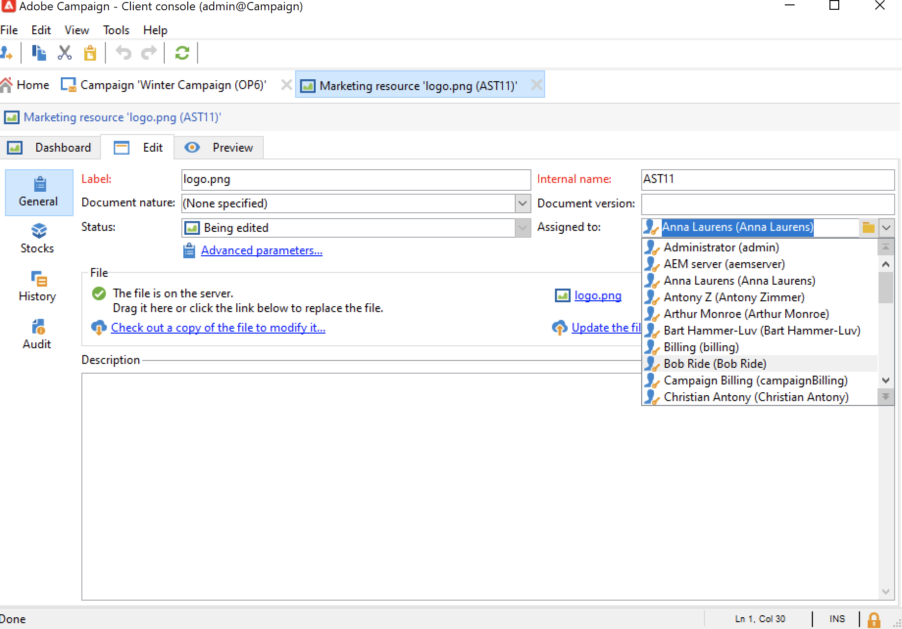
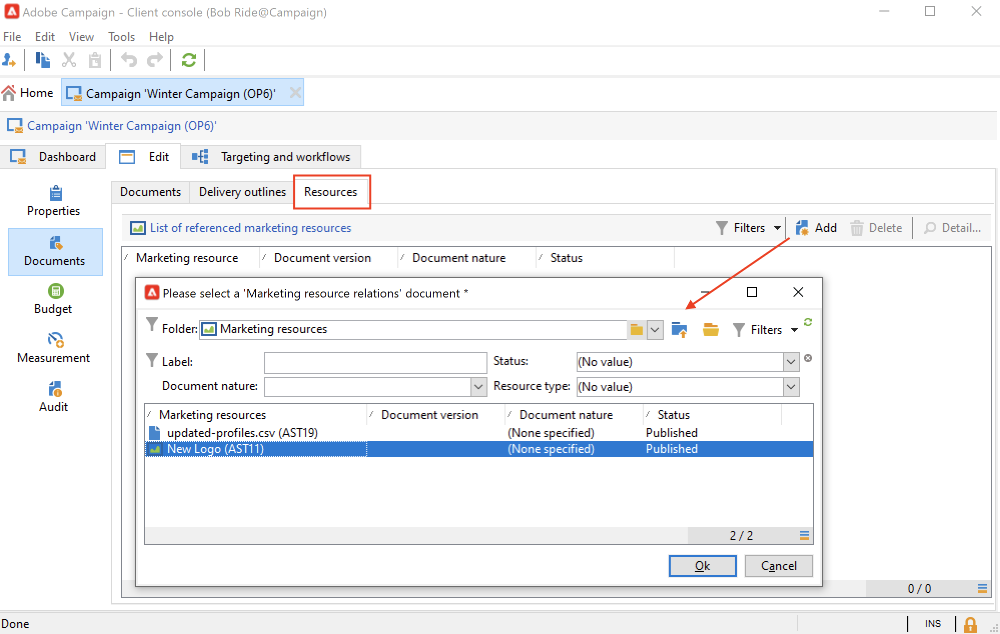

# 管理营销资源{#managing-marketing-resources}

使用Adobe Campaign管理和跟踪活动生命周期中涉及的营销资源。 这些营销资源可以是白皮书、数据文件、徽标或与营销活动相关的任何其他资产。

对于通过Adobe Campaign管理的每个营销资源，您可以随时跟踪其状态和历史记录，并查看当前版本。

默认情况下，营销资源存储在 **[!UICONTROL MRM > Marketing resources]** Campaign资源管理器的文件夹。

## 添加营销资源 {#adding-a-marketing-resource}

要添加营销资源，请执行以下步骤：

1. 浏览至 **[!UICONTROL Campaigns]** 选项卡，然后选择 **[!UICONTROL Marketing resouces]**.

1. 单击 **[!UICONTROL Create]** 按钮。
   
1. 将文件拖放到“营销资源”窗口中，以将其上传到Campaign服务器。 您还可以使用 **[!UICONTROL Upload file to server...]** 链接。
   

上传完成后，该资源将添加到可用资源列表中。

## 管理营销资源 {#manage-marketing-resources}

上传后，所有Adobe Campaign操作员都可以使用营销资源。 他们可以查看、制作副本以对其进行修改，或更新服务器上的文件。

使用 **[!UICONTROL Assigned to]** 中的下拉列表 **[!UICONTROL Edit]** 选项卡，选择负责该资源的操作员。

您还可以选择负责资源验证和资源发布的操作员或操作员组。 要访问这些选项，请单击  **[!UICONTROL Advanced parameters]** 链接。

启动资源验证过程后，将通过电子邮件通知这些操作员。

如果未选择审阅者，则资源 **[!UICONTROL cannot be]** 须经批准。

使用 **[!UICONTROL Audit]** 制表符，以添加验证读取器并定义资源的可用日期。 在此日期之后，它将显示为 **[!UICONTROL Late]** 状态。

>[!NOTE]
>
>此 **[!UICONTROL History]** 选项卡包含资源的下载和更新日志。 此 **[!UICONTROL Details]** 按钮可查看所选版本。
>
>此 **[!UICONTROL Audit]** 选项卡允许您监视对资源执行的任何操作：批准、拒绝审批、相关评论或发布。

### 锁定/解锁资源 {#locking-unlocking-a-resource}

创建资源后，即可在营销资源功能板中使用这些资源，操作员可以编辑和修改它们。

当操作员开始使用资源时，最佳实践是锁定该资源，以防止其他操作员同时修改该资源。 然后保留资源：该资源仍可访问，但无法由其他操作员在服务器上发布或更新。

仅当营销资源未获得批准时，才能将其锁定。

要锁定资源，必须单击 **[!UICONTROL Lock]** 按钮。

更新资源后，单击 **[!UICONTROL Lock]** 按钮以使所有操作员均可再次使用。

一条特殊消息会通知尝试访问它的任何操作员：

此 **[!UICONTROL Tracking]** 选项卡指示锁定资源的操作员的姓名。

>[!NOTE]
>
>只有锁定资源的操作员和具有管理员权限的操作员才有权解锁资源。

### 论坛 {#discussion-forums}

对于每个资源， **[!UICONTROL Forum]** 选项卡允许参与者共享信息。

了解详情，请参阅 [论坛](discussion-forums.md) 部分。

### 审批流程 {#approval-process}

预计可用性日期显示在资源详细信息中(如果已在 **[!UICONTROL Tracking]** 选项卡。 一旦达到此日期，您就可以使用 **[!UICONTROL Submit for approval]** 按钮。 然后，资源状态将更改为 **[!UICONTROL Approval in progress]**.

要批准资源，请单击 **[!UICONTROL Approve the resource]** 按钮。

授权操作员随后可以接受或拒绝批准。 此操作可通过以下方式执行：通过发送的电子邮件（单击通知消息中的链接），或通过客户端控制台(单击 **[!UICONTROL Approve]** )按钮。

您可以在批准窗口中输入备注。

浏览至 **[!UICONTROL Tracking]** 选项卡以检查审批。

>[!NOTE]
>
>除了为每个营销资源指定的审阅人之外，还授权具有管理员权限的操作员和资源管理器审批营销资源。

### 发布资源 {#publishing-a-resource}

获得批准后，必须发布营销资源。 发布过程必须按照公司要求具体实施。 这意味着可以将资源发布到外联网或任何其他服务器上，可以将特定信息发送到外部服务提供商等。

要发布资源，请单击 **[!UICONTROL Publish]** 按钮。

您还可以通过工作流自动发布资源。

发布资源意味着使资源可用（例如，供其他任务使用）。 发布方式因资源的性质而异：对于传单，发布可能意味着将文件发送到打印机，对于Web代理，发布可能意味着将其发布到网站等。

为了发布Adobe Campaign，您需要创建一个足够的工作流，并将其链接到资源。 为此，请打开 **[!UICONTROL Advanced settings...]** 框，然后在中选择所需的工作流 **[!UICONTROL Post-processing]** 字段。

工作流执行：

* 当审核者单击 **[!UICONTROL Publish resource]** 链接（如果未定义审阅人，则为负责资源的人员）。
* 如果资源是通过营销资源创建任务管理的，则当任务设置为时，将执行该任务 **[!UICONTROL Finished]**，只要 **[!UICONTROL Publish the marketing resource]** 框。 [了解详情](creating-and-managing-tasks.md#marketing-resource-creation-task))

如果未立即启动工作流（例如，工作流已停止），则资源的状态将更改为 **[!UICONTROL Pending publication]**. 工作流启动后，资源的状态将更改为 **[!UICONTROL Published]**. 此状态未考虑发布过程中可能出现的错误。 检查工作流的状态，确保工作流已正确执行。

## 将资源链接到营销策划 {#linking-a-resource-to-a-campaign}

### 引用营销资源 {#referencing-a-marketing-resource}

营销资源可与营销活动关联，前提是已在以下位置选择此功能： [活动模板](../campaigns/marketing-campaign-templates.md).

浏览至 **[!UICONTROL Edit > Documents > Resources]** 选项卡，然后单击 **[!UICONTROL Add]** 以选择相关资源。

您可以按状态、性质或类型筛选资源，或应用个性化筛选器。

使用 **[!UICONTROL Details]** 按钮以编辑和预览资源。

### 将营销资源添加到投放大纲 {#adding-a-marketing-resource-to-a-delivery-outline}

营销资源可以通过投放大纲与投放关联。

要了解有关投放概要的更多信息，请参阅 [本节](../campaigns/marketing-campaign-deliveries.md).

要实现此目的，请右键单击投放概要，然后选择 **新建>资源**.

输入资产名称，然后从中选择资产 **营销资源** 下拉列表。

## 库存管理 {#stock-management}

您可以将营销资源与一个或多个库存相关联，以便管理供应并在库存不足时在控制面板上显示警告。

要将营销资源与股票相关联，请执行以下步骤：

1. 编辑坯件或创建新坯件。 进一步了解中的股票 [本节](../campaigns/providers--stocks-and-budgets.md#stock-management).

1. 添加库存行，然后选择相应的营销资源。

   

   您可以通过以下方式编辑选定的资源 **[!UICONTROL Edit the link]** 图标，在选择该资源后，位于其右侧。

1. 指定初始库存和警报库存，然后保存。

库存在营销资源中指明 **库存** 选项卡。
