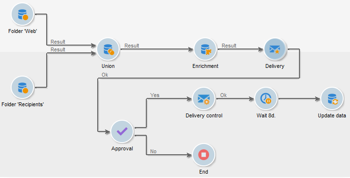

# 工作流入门{#gs-workflows}

## 关于工作流{#about-workflows}

Adobe Campaign 包含一个工作流模块，允许您在应用程序服务器的不同模块之间编排所有流程和任务。您可以利用这个全面的图形环境设计各式流程，包括部分划分、活动执行、文件处理、人员参与等。工作流引擎会执行并跟踪这些流程。

例如，您可以使用某个工作流从服务器下载文件、解压缩，然后将其中包含的记录导入 Adobe Campaign 数据库。

此外，一个工作流也可能涉及到要通知一个或多个操作员，或者是可以作出决策和批准流程的相关人员。这样就可以创建一次投放行动，将内容相关任务指派给一位或多位操作员，指定目标并在开始投放前获得批准。

工作流在营销活动管理流程的不同上下文和阶段中出现。

Adobe Campaign使用工作流执行以下操作：

* 设计定位工作流。 [了解详情](#targeting-workflows)
* 编排跨渠道活动。 [了解详情](#campaign-workflows)
* 执行清理、数据跟踪收集、计算等技术流程。 [了解详情](#technical-workflows)

工作流是流程定义：工作流图，用于表示应发生的事件。 工作流也是此过程的一个实例：工作流实例，用于表示实际发生的情况。

工作流模板描述要执行的各种任务以及它们如何链接在一起。 任务模板称为活动，由图标表示。 它们通过过渡链接在一起。

## 主要原则

每个工作流都包含：

* **[!UICONTROL Activities]**

   活动描述任务模板。 图表中以图标表示各种可用的活动。 每种类型都具有通用属性和特定属性。 例如，尽管所有活动都具有名称和标签，但只有 **[!UICONTROL Approval]** 活动具有分配。

   在工作流图中，给定的活动可以生成多个任务，尤其是当存在循环或重复（定期）操作时。

   所有工作流活动均列于 [此部分](activities.md)，包括用例和示例。

* **[!UICONTROL Transitions]**

   过渡允许您链接活动并定义其顺序。 过渡可将源活动链接到目标活动。 过渡有多种类型，具体取决于源活动。 某些过渡具有其他参数，如持续时间、条件或过滤器。

   未链接到目标活动的过渡采用橙色，箭头显示为菱形。

   >[!NOTE]
   >
   >包含未终止过渡的工作流仍可以执行：将生成一条警告消息，工作流在到达过渡后将暂停，但不会生成错误。 因此，可以在工作流未完成的情况下启动工作流，并在您继续时将其添加到工作流中。

   有关如何构建工作流的更多信息，请参阅 [此部分](build-a-workflow.md).

* **[!UICONTROL Worktables]**

   工作台包含该过渡所携带的所有信息。 每个工作流都使用多个工作表。 在工作流的整个生命周期中，只要未清除，这些表中传送的数据就可以加速并使用。 事实上，每次激活工作流时，都会清除不需要的表，而且可能还会在执行最大的工作流时清除这些表，以避免服务器过载。

   了解有关工作流数据和表的更多信息，请参阅 [此部分](use-workflow-data.md).

## 相关章节

请参阅以下章节，以查找使用工作流自动化流程的指导和最佳实践：

* 了解有关 [本页](use-workflow-data.md).
* 了解如何在 [此部分](build-a-workflow.md).
* 了解如何使用工作流在 [此部分](campaign-workflows.md)..
* 工作流最佳实践详见 [本页](workflow-best-practices.md).
* 在中查找有关工作流执行的指导 [此部分](start-a-workflow.md).
* 了解如何在 [本页](monitor-workflow-execution.md).
* 了解如何授予用户在 [本页](managing-rights.md).
