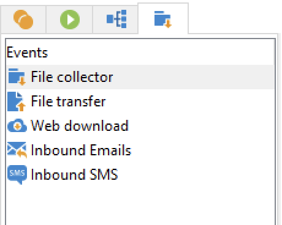

# 工作流活动{#wf-activities}

工作流活动在四个不同的选项卡中按类别分组。

根据您的权限、实施以及设计工作流的上下文，可用活动可能会有所不同。

例如，在营销活动中创建的工作流具有包含所有渠道的特定&#x200B;**投放**&#x200B;选项卡。 此选项卡在[技术工作流](technical-workflows.md)中不可用。

技术工作流具有特定的&#x200B;**事件**&#x200B;选项卡，该选项卡在[营销活动工作流](campaign-workflows.md)中不可用。

以下各章节详细介绍了所有活动：

* [定位活动](targeting-activities.md)
* [流量控制活动](flow-control-activities.md)
* [操作活动](action-activities.md)
* [事件活动](event-activities.md)
* [活动工作流特定的活动](../campaigns/marketing-campaign-deliveries.md)
