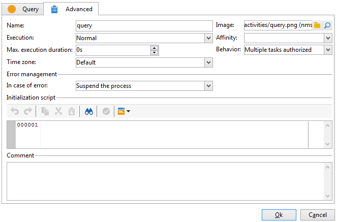

# 高级参数{#advanced-parameters}

活动的“属性”屏幕具有 **[!UICONTROL Advanced]** 选项卡，用于在发生错误时定义行为；和允许您输入初始化脚本。 此选项卡有两个版本：

* 简化版本( **[!UICONTROL Start]** 和 **[!UICONTROL End]** 例如活动)

   

* 更详细的版本(对于 **[!UICONTROL Query]** 活动，例如

   

要在 **[!UICONTROL Advanced]** 选项卡，请参阅此代码。

## 名称 {#name}

此字段包含活动的内部名称。

## 图像 {#image}

利用此字段，可更改链接到活动的图像。 有关更多信息，请参阅 [更改活动图像](change-activity-images.md).

## 执行 {#execution}

利用此字段，可定义在触发任务时要执行的操作。 有三种可能的选项：

这些选项通常通过右键单击活动在购物车中进行选择。

* **[!UICONTROL Normal]**:与往常一样，执行活动。
* **[!UICONTROL Do not activate]**:不会执行此任务和以下所有任务（在同一分支中）。
* **[!UICONTROL Activate but do not execute]**:此任务和以下所有任务（在同一分支中）将自动停止。 如果您希望在任务启动时存在该位置，则此选项会非常有用。 要手动执行任务，请右键单击活动并选择 **[!UICONTROL Normal execution]**.

## 亲和度 {#affinity}

您可以选择在特定计算机上强制执行工作流或工作流活动。 为此，您必须在工作流或相关活动的级别定义一个或多个倾向性。

此中详细介绍了高可用性工作流配置。

## Max。 执行期 {#max--execution-period}

利用此字段，可在任务过长时设置警告。 它不会影响工作流操作。 如果任务在 **[!UICONTROL Max. execution period]** 结束， **[!UICONTROL Instance monitoring]** 页面将显示此工作流的警告。 通过 **[!UICONTROL Monitoring]** 选项卡。

## 行为 {#behavior}

利用此字段，可定义要使用异步任务应用的行为。 有两种可能的选项：

* **[!UICONTROL Several tasks authorized]**:即使第一个任务未完成，也可以同时执行多个任务。
* **[!UICONTROL The current task has priority]**:正在进行的任务优先处理。 只要任务正在进行中，就不会执行其他任务。

## 时区 {#time-zone}

利用此字段，可选择活动的时区。 有关此内容的更多信息： [管理时区](managing-time-zones.md).

## 出错时 {#in-case-of-errors}

利用此字段，可定义在活动出错时要执行的操作。 有两种可能的选项：

* **[!UICONTROL Suspend the process]**:工作流将自动停止。 其状态更改为 **[!UICONTROL Failed]**. 解决问题后，重新启动工作流。
* **[!UICONTROL Ignore]**:不会执行此任务和以下所有任务（在同一分支中）。 这对于定期任务很有用。 如果分支具有上游调度程序，则该调度程序将像往常一样在下一个执行日期开始。
* **[!UICONTROL Abort on error]**:工作流会自动停止，无法重新启动。 其状态更改为 **[!UICONTROL Failed]**.

## 初始化脚本 {#initialization-script}

利用此字段，可初始化变量或修改活动属性。 有关更多信息，请参阅： [JavaScript脚本和模板](javascript-scripts-and-templates.md).

## 注释 {#comment}

的 **[!UICONTROL Comment]** 字段是可添加说明的自由字段。
