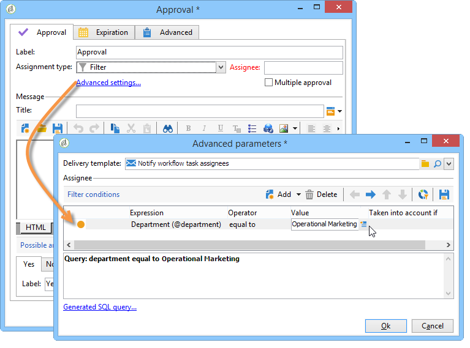

# 审批{#approval}

An **批准** 任务需要操作员的参与。 操作员被分配了一项任务，可以通过电子邮件、使用电子邮件中链接的网页或通过控制台进行响应。

## 任务分派 {#task-assignment}

默认情况下，审批分配给一组操作员。 此组代表一个角色，如“新闻稿内容组”或“新闻稿目标组”。 组中的每个操作员都可以回答，但只考虑第一个回复（在多次批准的情况下除外）。

如有必要，您可以将审批任务分配给单个操作员或由过滤器定义的一组操作员。

* 要选择单个运算符，请选择 **[!UICONTROL Operator]** 中的值 **[!UICONTROL Assignment type]** 字段，并在的下拉列表中选择相关的运算符 **[!UICONTROL Assignee]** 字段。

  

  >[!CAUTION]
  >
  >只有选定的操作员才有权批准任务。

* 您可以定义用于筛选批准操作员的查询。 要执行此操作，请选择 **[!UICONTROL Filter]** 中的值 **[!UICONTROL Assignment type]** 字段，然后单击 **[!UICONTROL Advanced parameters...]** 用于定义筛选条件的链接，如以下示例所示：

  

在单个批准的情况下，对应于操作员选择的过渡被激活并且任务已完成：其他操作员无法回复。

在多次审批的情况下，将启用与每个操作员的选择对应的过渡。 当组的所有操作员都回复了任务或任务过期时，任务即完成。

此活动不会阻止处理，工作流在等待回复时可以执行其他任务。

操作员可以从客户端控制台批准分配给该操作员的任务。 具有管理员权限的操作员可以查看和删除分配给任何操作员的任务，但不能回复这些任务。

修改活动的标题或消息正文不会影响当前任务，但另一方面，修改可能的选项会直接影响当前任务，这会自动继承新的选项列表。

**批准** 类型任务可从 **[!UICONTROL Administration > Production > Objects created automatically > Approvals pending]** 节点：操作员可以通过此视图直接访问批准表单。

## 属性 {#properties}

可在发送给审阅人的消息中使用自定义变量。 它们可以插入到消息标题或正文中。

此 **[!UICONTROL Title]** 字段包含消息的标题：这是已发送电子邮件的主题。 标题和消息正文都是JavaScript模板，因此可以包含根据工作流上下文计算的值。

该编辑器下半部分允许您定义可能的答案列表。 每个答案都有一个对应的过渡。 名称是内部标识符，标签是将显示在选项列表中的文本。

单击 **[!UICONTROL Advanced parameters...]** 用于选择用于通知操作员的投放模板的链接。 默认模板（内部名称为“notifyAssignee”）采用标题和消息，并添加指向用于应答的网页的链接。

可以修改此模板以个性化邮件布局，但最好制作副本。 不得修改定位机制（外部文件、目标映射），因为通知需要它才能正确运行。

审批示例显示于 [定义审批](define-approvals.md).

## 输出参数 {#output-parameters}

* **[!UICONTROL response]**

  与响应相关的评论

* **[!UICONTROL responseOperator]**

  响应的操作员的标识符。 该字段是一个数值，但 **[!UICONTROL String]** 字段。
