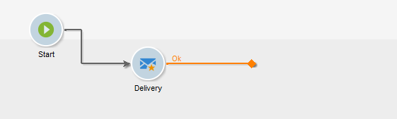

# 构建工作流 {#build-a-workflow}

## 创建新工作流 {#create-a-new-workflow}

工作流创建流程取决于工作流的类型。 您可以：

* 创建 [定位工作流](#targeting-workflows) 从 **[!UICONTROL Profiles and Targets]** > **[!UICONTROL Jobs]** > **[!UICONTROL Targeting workflows]** 浏览器节点或从 **[!UICONTROL Profiles and Targets]** 选项卡，通过 **[!UICONTROL Targeting workflows]** 子选项卡。

  

* 创建 [活动工作流](#campaign-workflows) 从 **[!UICONTROL Targeting and workflows]** 营销活动选项卡

* 创建 [技术工作流](#technical-workflows) 从 **[!UICONTROL Administration]** > **[!UICONTROL Production]** > **[!UICONTROL Technical workflows]** Explorer节点。 最佳实践是创建特定工作流文件夹以保存您的技术工作流。

单击 **[!UICONTROL New]** 按钮时，单击此按钮可访问工作流列表。

输入标签并单击 **[!UICONTROL Save]**.

## 添加和链接活动 {#add-and-link-activities}

您现在必须定义各种活动，并在图表中将它们链接到一起。在配置的此阶段，我们可以看到图标签和工作流状态（正在编辑）。 窗口的下部仅用于编辑图。 它包含一个工具栏、活动面板（位于左侧）以及图表本身（位于右侧）。

>[!NOTE]
>
>如果未显示面板，请单击工作流工具栏上的第一个按钮以显示面板。

在面板的不同选项卡中，活动按类别分组。 可用选项卡和活动会因工作流类型（技术、定位或活动工作流）而异。

* 第一个选项卡包含定位和数据操作活动。 有关这些活动的详情，请参见 [定位活动](targeting-activities.md).
* 第二个选项卡包含计划活动，主要用于协调其他活动。 有关这些活动的详情，请参见 [流量控制活动](flow-control-activities.md).
* 第三个选项卡包含可在工作流中使用的工具和操作。 有关这些活动的详情，请参见 [操作活动](action-activities.md).
* 第四个选项卡包含依赖于给定事件的活动，如接收电子邮件或文件到达服务器。 有关这些活动的详情，请参见 [事件活动](event-activities.md).

创建图

1. 通过在面板中选择某个活动并使用拖放操作将其移至图表中来添加该活动。

   添加 **开始** 活动，然后是 **投放** 活动图。

   

1. 通过拖动 **开始** 活动过渡并将其放置到 **投放** 活动。

   

   通过将新活动放在过渡的末尾，您可以自动将活动链接到上一个活动。

1. 添加所需的活动并将它们链接在一起，如下图所示。

   

>[!CAUTION]
>
>您可以在同一工作流中复制并粘贴活动。 但是，我们不建议跨不同的工作流复制并粘贴活动。 某些附加到活动（如投放和计划程序）的设置可能会导致执行目标工作流时出现冲突和错误。 为此，我们建议您  **复制** 工作流。 有关更多信息，请参阅 [复制工作流](#duplicate-workflows).

您可以使用以下元素更改图表的显示和布局：

* **使用工具栏**

  通过图编辑工具栏，您可以访问工作流的布局和执行功能。

  

  这使您可以调整编辑工具的布局：面板的显示以及图形对象的概述、大小和对齐方式。

  

  以下各节详细介绍了与进度和日志显示相关的图标：

   * [显示进度](monitor-workflow-execution.md#displaying-progress)
   * [显示日志](monitor-workflow-execution.md#displaying-logs)

* **对象对齐方式**

  要对齐图标，请选择图标并单击 **[!UICONTROL Align vertically]** 或 **[!UICONTROL Align horizontally]** 图标。

  使用 **CTRL** 键可选择多个分散的活动，或取消选择一个或多个活动。 单击图表背景取消选择所有内容。

* **映像管理**

  您可以自定义图表的背景图像以及与各种活动相关的图像。 请参阅 [更改活动图像](change-activity-images.md).

## 配置活动 {#configure-activities}

双击某个活动以进行配置，或右键单击并选择 **[!UICONTROL Open...]**.

>[!NOTE]
>
>中详细介绍了活动工作流活动 [本节](activities.md).

第一个选项卡包含基本配置。 此 **[!UICONTROL Advanced]** 选项卡包含其他参数，专门用于定义遇到错误时的行为、指定活动的执行持续时间以及输入初始化脚本。

为了更好地了解活动并改善工作流的易读性，您可以在活动中输入备注。

当操作员滚动到活动上时，将自动显示这些注释。

## 工作流模板 {#workflow-templates}

工作流模板包含属性的整体配置，还可能包含图表中连接的一系列活动。 此配置可重复用于创建包含一定数量预配置元素的新工作流

您可以基于现有模板创建新工作流模板，或直接将工作流更改为模板。

工作流模板存储在中 **[!UICONTROL Resources > Templates > Workflow templates]** Explorer节点。

除了常规工作流属性之外，模板属性还允许您为基于此模板创建的工作流指定执行文件。

## 复制工作流 {#duplicate-workflows}

您可以复制不同类型的工作流。 复制后，对于原工作流的修改不会被应用到该工作流的副本。

>[!CAUTION]
>
>可在工作流中使用复制粘贴功能，但我们建议您使用 **复制**. 复制活动后，将保留其整个配置。 对于投放活动（电子邮件、短信、推送通知……），还会复制附加到活动的投放对象，这可能会导致崩溃。

1. 右键单击工作流。
1. 单击 **复制**.

   

1. 在工作流窗口中，更改工作流标签。
1. 单击&#x200B;**保存**。

复制功能无法直接在营销活动视图中可用。

但是，您可以创建一个视图以显示实例上的所有工作流。 在此视图中，您可以使用以下方式复制工作流 **复制到**.

**创建视图**

1. 在 **资源管理器**，转到在其中创建视图所需的文件夹。
1. 右键单击并转到 **添加新文件夹** > **进程**，选择 **工作流**.

   

新文件夹 **工作流** 创建。

1. 右键单击并选择 **属性**.
1. 在 **限制** 选项卡，启用 **此文件夹是一个视图** 选项并单击 **保存**.

   

该文件夹现在已填充了实例的所有工作流。

**复制营销活动工作流**

1. 在工作流视图中选择营销活动工作流。
1. 右键单击 **复制到**.
1. 更改其标签。
1. 单击&#x200B;**保存**。

您可以在工作流视图中查看重复的工作流。
