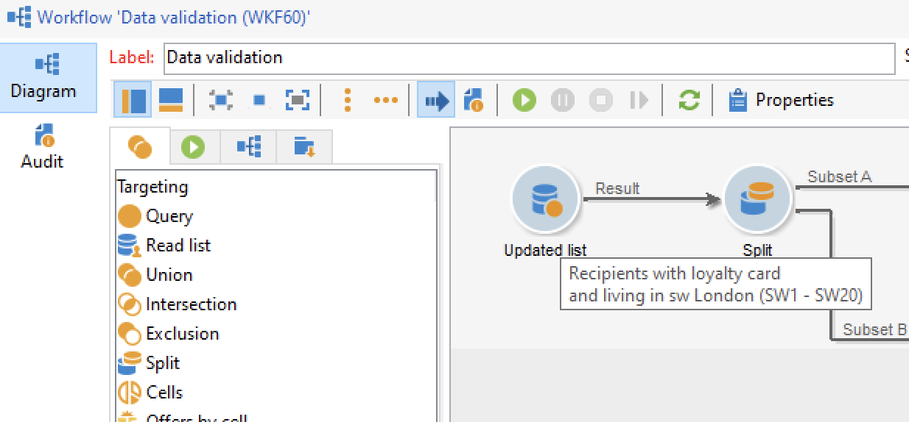

# 构建工作流 {#build-a-workflow}

## 创建新工作流 {#create-a-new-workflow}

工作流创建流程取决于工作流的类型。 您可以：

* 从资源管理器的&#x200B;**[!UICONTROL Profiles and Targets]** > **[!UICONTROL Jobs]** > **[!UICONTROL Targeting workflows]**&#x200B;节点或从主页的&#x200B;**[!UICONTROL Profiles and Targets]**&#x200B;选项卡通过&#x200B;**[!UICONTROL Targeting workflows]**&#x200B;子选项卡创建[定位工作流](#targeting-workflows)。

  

* 从营销活动的&#x200B;**[!UICONTROL Targeting and workflows]**&#x200B;选项卡创建[营销活动工作流](#campaign-workflows)

* 从资源管理器的&#x200B;**[!UICONTROL Administration]** > **[!UICONTROL Production]** > **[!UICONTROL Technical workflows]**&#x200B;节点创建[技术工作流](#technical-workflows)。 最佳实践是创建特定工作流文件夹以保存您的技术工作流。

单击位于工作流列表上方的&#x200B;**[!UICONTROL New]**&#x200B;按钮。

输入标签并单击&#x200B;**[!UICONTROL Save]**。

## 添加和链接活动 {#add-and-link-activities}

您现在必须定义各种活动，并在图表中将它们链接在一起。 在配置的此阶段，我们可以看到图标签和工作流状态（正在编辑）。 窗口的下部仅用于编辑图。 它包含一个工具栏、活动面板（位于左侧）以及图表本身（位于右侧）。

>[!NOTE]
>
>如果未显示面板，请单击工作流工具栏上的第一个按钮以显示面板。

在面板的不同选项卡中，活动按类别分组。 可用选项卡和活动会因工作流类型（技术、定位或活动工作流）而异。

* 第一个选项卡包含定位和数据操作活动。 [定位活动](targeting-activities.md)中详细介绍了这些活动。
* 第二个选项卡包含计划活动，主要用于协调其他活动。 在[流控制活动](flow-control-activities.md)中详细介绍了这些活动。
* 第三个选项卡包含可在工作流中使用的工具和操作。 [操作活动](action-activities.md)中详细介绍了这些活动。
* 第四个选项卡包含依赖于给定事件的活动，如接收电子邮件或文件到达服务器。 [事件活动](event-activities.md)中详细介绍了这些活动。

创建图

1. 通过在面板中选择某个活动并使用拖放操作将其移至图表中来添加该活动。

   在关系图上添加&#x200B;**开始**&#x200B;活动，然后添加&#x200B;**投放**&#x200B;活动。

   

1. 通过将&#x200B;**开始**&#x200B;活动过渡拖放到&#x200B;**投放**&#x200B;活动上，将两个活动链接在一起。

   

   通过将新活动放在过渡的末尾，您可以自动将活动链接到上一个活动。

1. 添加所需的活动并将它们链接在一起，如下图所示。

   

>[!CAUTION]
>
>您可以在同一工作流中复制并粘贴活动。 但是，我们不建议跨不同的工作流复制并粘贴活动。 某些附加到活动（如投放和计划程序）的设置可能会导致执行目标工作流时出现冲突和错误。 为此，我们建议您&#x200B;**复制**&#x200B;工作流。 有关详细信息，请参阅[重复的工作流](#duplicate-workflows)。

您可以使用以下元素更改图表的显示和布局：

* **使用工具栏**

  通过图编辑工具栏，您可以访问工作流的布局和执行功能。

  

  这使您可以调整编辑工具的布局：面板的显示以及图形对象的概述、大小和对齐方式。

  

  以下各节详细介绍了与进度和日志显示相关的图标：

   * [显示进度](monitor-workflow-execution.md#displaying-progress)
   * [显示日志](monitor-workflow-execution.md#displaying-logs)

* **对象对齐方式**

  要对齐图标，请选择图标并单击&#x200B;**[!UICONTROL Align vertically]**&#x200B;或&#x200B;**[!UICONTROL Align horizontally]**&#x200B;图标。

  使用&#x200B;**CTRL**&#x200B;键选择多个分散的活动，或取消选择一个或多个活动。 单击图表背景取消选择所有内容。

* **映像管理**

  您可以自定义图表的背景图像以及与各种活动相关的图像。 请参阅[更改活动图像](change-activity-images.md)。

## 配置活动 {#configure-activities}

双击活动以进行配置，或右键单击并选择&#x200B;**[!UICONTROL Open...]**。

>[!NOTE]
>
>[此部分](activities.md)中详细介绍了活动工作流活动。

第一个选项卡包含基本配置。 **[!UICONTROL Advanced]**&#x200B;选项卡包含其他参数，这些参数特别用于定义遇到错误时的行为、指定活动的执行持续时间以及输入初始化脚本。

为了更好地了解活动并改善工作流的易读性，您可以在活动中输入备注。

当操作员滚动到活动上时，将自动显示这些注释。

## 工作流模板 {#workflow-templates}

工作流模板包含属性的整体配置，还可能包含图表中连接的一系列活动。 此配置可重复用于创建包含一定数量预配置元素的新工作流

您可以基于现有模板创建新工作流模板，或直接将工作流更改为模板。

工作流模板存储在资源管理器的&#x200B;**[!UICONTROL Resources > Templates > Workflow templates]**&#x200B;节点中。

除了常规工作流属性之外，模板属性还允许您为基于此模板创建的工作流指定执行文件。

## 复制工作流 {#duplicate-workflows}

您可以复制不同类型的工作流。 复制后，对工作流的修改不会转移到工作流的副本中。

Adobe建议复制工作流，而不是执行活动的复制/粘贴。 复制活动时，将保留其所有设置。 对于渠道活动，与活动关联的投放对象也会被复制，这可能会导致严重问题。

1. 右键单击工作流。
1. 单击&#x200B;**复制**。

   

1. 在工作流窗口中，更改工作流标签。
1. 单击&#x200B;**保存**。

