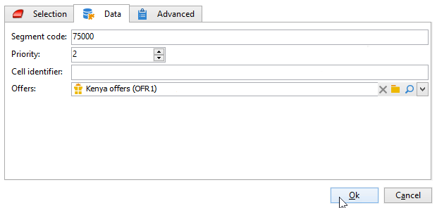

# 单元格{#cells}

**[!UICONTROL Cells]**&#x200B;活动将各种子集的视图作为数据列提供。 它有助于子集操作，并且还旨在利用个性化功能。


此活动可配置为根据用户需求输入特定参数。 默认情况下，每个子集的详细信息通过&#x200B;**[!UICONTROL Cells]**&#x200B;和&#x200B;**[!UICONTROL Advanced]**&#x200B;选项卡在专用窗口中进行详细介绍。


在下面的示例中，修改了输入表单：添加了&#x200B;**[!UICONTROL Data]**&#x200B;选项卡以启用每个子集的选件和优先级之间的关联。



对于此配置，已将以下信息添加到Adobe Campaign资源管理器的&#x200B;**[!UICONTROL Administration > Configurations > Input forms]**&#x200B;节点的工作流表单中：

```
<container img="nms:miniatures/mini-enrich.png" label="Data">
                <input xpath="@code"/>
                <container xpath="select/node[@alias='@numTest']">
                  <input alwaysActive="true" expr="'long'" type="expr" xpath="@type"/>
                  <input alwaysActive="true" expr="'Priority'" type="expr" xpath="@label"/>
                  <input label="Priority" maxValue="12" minValue="0" type="number"
                         xpath="@value" xpathEditFromType="@type"/>
                </container>
                <container xpath="select/node[@alias='@test']">
                  <input alwaysActive="true" expr="'string'" type="expr" xpath="@type"/>
                  <input alwaysActive="true" expr="'Identifier'" type="expr" xpath="@label"/>
                  <input label="Cell identifier" xpath="@value"/>
                </container>
                <container xpath="select/node[@alias='linkTest']">
                  <input alwaysActive="true" expr="'link'" type="expr" xpath="@type"/>
                  <input alwaysActive="true" expr="'nms:offer'" type="expr" xpath="@dataType"/>
                  <input alwaysActive="true" expr="'Offre'" type="expr" xpath="@label"/>
                  <input computeStringAlias="@valueLabel" label="Offers" notifyPathList="@_cs|@valueLabel"
                         schema="nms:offer" type="linkEdit" xpath="@value"/>
                </container>
```

Adobe Campaign中的输入表单个性化仅适用于专家用户。