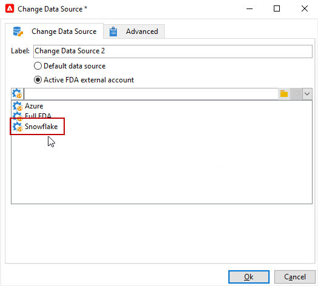

# 更改数据源 {#change-data-source}

使用&#x200B;**[!UICONTROL Change data source]**&#x200B;活动更改[工作流工作表](use-workflow-data.md#workflow-temporary-work-table)的数据源。 此活动为跨不同数据源(如联合数据访问(FDA)、Campaign云数据库(FFDA)和Campaign本地数据库)管理数据提供了更大的灵活性。

工作流&#x200B;**[!UICONTROL Working table]**&#x200B;用于处理与工作流活动共享数据。

默认情况下，**[!UICONTROL Working table]**&#x200B;是在与需要查询的数据源相同的数据库中创建的。
例如，在查询存储在云数据库上的&#x200B;**[!UICONTROL Recipients]**&#x200B;表时，工作流会在同一云数据库上创建&#x200B;**[!UICONTROL Working table]**。

使用&#x200B;**[!UICONTROL Change Data Source]**&#x200B;活动为您的&#x200B;**[!UICONTROL Working table]**&#x200B;使用其他数据源。

请注意，在使用&#x200B;**[!UICONTROL Change Data Source]**&#x200B;活动时，您需要切换回云数据库以继续执行工作流。

>[!IMPORTANT]
>
>请注意，不应将&#x200B;**[!UICONTROL Change Dimension]**&#x200B;和&#x200B;**[!UICONTROL Change Data source]**&#x200B;活动添加到一行中。 如果需要连续使用这两个活动，请确保在它们之间包含&#x200B;**[!UICONTROL Enrichement]**&#x200B;活动。 这可以确保正确执行并防止潜在的冲突或错误。

要使用&#x200B;**[!UICONTROL Change Data Source]**&#x200B;活动，您必须：

1. 创建工作流。

1. 使用&#x200B;**[!UICONTROL Query]**&#x200B;活动查询目标收件人。

   有关&#x200B;**[!UICONTROL Query]**&#x200B;活动的详细信息，请参阅此[页面](query.md#create-a-query)。

1. 添加&#x200B;**[!UICONTROL Change data source]**&#x200B;活动。

   

1. 编辑您的&#x200B;**[!UICONTROL Change data source]**&#x200B;活动以选择&#x200B;**[!UICONTROL Default data source]**。

   随后，包含查询结果的工作表将移至默认的Campaign本地数据库。

   

1. 添加&#x200B;**[!UICONTROL JavaScript code]**&#x200B;活动以对工作表执行单一操作。

   有关&#x200B;**[!UICONTROL JavaScript code]**&#x200B;活动的详细信息，请参阅[此页面](sql-code-and-javascript-code.md#javascript-code)。

1. 添加另一个&#x200B;**[!UICONTROL Change data source]**&#x200B;活动以切换回云数据库。

1. 编辑此活动并选择&#x200B;**[!UICONTROL Active FDA external account]**&#x200B;以及相应的&#x200B;**[!UICONTROL External database]**&#x200B;外部帐户。

   

1. 您现在可以启动工作流。
