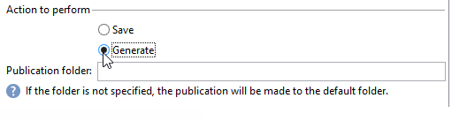

# 内容管理{#content-management}

A **内容管理** 通过活动，可创建和操作内容并根据此内容生成文件。 然后，可以通过“投放”活动交付此内容。

>[!CAUTION]
>
>内容管理是一个可选的Adobe Campaign模块。 请核实您的许可协议。

活动的属性分为三个步骤：

* **内容选择**：内容可以以前创建，也可以通过活动创建。
* **内容更新**：该任务可以修改内容的主题或导入所有XML内容。
* **操作**：可以保存或生成生成的内容。

  

1. **内容**

   * **[!UICONTROL Specified in the transition]**

     此选项允许您使用过渡中指定的内容，即激活内容管理的事件必须包含 **[!UICONTROL contentId]** 变量。 此变量可由之前的内容管理或任何脚本设置。

   * **[!UICONTROL Explicit]**

     此选项允许您通过 **[!UICONTROL Content]** 字段。 此字段仅在 **[!UICONTROL Explicit]** 已选中选项。

     

   * **[!UICONTROL Calculated by a script]**

     内容标识符由脚本计算。 此 **[!UICONTROL Script]** 字段允许您定义用于评估内容标识符（主键）的JavaScript模板。 此字段仅在 **[!UICONTROL Calculated by a script]** 已选中选项。

     

   * **[!UICONTROL New, created from a publication template]**

     从发布模板创建新内容。 此新内容将保存在 **[!UICONTROL String]** 字段。 此 **[!UICONTROL Template]** 字段指定用于创建内容的发布模板。

     

1. **更新内容**

   * **[!UICONTROL Subject]**

     此字段允许您修改内容的主题。

   * **[!UICONTROL Access to data from an XML feed]**

     此选项允许您从通过XSL样式表下载的XML文档构造内容。 选择此选项时， **[!UICONTROL URL]** 字段指定XML内容下载URL。 此 **[!UICONTROL XSL stylesheet]** 用于指定用于转换下载的XML文档的样式表。 此属性是可选的。

     

1. **要执行的操作**

   * **[!UICONTROL Save]**

     此选项保存已创建或已修改的内容。

     叫客过渡仅激活一次，其内容保存在中 **[!UICONTROL contentId]** 变量作为参数。

   * **[!UICONTROL Generate]**

     此选项保存内容，然后为具有“文件”类型发布的每个转换模板生成输出文件。

     

     对于使用保存在中的内容的标识符生成的每个文件，都会激活出站过渡。 **[!UICONTROL contentId]** 变量作为它的参数，以及该文件名中的 **[!UICONTROL filename]** 变量。

## 输入参数 {#input-parameters}

* contentId

要使用的内容的标识符，如果 **[!UICONTROL Specified in the transition]** 选项。

## 输出参数 {#output-parameters}

* contentId

  内容标识符.

* 文件名

  生成的文件的全名（如果所选操作为） **[!UICONTROL Generate]**.
