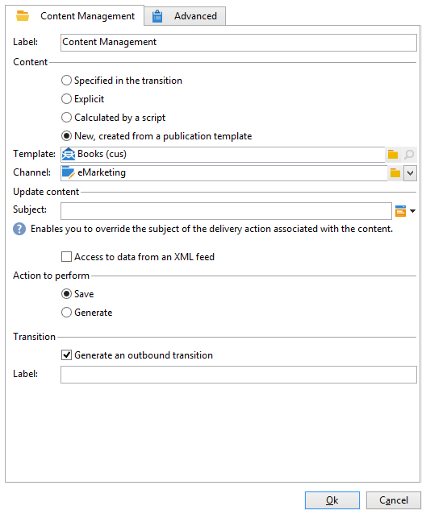

# 内容管理{#content-management}

通过&#x200B;**内容管理**&#x200B;活动，您可以创建和处理内容并根据此内容生成文件。 然后，可以通过“投放”活动交付此内容。

>[!CAUTION]
>
>内容管理是一个可选的Adobe Campaign模块。 请核实您的许可协议。

>[!NOTE]
>
>Adobe Campaign Web用户界面允许您为内容使用内容片段。 借助可在一条或多条消息中引用的可重用组件，营销用户可预建多个自定义内容块，从而允许您在改进的设计过程中快速组合消息内容。 要了解有关内容片段的更多信息，请参阅[Adobe Campaign Web UI文档。](https://experienceleague.adobe.com/zh-hans/docs/campaign-web/v8/content/manage-reusable-content/fragments/fragments){target=_blank}

活动的属性分为三个步骤：

* **内容选择**：内容可以以前创建，也可以通过活动创建。
* **内容更新**：任务可以修改内容的主题或导入所有XML内容。
* **操作**：生成的内容可以保存或生成。

  

1. **内容**

   * **[!UICONTROL Specified in the transition]**

     此选项允许您使用过渡中指定的内容，即激活内容管理的事件必须包含&#x200B;**[!UICONTROL contentId]**&#x200B;变量。 此变量可由之前的内容管理或任何脚本设置。

   * **[!UICONTROL Explicit]**

     此选项允许您通过&#x200B;**[!UICONTROL Content]**&#x200B;字段选择已创建的内容。 仅当选择了&#x200B;**[!UICONTROL Explicit]**&#x200B;选项时，此字段才可见。

     

   * **[!UICONTROL Calculated by a script]**

     内容标识符由脚本计算。 **[!UICONTROL Script]**&#x200B;字段允许您定义评估内容标识符（主键）的JavaScript模板。 仅当选择了&#x200B;**[!UICONTROL Calculated by a script]**&#x200B;选项时，此字段才可见。

     

   * **[!UICONTROL New, created from a publication template]**

     从发布模板创建新内容。 此新内容将保存在&#x200B;**[!UICONTROL String]**&#x200B;字段中指定的文件中。 **[!UICONTROL Template]**&#x200B;字段指定要用于创建内容的发布模板。

     

1. **更新内容**

   * **[!UICONTROL Subject]**

     此字段允许您修改内容的主题。

   * **[!UICONTROL Access to data from an XML feed]**

     此选项允许您从通过XSL样式表下载的XML文档构造内容。 选择此选项时，**[!UICONTROL URL]**&#x200B;字段指定XML内容下载URL。 **[!UICONTROL XSL stylesheet]**&#x200B;允许您指定用于转换下载的XML文档的样式表。 此属性是可选的。

     

1. **要执行的操作**

   * **[!UICONTROL Save]**

     此选项保存已创建或已修改的内容。

     叫客过渡仅激活一次，其内容将作为参数保存在&#x200B;**[!UICONTROL contentId]**&#x200B;变量中。

   * **[!UICONTROL Generate]**

     此选项保存内容，然后为具有“文件”类型发布的每个转换模板生成输出文件。

     

     对于每个使用在&#x200B;**[!UICONTROL contentId]**&#x200B;变量中保存的内容标识符作为其参数以及在&#x200B;**[!UICONTROL filename]**&#x200B;变量中的文件名生成的文件，将激活出站过渡。

## 输入参数 {#input-parameters}

* contentId

启用&#x200B;**[!UICONTROL Specified in the transition]**&#x200B;选项时要使用的内容的标识符。

## 输出参数 {#output-parameters}

* contentId

  内容标识符。

* 文件名

  如果所选操作为&#x200B;**[!UICONTROL Generate]**，则为所生成文件的全名。
