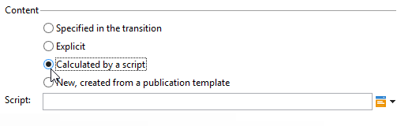

# 内容管理{#content-management}

A **内容管理** 活动允许您创建和操作内容，并基于此内容生成文件。 然后，可以通过“交付”活动交付此内容。

>[!CAUTION]
>
>内容管理是一个可选的Adobe Campaign模块。 请核实您的许可协议。

活动的属性分为三个步骤：

* **内容选择**:内容可以是以前创建的，也可以通过活动创建。
* **内容更新**:该任务可以修改内容的主题或导入所有XML内容。
* **操作**:可以保存或生成生成的内容。

   

   有关在Adobe Campaign中配置和使用内容管理的更多信息，请参阅此。

1. **内容**

   * **[!UICONTROL Specified in the transition]**

      此选项允许您使用过渡中指定的内容，即激活内容管理的事件必须包含 **[!UICONTROL contentId]** 变量。 此变量可由以前的内容管理或任何脚本进行设置。

   * **[!UICONTROL Explicit]**

      此选项允许您通过 **[!UICONTROL Content]** 字段。 仅当 **[!UICONTROL Explicit]** 选项。

      

   * **[!UICONTROL Calculated by a script]**

      内容标识符由脚本计算。 的 **[!UICONTROL Script]** 字段中，您可以定义用于评估内容标识符（主键）的JavaScript模板。 仅当 **[!UICONTROL Calculated by a script]** 选项。

      

   * **[!UICONTROL New, created from a publication template]**

      从发布模板创建新内容。 此新内容将保存在 **[!UICONTROL String]** 字段。 的 **[!UICONTROL Template]** 字段指定用于创建内容的发布模板。

      

1. **更新内容**

   * **[!UICONTROL Subject]**

      利用此字段，可修改内容的主题。

   * **[!UICONTROL Access to data from an XML feed]**

      此选项允许您从通过XSL样式表下载的XML文档构建内容。 选择此选项后， **[!UICONTROL URL]** 字段指定下载URL的XML内容。 的 **[!UICONTROL XSL stylesheet]** 可指定用于转换下载的XML文档的样式表。 此属性是可选的。

      

1. **要执行的操作**

   * **[!UICONTROL Save]**

      此选项会保存创建或修改的内容。

      叫客过渡只激活一次，内容保存在 **[!UICONTROL contentId]** 变量。

   * **[!UICONTROL Generate]**

      此选项会保存内容，然后为每个具有“File”类型发布的转换模板生成输出文件。

      

      对于使用保存在 **[!UICONTROL contentId]** 变量作为其参数，且文件名位于 **[!UICONTROL filename]** 变量。

## 输入参数 {#input-parameters}

* contentId

要使用的内容的标识符(如果 **[!UICONTROL Specified in the transition]** 选项。

## 输出参数 {#output-parameters}

* contentId

   内容标识符。

* 文件名

   如果所选操作为，则生成文件的完整名称 **[!UICONTROL Generate]**.

## 示例 {#examples}

中提供了示例。
