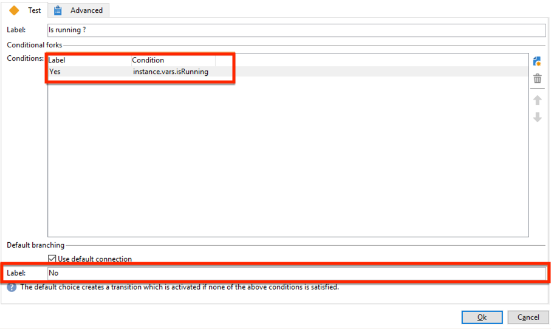

# 协调数据更新{#coordinating-data-updates}

此用例详细说明了如何创建工作流，以便您在使用多个工作流执行时管理伴随的更新。

目的是检查更新过程是否已在执行另一个更新操作之前结束。 为此，我们将设置一个实例变量，并让工作流测试实例是否正在运行，以决定是否继续执行工作流并执行更新。

此工作流由以下部分组成：

* **调度程序**&#x200B;活动，在特定频率上执行工作流。
* **测试**&#x200B;活动，用于检查工作流是否已执行。
* 如果工作流尚未执行，**查询**&#x200B;和&#x200B;**更新数据**&#x200B;活动，随后是&#x200B;**结束**&#x200B;活动，该活动将工作流实例变量重新初始化为false。
* **End**&#x200B;活动（如果工作流已在执行）。

要构建工作流，请执行以下步骤：

1. 添加&#x200B;**调度程序**&#x200B;活动，然后根据需要配置其频率。
1. 添加&#x200B;**Test**&#x200B;活动以检查工作流是否已执行，然后如下所示对其进行配置。

   >[!NOTE]
   >
   >“isRunning”是我们为本示例选择的实例变量名称。 这不是内置变量。

   

1. 将&#x200B;**End**&#x200B;活动添加到&#x200B;**No**&#x200B;分支。 这样，如果工作流已经在执行，则不会执行任何操作。
1. 将所需的活动添加到&#x200B;**是**&#x200B;分支。 在我们的示例中，**查询**&#x200B;和&#x200B;**更新数据**&#x200B;活动。
1. 打开第一个活动，然后在&#x200B;**[!UICONTROL Advanced]**&#x200B;选项卡中添加&#x200B;**instance.vars.isRunning = true**&#x200B;命令。 这样，实例变量将设置为正在运行。

   

1. 在&#x200B;**[!UICONTROL Yes]**&#x200B;分支的末尾添加&#x200B;**End**&#x200B;活动，然后在&#x200B;**[!UICONTROL Advanced]**&#x200B;选项卡中添加&#x200B;**instance.vars.isRunning = false**&#x200B;命令。

   这样，只要正在执行工作流，就不会执行任何操作。

   

**相关主题：**

* [防止同时执行多个操作](monitor-workflow-execution.md#preventing-simultaneous-multiple-executions)
* [更新数据活动](update-data.md)
