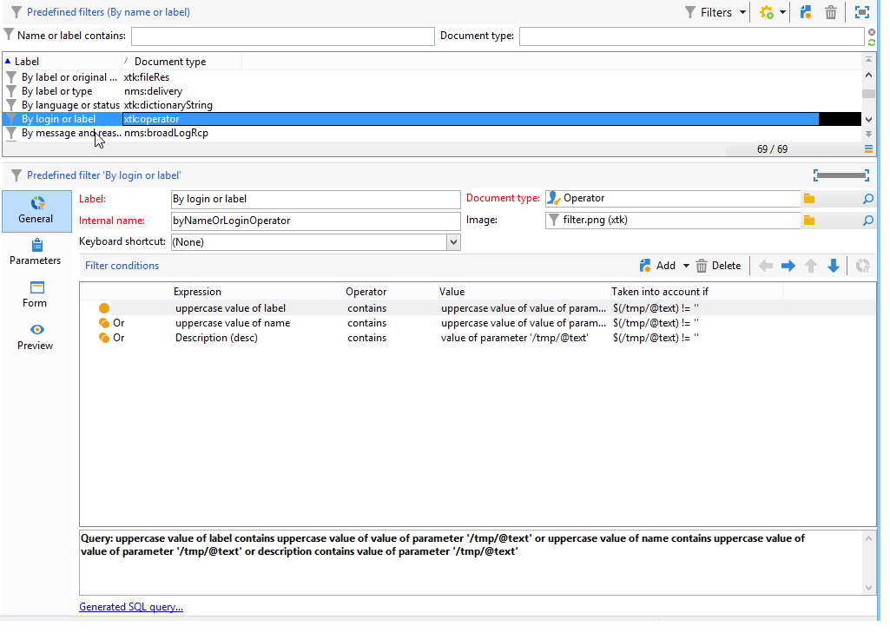

# 创建筛选 {#creating-a-filter}

Adobe Campaign中可用的过滤器是通过过滤条件定义的，这些条件是使用与查询相同的操作模式创建的。

>[!NOTE]
>
>有关创建过滤器的更多信息，请参阅。

的 **[!UICONTROL Administration > Configuration > Predefined filters]** 节点包含列表和概述中使用的所有过滤器。

例如，运算符列表可按 **[!UICONTROL Active accounts]**:

匹配过滤器包含 **[!UICONTROL Account disabled]** 值 **[!UICONTROL Operators]** 架构：

对于同一列表， **[!UICONTROL By login or label]** 过滤器允许您根据在过滤器字段中输入的值过滤列表上的数据：

其构建如下：

要匹配筛选条件，运算符帐户必须检查以下条件之一：

* 其标签包含在输入字段中输入的字符，
* 运算符名称包含在输入字段中输入的字符，
* 描述区域的内容包含在输入字段中输入的字符。

>[!NOTE]
>
>的 **[!UICONTROL Upper]** 函数，可停用区分大小写的函数。

的 **[!UICONTROL Taken into account if]** 列中，您可以定义这些筛选条件的应用程序条件。 这里， **$(/tmp/@text)** 字符表示链接到过滤器的输入字段的内容：

这里， **$(/tmp/@text)=&#39;agency&#39;**

的 **$(/tmp/@text)!=&quot;** 当输入字段不为空时，表达式将应用每个条件。
