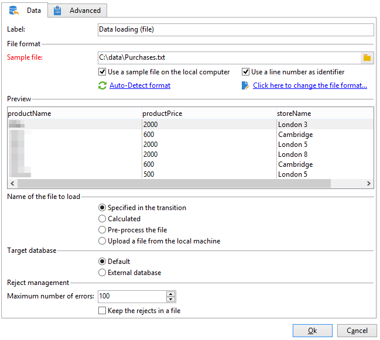
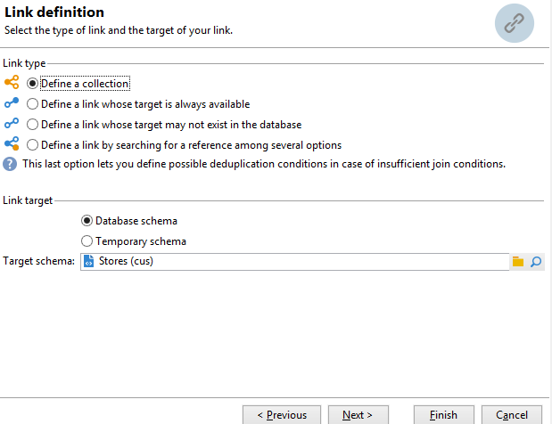

# 创建摘要列表{#creating-a-summary-list}

此用例详细介绍了如何创建工作流，在收集文件并进行多项扩充后，您可以创建摘要列表。 此示例基于在商店中购物的联系人列表。


使用以下数据结构：


其目的是：

* 使用扩充活动的各种选项
* 在协调之后更新数据库中的数据
* 创建扩充数据的全局“视图”

要创建摘要列表，您需要执行以下步骤：

1. 在工作流的工作表中收集和加载“购买”文件
1. 通过创建指向参考表的链接来扩充导入的数据
1. 使用扩充的数据更新“购买”表
1. 从“购买”表中用聚合计算扩充“联系人”数据
1. 创建摘要列表

## 步骤1:加载文件并协调导入的数据 {#step-1--loading-the-file-and-reconciling-the-imported-data}

要加载的数据是与“Purchase”相关的数据，其格式如下：

```
Product Name;Product price;Store
Computer;2000;London 3
Tablet;600;Cambridge
Computer;2000;London 5
Computer;2000;London 8
Tablet;600;Cambridge
Phone;500;London 5
```

此数据包含在“Purchases.txt”文本文件中。

1. 添加 **文件收集器** 和 **数据加载（文件）** 活动。

   的 **文件收集器** 活动允许您从Adobe Campaign服务器收集文件并将文件发送到该服务器。

   的 **数据加载（文件）** 活动允许您使用收集的数据扩充工作流的工作表。 有关此活动的更多信息，请参阅 [本页](data-loading--file-.md).

1. 配置 **文件收集器** 收集文本的活动(&#42;.txt)从选定目录中键入文件。

   

   的 **文件收集器** 活动可让您管理源目录中缺少文件的情况。 为此，请检查 **[!UICONTROL Process file nonexistence]** 选项。 在此工作流中， **等待** 添加了活动以尝试其他文件集合（如果收集时该文件集在目录中缺失）。

1. 配置 **数据加载（文件）** 活动，使用与要导入数据格式相同的样例文件。

   

   单击 **[!UICONTROL Click here to change the file format...]** 链接以使用“购买”表的内部名称和标签重命名列。

   

导入数据后，通过创建指向与“存储”模式匹配的参考表的链接来进行扩充。

添加扩充活动并按如下方式对其进行配置：

1. 从中选择由数据组成的主集 **数据加载（文件）** 活动。

   

1. 单击 **[!UICONTROL Add data]**，然后选择 **[!UICONTROL A link]** 选项。

   

1. 选择 **[!UICONTROL Define a collection]** 选项。
1. 选择“存储”架构作为目标。

   

有关各种类型链接的更多信息，请参阅 [扩充和修改数据](targeting-workflows.md#enrich-and-modify-data).

在以下窗口中，您需要通过选择源字段（在主集中）和目标字段（属于“存储”架构）来创建连接条件，以配置数据协调。


现在，链接已创建，接下来我们将从“存储”架构向工作流的工作表添加一列：“邮政编码参考”字段。

1. 打开扩充活动。
1. 单击 **[!UICONTROL Edit additional data]**。
1. 在 **[!UICONTROL Output columns]**.


此扩充后工作流工作表中的数据将如下所示：


## 步骤2:将扩充数据写入“购买”表 {#step-2--writing-enriched-data-to-the--purchases--table}

此步骤详细介绍如何将导入和扩充的数据写入“购买”表。 为此，我们需要使用 **更新数据** 活动。

工作流工作表中的数据与 **购买** 必须先执行定向维度，然后才能在 **购买** 表格。

1. 单击 **[!UICONTROL Reconciliation]** 的子菜单。
1. 选择定向维度，在此例中为“购买”模式。
1. 为工作流表中的数据选择“源表达式”（在本例中为“storeName”字段）。
1. 在“购买”表中为数据选择“目标表达式”（在本例中为“存储重命名”字段）。
1. 勾选 **[!UICONTROL Keep unreconciled data coming from the work table]** 选项。


在 **更新数据** 活动时，需要进行以下配置：

1. 选择 **[!UICONTROL Insert or update]** 选项 **[!UICONTROL Operation type]** 字段，以避免每次收集文件时创建新记录。
1. 选择 **[!UICONTROL By directly using the targeting dimension]** 值 **[!UICONTROL Record identification]** 选项。
1. 选择“购买”架构作为 **[!UICONTROL Document type]**.
1. 指定要更新的字段列表。 的 **[!UICONTROL Destination]** 列中，您可以定义“购买”架构的字段。 的 **[!UICONTROL Expression]** 列允许您选择工作表中的字段以执行映射。
1. 单击 **[!UICONTROL Generate an outbound transition]** 选项。


## 步骤3:扩充“联系人”数据 {#step-3--enriching--contact--data-}

“联系人”架构实际上已链接到“购买”架构。 这意味着您可以使用“扩充”选项的其他选项：添加链接到过滤维度的数据。

第二次扩充的目的是在购买架构上创建聚合，以计算每个已识别联系人的总购买量。

1. 添加 **查询** 键入可用于恢复所有 **联系人** 存储。
1. 添加 **扩充** 活动，然后选择从上一个查询生成的主集。
1. 单击添加 **[!UICONTROL Data]**.
1. 单击 **[!UICONTROL Data linked to the targeting dimension]** 选项。
1. 单击 **[!UICONTROL Data linked to the filtering dimension]** 选项 **[!UICONTROL Select fields to add]** 窗口。
1. 选择 **[!UICONTROL Purchases]** 节点，然后单击 **[!UICONTROL Next]**.

   

1. 更改 **[!UICONTROL Collected data]** 字段 **[!UICONTROL Aggregates]** 选项。

   

1. 单击 **[!UICONTROL Next]**。
1. 添加以下表达式以计算每个联系人的购买总数：&quot;Sum(@prodprice)&quot;。

   

要准备摘要列表，您需要添加“购买”字段和第一个扩充中的字段：“邮政编码参考”字段。

1. 单击 **[!UICONTROL Edit additional data...]** 链接。
1. 添加“商店名称”和“购买/邮政编码参考”字段。

   

1. 单击 **[!UICONTROL Properties]** 选项卡。
1. 更改第二个链接以仅创建一行。

## 步骤4:创建并添加到摘要列表 {#step-4--creating-and-adding-to-a-summary-list}

最后一步是将所有扩充数据写入列表。

1. 添加 **列表更新** 活动。 此活动必须链接到第二个扩充活动的叫客过渡。
1. 选择 **[!UICONTROL Create the list if necessary (Calculated name)]** 选项。
1. 为计算名称选择一个值。 为列表选择的标签是当前日期：&lt;%= formatDate(new Date(), &quot;%2D/%2M/%2Y&quot;)%>。

执行工作流后，列表将包括：

* 联系人名单，
* “总购买”栏，
* “商店名称”列，
* 为存储引用架构中包含的所有存储输入“邮政编码引用”列。


