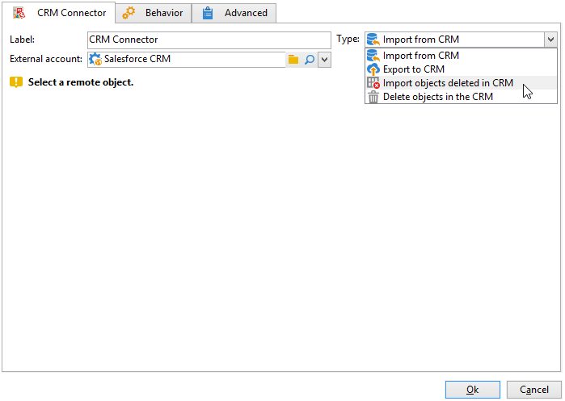
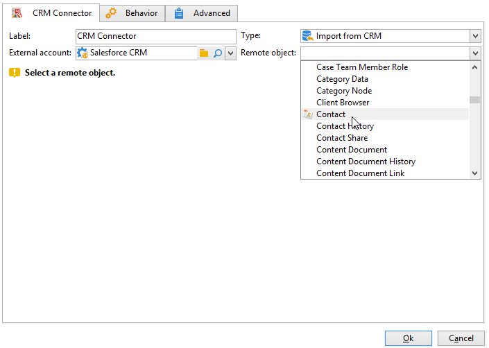

# CRM 连接器{#crm-connector}

的 **CRM连接器** 活动，可配置Adobe Campaign与CRM系统之间的数据同步。

通过此活动，您可以：

* 从CRM导入
* 导出到CRM
* 导入在CRM中删除的对象
* 删除CRM中的对象

选择与要配置同步的CRM匹配的外部帐户，然后选择要同步的对象（帐户、机会、联系人等）。

有关Adobe Campaign中CRM连接器的更多信息，请参阅 [此部分](https://experienceleague.adobe.com/docs/campaign/campaign-v8/connect/ac-crm/crm.html){target=&quot;_blank&quot;}。
