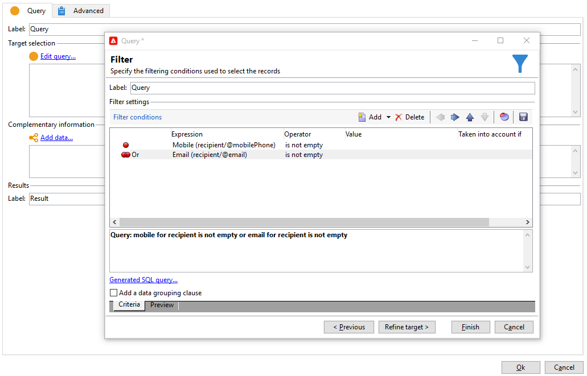

# 跨渠道投放{#cross-channel-deliveries}

跨渠道投放在[营销活动工作流](campaign-workflows.md)活动的&#x200B;**[!UICONTROL Deliveries]**&#x200B;选项卡中可用。

选择投放所基于的模板并定义其内容。

您可以使用不同的定向活动，在工作流上游指定投放目标。

在以下示例中，了解如何创建工作流来向推送通知订阅者发送电子邮件或短信，然后在一周后发送推送通知。 操作步骤：

1. 创建营销策划。
1. 在营销活动的&#x200B;**[!UICONTROL Targeting and workflows]**&#x200B;选项卡中，添加&#x200B;**[!UICONTROL Query]**&#x200B;活动。
1. 配置查询：选择订阅了推送通知的收件人作为目标维度。

   >[!NOTE]
   >
   >对于推送通知，请使用&#x200B;**订阅者应用程序**&#x200B;目标维度。

   

1. 将筛选条件添加到查询。 在这种情况下，我们将选择具有手机号码或电子邮件地址的收件人。

   

1. 将&#x200B;**[!UICONTROL Split]**&#x200B;活动添加到您的工作流中，以划分具有手机号码的收件人和具有电子邮件地址的收件人。
1. 在&#x200B;**[!UICONTROL Delivery]**&#x200B;选项卡中，为每个目标选择一个投放。

   通过双击工作流中的投放活动，使用与使用经典投放向导相同的方式创建投放。

   

1. 添加并配置&#x200B;**[!UICONTROL Wait]**&#x200B;活动，以便收件人不会一次收到太多投放。
1. 添加&#x200B;**[!UICONTROL Split]**&#x200B;活动以划分iOS或Android移动应用程序的订阅者。

   为每个操作系统选择服务。

   

1. 选择并配置每个操作系统的移动应用程序投放。

   
