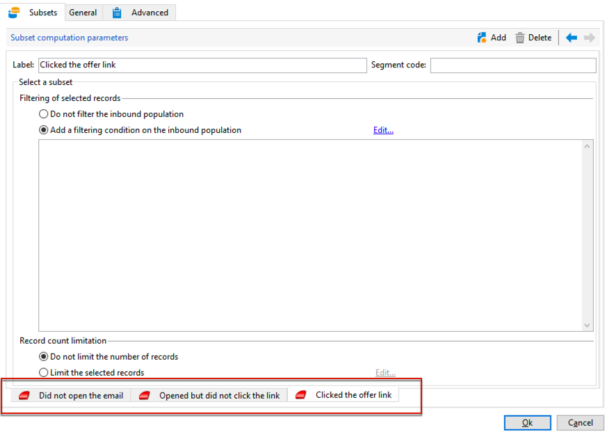
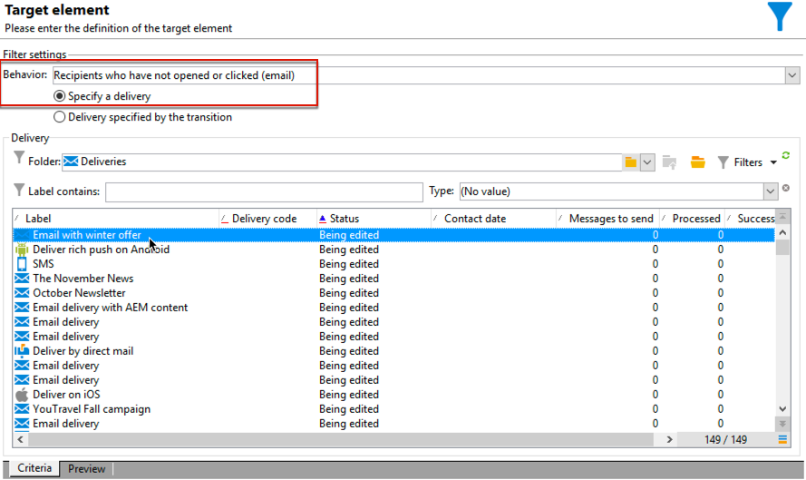
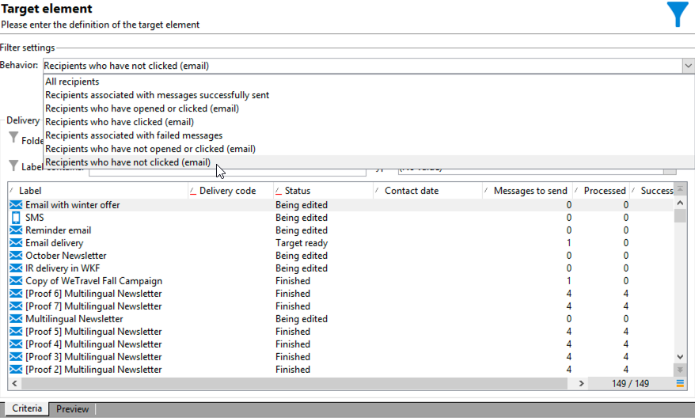
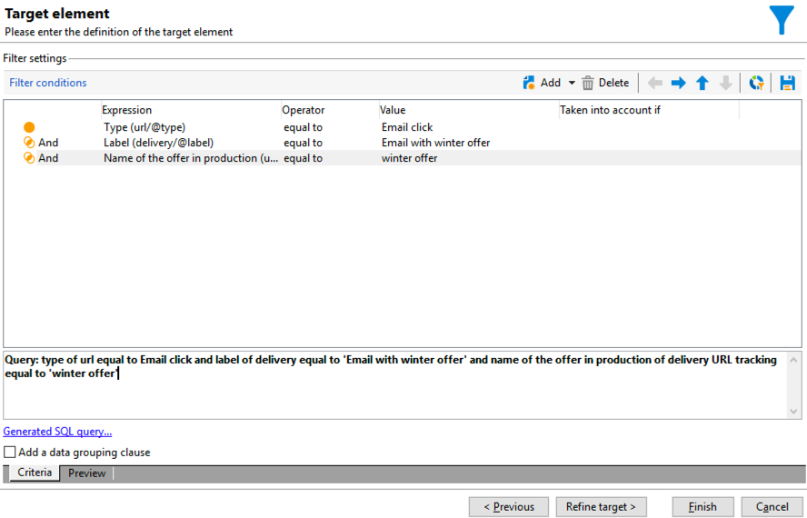

# 跨渠道投放工作流{#cross-channel-delivery-workflow}

此用例展示了涉及跨渠道投放工作流的示例。 有关跨渠道投放的一般概念，请参阅 [此部分](cross-channel-deliveries.md).

目标是将受众从数据库的收件人划分为不同的组，以便向某个组发送电子邮件，向另一个组发送短信消息。

此用例的主要实施步骤如下：

1. 创建 **[!UICONTROL Query]** 活动来定位受众。
1. 创建 **[!UICONTROL Email delivery]** 活动，其中包含指向选件的链接。
1. 使用 **[!UICONTROL Split]** 活动：

   * 向未打开第一封电子邮件的收件人发送另一封电子邮件。
   * 向打开了电子邮件但未单击选件链接的收件人发送短信。
   * 将打开电子邮件并单击链接的收件人添加到数据库。

## 步骤1:定位受众 {#step-1--targeting-the-audience}

要定义目标，请创建查询以标识收件人。

1. 创建营销策划. 有关详细信息，请参见 。
1. 在 **[!UICONTROL Targeting and workflows]** 的 **查询** 活动。 有关使用此活动的更多信息，请参阅 [此部分](query.md).
1. 定义接收投放的收件人。 例如，选择“Gold”成员作为目标维度。
1. 向查询添加筛选条件。 在此示例中，选择具有电子邮件地址和移动号码的收件人。

   

1. 保存更改。

## 步骤2:创建包含选件的电子邮件 {#step-2--creating-an-email-including-an-offer}

1. 创建** 。
1. 设计消息并在内容中插入包含选件的链接。

   

   有关将优惠集成到消息正文中的更多信息，请参阅。

1. 保存更改。
1. 右键单击 **[!UICONTROL Email delivery]** 活动以将其打开。
1. 选择 **[!UICONTROL Generate an outbound transition]** 选项来恢复群体和跟踪日志。

   

   这样，您就可以根据收件人在收到第一封电子邮件时的行为，使用此信息发送另一封投放。

1. 添加 **[!UICONTROL Wait]** 活动，让收件人用几天时间打开电子邮件。

   

## 步骤3:对生成的受众进行分段 {#step-3--segmenting-the-resulting-audience}

确定目标并创建首次投放后，您需要使用筛选条件将目标细分为不同的群体。

1. 添加 **拆分** 活动，并将其打开。 有关使用此活动的更多信息，请参阅 [此部分](split.md).
1. 从查询上游计算的群体创建三个区段。

   

1. 对于第一个子集，选择 **[!UICONTROL Add a filtering condition on the inbound population]** 选项并单击 **[!UICONTROL Edit]**.

   

1. 选择 **[!UICONTROL Recipients of a delivery]** 作为限制过滤器，然后单击 **[!UICONTROL Next]**.

   

1. 在过滤器设置中，选择 **[!UICONTROL Recipients who have not opened or clicked (email)]** 从 **[!UICONTROL Behavior]** 下拉列表中，然后选择电子邮件，其中包括要从投放列表发送的选件。 单击 **[!UICONTROL Finish]**。

   

1. 以类似方式继续第二个子集，然后选择 **[!UICONTROL Recipients who have not clicked (email)]** 从 **[!UICONTROL Behavior]** 下拉列表。

   

1. 对于第三个子集，在选择 **[!UICONTROL Add a filtering condition on the inbound population]** 单击 **[!UICONTROL Edit]**，选择 **[!UICONTROL Use a specific filtering dimension]** 选项。
1. 选择 **[!UICONTROL Recipient tracking log]** 从 **[!UICONTROL Filtering dimension]** 下拉列表，突出显示 **[!UICONTROL Filtering conditions]** 从 **[!UICONTROL List of restriction filters]** 单击 **[!UICONTROL Next]**.

   

1. 按如下方式选择筛选条件：

   

1. 单击 **[!UICONTROL Finish]** 以保存更改。

## 步骤4:最终完成工作流 {#step-4--finalizing-the-workflow}

1. 在由 **[!UICONTROL Split]** 活动：

   * 添加 **[!UICONTROL Email delivery]** 活动，向第一个子集发送电子邮件提醒。
   * 添加 **[!UICONTROL Mobile delivery]** 活动，以向第二个子集发送短信消息。
   * 添加 **[!UICONTROL List update]** 活动，将相应的收件人添加到数据库。

1. 在工作流中双击投放活动以对其进行编辑。 有关创建电子邮件和短信的更多信息，请参阅。
1. 双击 **[!UICONTROL List update]** 活动，然后选择 **[!UICONTROL Generate an outbound transition]** 选项。

   然后，您可以将生成的收件人从Adobe Campaign导出到Adobe Experience Cloud。 例如，您可以通过添加**在Adobe Target中使用受众。

1. 单击 **开始** 按钮以执行工作流。

目标群体 **查询** 活动将被分段，以根据收件人的行为接收电子邮件或短信投放。 剩余群体将使用 **[!UICONTROL List update]** 活动。
