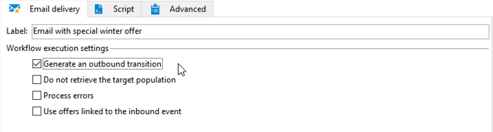

# 跨渠道投放工作流{#cross-channel-delivery-workflow}

此用例展示了涉及跨渠道投放工作流的示例。 中介绍了跨渠道投放的一般概念。 [本节](cross-channel-deliveries.md).

目标在于将受众从数据库的收件人划分到不同的组中，以便向组发送电子邮件，向另一组发送短信消息。

此用例的主要实施步骤如下：

1. 创建 **[!UICONTROL Query]** 活动以定向受众。
1. 创建 **[!UICONTROL Email delivery]** 包含指向选件的链接的活动。
1. 使用 **[!UICONTROL Split]** 活动至：

   * 向未打开第一封电子邮件的收件人发送另一封电子邮件。
   * 向打开了电子邮件但未单击选件链接的收件人发送短信。
   * 将打开了电子邮件并单击了链接的收件人添加到数据库。

## 步骤1：构建受众 {#step-1--build-the-audience}

要定义目标，请创建查询以标识收件人。

1. 创建营销策划。 请参阅[此页面](../campaigns/marketing-campaign-create.md)以了解详情。
1. 在 **[!UICONTROL Targeting and workflows]** 选项卡，添加 **查询** 活动添加到工作流。 有关使用此活动的更多信息，请参阅 [本节](query.md).
1. 定义将接收投放的收件人。 例如，选择“Gold”成员作为目标维。
1. 将筛选条件添加到查询。 在此示例中，选择具有电子邮件地址和手机号码的收件人。

   

1. 保存您的更改。

## 第2步：创建包含选件的电子邮件 {#step-2--create-an-email-including-an-offer}

1. 创建电子邮件投放。
1. 设计消息并在内容中插入包含选件的链接。

   

   有关将优惠集成到消息正文中的更多信息，请参阅 [此页面](../../v8/send/email.md).

1. 保存您的更改。
1. 右键单击 **[!UICONTROL Email delivery]** 活动以打开它。
1. 选择 **[!UICONTROL Generate an outbound transition]** 用于恢复群体和跟踪日志的选项。

   

   这样，您就可以使用此信息根据收件人接收第一封电子邮件时的行为发送另一个投放。

1. 添加 **[!UICONTROL Wait]** 活动，让收件人有几天时间打开电子邮件。

   

## 步骤3：对生成的受众进行分段 {#step-3--segment-the-resulting-audience}

在识别目标并创建第一个投放后，您需要使用过滤条件将目标划分为不同的群体。

1. 添加 **Split** 活动以打开工作流。 有关使用此活动的更多信息，请参阅 [本节](split.md).
1. 从查询上游计算的群体创建三个区段。

   

1. 对于第一个子集，选择 **[!UICONTROL Add a filtering condition on the inbound population]** 选项并单击 **[!UICONTROL Edit]**.

   

1. 选择 **[!UICONTROL Recipients of a delivery]** 作为限制过滤器，然后单击 **[!UICONTROL Next]**.

   

1. 在筛选器设置中，选择 **[!UICONTROL Recipients who have not opened or clicked (email)]** 从 **[!UICONTROL Behavior]** 下拉列表，然后从投放列表中选择包含要发送的优惠的电子邮件。 单击 **[!UICONTROL Finish]**。

   

1. 对第二个子集进行类似操作并选择 **[!UICONTROL Recipients who have not clicked (email)]** 从 **[!UICONTROL Behavior]** 下拉列表。

   

1. 对于第三个子集，在选择 **[!UICONTROL Add a filtering condition on the inbound population]** 并单击 **[!UICONTROL Edit]**，选择 **[!UICONTROL Use a specific filtering dimension]** 选项。
1. 选择 **[!UICONTROL Recipient tracking log]** 从 **[!UICONTROL Filtering dimension]** 下拉列表，突出显示 **[!UICONTROL Filtering conditions]** 从 **[!UICONTROL List of restriction filters]** 并单击 **[!UICONTROL Next]**.

   

1. 按如下方式选择筛选条件：

   

1. 单击 **[!UICONTROL Finish]** 以保存更改。

## 步骤4：完成工作流 {#step-4--finalize-the-workflow}

1. 将相关活动添加到工作流中，并放置由生成的三个子集之后。 **[!UICONTROL Split]** 活动：

   * 添加 **[!UICONTROL Email delivery]** 活动，向第一个子集发送提醒电子邮件。
   * 添加 **[!UICONTROL Mobile delivery]** 活动，用于将短信消息发送到第二个子集。
   * 添加 **[!UICONTROL List update]** 活动，将相应的收件人添加到数据库。

1. 双击工作流中的投放活动以进行编辑。
1. 双击 **[!UICONTROL List update]** 活动并选择 **[!UICONTROL Generate an outbound transition]** 选项。
1. 单击 **开始** 按钮来执行工作流。

目标人群 **查询** 将根据收件人的行为对活动进行分段，以接收电子邮件或短信投放。 剩余的群体将使用添加到数据库中 **[!UICONTROL List update]** 活动。
